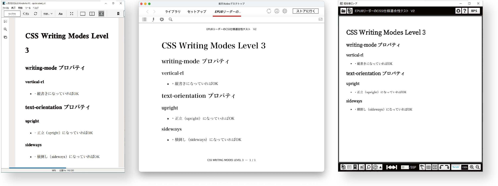

---
link:
  - rel: 'stylesheet'
    href: 'css/main.css'
lang: 'ja'
---

# 第2章 CSS表示テスト

小形克宏／村上真雄（Vivliostyle Foundation）

## CSS表示テストの結果

### 1. レイアウトエンジンの分類：モダンブラウザー系と独自エンジン系

EPUBリーダーはレイアウトエンジンにより2つに分類できます。次のように呼ぶことにします：

- **モダンブラウザー系**
  - 現在一般に使われているWebブラウザーのレイアウトエンジンを利用するもの
  - 具体的にはChromium (Chrome)やWebKit (Safari)が使われている
    - 各プラットフォームでの通常のブラウザーエンジンをそのまま利用するものと、  
      特定バージョンのブラウザーエンジンをカスタマイズなどして利用するものがある
  - WebKitやChromiumの古いバージョン（2013〜2015年のものなど）を使うものは除外
- **独自エンジン系**
  - 独自のレイアウトエンジンを利用するもの
  - または、ブラウザーのレイアウトエンジンを利用したもののそのまま使ううちに「モダン」ではなくなったもの　（独自といえるか微妙ですが、便宜上こちらに分類します）

EPUB 3.3仕様でサポートが求められている「CSSの公式的な定義に含まれるCSSモジュール」は、モダンブラウザーでサポートされているものなので、それを利用するEPUBリーダーでも基本的にサポートされているはずです。他方、独自エンジン系ではどうでしょう？

### 2. レイアウトエンジンの種別とCSSモジュールのグループ分け

<table style="margin-inline: auto; margin-block: 2em;">
  <caption><strong>表1 </strong>レイアウトエンジンの種別</caption>
  <tr>
    <td style="margin-top:24.5Q;" bgcolor="#d9d9d9" align="center">モダンブラウザー系</td>
    <td bgcolor="#d9d9d9" align="center">独自エンジン系</td>
  </tr>
  <tr>
    <td bgcolor="#d9ead3" align="center">kobo-mobile</td>
    <td bgcolor="#c9daf8" align="center">Kindle</td>
  </tr>
  <tr>
    <td bgcolor="#d9ead3" align="center">ブック</td>
    <td bgcolor="#c9daf8" align="center">kobo-other</td>
  </tr>
  <tr>
    <td bgcolor="#d9ead3" align="center">MURASAKI</td>
    <td bgcolor="#c9daf8" align="center">honto</td>
  </tr>
  <tr>
    <td bgcolor="#d9ead3" align="center">Book Walker</td>
    <td bgcolor="#c9daf8" align="center">Kinoppy</td>
  </tr>
  <tr>
    <td bgcolor="#d9ead3" align="center">Bibi</td>
    <td bgcolor="#c9daf8" align="center">BinB</td>
  </tr>
  <tr>
    <td bgcolor="#d9ead3" align="center">Vivliostyle Viewer</td>
    <td bgcolor="#c9daf8" align="center">超縦書</td>
  </tr>
  <tr>
    <td bgcolor="#d9ead3" align="center">Thorium Reader</td>
    <td bgcolor="#FFFFFF" align="center"></td>
  </tr>
</table>

- 「CSSの公式的な定義に含まれるCSSモジュール」を、サポートするEPUBリーダーが多いものと少ないものの2つのグループに分けてテスト結果を掲載します。
  1. メジャーなEPUBリーダーでサポートされるCSSモジュール
  2. おもにモダンブラウザー系でサポートされるCSSモジュール

### 3. メジャーなEPUBリーダーでサポートされるCSSモジュール

- これらは、KindleをはじめメジャーなEPUBリーダーでサポートされているCSSの機能です。
- 多くのEPUBリーダーで「OK」の項目が多いことがわかります。
- ただし、honto、Kinoppy、BinBは残念ながら「NG」の項目が多いです。

<table style="margin-inline: auto; margin-block: 2em;">
  <caption><strong>表2 </strong>メジャーなEPUBリーダーでサポートされるCSSモジュール</caption>
  <thead>
    <tr>
      <td style="color:#434343" align="right"></td>
      <td style="writing-mode: vertical-lr" bgcolor="#c9daf8" align="center">Kindle</td>
      <td style="writing-mode: vertical-lr" bgcolor="#d9ead3" align="center">kobo-mobile</td>
      <td style="writing-mode: vertical-lr" bgcolor="#c9daf8" align="center">kobo-other</td>
      <td style="writing-mode: vertical-lr" bgcolor="#d9ead3" align="center">ブック</td>
      <td style="writing-mode: vertical-lr" bgcolor="#d9ead3" align="center">MURASAKI</td>
      <td style="writing-mode: vertical-lr" bgcolor="#c9daf8" align="center">honto</td>
      <td style="writing-mode: vertical-lr" bgcolor="#d9ead3" align="center">Book Walker</td>
      <td style="writing-mode: vertical-lr" bgcolor="#c9daf8" align="center">Kinoppy</td>
      <td style="writing-mode: vertical-lr" bgcolor="#c9daf8" align="center">BinB</td>
      <td style="writing-mode: vertical-lr" bgcolor="#d9ead3" align="center">Bibi</td>
      <td style="writing-mode: vertical-lr" bgcolor="#c9daf8" align="center">超縦書</td>
      <td style="writing-mode: vertical-lr" bgcolor="#d9ead3" align="center">Vivliostyle</td>
      <td style="writing-mode: vertical-lr" bgcolor="#d9ead3" align="center">Thorium</td>
    </tr>
  </thead>
  <tbody>
    <tr>
      <th valign="bottom">Selectors Level 3</th>
      <td valign="bottom"></td>
      <td valign="bottom"></td>
      <td valign="bottom"></td>
      <td valign="bottom"></td>
      <td valign="bottom"></td>
      <td valign="bottom"></td>
      <td valign="bottom"></td>
      <td valign="bottom"></td>
      <td valign="bottom"></td>
      <td valign="bottom"></td>
      <td valign="bottom"></td>
      <td valign="bottom"></td>
      <td valign="bottom"></td>
    </tr>
    <tr>
      <td>部分文字列マッチング属性セレクタ [att^=val]</td>
      <td align="center">OK</td>
      <td align="center">OK</td>
      <td align="center">OK</td>
      <td align="center">OK</td>
      <td align="center">OK</td>
      <td style="color:#ea4335" align="center">NG</td>
      <td align="center">OK</td>
      <td style="color:#ea4335" align="center">NG</td>
      <td style="color:#ea4335" align="center">NG</td>
      <td align="center">OK</td>
      <td align="center">OK</td>
      <td align="center">OK</td>
      <td align="center">OK</td>
    </tr>
    <tr>
      <td>部分文字列マッチング属性セレクタ[att$=val]</td>
      <td align="center">OK</td>
      <td align="center">OK</td>
      <td align="center">OK</td>
      <td align="center">OK</td>
      <td align="center">OK</td>
      <td style="color:#ea4335" align="center">NG</td>
      <td align="center">OK</td>
      <td style="color:#ea4335" align="center">NG</td>
      <td style="color:#ea4335" align="center">NG</td>
      <td align="center">OK</td>
      <td align="center">OK</td>
      <td align="center">OK</td>
      <td align="center">OK</td>
    </tr>
    <tr>
      <td>部分文字列マッチング属性セレクタ[att*=val]</td>
      <td align="center">OK</td>
      <td align="center">OK</td>
      <td align="center">OK</td>
      <td align="center">OK</td>
      <td align="center">OK</td>
      <td style="color:#ea4335" align="center">NG</td>
      <td align="center">OK</td>
      <td style="color:#ea4335" align="center">NG</td>
      <td style="color:#ea4335" align="center">NG</td>
      <td align="center">OK</td>
      <td align="center">OK</td>
      <td align="center">OK</td>
      <td align="center">OK</td>
    </tr>
    <tr>
      <td>:root 擬似クラス</td>
      <td align="center">OK</td>
      <td align="center">OK</td>
      <td align="center">OK</td>
      <td align="center">OK</td>
      <td align="center">OK</td>
      <td style="color:#ea4335" align="center">NG</td>
      <td align="center">OK</td>
      <td style="color:#ea4335" align="center">NG</td>
      <td style="color:#ea4335" align="center">NG</td>
      <td align="center">OK</td>
      <td align="center">OK</td>
      <td align="center">OK</td>
      <td align="center">OK</td>
    </tr>
    <tr>
      <td>:nth-child() 擬似クラス</td>
      <td align="center">OK</td>
      <td align="center">OK</td>
      <td align="center">OK</td>
      <td align="center">OK</td>
      <td align="center">OK</td>
      <td style="color:#ea4335" align="center">NG</td>
      <td align="center">OK</td>
      <td style="color:#ea4335" align="center">NG</td>
      <td style="color:#ea4335" align="center">NG</td>
      <td align="center">OK</td>
      <td align="center">OK</td>
      <td align="center">OK</td>
      <td align="center">OK</td>
    </tr>
    <tr>
      <td>:nth-last-child() 擬似クラス</td>
      <td align="center">OK</td>
      <td align="center">OK</td>
      <td align="center">OK</td>
      <td align="center">OK</td>
      <td align="center">OK</td>
      <td style="color:#ea4335" align="center">NG</td>
      <td align="center">OK</td>
      <td style="color:#ea4335" align="center">NG</td>
      <td style="color:#ea4335" align="center">NG</td>
      <td align="center">OK</td>
      <td align="center">OK</td>
      <td align="center">OK</td>
      <td align="center">OK</td>
    </tr>
    <tr>
      <td>:nth-of-type() 擬似クラス</td>
      <td align="center">OK</td>
      <td align="center">OK</td>
      <td align="center">OK</td>
      <td align="center">OK</td>
      <td align="center">OK</td>
      <td style="color:#ea4335" align="center">NG</td>
      <td align="center">OK</td>
      <td style="color:#ea4335" align="center">NG</td>
      <td style="color:#ea4335" align="center">NG</td>
      <td align="center">OK</td>
      <td align="center">OK</td>
      <td align="center">OK</td>
      <td align="center">OK</td>
    </tr>
    <tr>
      <td>:nth-last-of-type() 擬似クラス</td>
      <td align="center">OK</td>
      <td align="center">OK</td>
      <td align="center">OK</td>
      <td align="center">OK</td>
      <td align="center">OK</td>
      <td style="color:#ea4335" align="center">NG</td>
      <td align="center">OK</td>
      <td style="color:#ea4335" align="center">NG</td>
      <td style="color:#ea4335" align="center">NG</td>
      <td align="center">OK</td>
      <td align="center">OK</td>
      <td align="center">OK</td>
      <td align="center">OK</td>
    </tr>
    <tr>
      <td>:last-child 擬似クラス</td>
      <td align="center">OK</td>
      <td align="center">OK</td>
      <td align="center">OK</td>
      <td align="center">OK</td>
      <td align="center">OK</td>
      <td style="color:#ea4335" align="center">NG</td>
      <td align="center">OK</td>
      <td style="color:#ea4335" align="center">NG</td>
      <td style="color:#ea4335" align="center">NG</td>
      <td align="center">OK</td>
      <td align="center">OK</td>
      <td align="center">OK</td>
      <td align="center">OK</td>
    </tr>
    <tr>
      <td>:only-child 擬似クラス</td>
      <td align="center">OK</td>
      <td align="center">OK</td>
      <td align="center">OK</td>
      <td align="center">OK</td>
      <td align="center">OK</td>
      <td style="color:#ea4335" align="center">NG</td>
      <td align="center">OK</td>
      <td style="color:#ea4335" align="center">NG</td>
      <td style="color:#ea4335" align="center">NG</td>
      <td align="center">OK</td>
      <td align="center">OK</td>
      <td align="center">OK</td>
      <td align="center">OK</td>
    </tr>
    <tr>
      <td>:first-of-type 擬似クラス</td>
      <td align="center">OK</td>
      <td align="center">OK</td>
      <td align="center">OK</td>
      <td align="center">OK</td>
      <td align="center">OK</td>
      <td style="color:#ea4335" align="center">NG</td>
      <td align="center">OK</td>
      <td style="color:#ea4335" align="center">NG</td>
      <td style="color:#ea4335" align="center">NG</td>
      <td align="center">OK</td>
      <td align="center">OK</td>
      <td align="center">OK</td>
      <td align="center">OK</td>
    </tr>
    <tr>
      <td>:last-of-type 擬似クラス</td>
      <td align="center">OK</td>
      <td align="center">OK</td>
      <td align="center">OK</td>
      <td align="center">OK</td>
      <td align="center">OK</td>
      <td style="color:#ea4335" align="center">NG</td>
      <td align="center">OK</td>
      <td style="color:#ea4335" align="center">NG</td>
      <td style="color:#ea4335" align="center">NG</td>
      <td align="center">OK</td>
      <td align="center">OK</td>
      <td align="center">OK</td>
      <td align="center">OK</td>
    </tr>
    <tr>
      <td>:only-of-type 擬似クラス</td>
      <td align="center">OK</td>
      <td align="center">OK</td>
      <td align="center">OK</td>
      <td align="center">OK</td>
      <td align="center">OK</td>
      <td style="color:#ea4335" align="center">NG</td>
      <td align="center">OK</td>
      <td style="color:#ea4335" align="center">NG</td>
      <td style="color:#ea4335" align="center">NG</td>
      <td align="center">OK</td>
      <td align="center">OK</td>
      <td align="center">OK</td>
      <td align="center">OK</td>
    </tr>
    <tr>
      <td>:empty 擬似クラス</td>
      <td align="center">OK</td>
      <td align="center">OK</td>
      <td align="center">OK</td>
      <td align="center">OK</td>
      <td align="center">OK</td>
      <td style="color:#ea4335" align="center">NG</td>
      <td align="center">OK</td>
      <td style="color:#ea4335" align="center">NG</td>
      <td style="color:#ea4335" align="center">NG</td>
      <td align="center">OK</td>
      <td align="center">OK</td>
      <td align="center">OK</td>
      <td align="center">OK</td>
    </tr>
    <tr>
      <td>:not 擬似クラス</td>
      <td align="center">OK</td>
      <td align="center">OK</td>
      <td align="center">OK</td>
      <td align="center">OK</td>
      <td align="center">OK</td>
      <td style="color:#ea4335" align="center">NG</td>
      <td align="center">OK</td>
      <td style="color:#ea4335" align="center">NG</td>
      <td style="color:#ea4335" align="center">NG</td>
      <td align="center">OK</td>
      <td align="center">OK</td>
      <td align="center">OK</td>
      <td align="center">OK</td>
    </tr>
    <tr>
      <td valign="bottom">::first-line 擬似要素</td>
      <td align="center">OK</td>
      <td align="center">OK</td>
      <td align="center">OK</td>
      <td align="center">OK</td>
      <td align="center">OK</td>
      <td style="color:#ea4335" align="center">NG</td>
      <td align="center">OK</td>
      <td style="color:#ea4335" align="center">NG</td>
      <td style="color:#ea4335" align="center">NG</td>
      <td align="center">OK</td>
      <td align="center">OK</td>
      <td align="center">OK</td>
      <td align="center">OK</td>
    </tr>
    <tr>
      <td>::first-letter 擬似要素</td>
      <td align="center">OK</td>
      <td align="center">OK</td>
      <td align="center">OK</td>
      <td align="center">OK</td>
      <td align="center">OK</td>
      <td style="color:#ea4335" align="center">NG</td>
      <td align="center">OK</td>
      <td style="color:#ea4335" align="center">NG</td>
      <td style="color:#ea4335" align="center">NG</td>
      <td align="center">OK</td>
      <td align="center">OK</td>
      <td align="center">OK</td>
      <td align="center">OK</td>
    </tr>
    <tr>
      <td>::before 擬似要素</td>
      <td align="center">OK</td>
      <td align="center">OK</td>
      <td align="center">OK</td>
      <td align="center">OK</td>
      <td align="center">OK</td>
      <td style="color:#ea4335" align="center">NG</td>
      <td align="center">OK</td>
      <td style="color:#ea4335" align="center">NG</td>
      <td style="color:#ea4335" align="center">NG</td>
      <td align="center">OK</td>
      <td align="center">OK</td>
      <td align="center">OK</td>
      <td align="center">OK</td>
    </tr>
    <tr>
      <td>::after 擬似要素</td>
      <td align="center">OK</td>
      <td align="center">OK</td>
      <td align="center">OK</td>
      <td align="center">OK</td>
      <td align="center">OK</td>
      <td style="color:#ea4335" align="center">NG</td>
      <td align="center">OK</td>
      <td style="color:#ea4335" align="center">NG</td>
      <td style="color:#ea4335" align="center">NG</td>
      <td align="center">OK</td>
      <td align="center">OK</td>
      <td align="center">OK</td>
      <td align="center">OK</td>
    </tr>
    <tr>
      <td>後続兄弟結合子 E ~ F</td>
      <td align="center">OK</td>
      <td align="center">OK</td>
      <td align="center">OK</td>
      <td align="center">OK</td>
      <td align="center">OK</td>
      <td style="color:#ea4335" align="center">NG</td>
      <td align="center">OK</td>
      <td style="color:#ea4335" align="center">NG</td>
      <td style="color:#ea4335" align="center">NG</td>
      <td align="center">OK</td>
      <td align="center">OK</td>
      <td align="center">OK</td>
      <td align="center">OK</td>
    </tr>
    <tr>
      <th valign="bottom">CSS Cascading and Inheritance Level 4</th>
      <td align="center"></td>
      <td align="center"></td>
      <td align="center"></td>
      <td align="center"></td>
      <td align="center"></td>
      <td align="center"></td>
      <td align="center"></td>
      <td align="center"></td>
      <td align="center"></td>
      <td align="center"></td>
      <td align="center"></td>
      <td align="center"></td>
      <td align="center"></td>
    </tr>
    <tr>
      <td valign="bottom">プロパティの値 initial</td>
      <td align="center">OK</td>
      <td align="center">OK</td>
      <td align="center">OK</td>
      <td align="center">OK</td>
      <td align="center">OK</td>
      <td style="color:#ea4335" align="center">NG</td>
      <td align="center">OK</td>
      <td style="color:#ea4335" align="center">NG</td>
      <td style="color:#ea4335" align="center">NG</td>
      <td align="center">OK</td>
      <td align="center">OK</td>
      <td align="center">OK</td>
      <td align="center">OK</td>
    </tr>
      <th valign="bottom">CSS Values and Units Level 3</th>
      <td align="center"></td>
      <td align="center"></td>
      <td align="center"></td>
      <td align="center"></td>
      <td align="center"></td>
      <td align="center"></td>
      <td align="center"></td>
      <td align="center"></td>
      <td align="center"></td>
      <td align="center"></td>
      <td align="center"></td>
      <td align="center"></td>
      <td align="center"></td>
    </tr>
    <tr>
      <td valign="bottom">長さの単位 rem</td>
      <td align="center">OK</td>
      <td align="center">OK</td>
      <td align="center">OK</td>
      <td align="center">OK</td>
      <td align="center">OK</td>
      <td style="color:#ea4335" align="center">NG</td>
      <td align="center">OK</td>
      <td align="center">OK</td>
      <td align="center">OK</td>
      <td align="center">OK</td>
      <td align="center">OK</td>
      <td align="center">OK</td>
      <td align="center">OK</td>
    </tr>
    <tr>
      <th valign="bottom">CSS Backgrounds and Borders Level 3</th>
      <td align="center"></td>
      <td align="center"></td>
      <td align="center"></td>
      <td align="center"></td>
      <td align="center"></td>
      <td align="center"></td>
      <td align="center"></td>
      <td align="center"></td>
      <td align="center"></td>
      <td align="center"></td>
      <td align="center"></td>
      <td align="center"></td>
      <td align="center"></td>
    </tr>
    <tr>
      <td valign="bottom">border-radius プロパティ</td>
      <td align="center">OK</td>
      <td align="center">OK</td>
      <td align="center">OK</td>
      <td align="center">OK</td>
      <td align="center">OK</td>
      <td align="center">OK</td>
      <td align="center">OK</td>
      <td style="color:#1f1f1f" align="center">OK</td>
      <td style="color:#ea4335" align="center">NG</td>
      <td align="center">OK</td>
      <td align="center">OK</td>
      <td align="center">OK</td>
      <td align="center">OK</td>
    </tr>
    <tr>
      <td valign="bottom">box-shadow プロパティ</td>
      <td align="center">OK</td>
      <td align="center">OK</td>
      <td align="center">OK</td>
      <td align="center">OK</td>
      <td style="color:#ea4335" align="center">NG</td>
      <td style="color:#ea4335" align="center">NG</td>
      <td align="center">OK</td>
      <td style="color:#ea4335" align="center">NG</td>
      <td style="color:#ea4335" align="center">NG</td>
      <td align="center">OK</td>
      <td align="center">OK</td>
      <td align="center">OK</td>
      <td align="center">OK</td>
    </tr>
    <tr>
      <th valign="bottom">CSS User Interface Module Level 3</th>
      <td align="center"></td>
      <td align="center"></td>
      <td align="center"></td>
      <td align="center"></td>
      <td align="center"></td>
      <td align="center"></td>
      <td align="center"></td>
      <td align="center"></td>
      <td align="center"></td>
      <td align="center"></td>
      <td align="center"></td>
      <td align="center"></td>
      <td align="center"></td>
    </tr>
    <tr>
      <td valign="bottom">outline プロパティ</td>
      <td align="center">OK</td>
      <td align="center">OK</td>
      <td align="center">OK</td>
      <td align="center">OK</td>
      <td align="center">OK</td>
      <td style="color:#ea4335" align="center">NG</td>
      <td align="center">OK</td>
      <td style="color:#ea4335" align="center">NG</td>
      <td style="color:#ea4335" align="center">NG</td>
      <td align="center">OK</td>
      <td align="center">OK</td>
      <td align="center">OK</td>
      <td align="center">OK</td>
    </tr>
    <tr>
      <th valign="bottom">CSS Counter Styles Level 3</th>
      <td align="center"></td>
      <td align="center"></td>
      <td align="center"></td>
      <td align="center"></td>
      <td align="center"></td>
      <td align="center"></td>
      <td align="center"></td>
      <td align="center"></td>
      <td align="center"></td>
      <td align="center"></td>
      <td align="center"></td>
      <td align="center"></td>
      <td align="center"></td>
    </tr>
    <tr>
      <td valign="bottom">定義済みカウンタースタイル lower-greek</td>
      <td align="center">OK</td>
      <td align="center">OK</td>
      <td align="center">OK</td>
      <td align="center">OK</td>
      <td align="center">OK</td>
      <td style="color:#ea4335" align="center">NG</td>
      <td align="center">OK</td>
      <td style="color:#ea4335" align="center">NG</td>
      <td style="color:#ea4335" align="center">NG</td>
      <td bgcolor="#f3f3f3" align="center">OK</td>
      <td align="center">OK</td>
      <td align="center">OK</td>
      <td align="center">OK</td>
    </tr>
    <tr>
      <td valign="bottom">定義済みカウンタースタイル katakana</td>
      <td align="center">OK</td>
      <td align="center">OK</td>
      <td align="center">OK</td>
      <td align="center">OK</td>
      <td align="center">OK</td>
      <td align="center">OK</td>
      <td align="center">OK</td>
      <td style="color:#ea4335" align="center">NG</td>
      <td style="color:#ea4335" align="center">NG</td>
      <td align="center">OK</td>
      <td align="center">OK</td>
      <td align="center">OK</td>
      <td align="center">OK</td>
    </tr>
    <tr>
      <td valign="bottom">定義済みカウンタースタイル katakana-iroha</td>
      <td align="center">OK</td>
      <td align="center">OK</td>
      <td align="center">OK</td>
      <td align="center">OK</td>
      <td align="center">OK</td>
      <td align="center">OK</td>
      <td align="center">OK</td>
      <td style="color:#ea4335" align="center">NG</td>
      <td style="color:#ea4335" align="center">NG</td>
      <td align="center">OK</td>
      <td align="center">OK</td>
      <td align="center">OK</td>
      <td align="center">OK</td>
    </tr>
  </tbody>
</table>

### 4. おもにモダンブラウザー系でサポートされるCSSモジュール

- これらは、モダンブラウザー系以外ではあまりサポートされていないCSSの機能です。
- モダンブラウザー系のEPUBリーダー（kobo-mobile、ブック、MURASAKI、Book Walker、Bibi、Vivliostyle、Thorium）は「OK」が多く、独自エンジン系のEPUBリーダー（Kindle、kobo-other、honto、Kinoppy、BinB、超縦書）は「NG」が多いことがわかります。

<table style="margin-inline: auto; margin-block: 2em;">
  <caption><strong>表3 </strong>おもにモダンブラウザー系でサポートされるCSSモジュール</caption>
  <thead>
    <tr>
      <td style="color:#434343" align="right"></td>
      <td style="writing-mode: vertical-lr" bgcolor="#c9daf8" align="center">Kindle</td>
      <td style="writing-mode: vertical-lr" bgcolor="#d9ead3" align="center">kobo-mobile</td>
      <td style="writing-mode: vertical-lr" bgcolor="#c9daf8" align="center">kobo-other</td>
      <td style="writing-mode: vertical-lr" bgcolor="#d9ead3" align="center">ブック</td>
      <td style="writing-mode: vertical-lr" bgcolor="#d9ead3" align="center">MURASAKI</td>
      <td style="writing-mode: vertical-lr" bgcolor="#c9daf8" align="center">honto</td>
      <td style="writing-mode: vertical-lr" bgcolor="#d9ead3" align="center">Book Walker</td>
      <td style="writing-mode: vertical-lr" bgcolor="#c9daf8" align="center">Kinoppy</td>
      <td style="writing-mode: vertical-lr" bgcolor="#c9daf8" align="center">BinB</td>
      <td style="writing-mode: vertical-lr" bgcolor="#d9ead3" align="center">Bibi</td>
      <td style="writing-mode: vertical-lr" bgcolor="#c9daf8" align="center">超縦書</td>
      <td style="writing-mode: vertical-lr" bgcolor="#d9ead3" align="center">Vivliostyle</td>
      <td style="writing-mode: vertical-lr" bgcolor="#d9ead3" align="center">Thorium</td>
    </tr>
  </thead>
  <tbody>
    <tr>
      <th valign="bottom">CSS Values and Units Level 3</th>
      <td align="center"></td>
      <td align="center"></td>
      <td align="center"></td>
      <td align="center"></td>
      <td align="center"></td>
      <td align="center"></td>
      <td align="center"></td>
      <td align="center"></td>
      <td align="center"></td>
      <td align="center"></td>
      <td align="center"></td>
      <td align="center"></td>
      <td align="center"></td>
    </tr>
    <tr>
      <td valign="bottom">長さの単位 ch</td>
      <td style="color:#ea4335" align="center">NG</td>
      <td align="center">OK</td>
      <td align="center">OK</td>
      <td align="center">OK</td>
      <td align="center">OK</td>
      <td style="color:#ea4335" align="center">NG</td>
      <td align="center">OK</td>
      <td style="color:#ea4335" align="center">NG</td>
      <td style="color:#ea4335" align="center">NG</td>
      <td align="center">OK</td>
      <td align="center">OK</td>
      <td align="center">OK</td>
      <td align="center">OK</td>
    </tr>
    <tr>
      <td valign="bottom">長さの単位 vw</td>
      <td style="color:#ea4335" align="center">NG</td>
      <td align="center">OK</td>
      <td align="center">OK</td>
      <td align="center">OK</td>
      <td align="center">OK</td>
      <td style="color:#ea4335" align="center">NG</td>
      <td align="center">OK</td>
      <td style="color:#ea4335" align="center">NG</td>
      <td style="color:#ea4335" align="center">NG</td>
      <td align="center">OK</td>
      <td align="center">OK</td>
      <td align="center">OK</td>
      <td align="center">OK</td>
    </tr>
    <tr>
      <td valign="bottom">長さの単位 vh</td>
      <td style="color:#ea4335" align="center">NG</td>
      <td align="center">OK</td>
      <td align="center">OK</td>
      <td align="center">OK</td>
      <td align="center">OK</td>
      <td style="color:#ea4335" align="center">NG</td>
      <td align="center">OK</td>
      <td style="color:#ea4335" align="center">NG</td>
      <td style="color:#ea4335" align="center">NG</td>
      <td align="center">OK</td>
      <td align="center">OK</td>
      <td align="center">OK</td>
      <td align="center">OK</td>
    </tr>
    <tr>
      <td valign="bottom">長さの単位 vmin</td>
      <td style="color:#ea4335" align="center">NG</td>
      <td align="center">OK</td>
      <td align="center">OK</td>
      <td align="center">OK</td>
      <td align="center">OK</td>
      <td style="color:#ea4335" align="center">NG</td>
      <td align="center">OK</td>
      <td style="color:#ea4335" align="center">NG</td>
      <td style="color:#ea4335" align="center">NG</td>
      <td align="center">OK</td>
      <td align="center">OK</td>
      <td align="center">OK</td>
      <td align="center">OK</td>
    </tr>
    <tr>
      <td valign="bottom">長さの単位 vmax</td>
      <td style="color:#ea4335" align="center">NG</td>
      <td align="center">OK</td>
      <td align="center">OK</td>
      <td align="center">OK</td>
      <td align="center">OK</td>
      <td style="color:#ea4335" align="center">NG</td>
      <td align="center">OK</td>
      <td style="color:#ea4335" align="center">NG</td>
      <td style="color:#ea4335" align="center">NG</td>
      <td align="center">OK</td>
      <td align="center">OK</td>
      <td align="center">OK</td>
      <td align="center">OK</td>
    </tr>
    <tr>
      <td valign="bottom">長さの単位 Q</td>
      <td style="color:#ea4335" align="center">NG</td>
      <td align="center">OK</td>
      <td style="color:#ea4335" align="center">NG</td>
      <td align="center">OK</td>
      <td align="center">OK</td>
      <td style="color:#ea4335" align="center">NG</td>
      <td align="center">OK</td>
      <td style="color:#ea4335" align="center">NG</td>
      <td style="color:#ea4335" align="center">OK / NG </td>
      <td align="center">OK</td>
      <td style="color:#ea4335" align="center">NG</td>
      <td align="center">OK</td>
      <td align="center">OK</td>
    </tr>
    <tr>
      <th valign="bottom">CSS Conditional Rules Level 3</th>
      <td align="center"></td>
      <td align="center"></td>
      <td align="center"></td>
      <td align="center"></td>
      <td align="center"></td>
      <td align="center"></td>
      <td align="center"></td>
      <td align="center"></td>
      <td align="center"></td>
      <td align="center"></td>
      <td style="color:#ea4335" align="center"></td>
      <td align="center"></td>
      <td align="center"></td>
    </tr>
    <tr>
      <td valign="bottom">@supports ルール</td>
      <td style="color:#ea4335" align="center">NG</td>
      <td align="center">OK</td>
      <td style="color:#ea4335" align="center">NG</td>
      <td align="center">OK</td>
      <td align="center">OK</td>
      <td style="color:#ea4335" align="center">NG</td>
      <td align="center">OK</td>
      <td style="color:#ea4335" align="center">NG</td>
      <td style="color:#ea4335" align="center">NG</td>
      <td align="center">OK</td>
      <td align="center">OK</td>
      <td align="center">OK</td>
      <td align="center">OK</td>
    </tr>
    <tr>
      <th valign="bottom">CSS Cascading and Inheritance Level 4</th>
      <td align="center"></td>
      <td align="center"></td>
      <td align="center"></td>
      <td align="center"></td>
      <td align="center"></td>
      <td align="center"></td>
      <td align="center"></td>
      <td align="center"></td>
      <td align="center"></td>
      <td align="center"></td>
      <td align="center"></td>
      <td align="center"></td>
      <td align="center"></td>
    </tr>
    <tr>
      <td valign="bottom">all プロパティ</td>
      <td style="color:#ea4335" align="center">NG</td>
      <td align="center">OK</td>
      <td style="color:#ea4335" align="center">NG</td>
      <td align="center">OK</td>
      <td align="center">OK</td>
      <td style="color:#ea4335" align="center">NG</td>
      <td align="center">OK</td>
      <td style="color:#ea4335" align="center">NG</td>
      <td style="color:#ea4335" align="center">NG</td>
      <td style="color:#ea4335" align="center">NG</td>
      <td style="color:#ea4335" align="center">NG</td>
      <td align="center">OK</td>
      <td align="center">OK</td>
    </tr>
    <tr>
      <td valign="bottom">プロパティの値 unset</td>
      <td style="color:#ea4335" align="center">NG</td>
      <td align="center">OK</td>
      <td style="color:#ea4335" align="center">NG</td>
      <td align="center">OK</td>
      <td align="center">OK</td>
      <td style="color:#ea4335" align="center">NG</td>
      <td align="center">OK</td>
      <td style="color:#ea4335" align="center">NG</td>
      <td style="color:#ea4335" align="center">NG</td>
      <td align="center">OK</td>
      <td style="color:#ea4335" align="center">NG</td>
      <td align="center">OK</td>
      <td align="center">OK</td>
    </tr>
    <tr>
      <td valign="bottom">プロパティの値 revert</td>
      <td style="color:#ea4335" align="center">NG</td>
      <td style="color:#ea4335" align="center">OK / NG *¹</td>
      <td style="color:#ea4335" align="center">NG</td>
      <td align="center">OK</td>
      <td align="center">OK</td>
      <td style="color:#ea4335" align="center">NG</td>
      <td style="color:#ea4335" align="center">OK / NG *¹</td>
      <td style="color:#ea4335" align="center">NG</td>
      <td style="color:#ea4335" align="center">NG</td>
      <td align="center">OK</td>
      <td style="color:#ea4335" align="center">NG</td>
      <td align="center">OK</td>
      <td align="center">OK</td>
    </tr>
    <tr>
      <th valign="bottom">CSS Custom Properties for Cascading Variables Module Level 1</th>
      <td align="center"></td>
      <td align="center"></td>
      <td align="center"></td>
      <td align="center"></td>
      <td align="center"></td>
      <td align="center"></td>
      <td align="center"></td>
      <td align="center"></td>
      <td align="center"></td>
      <td align="center"></td>
      <td style="color:#ea4335" align="center"></td>
      <td align="center"></td>
      <td align="center"></td>
    </tr>
    <tr>
      <td valign="bottom">CSS変数</td>
      <td style="color:#ea4335" align="center">NG</td>
      <td align="center">OK</td>
      <td style="color:#ea4335" align="center">NG</td>
      <td align="center">OK</td>
      <td align="center">OK</td>
      <td style="color:#ea4335" align="center">NG</td>
      <td align="center">OK</td>
      <td style="color:#ea4335" align="center">NG</td>
      <td style="color:#ea4335" align="center">NG</td>
      <td align="center">OK</td>
      <td style="color:#ea4335" align="center">NG</td>
      <td align="center">OK</td>
      <td align="center">OK</td>
    </tr>
    <tr>
      <th valign="bottom">CSS Color Level 4</th>
      <td align="center"></td>
      <td align="center"></td>
      <td align="center"></td>
      <td align="center"></td>
      <td align="center"></td>
      <td align="center"></td>
      <td align="center"></td>
      <td align="center"></td>
      <td align="center"></td>
      <td align="center"></td>
      <td style="color:#ea4335" align="center"></td>
      <td align="center"></td>
      <td align="center"></td>
    </tr>
    <tr>
      <td valign="bottom">opacity プロパティ</td>
      <td style="color:#ea4335" align="center">NG</td>
      <td align="center">OK</td>
      <td align="center">OK</td>
      <td align="center">OK</td>
      <td align="center">OK</td>
      <td style="color:#ea4335" align="center">NG</td>
      <td align="center">OK</td>
      <td style="color:#ea4335" align="center">NG</td>
      <td style="color:#ea4335" align="center">NG</td>
      <td align="center">OK</td>
      <td align="center">OK</td>
      <td align="center">OK</td>
      <td align="center">OK</td>
    </tr>
    <tr>
      <td valign="bottom">rgb() 関数のコンマなし形式 例: rgb (0 255 0 / .5)</td>
      <td style="color:#ea4335" align="center">NG</td>
      <td align="center">OK</td>
      <td style="color:#ea4335" align="center">NG</td>
      <td align="center">OK</td>
      <td align="center">OK</td>
      <td style="color:#ea4335" align="center" valign="bottom">NG</td>
      <td align="center">OK</td>
      <td style="color:#ea4335" align="center" valign="bottom">NG</td>
      <td style="color:#ea4335" align="center" valign="bottom">NG</td>
      <td align="center">OK</td>
      <td style="color:#ea4335" align="center" valign="bottom">NG</td>
      <td align="center">OK</td>
      <td align="center">OK</td>
    </tr>
    <tr>
      <td valign="bottom">16進数のRGBA形式 (8桁）</td>
      <td style="color:#ea4335" align="center">NG</td>
      <td align="center">OK</td>
      <td style="color:#ea4335" align="center">NG</td>
      <td align="center">OK</td>
      <td align="center">OK</td>
      <td style="color:#ea4335" align="center">NG</td>
      <td align="center">OK</td>
      <td style="color:#ea4335" align="center">NG</td>
      <td style="color:#ea4335" align="center">NG</td>
      <td align="center">OK</td>
      <td style="color:#ea4335" align="center" valign="bottom">NG</td>
      <td align="center">OK</td>
      <td align="center">OK</td>
    </tr>
    <tr>
      <td valign="bottom">16進数のRGBA形式 (4桁）</td>
      <td style="color:#ea4335" align="center">NG</td>
      <td align="center">OK</td>
      <td style="color:#ea4335" align="center">NG</td>
      <td align="center">OK</td>
      <td align="center">OK</td>
      <td style="color:#ea4335" align="center">NG</td>
      <td align="center">OK</td>
      <td style="color:#ea4335" align="center">NG</td>
      <td style="color:#ea4335" align="center">NG</td>
      <td align="center">OK</td>
      <td style="color:#ea4335" align="center" valign="bottom">NG</td>
      <td align="center">OK</td>
      <td align="center">OK</td>
    </tr>
    <tr>
      <td valign="bottom">hsl() 関数</td>
      <td style="color:#ea4335" align="center">NG</td>
      <td align="center">OK</td>
      <td style="color:#ea4335" align="center">NG</td>
      <td align="center">OK</td>
      <td align="center">OK</td>
      <td style="color:#ea4335" align="center">NG</td>
      <td align="center">OK</td>
      <td style="color:#ea4335" align="center">NG</td>
      <td style="color:#ea4335" align="center">NG</td>
      <td align="center">OK</td>
      <td style="color:#ea4335" align="center" valign="bottom">NG</td>
      <td align="center">OK</td>
      <td align="center">OK</td>
    </tr>
    <tr>
      <td valign="bottom">hwb() 関数</td>
      <td style="color:#ea4335" align="center">NG</td>
      <td style="color:#ea4335" align="center">OK / NG *¹</td>
      <td style="color:#ea4335" align="center">NG</td>
      <td align="center">OK</td>
      <td align="center">OK</td>
      <td style="color:#ea4335" align="center">NG</td>
      <td style="color:#ea4335" align="center">OK / NG *¹</td>
      <td style="color:#ea4335" align="center">NG</td>
      <td style="color:#ea4335" align="center">NG</td>
      <td align="center">OK</td>
      <td style="color:#ea4335" align="center" valign="bottom">NG</td>
      <td align="center">OK</td>
      <td align="center">OK</td>
    </tr>
    <tr>
      <th valign="bottom">CSS Backgrounds and Borders Level 3</th>
      <td align="center"></td>
      <td align="center"></td>
      <td align="center"></td>
      <td align="center"></td>
      <td align="center"></td>
      <td align="center"></td>
      <td align="center"></td>
      <td align="center"></td>
      <td align="center"></td>
      <td align="center"></td>
      <td align="center"></td>
      <td align="center"></td>
      <td align="center"></td>
    </tr>
    <tr>
      <td valign="bottom">複数の背景画像</td>
      <td style="color:#ea4335" align="center">NG</td>
      <td align="center">OK</td>
      <td align="center">OK</td>
      <td align="center">OK</td>
      <td align="center">OK</td>
      <td style="color:#ea4335" align="center">NG</td>
      <td align="center">OK</td>
      <td style="color:#ea4335" align="center">NG</td>
      <td style="color:#ea4335" align="center">NG</td>
      <td align="center">OK</td>
      <td align="center">OK</td>
      <td align="center">OK</td>
      <td align="center">OK</td>
    </tr>
    <tr>
      <td valign="bottom">border-image プロパティ</td>
      <td style="color:#ea4335" align="center">NG</td>
      <td align="center">OK</td>
      <td align="center">OK</td>
      <td align="center">OK</td>
      <td align="center">OK</td>
      <td style="color:#ea4335" align="center">NG</td>
      <td align="center">OK</td>
      <td style="color:#ea4335" align="center">NG</td>
      <td style="color:#ea4335" align="center">NG</td>
      <td align="center">OK</td>
      <td align="center">OK</td>
      <td align="center">OK</td>
      <td align="center">OK</td>
    </tr>
    <tr>
      <th valign="bottom">CSS Images Level 3</th>
      <td align="center"></td>
      <td align="center"></td>
      <td align="center"></td>
      <td align="center"></td>
      <td align="center"></td>
      <td align="center"></td>
      <td align="center"></td>
      <td align="center"></td>
      <td align="center"></td>
      <td align="center"></td>
      <td align="center"></td>
      <td align="center"></td>
      <td align="center"></td>
    </tr>
    <tr>
      <td valign="bottom">グラデーション関数 linear-gradient()</td>
      <td style="color:#ea4335" align="center">NG</td>
      <td align="center">OK</td>
      <td align="center">OK</td>
      <td align="center">OK</td>
      <td align="center">OK</td>
      <td style="color:#ea4335" align="center">NG</td>
      <td align="center">OK</td>
      <td style="color:#ea4335" align="center">NG</td>
      <td style="color:#ea4335" align="center">NG</td>
      <td align="center">OK</td>
      <td align="center">OK</td>
      <td align="center">OK</td>
      <td align="center">OK</td>
    </tr>
    <tr>
      <td valign="bottom">グラデーション関数 radial-gradient()</td>
      <td style="color:#ea4335" align="center">NG</td>
      <td align="center">OK</td>
      <td align="center">OK</td>
      <td align="center">OK</td>
      <td align="center">OK</td>
      <td style="color:#ea4335" align="center">NG</td>
      <td align="center">OK</td>
      <td style="color:#ea4335" align="center">NG</td>
      <td style="color:#ea4335" align="center">NG</td>
      <td align="center">OK</td>
      <td align="center">OK</td>
      <td align="center">OK</td>
      <td align="center">OK</td>
    </tr>
    <tr>
      <td valign="bottom">グラデーション関数 repeating-linear-gradient()</td>
      <td style="color:#ea4335" align="center">NG</td>
      <td align="center">OK</td>
      <td align="center">OK</td>
      <td align="center">OK</td>
      <td align="center">OK</td>
      <td style="color:#ea4335" align="center">NG</td>
      <td align="center">OK</td>
      <td style="color:#ea4335" align="center">NG</td>
      <td style="color:#ea4335" align="center">NG</td>
      <td align="center">OK</td>
      <td align="center">OK</td>
      <td align="center">OK</td>
      <td align="center">OK</td>
    </tr>
    <tr>
      <td valign="bottom">グラデーション関数 repeating-radial-gradient()</td>
      <td style="color:#ea4335" align="center">NG</td>
      <td align="center">OK</td>
      <td align="center">OK</td>
      <td align="center">OK</td>
      <td align="center">OK</td>
      <td style="color:#ea4335" align="center">NG</td>
      <td align="center">OK</td>
      <td style="color:#ea4335" align="center">NG</td>
      <td style="color:#ea4335" align="center">NG</td>
      <td align="center">OK</td>
      <td align="center">OK</td>
      <td align="center">OK</td>
      <td align="center">OK</td>
    </tr>
    <tr>
      <td valign="bottom">object-fit プロパティ contain</td>
      <td style="color:#ea4335" align="center">NG</td>
      <td align="center">OK</td>
      <td style="color:#ea4335" align="center">NG</td>
      <td align="center">OK</td>
      <td align="center">OK</td>
      <td style="color:#ea4335" align="center">NG</td>
      <td align="center">OK</td>
      <td style="color:#ea4335" align="center">NG</td>
      <td style="color:#ea4335" align="center">NG</td>
      <td align="center">OK</td>
      <td align="center">OK</td>
      <td align="center">OK</td>
      <td align="center">OK</td>
    </tr>
    <tr>
      <td valign="bottom">object-fit プロパティ cover</td>
      <td style="color:#ea4335" align="center">NG</td>
      <td style="color:#ea4335" align="center">OK / NG *³</td>
      <td style="color:#ea4335" align="center">NG</td>
      <td align="center">OK</td>
      <td align="center">OK</td>
      <td style="color:#ea4335" align="center">NG</td>
      <td align="center">OK</td>
      <td style="color:#ea4335" align="center">NG</td>
      <td style="color:#ea4335" align="center">NG</td>
      <td align="center">OK</td>
      <td align="center">OK</td>
      <td align="center">OK</td>
      <td align="center">OK</td>
    </tr>
    <tr>
      <td valign="bottom">object-position プロパティ</td>
      <td style="color:#ea4335" align="center">NG</td>
      <td align="center">OK</td>
      <td style="color:#ea4335" align="center">NG</td>
      <td align="center">OK</td>
      <td align="center">OK</td>
      <td style="color:#ea4335" align="center">NG</td>
      <td align="center">OK</td>
      <td style="color:#ea4335" align="center">NG</td>
      <td style="color:#ea4335" align="center">NG</td>
      <td align="center">OK</td>
      <td align="center">OK</td>
      <td align="center">OK</td>
      <td align="center">OK</td>
    </tr>
    <tr>
      <th valign="bottom">CSS Fonts Level 3</th>
      <td align="center"></td>
      <td align="center"></td>
      <td align="center"></td>
      <td align="center"></td>
      <td align="center"></td>
      <td align="center"></td>
      <td align="center"></td>
      <td align="center"></td>
      <td align="center"></td>
      <td align="center"></td>
      <td style="color:#ea4335" align="center"></td>
      <td align="center"></td>
      <td align="center"></td>
    </tr>
    <tr>
      <td valign="bottom">@font-face ルール</td>
      <td style="color:#ea4335" align="center">NG</td>
      <td align="center">OK</td>
      <td align="center">OK</td>
      <td style="color:#ea4335" align="center">OK / NG *²</td>
      <td align="center">OK</td>
      <td style="color:#ea4335" align="center">NG</td>
      <td align="center">OK</td>
      <td style="color:#ea4335" align="center">NG</td>
      <td style="color:#ea4335" align="center">NG</td>
      <td style="color:#ea4335" align="center">NG</td>
      <td align="center">OK</td>
      <td align="center">OK</td>
      <td align="center">OK</td>
    </tr>
    <tr>
      <td valign="bottom">unicode-range 記述子</td>
      <td style="color:#ea4335" align="center">NG</td>
      <td align="center">OK</td>
      <td align="center">OK</td>
      <td style="color:#ea4335" align="center">OK / NG *²</td>
      <td align="center">OK</td>
      <td style="color:#ea4335" align="center">NG</td>
      <td align="center">OK</td>
      <td style="color:#ea4335" align="center">NG</td>
      <td style="color:#ea4335" align="center">NG</td>
      <td style="color:#ea4335" align="center">NG</td>
      <td align="center">OK</td>
      <td align="center">OK</td>
      <td align="center">OK</td>
    </tr>
    <tr>
      <td valign="bottom">font-kerning プロパティ</td>
      <td style="color:#ea4335" align="center">NG</td>
      <td align="center">OK</td>
      <td style="color:#ea4335" align="center">NG</td>
      <td align="center">OK</td>
      <td align="center">OK</td>
      <td style="color:#ea4335" align="center">NG</td>
      <td align="center">OK</td>
      <td style="color:#ea4335" align="center">NG</td>
      <td style="color:#ea4335" align="center">NG</td>
      <td style="color:#ea4335" align="center">NG</td>
      <td style="color:#ea4335" align="center">NG</td>
      <td align="center">OK</td>
      <td align="center">OK</td>
    </tr>
    <tr>
      <td valign="bottom">font-variant プロパティ</td>
      <td style="color:#ea4335" align="center">NG</td>
      <td align="center">OK</td>
      <td style="color:#ea4335" align="center">NG</td>
      <td align="center">OK</td>
      <td align="center">OK</td>
      <td style="color:#ea4335" align="center">NG</td>
      <td align="center">OK</td>
      <td style="color:#ea4335" align="center">NG</td>
      <td style="color:#ea4335" align="center">NG</td>
      <td style="color:#ea4335" align="center">NG</td>
      <td style="color:#ea4335" align="center">NG</td>
      <td align="center">OK</td>
      <td align="center">OK</td>
    </tr>
    <tr>
      <td valign="bottom">font-feature-settings プロパティ</td>
      <td style="color:#ea4335" align="center">NG</td>
      <td align="center">OK</td>
      <td style="color:#ea4335" align="center">NG</td>
      <td align="center">OK</td>
      <td align="center">OK</td>
      <td style="color:#ea4335" align="center">NG</td>
      <td align="center">OK</td>
      <td style="color:#ea4335" align="center">NG</td>
      <td style="color:#ea4335" align="center">NG</td>
      <td style="color:#ea4335" align="center">NG</td>
      <td style="color:#ea4335" align="center">NG</td>
      <td align="center">OK</td>
      <td align="center">OK</td>
    </tr>
    <tr>
      <th valign="bottom">CSS Writing Modes Level 3</th>
      <td align="center"></td>
      <td align="center"></td>
      <td align="center"></td>
      <td align="center"></td>
      <td align="center"></td>
      <td align="center"></td>
      <td align="center"></td>
      <td align="center"></td>
      <td align="center"></td>
      <td align="center"></td>
      <td style="color:#ea4335" align="center"></td>
      <td align="center"></td>
      <td align="center"></td>
    </tr>
    <tr>
      <td valign="bottom">writing-mode プロパティ vertical-rl</td>
      <td style="color:#ea4335" align="center">OK / NG *⁴</td>
      <td align="center">OK</td>
      <td style="color:#ea4335" align="center">NG *⁴</td>
      <td align="center">OK</td>
      <td align="center">OK</td>
      <td align="center">OK</td>
      <td align="center">OK</td>
      <td align="center">OK</td>
      <td align="center">OK</td>
      <td align="center">OK</td>
      <td style="color:#ea4335" align="center">NG *⁴</td>
      <td align="center">OK</td>
      <td align="center">OK</td>
    </tr>
    <tr>
      <td valign="bottom">text-orientation プロパティ upright</td>
      <td style="color:#ea4335" align="center">OK / NG *⁴</td>
      <td align="center">OK</td>
      <td style="color:#0000ff" align="center" valign="bottom">N/A *⁴</td>
      <td align="center">OK</td>
      <td align="center">OK</td>
      <td align="center">OK</td>
      <td align="center">OK</td>
      <td align="center">OK</td>
      <td align="center">OK</td>
      <td align="center">OK</td>
      <td style="color:#0000ff" align="center">N/A *⁴</td>
      <td align="center">OK</td>
      <td align="center">OK</td>
    </tr>
    <tr>
      <td valign="bottom">text-orientation プロパティ sideways</td>
      <td style="color:#ea4335" align="center">OK / NG *⁴</td>
      <td align="center">OK</td>
      <td style="color:#0000ff" align="center" valign="bottom">N/A *⁴</td>
      <td align="center">OK</td>
      <td align="center">OK</td>
      <td align="center">OK</td>
      <td align="center">OK</td>
      <td align="center">OK</td>
      <td align="center">OK</td>
      <td align="center">OK</td>
      <td style="color:#0000ff" align="center">N/A *⁴</td>
      <td align="center">OK</td>
      <td align="center">OK</td>
    </tr>
    <tr>
      <th valign="bottom">CSS Multi-column Layout Level 1</th>
      <td align="center"></td>
      <td align="center"></td>
      <td align="center"></td>
      <td align="center"></td>
      <td align="center"></td>
      <td align="center"></td>
      <td align="center"></td>
      <td align="center"></td>
      <td align="center"></td>
      <td align="center"></td>
      <td style="color:#0000ff" align="center"></td>
      <td align="center"></td>
      <td align="center"></td>
    </tr>
    <tr>
      <td valign="bottom">段組 2段組</td>
      <td style="color:#ea4335" align="center">NG *⁵</td>
      <td style="color:#ea4335" align="center">OK / NG *¹ *⁵</td>
      <td style="color:#ea4335" align="center">NG *⁵</td>
      <td align="center">OK</td>
      <td align="center">OK</td>
      <td style="color:#ea4335" align="center">NG *⁵</td>
      <td style="color:#ea4335" align="center">OK / NG *⁵ *¹</td>
      <td style="color:#ea4335" align="center">NG *⁵</td>
      <td style="color:#ea4335" align="center">NG *⁵</td>
      <td align="center">OK</td>
      <td style="color:#ea4335" align="center">NG *⁵</td>
      <td align="center">OK</td>
      <td align="center">OK</td>
    </tr>
    <tr>
      <td valign="bottom">段組 段間罫</td>
      <td style="color:#0000ff" align="center">N/A *⁵</td>
      <td style="color:#ea4335" align="center">OK / NG *¹ *⁵</td>
      <td style="color:#0000ff" align="center">N/A *⁵</td>
      <td align="center">OK</td>
      <td align="center">OK</td>
      <td style="color:#0000ff" align="center">N/A *⁵</td>
      <td style="color:#0000ff" align="center">OK / N/A *⁵ *¹</td>
      <td style="color:#0000ff" align="center">N/A *⁵</td>
      <td style="color:#0000ff" align="center">N/A *⁵</td>
      <td align="center">OK</td>
      <td style="color:#0000ff" align="center">N/A *⁵</td>
      <td align="center">OK</td>
      <td align="center">OK</td>
    </tr>
    <tr>
      <td valign="bottom">段抜き：column-span プロパティ</td>
      <td style="color:#0000ff" align="center">N/A *⁵</td>
      <td style="color:#ea4335" align="center">OK / NG *¹ *⁵</td>
      <td style="color:#0000ff" align="center">N/A *⁵</td>
      <td align="center">OK</td>
      <td align="center">OK</td>
      <td style="color:#0000ff" align="center">N/A *⁵</td>
      <td style="color:#0000ff" align="center">OK / N/A *⁵ *¹</td>
      <td style="color:#0000ff" align="center">N/A *⁵</td>
      <td style="color:#0000ff" align="center">N/A *⁵</td>
      <td align="center">OK</td>
      <td style="color:#0000ff" align="center">N/A *⁵</td>
      <td align="center">OK</td>
      <td align="center">OK</td>
    </tr>
    <tr>
      <td valign="bottom">段バランス：column-fill: balance</td>
      <td style="color:#0000ff" align="center">N/A *⁵</td>
      <td style="color:#ea4335" align="center">OK / NG *¹ *⁵</td>
      <td style="color:#0000ff" align="center">N/A *⁵</td>
      <td align="center">OK</td>
      <td align="center">OK</td>
      <td style="color:#0000ff" align="center">N/A *⁵</td>
      <td style="color:#0000ff" align="center">OK / N/A *⁵ *¹</td>
      <td style="color:#0000ff" align="center">N/A *⁵</td>
      <td style="color:#0000ff" align="center">N/A *⁵</td>
      <td align="center">OK</td>
      <td style="color:#0000ff" align="center">N/A *⁵</td>
      <td align="center">OK</td>
      <td align="center">OK</td>
    </tr>
    <tr>
      <td valign="bottom">段バランス：column-fill: auto</td>
      <td style="color:#0000ff" align="center">N/A *⁵</td>
      <td style="color:#ea4335" align="center">OK / NG *¹ *⁵</td>
      <td style="color:#0000ff" align="center">N/A *⁵</td>
      <td align="center">OK</td>
      <td align="center">OK</td>
      <td style="color:#0000ff" align="center">N/A *⁵</td>
      <td style="color:#0000ff" align="center">OK / N/A *⁵ *¹</td>
      <td style="color:#0000ff" align="center">N/A *⁵</td>
      <td style="color:#0000ff" align="center">N/A *⁵</td>
      <td align="center">OK</td>
      <td style="color:#0000ff" align="center">N/A *⁵</td>
      <td align="center">OK</td>
      <td align="center">OK</td>
    </tr>
    <tr>
      <th valign="bottom">CSS Flexible Box Module Level 1</th>
      <td align="center"></td>
      <td align="center"></td>
      <td align="center"></td>
      <td align="center"></td>
      <td align="center"></td>
      <td align="center"></td>
      <td align="center"></td>
      <td align="center"></td>
      <td align="center"></td>
      <td align="center"></td>
      <td align="center"></td>
      <td align="center"></td>
      <td align="center"></td>
    </tr>
    <tr>
      <td valign="bottom">Flexboxによる上下中央揃え</td>
      <td style="color:#ea4335" align="center">NG</td>
      <td align="center">OK</td>
      <td style="color:#ea4335" align="center">NG</td>
      <td align="center">OK</td>
      <td align="center">OK</td>
      <td style="color:#ea4335" align="center">NG</td>
      <td align="center">OK</td>
      <td style="color:#ea4335" align="center">NG</td>
      <td style="color:#ea4335" align="center">NG</td>
      <td align="center">OK</td>
      <td align="center">OK</td>
      <td align="center">OK</td>
      <td align="center">OK</td>
    </tr>
    <tr>
      <th valign="bottom">CSS User Interface Module Level 3</th>
      <td align="center"></td>
      <td align="center"></td>
      <td align="center"></td>
      <td align="center"></td>
      <td align="center"></td>
      <td align="center"></td>
      <td align="center"></td>
      <td align="center"></td>
      <td align="center"></td>
      <td align="center"></td>
      <td align="center"></td>
      <td align="center"></td>
      <td align="center"></td>
    </tr>
    <tr>
      <td valign="bottom">box-sizing プロパティ border-box</td>
      <td style="color:#ea4335" align="center">NG</td>
      <td align="center">OK</td>
      <td align="center">OK</td>
      <td align="center">OK</td>
      <td align="center">OK</td>
      <td style="color:#ea4335" align="center">NG</td>
      <td align="center">OK</td>
      <td style="color:#ea4335" align="center">NG</td>
      <td style="color:#ea4335" align="center">NG</td>
      <td align="center">OK</td>
      <td align="center">OK</td>
      <td align="center">OK</td>
      <td align="center">OK</td>
    </tr>
    <tr>
      <td valign="bottom">box-sizing プロパティ content-box</td>
      <td style="color:#ea4335" align="center">NG</td>
      <td align="center">OK</td>
      <td align="center">OK</td>
      <td align="center">OK</td>
      <td align="center">OK</td>
      <td style="color:#ea4335" align="center">NG</td>
      <td align="center">OK</td>
      <td style="color:#ea4335" align="center">NG</td>
      <td style="color:#ea4335" align="center">NG</td>
      <td align="center">OK</td>
      <td align="center">OK</td>
      <td align="center">OK</td>
      <td align="center">OK</td>
    </tr>
    <tr>
      <th valign="bottom">CSS Containment Module Level 1</th>
      <td align="center"></td>
      <td align="center"></td>
      <td align="center"></td>
      <td align="center"></td>
      <td align="center"></td>
      <td align="center"></td>
      <td align="center"></td>
      <td align="center"></td>
      <td align="center"></td>
      <td align="center"></td>
      <td style="color:#ea4335" align="center"></td>
      <td align="center"></td>
      <td align="center"></td>
    </tr>
    <tr>
      <td valign="bottom">contain プロパティ</td>
      <td style="color:#ea4335" align="center">NG</td>
      <td align="center">OK</td>
      <td style="color:#ea4335" align="center">NG</td>
      <td align="center">OK</td>
      <td align="center">OK</td>
      <td style="color:#ea4335" align="center">NG</td>
      <td align="center">OK</td>
      <td style="color:#ea4335" align="center">NG</td>
      <td style="color:#ea4335" align="center">NG</td>
      <td align="center">OK</td>
      <td style="color:#ea4335" align="center">NG</td>
      <td align="center">OK</td>
      <td align="center">OK</td>
    </tr>
    <tr>
      <th valign="bottom">CSS Transforms Level 1</th>
      <td align="center"></td>
      <td align="center"></td>
      <td align="center"></td>
      <td align="center"></td>
      <td align="center"></td>
      <td align="center"></td>
      <td align="center"></td>
      <td align="center"></td>
      <td align="center"></td>
      <td align="center"></td>
      <td style="color:#ea4335" align="center"></td>
      <td align="center"></td>
      <td align="center"></td>
    </tr>
    <tr>
      <td valign="bottom">transform プロパティ</td>
      <td style="color:#ea4335" align="center">NG</td>
      <td align="center">OK</td>
      <td style="color:#ea4335" align="center">NG</td>
      <td align="center">OK</td>
      <td align="center">OK</td>
      <td style="color:#ea4335" align="center">NG</td>
      <td align="center">OK</td>
      <td align="center">OK</td>
      <td style="color:#ea4335" align="center">NG</td>
      <td align="center">OK</td>
      <td style="color:#ea4335" align="center">NG</td>
      <td align="center">OK</td>
      <td align="center">OK</td>
    </tr>
    <tr>
      <th valign="bottom">CSS Compositing and Blending Level 1</th>
      <td align="center"></td>
      <td align="center"></td>
      <td align="center"></td>
      <td align="center"></td>
      <td align="center"></td>
      <td align="center"></td>
      <td align="center"></td>
      <td align="center"></td>
      <td align="center"></td>
      <td align="center"></td>
      <td style="color:#ea4335" align="center"></td>
      <td style="color:#ea4335" align="center"></td>
      <td align="center"></td>
    </tr>
    <tr>
      <td valign="bottom">mix-blend-mode プロパティ</td>
      <td style="color:#ea4335" align="center">NG *⁶</td>
      <td align="center">OK</td>
      <td style="color:#ea4335" align="center">NG *⁶</td>
      <td align="center">OK</td>
      <td align="center">OK</td>
      <td style="color:#ea4335" align="center">NG *⁶</td>
      <td align="center">OK</td>
      <td style="color:#ea4335" align="center">NG *⁶</td>
      <td style="color:#ea4335" align="center">NG *⁶</td>
      <td align="center">OK</td>
      <td style="color:#ea4335" align="center">NG *⁶</td>
      <td align="center">OK</td>
      <td align="center">OK</td>
    </tr>
    <tr>
      <td valign="bottom">isolation プロパティ</td>
      <td style="color:#0000ff" align="center">N/A *⁶</td>
      <td align="center">OK</td>
      <td style="color:#0000ff" align="center">N/A *⁶</td>
      <td align="center">OK</td>
      <td align="center">OK</td>
      <td style="color:#0000ff" align="center">N/A *⁶</td>
      <td align="center">OK</td>
      <td style="color:#0000ff" align="center">N/A *⁶</td>
      <td style="color:#0000ff" align="center">N/A *⁶</td>
      <td align="center">OK</td>
      <td style="color:#0000ff" align="center">N/A *⁶</td>
      <td align="center">OK</td>
      <td align="center">OK</td>
    </tr>
    <tr>
      <td valign="bottom">background-blend-mode プロパティ</td>
      <td style="color:#ea4335" align="center">NG</td>
      <td align="center">OK</td>
      <td style="color:#ea4335" align="center">NG</td>
      <td align="center">OK</td>
      <td align="center">OK</td>
      <td style="color:#ea4335" align="center">NG</td>
      <td align="center">OK</td>
      <td style="color:#ea4335" align="center">NG</td>
      <td style="color:#ea4335" align="center">NG</td>
      <td align="center">OK</td>
      <td style="color:#ea4335" align="center">NG</td>
      <td align="center">OK</td>
      <td align="center">OK</td>
    </tr>
    <tr>
      <th valign="bottom">CSS Counter Styles Level 3</th>
      <td align="center"></td>
      <td align="center"></td>
      <td align="center"></td>
      <td align="center"></td>
      <td align="center"></td>
      <td align="center"></td>
      <td align="center"></td>
      <td align="center"></td>
      <td align="center"></td>
      <td align="center"></td>
      <td align="center"></td>
      <td align="center"></td>
      <td align="center"></td>
    </tr>
    <tr>
      <td valign="bottom">@counter-style ルール</td>
      <td style="color:#ea4335" align="center">NG</td>
      <td style="color:#ea4335" align="center">OK / NG *¹</td>
      <td style="color:#ea4335" align="center">NG</td>
      <td align="center">OK</td>
      <td align="center">OK</td>
      <td style="color:#ea4335" align="center">NG</td>
      <td style="color:#ea4335" align="center">OK / NG *¹</td>
      <td style="color:#ea4335" align="center">NG</td>
      <td style="color:#ea4335" align="center">NG</td>
      <td align="center">OK</td>
      <td style="color:#ea4335" align="center">NG</td>
      <td style="color:#ea4335" align="center">NG</td>
      <td align="center">OK</td>
    </tr>
    <tr>
      <td valign="bottom">定義済みカウンタースタイル cjk-decimal</td>
      <td style="color:#ea4335" align="center">NG</td>
      <td style="color:#ea4335" align="center">OK / NG *¹</td>
      <td style="color:#ea4335" align="center">NG</td>
      <td align="center">OK</td>
      <td align="center">OK</td>
      <td align="center">OK</td>
      <td style="color:#ea4335" align="center">OK / NG *¹</td>
      <td style="color:#ea4335" align="center">NG</td>
      <td style="color:#ea4335" align="center">NG</td>
      <td align="center">OK</td>
      <td style="color:#ea4335" align="center">NG</td>
      <td align="center">OK</td>
      <td align="center">OK</td>
    </tr>
    <tr>
      <td valign="bottom">定義済みカウンタースタイル hiragana</td>
      <td style="color:#ea4335" align="center">OK / NG *⁷</td>
      <td align="center">OK</td>
      <td align="center">OK</td>
      <td align="center">OK</td>
      <td align="center">OK</td>
      <td align="center">OK</td>
      <td align="center">OK</td>
      <td style="color:#ea4335" align="center">NG</td>
      <td style="color:#ea4335" align="center">NG</td>
      <td align="center">OK</td>
      <td align="center">OK</td>
      <td align="center">OK</td>
      <td align="center">OK</td>
    </tr>
    <tr>
      <td valign="bottom">定義済みカウンタースタイル hiragana-iroha</td>
      <td style="color:#ea4335" align="center">OK / NG *⁷</td>
      <td align="center">OK</td>
      <td align="center">OK</td>
      <td align="center">OK</td>
      <td align="center">OK</td>
      <td align="center">OK</td>
      <td align="center">OK</td>
      <td style="color:#ea4335" align="center">NG</td>
      <td style="color:#ea4335" align="center">NG</td>
      <td align="center">OK</td>
      <td align="center">OK</td>
      <td align="center">OK</td>
      <td align="center">OK</td>
    </tr>
    <tr>
      <td valign="bottom">定義済みカウンタースタイル cjk-earthly-branch</td>
      <td style="color:#ea4335" align="center">OK / NG *⁷</td>
      <td align="center">OK</td>
      <td align="center">OK</td>
      <td align="center">OK</td>
      <td align="center">OK</td>
      <td style="color:#ea4335" align="center">NG</td>
      <td align="center">OK</td>
      <td style="color:#ea4335" align="center">NG</td>
      <td style="color:#ea4335" align="center">NG</td>
      <td align="center">OK</td>
      <td align="center">OK</td>
      <td align="center">OK</td>
      <td align="center">OK</td>
    </tr>
    <tr>
      <td valign="bottom">定義済みカウンタースタイル cjk-heavenly-stem</td>
      <td style="color:#ea4335" align="center">OK / NG *⁷</td>
      <td align="center">OK</td>
      <td align="center">OK</td>
      <td align="center">OK</td>
      <td align="center">OK</td>
      <td style="color:#ea4335" align="center">NG</td>
      <td align="center">OK</td>
      <td style="color:#ea4335" align="center">NG</td>
      <td style="color:#ea4335" align="center">NG</td>
      <td align="center">OK</td>
      <td align="center">OK</td>
      <td align="center">OK</td>
      <td align="center">OK</td>
    </tr>
    <tr>
      <td valign="bottom">定義済みカウンタースタイル japanese-informal</td>
      <td style="color:#ea4335" align="center">NG</td>
      <td style="color:#ea4335" align="center">OK / NG *¹</td>
      <td style="color:#ea4335" align="center">NG</td>
      <td align="center">OK</td>
      <td align="center">OK</td>
      <td style="color:#ea4335" align="center">NG</td>
      <td style="color:#ea4335" align="center">OK / NG *¹</td>
      <td style="color:#ea4335" align="center">NG</td>
      <td style="color:#ea4335" align="center">NG</td>
      <td align="center">OK</td>
      <td style="color:#ea4335" align="center">NG</td>
      <td align="center">OK</td>
      <td align="center">OK</td>
    </tr>
  </tbody>
</table>

- 1……iOSがOK、AndroidがNG
- 2……一部のMac環境でNG
- 3……iOSのみNG
- 4……`vertical-rl`がNGの場合、これを前提とするtext-orientationは無効（N/A）
- 5……掲載した全てのテスト環境で2段組がNGの場合、これを前提とする他のプロパティは無効（N/A）
- 6……掲載した全てのテスト環境でmix-blend-modeがNGの場合、これを前提とするisolationは無効（N/A）
- 7……Windows上のKindle for PCのみNG。他はすべてOK

### 5. テスト結果の例「writing-modeプロパティ」

- `writing-mode: vertical-rl;` の指定（`-epub-`接頭辞なし）で縦書きになるかチェック
- テストしたEPUBリーダーで「NG」だったのは、KindleのWindows版、kobo-other（Mac版・Windows版・専用タブレット）、そして超縦書（Windows版）のみ。（**図1**）

<figure>
  
  <figcaption><strong>図1</strong> 左からKindle（Windows版 v2.3.1(70682)）、kobo-other (Mac版 v4.37.17113)、超縦書（v2.3.1）。</figcaption>
</figure>

- ほかのEPUBリーダーではすべて「OK」でした。（**図2**、**図3**、**図4**、**図5**）

<figure>
  
  <figcaption><strong>図2</strong> 左からKindle（iPhone版v7.7）、Kindle（Mac版v7.6.0.0(1.329899)）、kobo-mobile（iPhone版v10.5.3）。</figcaption>
</figure>

<figure>
  
  <figcaption><strong>図3 </strong>左からブック（v6.3(6040)）、MURASAKI（v2.4.1(30)）、honto（iPhone版 v6.62.0）</figcaption>
</figure>

<figure class="figure-top">
  
  <figcaption><strong>図4 </strong>左からBook Walker（v7.6.0）、Kinoppy（Windows版 v3.3.20.329851E）、BinB（バージョン非表示）</figcaption>
</figure>

<figure>
  
  <figcaption><strong>図5 </strong>Bibi（v1.2.0）、Vivliostylev2.28.1、Chrome 123で確認）、Thorium Reader（v2.4.1）</figcaption>
</figure>
