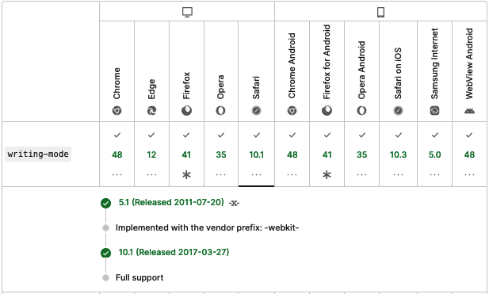

---
link:
  - rel: 'stylesheet'
    href: 'css/main.css'
lang: 'ja'
---

# 第2章 CSS表示テスト

## 2-1 はじめに

**情報開示：**本報告書に掲載したテストにおけるCSSモジュールの選定、及びテストファイルの制作は、本稿の共著者である村上真雄（Vivliostyle Foundation）がおこなった。村上はテスト対象となったEPUBリーダーの一つであるVivliostyle Viewerの開発者でもある。また、本稿のもう一人の共著者である小形克宏は、村上とともにVivliostyle Foundationの理事でもある。ただし、テストの制作と実施、そして本稿の執筆にあたって、中立性の確保、及び情報の公開を徹底することで、信頼性の担保に努めた。この点、あらかじめ開示する。

### 2-1-1 CSS表示テストの目的と方法

2023年5月、W3Cは最新のEPUB仕様となる[EPUB 3.3](https://www.w3.org/TR/epub-33/)を勧告した。そこではCSS仕様との関係について、以下のように規定している。

> [§1.3.3 Relationship to CSS](https://www.w3.org/TR/epub-33/#sec-overview-relations-css)
> 
> EPUB 3 supports CSS as defined by the CSS Working Group Snapshot [[csssnapshot]](https://www.w3.org/TR/CSS/). EPUB 3 also maintains some prefixed CSS properties, to ensure consistent support for global languages.
> 
> 和訳：**§1.3.3 CSSとの関係**　EPUB3は、CSS Working Group Snapshot [[csssnapshot]](https://www.w3.org/TR/CSS/)で定義されているCSSをサポートします。EPUB3は、グローバル言語のための一貫したサポートを保証するために、いくつかの接頭辞付きのCSSプロパティも維持します。

上記にある “CSS Working Group Snapshot” とはなんだろう。かつてバージョン2まで、CSS仕様は単一の仕様書ですべてのプロパティを規定していた。しかしその次のバージョン3では飛躍的に規模が大きくなることが確実になった。そこで審議するCSS Working Groupは、機能や目的ごとの「モジュール」に仕様を分割することにし、更新はモジュールごとにすすめることにした。ところが更新のペースがバラバラになると、今度はCSS仕様全体の状況が把握しづらくなってしまう。そこで考え出されたのが、インターネットブラウザー（以下、ブラウザー）に実装されたCSSモジュールの安定レベルごと分類したリストを作成、これを特定のURLで公開することにし、リストは1年ごとに更新していくという方法だ。

本稿を執筆している2024年3月では、上記引用で[csssnapshot]にリンクされているURL、https://www.w3.org/TR/CSS/ にジャンプすると“CSS Snapshot 2023” というタイトルが表示される。しかし、今から1年後の2025年3月に同じURLをクリックすると “CSS Snapshot 2024” になっており、リストの内容もその時の実装状況を反映して変わっているだろう。これが “CSS Working Group Snapshot” という方法なのである“CSS Snapshot 2023”のパーマネント・リンクは以下を参照。 https://www.w3.org/TR/css-2023/

そこで重要になるのが安定性のレベル分けだが、以下の3段階に分類されることになっている。

1. [CSSの公式的な定義に含まれるCSSモジュール（Cascading Style Sheets (CSS) — The Official Definition）](https://www.w3.org/TR/CSS/#css-official)
2. [かなり安定しているが実装経験が限定的なCSSモジュール（Fairly Stable Modules with limited implementation experience）](https://www.w3.org/TR/CSS/#fairly-stable)
3. [大まかな相互運用性のあるCSSモジュール（Modules with Rough Interoperability）](https://www.w3.org/TR/CSS/#rough-interop)

前掲EPUB 3.3の引用にある「CSS Working Group Snapshotで定義されているCSS」とは、上記のうち1のことだ。つまり、EPUB 3.3では上記1でリストアップされているCSSモジュールが使えることが求められている。では、**現在我が国で利用されている各社EPUBリーダーは、これらのCSSモジュールを表示できるのだろうか？**

もうひとつ、前掲の引用で分かるように、旧仕様で許されていた`-epub-`接頭辞付きのCSSプロパティは、最新仕様でも後方互換性のために残された。とはいえ、[§6.3.1.3 Prefixed properties](https://www.w3.org/TR/epub-33/#sec-css-prefixed)で、「EPUB制作者は接頭辞なしのプロパティを使用するべきで、リーディングシステム（EPUBリーダー）は現行のCSS仕様をサポートするべき」、「Working Groupは、EPUBの次のメジャーバージョンでこれらの接頭辞付きプロパティをサポートする見込みがないため、現在これらの接頭辞付きプロパティを使用しているEPUB制作者は、サポートが可能になり次第、接頭辞なしバージョンに移行することを推奨する」と規定されている。

つまりEPUB 3.3では、接頭辞は使わないことが推薦されている。では、**現在使われている各社EPUBリーダーは、本当に`-epub-`接頭辞付きプロパティなしで表示できるのだろうか？**

これらのことを実際にテストすることによって、EPUBリーダーのEPUB 3.3対応状況を知ることができる。それだけではない、EPUB 3.3は国際規格だ。ということは、このテストにより「日本のEPUBリーダーのEPUB 3.3対応状況」をも明らかにできるのではないか、そのように私達は考えた。

テストの方法をもう少し詳しく説明しよう。上記 [“CSS Working Group Snapshot”](https://www.w3.org/TR/css-2023/) にある3つに加え、そこに載っていないが最新のブラウザーで利用できるCSSモジュールを加え、全部で4つの規準によってCSSモジュールを選定することにした。

つぎに、選定したCSSモジュールごとに、対応の可否を一目で識別できるテスト用EPUBファイルを制作した。これは以下のリポジトリで公開しているので、お読みの方はぜひご自分でも試していただきたいライセンスは[CC0 1.0](https://creativecommons.org/publicdomain/zero/1.0/deed.ja)で、著作権を放棄している。詳細はリポジトリを参照。

- [EPUBリーダーのCSS仕様適合性テスト](https://github.com/jagat-xpub/epub-css-test/tree/main)

最後に、テストベッドとなるEPUBリーダーを選定し、当研究会のメンバーごとに割り振ってテストを開始した。各担当者は前述テスト用EPUBファイルを自分が担当するEPUBリーダーにサイドロードし、テスト結果を以下のGoogleスプレッドシートに記録していったのである。

- [EPUBリーダー表示チェック（JAGAT次世代パブリッシング研究会）2023](https://docs.google.com/spreadsheets/d/1xKDlL4TrMHMa1qq2QsWcXLEGMPjx-JWcTdaw_8KkftE/edit?usp=sharing)（以下、「EPUBリーダー表示チェック」）

ただし、実際に調査結果をまとめてみると、あまりにテスト項目が多すぎて収まりきらないことが判明した。やむなく本報告書ではEPUB 3.3で利用可能なモジュール（前述「CSSの公式的な定義に含まれるCSSモジュール」）に絞って結果を掲載することにした。その他のテスト結果を知りたい方は、申し訳ないが上記「EPUBリーダー表示チェック」を直接ご参照いただきたい。報告書に掲載しなかった3つの規準、「かなり安定しているが実装経験が限定的」「大まかな相互運用性がある」「CSS Snapshot 2023に載っていないが最新のブラウザーで利用できる」に分類されるCSSモジュールの明細も、「EPUBリーダーのCSS仕様適合性テスト」を参照してほしい。

### 2-1-2 テスト結果を掲載したCSSモジュール

前述したように、本報告書では[CSS Snapshot 2023](https://www.w3.org/TR/CSS/)のうち、[2.1. Cascading Style Sheets (CSS) — The Official Definition（CSSの公式的な定義に含まれるCSSモジュール）](https://www.w3.org/TR/CSS/#css-official)にあるものだけを報告するが、そのうち以下はあまりに基礎的な仕様であり、実装の可否を調べるまでもないのでテストそのものから外している。

- [CSS Level 2, latest revision](https://www.w3.org/TR/CSS2/) (including errata)
- [CSS Syntax Level 3](https://www.w3.org/TR/css-syntax-3/)
- [CSS Style Attributes](https://www.w3.org/TR/css-style-attr/)
- [Media Queries Level 3](https://www.w3.org/TR/css3-mediaqueries/)
- [CSS Namespaces](https://www.w3.org/TR/css-namespaces/)
- [CSS Box Model Level 3](https://www.w3.org/TR/css-box-3/)
- [CSS Easing Functions Level 1](https://www.w3.org/TR/css-easing-1/)

のこりを次節以降で報告する。以下に仕様へのリンクとともに挙げる。全部で17のモジュール、61のCSSモジュールである。

- [CSS Conditional Rules Level 3](https://www.w3.org/TR/css-conditional-3/)
  - @supports ルール
- [Selectors Level 3](https://www.w3.org/TR/selectors-3/)
  - 部分文字列マッチング属性セレクタ `[att^=val]`, `[att$=val]`, `[att*=val]`
  - :root 擬似クラス
  - :nth-child(), :nth-last-child(), :nth-of-type(), :nth-last-of-type() 擬似クラス
  - :last-child, :only-child, :first-of-type, :last-of-type, :only-of-type 擬似クラス
  - :empty 擬似クラス
  - :not() 擬似クラス
  - ::first-line, ::first-letter, ::before, ::after 擬似要素
  - 後続兄弟結合子 `E ~ F`
- [CSS Cascading and Inheritance Level 4](https://www.w3.org/TR/css-cascade-4/)
  - all プロパティ
  - プロパティの値 initial, unset, revert
- [CSS Values and Units Level 3](https://www.w3.org/TR/css-values-3/)
  - 長さの単位
    - ch
    - rem
    - vw, vh, vmin, vmax
    - Q
- [CSS Custom Properties for Cascading Variables Module Level 1](https://www.w3.org/TR/css-variables-1/)
  - CSS変数
- [CSS Color Level 4](https://www.w3.org/TR/css-color-4/)
  - opacity プロパティ
  - rgb() 関数のコンマなし形式　例: rgb(0 255 0 / .5)
  - 16進数のRGBA形式（8桁、4桁）　例: #88FF44CC, #8F4C
  - hsl() 関数
  - hwb() 関数
- [CSS Backgrounds and Borders Level 3](https://www.w3.org/TR/css-backgrounds-3/)
  - 複数の背景画像　例: background-image: url(a.png), url(b.png), url(c.png);
  - border-radius プロパティ
  - border-image プロパティ
  - box-shadow プロパティ
- [CSS Images Level 3](https://www.w3.org/TR/css-images-3/)
  - グラデーション関数
    - linear-gradient()
    - radial-gradient()
    - repeating-linear-gradient(), repeating-radial-gradient()
  - object-fit プロパティ
  - object-position プロパティ
- [CSS Fonts Level 3](https://www.w3.org/TR/css-fonts-3/)
  - @font-face ルール
  - unicode-range 記述子
  - font-kerning プロパティ
  - font-variant プロパティ
  - font-feature-settings プロパティ
- [CSS Writing Modes Level 3](https://www.w3.org/TR/css-writing-modes-3/)
  - writing-mode プロパティ
  - text-orientation プロパティ
  - text-combine-upright プロパティ
- [CSS Multi-column Layout Level 1](https://www.w3.org/TR/css-multicol-1/)
  - columns プロパティ
  - column-gap プロパティ
  - column-rule プロパティ
  - column-span プロパティ
  - column-fill プロパティ
- [CSS Flexible Box Module Level 1](https://www.w3.org/TR/css-flexbox-1/)
  - display プロパティの値 flex および inline-flex
  - flex-flow プロパティ
  - order プロパティ
  - flex プロパティ
  - justify-content, align-items, align-self, align-content プロパティ
- [CSS User Interface Module Level 3](https://www.w3.org/TR/css-ui-3/)
  - box-sizing プロパティ
  - outline プロパティ
- [CSS Containment Module Level 1](https://www.w3.org/TR/css-contain-1/)
  - contain プロパティ
- [CSS Transforms Level 1](https://www.w3.org/TR/css-transforms-1/)
  - transform プロパティ
- [CSS Compositing and Blending Level 1](https://www.w3.org/TR/compositing-1/)
  - mix-blend-mode プロパティ
  - isolation プロパティ
  - background-blend-mode プロパティ
- [CSS Counter Styles Level 3](https://www.w3.org/TR/css-counter-styles-3/)
  - @counter-style ルール
  - 定義済みカウンタースタイル
    - cjk-decimal
    - hiragana, hiragana-iroha, katakana, katakana-iroha
    - cjk-earthly-branch
    - cjk-heavenly-stem
    - japanese-informal

### 2-1-3 本調査におけるテスト環境の一覧

今回の調査でテストしたEPUBリーダーの数は、全部で54にのぼる。そのうち、次項以降で詳細を述べるリーダーが36だ。これらの明細を<a href="#2-1-3-1-掲載したテスト環境の一覧">2-1-3-1 掲載したテスト環境の一覧</a>に掲げる。

他方、54のうち18は掲載していない。その理由は一部テストファイルの不具合が判明し部分的に更新したことに伴い、それ以前のテスト結果は不正確であることから掲載しないことにしたものだ。この不具合については○○で詳述することにして、それらリーダーの明細を<a href="#2-1-3-2-掲載しなかったテスト環境の一覧">2-1-3-2 掲載しなかったテスト環境の一覧</a>に掲げる。

#### 2-1-3-1 掲載したテスト環境の一覧

<table>
  <thead>
    <tr>
      <th style="color:#434343" align="center">リーダー名</th>
      <th style="color:#434343" align="center">略称</td>
      <th style="color:#434343" align="center">種別</th>
      <th style="color:#434343" align="center">機材名</th>
      <th style="color:#434343" align="center">OS ver.</th>
      <th style="color:#434343" align="center">リーダーver.</th>
      <th style="color:#434343" align="center">担当者</th>
      <th style="color:#434343" align="center">テスト日</th>
    </tr>
  </thead>
  <tbody>
    <tr>
      <td bgcolor="#c9daf8" align="center">Kindle Previewer3 (Mac) *¹</td>
      <td bgcolor="#c9daf8" align="center">Kindle</td>
      <td bgcolor="#c9daf8" align="center">Macアプリ</td>
      <td bgcolor="#c9daf8" align="center">Mac mini M1, 2020</td>
      <td bgcolor="#c9daf8" align="center">macOS 14.2.1</td>
      <td bgcolor="#c9daf8" align="center">3.74.0</td>
      <td bgcolor="#c9daf8" align="center">村上</td>
      <td bgcolor="#c9daf8" align="center">2023/12/28</td>
    </tr>
    <tr>
      <td bgcolor="#c9daf8" align="center">Kindle for Mac *¹</td>
      <td bgcolor="#c9daf8" align="center">Kindle</td>
      <td bgcolor="#c9daf8" align="center">Macアプリ</td>
      <td bgcolor="#c9daf8" align="center">Mac mini M1, 2020</td>
      <td bgcolor="#c9daf8" align="center">macOS 14.2.1</td>
      <td bgcolor="#c9daf8" align="center">7.0.0.100 (1.316222)</td>
      <td bgcolor="#c9daf8" align="center">村上</td>
      <td bgcolor="#c9daf8" align="center">2023/12/28</td>
    </tr>
    <tr>
      <td bgcolor="#c9daf8" align="center">Kindle Previewer3 (Win) *¹</td>
      <td bgcolor="#c9daf8" align="center">Kindle</td>
      <td bgcolor="#c9daf8" align="center">Windows アプリ</td>
      <td bgcolor="#c9daf8" align="center">N/A *²</td>
      <td bgcolor="#c9daf8" align="center">Windows 10 Pro 22H2</td>
      <td bgcolor="#c9daf8" align="center">3.74.0</td>
      <td bgcolor="#c9daf8" align="center">村上</td>
      <td bgcolor="#c9daf8" align="center">2024/01/09</td>
    </tr>
    <tr>
      <td bgcolor="#c9daf8" align="center">Kindle for PC *¹</td>
      <td bgcolor="#c9daf8" align="center">Kindle</td>
      <td bgcolor="#c9daf8" align="center">Windows アプリ</td>
      <td bgcolor="#c9daf8" align="center">N/A *²</td>
      <td bgcolor="#c9daf8" align="center">Windows 10 Pro 22H2</td>
      <td bgcolor="#c9daf8" align="center">2.3.0 (70673)</td>
      <td bgcolor="#c9daf8" align="center">村上</td>
      <td bgcolor="#c9daf8" align="center">2024/01/09</td>
    </tr>
    <tr>
      <td bgcolor="#c9daf8" align="center">Kindle for Android *¹</td>
      <td bgcolor="#c9daf8" align="center">Kindle</td>
      <td bgcolor="#c9daf8" align="center">Android アプリ</td>
      <td bgcolor="#c9daf8" align="center">OPPO A55s 5G</td>
      <td bgcolor="#c9daf8" align="center">Android 12</td>
      <td bgcolor="#c9daf8" align="center">8.89.3.0 (2.0.2766.0)</td>
      <td bgcolor="#c9daf8" align="center">村上</td>
      <td bgcolor="#c9daf8" align="center">2024/01/09</td>
    </tr>
    <tr>
      <td bgcolor="#c9daf8" align="center">Kinoppy for iOS *¹</td>
      <td bgcolor="#c9daf8" align="center">Kindle</td>
      <td bgcolor="#c9daf8" align="center">iPadアプリ</td>
      <td bgcolor="#c9daf8" align="center">iPad mini (第5世代)</td>
      <td bgcolor="#c9daf8" align="center">iPadOS 17.1.2</td>
      <td bgcolor="#c9daf8" align="center">7.0.1</td>
      <td bgcolor="#c9daf8" align="center">村上</td>
      <td bgcolor="#c9daf8" align="center">2024/01/09</td>
    </tr>
    <tr>
      <td bgcolor="#c9daf8" align="center">Kinoppy for iOS *¹</td>
      <td bgcolor="#c9daf8" align="center">Kindle</td>
      <td bgcolor="#c9daf8" align="center">iOSアプリ</td>
      <td bgcolor="#c9daf8" align="center">iPhone 13 mini</td>
      <td bgcolor="#c9daf8" align="center">iOS 17.2.1</td>
      <td bgcolor="#c9daf8" align="center">7.1</td>
      <td bgcolor="#c9daf8" align="center">古門</td>
      <td bgcolor="#c9daf8" align="center">2024/01/21</td>
    </tr>
    <tr>
      <td bgcolor="#d9ead3" align="center">楽天Koboアプリ for iPhone *¹</td>
      <td bgcolor="#d9ead3" align="center">kobo-1</td>
      <td bgcolor="#d9ead3" align="center">iOSアプリ</td>
      <td bgcolor="#d9ead3" align="center">iPhone 13 mini</td>
      <td bgcolor="#d9ead3" align="center">iOS17.2.1</td>
      <td bgcolor="#d9ead3" align="center">10.4.3</td>
      <td bgcolor="#d9ead3" align="center">古門（追試）</td>
      <td bgcolor="#d9ead3" align="center">2024/02/01</td>
    </tr>
    <tr>
      <td bgcolor="#d9ead3" align="center">楽天Koboアプリ for Android</td>
      <td bgcolor="#d9ead3" align="center">kobo-2</td>
      <td bgcolor="#d9ead3" align="center">Android アプリ</td>
      <td bgcolor="#d9ead3" align="center">Galaxy Tab S8 Ultra</td>
      <td bgcolor="#d9ead3" align="center">Android　13</td>
      <td bgcolor="#d9ead3" align="center">9.4.8.1</td>
      <td bgcolor="#d9ead3" align="center">仁科</td>
      <td bgcolor="#d9ead3" align="center">2023/08/20</td>
    </tr>
    <tr>
      <td bgcolor="#c9daf8" align="center">Kobo Libra 2</td>
      <td bgcolor="#c9daf8" align="center">kobo-3</td>
      <td bgcolor="#c9daf8" align="center">専用 タブレット</td>
      <td bgcolor="#c9daf8" align="center">リーダーと同</td>
      <td bgcolor="#c9daf8" align="center">4.38.21908 (fac580f37d, 2023/08/22)</td>
      <td bgcolor="#c9daf8" align="center">4.37.21586 (42535ad976, 2023/07/06)</td>
      <td bgcolor="#c9daf8" align="center">仁科</td>
      <td bgcolor="#c9daf8" align="center">2023/07/25</td>
    </tr>
    <tr>
      <td bgcolor="#c9daf8" align="center">楽天Koboデスクトップ</td>
      <td bgcolor="#c9daf8" align="center">kobo-3</td>
      <td bgcolor="#c9daf8" align="center">Windows アプリ</td>
      <td bgcolor="#c9daf8" align="center">N/A *²</td>
      <td bgcolor="#c9daf8" align="center">Windows 10 Pro (22H2　19045.3208)</td>
      <td bgcolor="#c9daf8" align="center">4.37.19051</td>
      <td bgcolor="#c9daf8" align="center">仁科</td>
      <td bgcolor="#c9daf8" align="center">2023/07/25</td>
    </tr>
    <tr>
      <td bgcolor="#c9daf8" align="center">楽天Koboデスクトップ</td>
      <td bgcolor="#c9daf8" align="center">kobo-3</td>
      <td bgcolor="#c9daf8" align="center">Macアプリ</td>
      <td bgcolor="#c9daf8" align="center">MacBook (Retina, 12-12inch, Early 2016)</td>
      <td bgcolor="#c9daf8" align="center">macOS 12.6.6</td>
      <td bgcolor="#c9daf8" align="center">4.37.17113</td>
      <td bgcolor="#c9daf8" align="center">仁科</td>
      <td bgcolor="#c9daf8" align="center">2023/08/20</td>
    </tr>
    <tr>
      <td bgcolor="#c9daf8" align="center">楽天Koboデスクトップ *¹</td>
      <td bgcolor="#c9daf8" align="center">kobo-3</td>
      <td bgcolor="#c9daf8" align="center">Macアプリ</td>
      <td bgcolor="#c9daf8" align="center">MacBook (Retina, 12-12inch, Early 2016)</td>
      <td bgcolor="#c9daf8" align="center">macOS 12.7.2</td>
      <td bgcolor="#c9daf8" align="center"> 4.37.17113</td>
      <td bgcolor="#c9daf8" align="center">仁科</td>
      <td bgcolor="#c9daf8" align="center">2024/01/30</td>
    </tr>
    <tr>
      <td bgcolor="#d9ead3" align="center">ブック</td>
      <td bgcolor="#d9ead3" align="center">→</td>
      <td bgcolor="#d9ead3" align="center" valign="top">iOSアプリ</td>
      <td bgcolor="#d9ead3" align="center">iPhone 13 mini</td>
      <td bgcolor="#d9ead3" align="center">iOS16.4.1 (a)</td>
      <td bgcolor="#d9ead3" style="color:#0000ff" align="center">N/A *³</td>
      <td bgcolor="#d9ead3" align="center">古門</td>
      <td bgcolor="#d9ead3" align="center">2023/05/20</td>
    </tr>
    <tr>
      <td bgcolor="#d9ead3" align="center">ブック</td>
      <td bgcolor="#d9ead3" align="center">→</td>
      <td bgcolor="#d9ead3" align="center" valign="top">Macアプリ</td>
      <td bgcolor="#d9ead3" align="center">MacBookAir M2 2022</td>
      <td bgcolor="#d9ead3" align="center">macOS 13.6.3 (22G436)</td>
      <td bgcolor="#d9ead3" align="center">5.2 (5800.52)</td>
      <td bgcolor="#d9ead3" align="center">小形</td>
      <td bgcolor="#d9ead3" align="center">2023/05/23</td>
    </tr>
    <tr>
      <td bgcolor="#d9ead3" align="center">ブック</td>
      <td bgcolor="#d9ead3" align="center">→</td>
      <td bgcolor="#d9ead3" align="center">Macアプリ</td>
      <td bgcolor="#d9ead3" align="center">MacBook Pro 13-inch, 2019</td>
      <td bgcolor="#d9ead3" align="center">macOS 13.6.3 (22G436)</td>
      <td bgcolor="#d9ead3" align="center">5.2</td>
      <td bgcolor="#d9ead3" align="center">小形</td>
      <td bgcolor="#d9ead3" align="center">2024/02/07</td>
    </tr>
    <tr>
      <td bgcolor="#d9ead3" align="center">ブック*¹</td>
      <td bgcolor="#d9ead3" align="center">→</td>
      <td bgcolor="#d9ead3" align="center">Macアプリ</td>
      <td bgcolor="#d9ead3" align="center">MacBook Pro 13-inch, 2019</td>
      <td bgcolor="#d9ead3" align="center">macOS 13.6.3 (22G436)</td>
      <td bgcolor="#d9ead3" align="center">5.2</td>
      <td bgcolor="#d9ead3" align="center">小形</td>
      <td bgcolor="#d9ead3" align="center">2024/02/08</td>
    </tr>
    <tr>
      <td bgcolor="#d9ead3" align="center">ブック</td>
      <td bgcolor="#d9ead3" align="center">→</td>
      <td bgcolor="#d9ead3" align="center">Macアプリ</td>
      <td bgcolor="#d9ead3" align="center">MacBookAir M2 2022</td>
      <td bgcolor="#d9ead3" align="center">macOS 14.1.1（23B81）</td>
      <td bgcolor="#d9ead3" align="center">6.1</td>
      <td bgcolor="#d9ead3" align="center">小形</td>
      <td bgcolor="#d9ead3" align="center">2024/02/09</td>
    </tr>
    <tr>
      <td bgcolor="#d9ead3" align="center">ブック*¹</td>
      <td bgcolor="#d9ead3" align="center">→</td>
      <td bgcolor="#d9ead3" align="center">Macアプリ</td>
      <td bgcolor="#d9ead3" align="center">MacBookAir M2 2023</td>
      <td bgcolor="#d9ead3" align="center">macOS 14.1.1（23B81）</td>
      <td bgcolor="#d9ead3" align="center">6.1</td>
      <td bgcolor="#d9ead3" align="center">小形</td>
      <td bgcolor="#d9ead3" align="center">2024/02/10</td>
    </tr>
    <tr>
      <td bgcolor="#d9ead3" align="center">MURASAKI</td>
      <td bgcolor="#d9ead3" align="center">→</td>
      <td bgcolor="#d9ead3" align="center">Macアプリ</td>
      <td bgcolor="#d9ead3" align="center">MacBookAir M2 2022</td>
      <td bgcolor="#d9ead3" align="center">macOS 13.4</td>
      <td bgcolor="#d9ead3" align="center">2.4.1</td>
      <td bgcolor="#d9ead3" align="center">小形</td>
      <td bgcolor="#d9ead3" align="center">2023/05/23</td>
    </tr>
    <tr>
      <td bgcolor="#d9ead3" align="center">MURASAKI</td>
      <td bgcolor="#d9ead3" align="center">→</td>
      <td bgcolor="#d9ead3" align="center">Macアプリ</td>
      <td bgcolor="#d9ead3" align="center">MacBookAir M2 2022</td>
      <td bgcolor="#d9ead3" align="center">macOS 14.1.1 (23B81)</td>
      <td bgcolor="#d9ead3" align="center">2.4.1</td>
      <td bgcolor="#d9ead3" align="center">小形</td>
      <td bgcolor="#d9ead3" align="center">2024/02/08</td>
    </tr>
    <tr>
      <td bgcolor="#d9ead3" align="center">MURASAKI*¹</td>
      <td bgcolor="#d9ead3" align="center">→</td>
      <td bgcolor="#d9ead3" align="center">Macアプリ</td>
      <td bgcolor="#d9ead3" align="center">MacBook Pro 13-inch, 2019</td>
      <td bgcolor="#d9ead3" align="center">macOS 13.6.3 (22G436)</td>
      <td bgcolor="#d9ead3" align="center">5.2</td>
      <td bgcolor="#d9ead3" align="center">小形</td>
      <td bgcolor="#d9ead3" align="center">2024/02/08</td>
    </tr>
    <tr>
      <td bgcolor="#c9daf8" align="center">honto電子書籍リーダー *¹</td>
      <td bgcolor="#c9daf8" align="center">honto</td>
      <td bgcolor="#c9daf8" align="center">iOSアプリ</td>
      <td bgcolor="#c9daf8" align="center">iPhone 13 mini</td>
      <td bgcolor="#c9daf8" align="center">iOS17.2.1</td>
      <td bgcolor="#c9daf8" align="center">6.62.0</td>
      <td bgcolor="#c9daf8" align="center">古門</td>
      <td bgcolor="#c9daf8" align="center">2024/01/24</td>
    </tr>
    <tr>
      <td bgcolor="#d9ead3" align="center">BOOK☆WALKER</td>
      <td bgcolor="#d9ead3" align="center">→</td>
      <td bgcolor="#d9ead3" align="center">iOSアプリ</td>
      <td bgcolor="#d9ead3" align="center">iPhone 13 mini</td>
      <td bgcolor="#d9ead3" align="center">iOS16.4.1 (a)</td>
      <td bgcolor="#d9ead3" align="center">7.4.7</td>
      <td bgcolor="#d9ead3" align="center">古門</td>
      <td bgcolor="#d9ead3" align="center">2023/05/20</td>
    </tr>
    <tr>
      <td bgcolor="#d9ead3" align="center">BOOK☆WALKER</td>
      <td bgcolor="#d9ead3" align="center">→</td>
      <td bgcolor="#d9ead3" align="center">Android アプリ</td>
      <td bgcolor="#d9ead3" align="center">Galaxy Tab S8 Ultra</td>
      <td bgcolor="#d9ead3" align="center">Android　13</td>
      <td bgcolor="#d9ead3" align="center">7.5.0</td>
      <td bgcolor="#d9ead3" align="center">仁科</td>
      <td bgcolor="#d9ead3" align="center">2023/08/21</td>
    </tr>
    <tr>
      <td bgcolor="#c9daf8" align="center">Kinoppy *¹</td>
      <td bgcolor="#c9daf8" align="center">→</td>
      <td bgcolor="#c9daf8" align="center">Windows アプリ</td>
      <td bgcolor="#c9daf8" align="center">N/A *²</td>
      <td bgcolor="#c9daf8" align="center">Windows 10 Pro 22H2</td>
      <td bgcolor="#c9daf8" align="center">3.2.19</td>
      <td bgcolor="#c9daf8" align="center">村上</td>
      <td bgcolor="#c9daf8" align="center">2023/12/07</td>
    </tr>
    <tr>
      <td bgcolor="#c9daf8" align="center">Romancer *¹</td>
      <td bgcolor="#c9daf8" align="center">→</td>
      <td bgcolor="#c9daf8" align="center">Webアプリ</td>
      <td bgcolor="#c9daf8" align="center">Galaxy Tab S8 Ultra</td>
      <td bgcolor="#c9daf8" align="center">Android 13</td>
      <td bgcolor="#c9daf8" align="center">N/A *³</td>
      <td bgcolor="#c9daf8" align="center">仁科</td>
      <td bgcolor="#c9daf8" align="center">2023/07/23</td>
    </tr>
    <tr>
      <td bgcolor="#c9daf8" align="center">Romancer *¹</td>
      <td bgcolor="#c9daf8" align="center">→</td>
      <td bgcolor="#c9daf8" align="center">Webアプリ</td>
      <td bgcolor="#c9daf8" align="center">N/A *²</td>
      <td bgcolor="#c9daf8" align="center">Windows 10 Pro</td>
      <td bgcolor="#c9daf8" align="center">N/A *³</td>
      <td bgcolor="#c9daf8" align="center">仁科</td>
      <td bgcolor="#c9daf8" align="center">2023/07/23</td>
    </tr>
    <tr>
      <td bgcolor="#d9ead3" align="center">Bibi</td>
      <td bgcolor="#d9ead3" align="center">→</td>
      <td bgcolor="#d9ead3" align="center">Webアプリ</td>
      <td bgcolor="#d9ead3" align="center">N/A *²</td>
      <td bgcolor="#d9ead3" align="center">Windows 11 PRO</td>
      <td bgcolor="#d9ead3" align="center">1.2.0 / Chrome 113.0.5672.127 (64ビット) *⁴</td>
      <td bgcolor="#d9ead3" align="center">古門</td>
      <td bgcolor="#d9ead3" align="center">2023/05/28</td>
    </tr>
    <tr>
      <td bgcolor="#d9ead3" align="center">Bibi</td>
      <td bgcolor="#d9ead3" align="center">→</td>
      <td bgcolor="#d9ead3" align="center">Webアプリ</td>
      <td bgcolor="#d9ead3" align="center">N/A *²</td>
      <td bgcolor="#d9ead3" align="center">Windows 11 PRO</td>
      <td bgcolor="#d9ead3" align="center">1.2.0 / Edge 113.0.1774.57 (64ビット) *⁴</td>
      <td bgcolor="#d9ead3" align="center">古門</td>
      <td bgcolor="#d9ead3" align="center">2023/05/28</td>
    </tr>
    <tr>
      <td bgcolor="#c9daf8" align="center">超縦書</td>
      <td bgcolor="#c9daf8" align="center">→</td>
      <td bgcolor="#c9daf8" align="center">Windows アプリ</td>
      <td bgcolor="#c9daf8" align="center">N/A *²</td>
      <td bgcolor="#c9daf8" align="center">Windows 10 Home 21H2</td>
      <td bgcolor="#c9daf8" align="center">2.3.1</td>
      <td bgcolor="#c9daf8" align="center">田嶋</td>
      <td bgcolor="#c9daf8" align="center">2023/05/23</td>
    </tr>
    <tr>
      <td bgcolor="#c9daf8" align="center">超縦書 *¹</td>
      <td bgcolor="#c9daf8" align="center">→</td>
      <td bgcolor="#c9daf8" align="center">Windows アプリ</td>
      <td bgcolor="#c9daf8" align="center">N/A *²</td>
      <td bgcolor="#c9daf8" align="center">Windows 10 Pro 22H2</td>
      <td bgcolor="#c9daf8" align="center">2.3.2</td>
      <td bgcolor="#c9daf8" align="center">小形</td>
      <td bgcolor="#c9daf8" align="center">2024/02/13</td>
    </tr>
    <tr>
      <td bgcolor="#d9ead3" align="center">Vivliostyle Viewer</td>
      <td bgcolor="#d9ead3" align="center">Vivliostyle</td>
      <td bgcolor="#d9ead3" align="center">Webアプリ</td>
      <td bgcolor="#d9ead3" align="center">Mac mini M1, 2020</td>
      <td bgcolor="#d9ead3" align="center">macOS 13.4</td>
      <td bgcolor="#d9ead3" align="center">2.25.0 / Chrome 113 *⁴</td>
      <td bgcolor="#d9ead3" align="center">村上</td>
      <td bgcolor="#d9ead3" align="center">2023/05/23</td>
    </tr>
    <tr>
      <td bgcolor="#d9ead3" align="center">Vivliostyle Viewer *¹</td>
      <td bgcolor="#d9ead3" align="center">Vivliostyle</td>
      <td bgcolor="#d9ead3" align="center">Webアプリ</td>
      <td bgcolor="#d9ead3" align="center">iPad第6世代</td>
      <td bgcolor="#d9ead3" align="center">iPadOS 17.3.1</td>
      <td bgcolor="#d9ead3" align="center">2.27.0 / Safari (N/A)</td>
      <td bgcolor="#d9ead3" align="center">田嶋</td>
      <td bgcolor="#d9ead3" align="center">2024/02/13</td>
    </tr>
    <tr>
      <td bgcolor="#d9ead3" align="center">Thorium Reader</td>
      <td bgcolor="#d9ead3" align="center">Thorium</td>
      <td bgcolor="#d9ead3" align="center">Windows アプリ</td>
      <td bgcolor="#d9ead3" align="center">N/A *²</td>
      <td bgcolor="#d9ead3" align="center">Windows 11 PRO</td>
      <td bgcolor="#d9ead3" align="center">2.3.0</td>
      <td bgcolor="#d9ead3" align="center">古門</td>
      <td bgcolor="#d9ead3" align="center">2023/09/25</td>
    </tr>
    <tr>
      <td bgcolor="#d9ead3" align="center">Thorium Reader</td>
      <td bgcolor="#d9ead3" align="center">Thorium</td>
      <td bgcolor="#d9ead3" align="center">Macアプリ</td>
      <td bgcolor="#d9ead3" align="center">MacBook Air (M1, 2020) </td>
      <td bgcolor="#d9ead3" align="center">macOS12.6.7</td>
      <td bgcolor="#d9ead3" align="center">2.2.0</td>
      <td bgcolor="#d9ead3" align="center">田嶋</td>
      <td bgcolor="#d9ead3" align="center">2023/08/25</td>
    </tr>
  </tbody>
</table>

- 1……テストファイルepubcsstest_voyagerによるテスト
- 2……自作機もあるWindows環境ではハードウェアを区別する意味はあまりないので省略
- 3……バージョン番号を表示する機能がない
- 4……ブラウザー上で動作するのでブラウザーのバージョン名も併記

#### 2-1-3-2 掲載しなかったテスト環境の一覧

<table>
  <thead>
    <tr>
      <th style="color:#434343" align="center">リーダー名</th>
      <th style="color:#434343" align="center">種別</th>
      <th style="color:#434343" align="center">機材名</th>
      <th style="color:#434343" align="center">OS ver.</th>
      <th style="color:#434343" align="center">リーダーver.</th>
      <th style="color:#434343" align="center">担当者</th>
      <th style="color:#434343" align="center">テスト日</th>
    </tr>
  </thead>
  <tbody>
    <tr>
      <td bgcolor="#c9daf8" align="center">Kindle for Android</td>
      <td bgcolor="#c9daf8" align="center">Android アプリ</td>
      <td bgcolor="#c9daf8" align="center">Moto G30</td>
      <td bgcolor="#c9daf8" align="center">Android 11</td>
      <td bgcolor="#c9daf8" align="center">8.81.1.0 (1.3.290180.0)</td>
      <td bgcolor="#c9daf8" align="center">仁科</td>
      <td bgcolor="#c9daf8" align="center">2023/05/22</td>
    </tr>
    <tr>
      <td bgcolor="#c9daf8" align="center">Kindle for Android</td>
      <td bgcolor="#c9daf8" align="center">Android アプリ</td>
      <td bgcolor="#c9daf8" align="center">Galaxy Tab S8 Ultra</td>
      <td bgcolor="#c9daf8" align="center">Android 13</td>
      <td bgcolor="#c9daf8" align="center">8.81.1.0 (1.3.290180.0)</td>
      <td bgcolor="#c9daf8" align="center">仁科</td>
      <td bgcolor="#c9daf8" align="center">2023/722</td>
    </tr>
    <tr>
      <td bgcolor="#c9daf8" align="center">Kindle for Android</td>
      <td bgcolor="#c9daf8" align="center">Android アプリ</td>
      <td bgcolor="#c9daf8" align="center">Xperia 10 IV</td>
      <td bgcolor="#c9daf8" align="center">Android 13</td>
      <td bgcolor="#c9daf8" align="center">8.81.1.0 (1.3.290180.0)</td>
      <td bgcolor="#c9daf8" align="center">木龍</td>
      <td bgcolor="#c9daf8" align="center">2023/07/25</td>
    </tr>
    <tr>
      <td bgcolor="#c9daf8" align="center">Kindle Fire HD 10 Plus</td>
      <td bgcolor="#c9daf8" align="center">専用 タブレット</td>
      <td bgcolor="#c9daf8" align="center">リーダーと同</td>
      <td bgcolor="#c9daf8" align="center">FireOS 7.3.2.8</td>
      <td bgcolor="#c9daf8" align="center">14.81.160 (1.3.290180)</td>
      <td bgcolor="#c9daf8" align="center">仁科</td>
      <td bgcolor="#c9daf8" align="center">2023/05/21</td>
    </tr>
    <tr>
      <td bgcolor="#c9daf8" align="center">Kindle Paperwhite Signature Edition *¹</td>
      <td bgcolor="#c9daf8" align="center">専用 タブレット</td>
      <td bgcolor="#c9daf8" align="center">リーダーと同</td>
      <td bgcolor="#FFDEAD" align="center"></td>
      <td bgcolor="#c9daf8" align="center">5.15.1.1</td>
      <td bgcolor="#c9daf8" align="center">仁科</td>
      <td bgcolor="#c9daf8" align="center">2023/05/21</td>
    </tr>
    <tr>
      <td bgcolor="#c9daf8" align="center">Kindle for PC</td>
      <td bgcolor="#c9daf8" align="center">Windows アプリ</td>
      <td bgcolor="#c9daf8" align="center">N/A *⁴</td>
      <td bgcolor="#c9daf8" align="center">Windows 10 Home 21H2</td>
      <td bgcolor="#FFDEAD" align="center"></td>
      <td bgcolor="#c9daf8" align="center">田嶋</td>
      <td bgcolor="#c9daf8" align="center">2023/05/22</td>
    </tr>
    <tr>
      <td bgcolor="#c9daf8" align="center">Kindle for PC</td>
      <td bgcolor="#c9daf8" align="center">Windows アプリ</td>
      <td bgcolor="#c9daf8" align="center">N/A *⁴</td>
      <td bgcolor="#FFDEAD" align="center"></td>
      <td bgcolor="#c9daf8" align="center">2.0.1 (70350)</td>
      <td bgcolor="#c9daf8" align="center">仁科</td>
      <td bgcolor="#c9daf8" align="center">2023/10/24</td>
    </tr>
    <tr>
      <td bgcolor="#c9daf8" align="center">Kindle for PC</td>
      <td bgcolor="#c9daf8" align="center">Windows アプリ</td>
      <td bgcolor="#c9daf8" align="center">N/A *⁴</td>
      <td bgcolor="#FFDEAD" align="center"></td>
      <td bgcolor="#c9daf8" align="center">1.40.1 (65535)</td>
      <td bgcolor="#c9daf8" align="center">仁科</td>
      <td bgcolor="#c9daf8" align="center">2023/05/21</td>
    </tr>
    <tr>
      <td bgcolor="#c9daf8" align="center">Kindle for PC *²</td>
      <td bgcolor="#c9daf8" align="center">Windows アプリ</td>
      <td bgcolor="#c9daf8" align="center">N/A *⁴</td>
      <td bgcolor="#FFDEAD" align="center"></td>
      <td bgcolor="#c9daf8" align="center">2.0.0 (70301)</td>
      <td bgcolor="#c9daf8" align="center">木龍</td>
      <td bgcolor="#c9daf8" align="center">2023/08/22</td>
    </tr>
    <tr>
      <td bgcolor="#c9daf8" align="center">Kindle for Mac </td>
      <td bgcolor="#c9daf8" align="center">Macアプリ</td>
      <td bgcolor="#c9daf8" align="center">Macbook 12-inch, Early 2016</td>
      <td bgcolor="#c9daf8" align="center">macOS 12.6.6</td>
      <td bgcolor="#c9daf8" align="center">1.40.1 (65624)</td>
      <td bgcolor="#c9daf8" align="center">仁科</td>
      <td bgcolor="#c9daf8" align="center">2023/05/22</td>
    </tr>
    <tr>
      <td bgcolor="#c9daf8" align="center">Kindle Previewer3 (Win)</td>
      <td bgcolor="#c9daf8" align="center">Windows アプリ</td>
      <td bgcolor="#c9daf8" align="center">N/A *⁴</td>
      <td bgcolor="#c9daf8" align="center">Kindle Previewer3(Win)</td>
      <td bgcolor="#c9daf8" align="center">3.71.1</td>
      <td bgcolor="#c9daf8" align="center">仁科</td>
      <td bgcolor="#c9daf8" align="center">2023/05/22</td>
    </tr>
    <tr>
      <td bgcolor="#c9daf8" align="center">Kindle Previewer3 (Mac)</td>
      <td bgcolor="#c9daf8" align="center">Macアプリ</td>
      <td bgcolor="#c9daf8" align="center">MacBook 12-inch, Early 2016</td>
      <td bgcolor="#c9daf8" align="center">macOS 12.6.6</td>
      <td bgcolor="#c9daf8" align="center">3.72.0</td>
      <td bgcolor="#c9daf8" align="center">仁科</td>
      <td bgcolor="#c9daf8" align="center">2023/05/22</td>
    </tr>
    <tr>
      <td bgcolor="#d9ead3" align="center">楽天Kobo - 読書専用アプリ</td>
      <td bgcolor="#d9ead3" align="center">iOSアプリ</td>
      <td bgcolor="#d9ead3" align="center">iPhone 13 mini</td>
      <td bgcolor="#d9ead3" align="center">iOS16.4.1 (a)</td>
      <td bgcolor="#d9ead3" align="center">10.3.7</td>
      <td bgcolor="#d9ead3" align="center">古門</td>
      <td bgcolor="#d9ead3" align="center">2023/05/20</td>
    </tr>
    <tr>
      <td bgcolor="#c9daf8" align="center">honto電子書籍リーダー</td>
      <td bgcolor="#c9daf8" align="center">iOSアプリ</td>
      <td bgcolor="#c9daf8" align="center">iPhone 13 mini</td>
      <td bgcolor="#c9daf8" align="center">iOS16.4.1 (a)</td>
      <td bgcolor="#c9daf8" align="center">6.60.0</td>
      <td bgcolor="#c9daf8" align="center">古門</td>
      <td bgcolor="#c9daf8" align="center">2023/05/20</td>
    </tr>
    <tr>
      <td bgcolor="#c9daf8" align="center">honto電子書籍リーダー</td>
      <td bgcolor="#c9daf8" align="center">Android アプリ</td>
      <td bgcolor="#c9daf8" align="center">Galaxy Tab S8 Ultra</td>
      <td bgcolor="#c9daf8" align="center">Android 13</td>
      <td bgcolor="#c9daf8" align="center">6.60.0</td>
      <td bgcolor="#c9daf8" align="center">仁科</td>
      <td bgcolor="#c9daf8" align="center">2023/08/20</td>
    </tr>
    <tr>
      <td bgcolor="#c9daf8" align="center">Kinoppy for iOS *³</td>
      <td bgcolor="#c9daf8" align="center">iOSアプリ</td>
      <td bgcolor="#c9daf8" align="center">iPhone 13 mini</td>
      <td bgcolor="#c9daf8" align="center">iOS</td>
      <td bgcolor="#c9daf8" align="center">3.9.17.415162200</td>
      <td bgcolor="#c9daf8" align="center">古門</td>
      <td bgcolor="#c9daf8" align="center">2023/10/23</td>
    </tr>
    <tr>
      <td bgcolor="#c9daf8" align="center">Kinoppy for Android *³</td>
      <td bgcolor="#c9daf8" align="center">Android アプリ</td>
      <td bgcolor="#c9daf8" align="center">Galaxy Tab S8 Ultra</td>
      <td bgcolor="#c9daf8" align="center">Android 13</td>
      <td bgcolor="#c9daf8" align="center">3.10.7 (913557c)</td>
      <td bgcolor="#c9daf8" align="center">仁科</td>
      <td bgcolor="#c9daf8" align="center">2023/10/18</td>
    </tr>
    <tr>
      <td bgcolor="#c9daf8" align="center">Kinoppy for Windows Desktop</td>
      <td bgcolor="#c9daf8" align="center">Windows アプリ</td>
      <td bgcolor="#c9daf8" align="center">N/A *⁴</td>
      <td bgcolor="#c9daf8" align="center">Windows 10 Home 21H2</td>
      <td bgcolor="#c9daf8" align="center">Ver.3.2.19</td>
      <td bgcolor="#c9daf8" align="center">田嶋</td>
      <td bgcolor="#c9daf8" align="center">2023/5/23</td>
    </tr>
  </tbody>
</table>

- 1……4章掲載「EPUB内文字、画像、背景表示テスト」のみ画面表示ができず、機材をKindle Paperwhite（第7世代）に変更
- 2……1.40.1 (65535) 20230822／2.0.0 (70301)に更新。とりあえずその他のEPUBビューア表示テストから確認
- 3……分割ファイルで再テスト
- 4……自作機もあるWindows環境ではハードウェアを区別する意味はあまりないので省略

## 2-2 CSS表示テストの結果

### 2-2-1 はじめに：レイアウトエンジンの違いとテストとの関係

テスト結果を報告する前に、まずレイアウトエンジンとは何か、そしてCSS表示テスト（以下、本テスト）とどのような関係があるのかを説明する。

ここでいうレイアウトエンジンとは、文字や画像を特定のルールにもとづき描画するプログラムのことだ。レンダリングエンジンともいう。たとえばブラウザーの場合、もとづくルールはHTML、CSS、JavaScriptになる。

同様にEPUBもHTML、CSSにもとづくことから、EPUBリーダーのレイアウトエンジンとしてブラウザーのものが流用されることが多い。とくに2011年10月に制定された[EPUB 3.0](https://idpf.org/epub/30/spec/epub30-overview.html)に先んじて、[同年7月](https://developer.mozilla.org/ja/docs/Web/CSS/writing-mode#%E3%83%96%E3%83%A9%E3%82%A6%E3%82%B6%E3%83%BC%E3%81%AE%E4%BA%92%E6%8F%9B%E6%80%A7)からCSSの縦書き用プロパティ`writing-mode: vertical-rl;`をいち早く実装したAppleの[WebKit](https://webkit.org/)は、我が国ではEPUBリーダー用レイアウトエンジンとして大歓迎された。ただし、`-webkit-`接頭辞が必要とされた。2-1-1で引用したEPUB 3.3[§1.3.3 Relationship to CSS](https://www.w3.org/TR/epub-33/#sec-overview-relations-css)の中で、後方互換性のために残された「いくつかの接頭辞付きのCSSプロパティ」の一つが、まさにこれだ。

その背景には、WebKitが一定の条件で無料利用できるオープンソースソフトウェア（以下、OSS）であることから、これを使えば開発コストを抑えられ、同時に日本語書籍に必須とされる縦書きをはじめ、さまざまな機能をすぐに実装できたことが大きいと考えられる。

本稿では、Webの閲覧に現在使われている（つまりモダン「モダン」の定義を補足すると、WebにおけるCSS仕様の使われ方が大きく変わったのは、2014年〜2016年に実装がはじまった[CSS変数（カスタムプロパティ）](https://developer.mozilla.org/ja/docs/Web/CSS/var#%E3%83%96%E3%83%A9%E3%82%A6%E3%82%B6%E3%83%BC%E3%81%AE%E4%BA%92%E6%8F%9B%E6%80%A7)だ。そこでこれが使えるかどうかを尺度とした。な）ブラウザーのレイアウトエンジンを利用したEPUBリーダーを、一括して**「モダンブラウザー系」**と呼ぶことにする。

他方、レイアウトエンジンは中枢となるモジュールであり、これを外部から調達すれば独自機能の追加がむずかしくなるなど、開発の柔軟性を損なうデメリットが考えられる。これを嫌ってだろうか、コストをかけても独自のレイアウトエンジンを実装するEPUBリーダーも多い。本稿ではこれらを**「独自エンジン系」**と呼ぶ。

では、本テストで対象とするEPUBリーダーのうち、どれがモダンブラウザー系で、どれが独自エンジン系なのだろう。ここで、本報告書がもとづく “CSS Snapshot 2023” は、CSS仕様の安定性を主要なブラウザーでの実装により4段階に分けたものであることを思い出してほしい。

つまり、現在Webの閲覧に使われているブラウザーのレイアウトエンジンであれば、本報告書に掲載した最も実装が安定した「CSSの公式的な定義に含まれるCSSモジュール」は、問題なく表示できるはずだ。

一方で、EPUBという限定的なフォーマットのレイアウトに特化した独自エンジン系にとっては、余計なコストをかけてまで “CSS Snapshot 2023” の規準をクリアするメリットはないだろう（少なくともEPUB 3.3のなかで “CSS Snapshot 2023” のサポートが掲げられる以前は、なのだが）。

こうして、本報告書でテストしたCSSモジュールを帰納法的なモノサシにして、それらが表示できたEPUBリーダーをモダンブラウザー系、そうでなかったEPUBリーダーを独自エンジン系と分別できることになる。

ただし、これだけで簡単に分別できるほど現実は甘くない。そこにはレイアウトエンジンのバージョン、もっといえばアップデートの頻度が関わってくる。

たとえば、超縦書はレイアウトエンジンにChromeのOSS版、[Chromium](https://www.chromium.org/chromium-projects/)を採用しているEPUBビューア「超縦書」Windows版 よくある質問（BPS株式会社、baba、2017年6月）<https://techracho.bpsinc.jp/baba/2017_06_30/42515>。しかしテスト結果をみると、現在使われているブラウザでは安定的に実装されている「Flexboxによる上下中央揃え」はサポートしているものの、同じく「[CSS変数](https://docs.google.com/spreadsheets/d/1xKDlL4TrMHMa1qq2QsWcXLEGMPjx-JWcTdaw_8KkftE/edit?pli=1#gid=1234705026&range=G43:H43)」や「[Grid Layout](https://docs.google.com/spreadsheets/d/1xKDlL4TrMHMa1qq2QsWcXLEGMPjx-JWcTdaw_8KkftE/edit?pli=1#gid=1234705026&range=G124)」はサポートしていないことが分かる。

そこで超縦書のプロパティを調べてみると、2017年7月3日に更新されたことが分かる（図1）。

{width=240}

さらにプログラムのフォルダ内を見ると、Qt5というフレームワークのライブラリがある。このうちQt5Core.dllのバージョン（5.6.1）とChromiumのバージョンには対応関係があることが分かっており、ここから超縦書で使われたChromiumのバージョンは2015年9月にリリースされた45.0.2554.101と推測できる。Qt5とChromiumのバージョン対応については以下を参照。 https://wiki.qt.io/QtWebEngine/ChromiumVersions また、Chrome 45のリリース日については以下を参照。 https://chrome.softwaredownload.co.in/chrome-45-0-2454

実際にはChromiumをカスタマイズしている可能性もあり、必ずしもChrome 45と断定できない。しかし、現行バージョンのタイムスタンプが2017年7月3日であり、Chromiumはそれよりさらに古いことは確かだ。

このことから、超縦書はかなり古いレイアウトエンジンを実装したまま現在までアップデートしていなかったと言える。これだけ古いと「モダン」の要件からははずれる。そこで、超縦書はブラウザーのレイアウトエンジンを利用しているが、独自エンジン系に分類することにした。

このようにして、本報告書のテスト対象としたEPUBリーダーを、2-1-3-1所載の「略称」を使ってレイアウトエンジンで分別したのが表1だ。

  <table>
    <tr>
      <td style="margin-top:24.5Q;" bgcolor="#d9d9d9" align="center">モダンブラウザー系</td>
      <td bgcolor="#d9d9d9" align="center">独自エンジン系</td>
    </tr>
    <tr>
      <td bgcolor="#d9ead3" align="center">kobo-1</td>
      <td bgcolor="#c9daf8" align="center">Kindle</td>
    </tr>
    <tr>
      <td bgcolor="#d9ead3" align="center">kobo-2</td>
      <td bgcolor="#c9daf8" align="center">kobo-3</td>
    </tr>
    <tr>
      <td bgcolor="#d9ead3" align="center">ブック</td>
      <td bgcolor="#c9daf8" align="center">honto</td>
    </tr>
    <tr>
      <td bgcolor="#d9ead3" align="center">MURASAKI</td>
      <td bgcolor="#c9daf8" align="center">Kinoppy</td>
    </tr>
    <tr>
      <td bgcolor="#d9ead3" align="center">BOOK☆WALKER</td>
      <td bgcolor="#c9daf8" align="center">Romancer</td>
    </tr>
    <tr>
      <td bgcolor="#d9ead3" align="center">Bibi</td>
      <td bgcolor="#c9daf8" align="center">超縦書</td>
    </tr>
    <tr>
      <td bgcolor="#d9ead3" align="center">Vivliostyle Viewer</td>
      <td bgcolor="#FFFFFF" align="center"></td>
    </tr>
    <tr>
      <td bgcolor="#d9ead3" align="center">Thorium Reader</td>
      <td bgcolor="#FFFFFF" align="center"></td>
    </tr>
    <caption>表1 EPUBリーダーの分類</caption>
  </table>

--------

### 2-2-2 メジャーなEPUBリーダーでサポートされるCSSモジュール

<table>
  <thead>
    <tr>
      <td style="color:#434343" align="right"></td>
      <td style="writing-mode: vertical-lr" bgcolor="#c9daf8" align="center">Kindle</td>
      <td style="writing-mode: vertical-lr" bgcolor="#d9ead3" align="center">kobo-1</td>
      <td style="writing-mode: vertical-lr" bgcolor="#d9ead3" align="center">kobo-2</td>
      <td style="writing-mode: vertical-lr" bgcolor="#c9daf8" align="center">kobo-3</td>
      <td style="writing-mode: vertical-lr" bgcolor="#d9ead3" align="center">ブック</td>
      <td style="writing-mode: vertical-lr" bgcolor="#d9ead3" align="center">MURASAKI</td>
      <td style="writing-mode: vertical-lr" bgcolor="#c9daf8" align="center">honto</td>
      <td style="writing-mode: vertical-lr" bgcolor="#d9ead3" align="center">BOOK☆ WALKER</td>
      <td style="writing-mode: vertical-lr" bgcolor="#c9daf8" align="center">Kinoppy</td>
      <td style="writing-mode: vertical-lr" bgcolor="#c9daf8" align="center">Romancer</td>
      <td style="writing-mode: vertical-lr" bgcolor="#d9ead3" align="center">Bibi</td>
      <td style="writing-mode: vertical-lr" bgcolor="#c9daf8" align="center">超縦書</td>
      <td style="writing-mode: vertical-lr" bgcolor="#d9ead3" align="center">Vivliostyle</td>
      <td style="writing-mode: vertical-lr" bgcolor="#d9ead3" align="center">Thorium</td>
    </tr>
  </thead>
  <tbody>
    <tr>
      <th valign="bottom">Selectors Level 3</th>
      <td valign="bottom"></td>
      <td valign="bottom"></td>
      <td valign="bottom"></td>
      <td valign="bottom"></td>
      <td valign="bottom"></td>
      <td valign="bottom"></td>
      <td valign="bottom"></td>
      <td valign="bottom"></td>
      <td valign="bottom"></td>
      <td valign="bottom"></td>
      <td valign="bottom"></td>
      <td valign="bottom"></td>
      <td valign="bottom"></td>
      <td valign="bottom"></td>
    </tr>
    <tr>
      <td>部分文字列マッチング属性セレクタ [att^=val]</td>
      <td align="center">OK</td>
      <td align="center">OK</td>
      <td align="center">OK</td>
      <td style="color:#ff0000" align="center">NG</td>
      <td align="center">OK</td>
      <td align="center">OK</td>
      <td align="center">OK</td>
      <td align="center">OK</td>
      <td style="color:#ea4335" align="center">NG</td>
      <td style="color:#ea4335" align="center">NG</td>
      <td align="center">OK</td>
      <td align="center">OK</td>
      <td align="center">OK</td>
      <td align="center">OK</td>
    </tr>
    <tr>
      <td>部分文字列マッチング属性セレクタ[att$=val]</td>
      <td align="center">OK</td>
      <td align="center">OK</td>
      <td align="center">OK</td>
      <td align="center">OK</td>
      <td align="center">OK</td>
      <td align="center">OK</td>
      <td align="center">OK</td>
      <td align="center">OK</td>
      <td style="color:#ea4335" align="center">NG</td>
      <td style="color:#ea4335" align="center">NG</td>
      <td align="center">OK</td>
      <td align="center">OK</td>
      <td align="center">OK</td>
      <td align="center">OK</td>
    </tr>
    <tr>
      <td>部分文字列マッチング属性セレクタ[att*=val]</td>
      <td align="center">OK</td>
      <td align="center">OK</td>
      <td align="center">OK</td>
      <td align="center">OK</td>
      <td align="center">OK</td>
      <td align="center">OK</td>
      <td align="center">OK</td>
      <td align="center">OK</td>
      <td style="color:#ea4335" align="center">NG</td>
      <td style="color:#ea4335" align="center">NG</td>
      <td align="center">OK</td>
      <td align="center">OK</td>
      <td align="center">OK</td>
      <td align="center">OK</td>
    </tr>
    <tr>
      <td>:root 擬似クラス</td>
      <td align="center">OK</td>
      <td align="center">OK</td>
      <td align="center">OK</td>
      <td align="center">OK</td>
      <td align="center">OK</td>
      <td align="center">OK</td>
      <td align="center">OK</td>
      <td align="center">OK</td>
      <td style="color:#ea4335" align="center">NG</td>
      <td style="color:#ea4335" align="center">NG</td>
      <td align="center">OK</td>
      <td align="center">OK</td>
      <td align="center">OK</td>
      <td align="center">OK</td>
    </tr>
    <tr>
      <td>:nth-child() 擬似クラス</td>
      <td align="center">OK</td>
      <td align="center">OK</td>
      <td align="center">OK</td>
      <td align="center">OK</td>
      <td align="center">OK</td>
      <td align="center">OK</td>
      <td align="center">OK</td>
      <td align="center">OK</td>
      <td style="color:#ea4335" align="center">NG</td>
      <td style="color:#ea4335" align="center">NG</td>
      <td align="center">OK</td>
      <td align="center">OK</td>
      <td align="center">OK</td>
      <td align="center">OK</td>
    </tr>
    <tr>
      <td>:nth-last-child() 擬似クラス</td>
      <td align="center">OK</td>
      <td align="center">OK</td>
      <td align="center">OK</td>
      <td align="center">OK</td>
      <td align="center">OK</td>
      <td align="center">OK</td>
      <td align="center">OK</td>
      <td align="center">OK</td>
      <td style="color:#ea4335" align="center">NG</td>
      <td style="color:#ea4335" align="center">NG</td>
      <td align="center">OK</td>
      <td align="center">OK</td>
      <td align="center">OK</td>
      <td align="center">OK</td>
    </tr>
    <tr>
      <td>:nth-of-type() 擬似クラス</td>
      <td align="center">OK</td>
      <td align="center">OK</td>
      <td align="center">OK</td>
      <td align="center">OK</td>
      <td align="center">OK</td>
      <td align="center">OK</td>
      <td align="center">OK</td>
      <td align="center">OK</td>
      <td style="color:#ea4335" align="center">NG</td>
      <td style="color:#ea4335" align="center">NG</td>
      <td align="center">OK</td>
      <td align="center">OK</td>
      <td align="center">OK</td>
      <td align="center">OK</td>
    </tr>
    <tr>
      <td>:nth-last-of-type() 擬似クラス</td>
      <td align="center">OK</td>
      <td align="center">OK</td>
      <td align="center">OK</td>
      <td align="center">OK</td>
      <td align="center">OK</td>
      <td align="center">OK</td>
      <td align="center">OK</td>
      <td align="center">OK</td>
      <td style="color:#ea4335" align="center">NG</td>
      <td style="color:#ea4335" align="center">NG</td>
      <td align="center">OK</td>
      <td align="center">OK</td>
      <td align="center">OK</td>
      <td align="center">OK</td>
    </tr>
    <tr>
      <td>:last-child 擬似クラス</td>
      <td align="center">OK</td>
      <td align="center">OK</td>
      <td align="center">OK</td>
      <td align="center">OK</td>
      <td align="center">OK</td>
      <td align="center">OK</td>
      <td align="center">OK</td>
      <td align="center">OK</td>
      <td style="color:#ea4335" align="center">NG</td>
      <td style="color:#ea4335" align="center">NG</td>
      <td align="center">OK</td>
      <td align="center">OK</td>
      <td align="center">OK</td>
      <td align="center">OK</td>
    </tr>
    <tr>
      <td>:only-child 擬似クラス</td>
      <td align="center">OK</td>
      <td align="center">OK</td>
      <td align="center">OK</td>
      <td align="center">OK</td>
      <td align="center">OK</td>
      <td align="center">OK</td>
      <td align="center">OK</td>
      <td align="center">OK</td>
      <td style="color:#ea4335" align="center">NG</td>
      <td style="color:#ea4335" align="center">NG</td>
      <td align="center">OK</td>
      <td align="center">OK</td>
      <td align="center">OK</td>
      <td align="center">OK</td>
    </tr>
    <tr>
      <td>:first-of-type 擬似クラス</td>
      <td align="center">OK</td>
      <td align="center">OK</td>
      <td align="center">OK</td>
      <td align="center">OK</td>
      <td align="center">OK</td>
      <td align="center">OK</td>
      <td align="center">OK</td>
      <td align="center">OK</td>
      <td style="color:#ea4335" align="center">NG</td>
      <td style="color:#ea4335" align="center">NG</td>
      <td align="center">OK</td>
      <td align="center">OK</td>
      <td align="center">OK</td>
      <td align="center">OK</td>
    </tr>
    <tr>
      <td>:last-of-type 擬似クラス</td>
      <td align="center">OK</td>
      <td align="center">OK</td>
      <td align="center">OK</td>
      <td align="center">OK</td>
      <td align="center">OK</td>
      <td align="center">OK</td>
      <td align="center">OK</td>
      <td align="center">OK</td>
      <td style="color:#ea4335" align="center">NG</td>
      <td style="color:#ea4335" align="center">NG</td>
      <td align="center">OK</td>
      <td align="center">OK</td>
      <td align="center">OK</td>
      <td align="center">OK</td>
    </tr>
    <tr>
      <td>:only-of-type 擬似クラス</td>
      <td align="center">OK</td>
      <td align="center">OK</td>
      <td align="center">OK</td>
      <td align="center">OK</td>
      <td align="center">OK</td>
      <td align="center">OK</td>
      <td align="center">OK</td>
      <td align="center">OK</td>
      <td style="color:#ea4335" align="center">NG</td>
      <td style="color:#ea4335" align="center">NG</td>
      <td align="center">OK</td>
      <td align="center">OK</td>
      <td align="center">OK</td>
      <td align="center">OK</td>
    </tr>
    <tr>
      <td>:empty 擬似クラス</td>
      <td align="center">OK</td>
      <td align="center">OK</td>
      <td align="center">OK</td>
      <td align="center">OK</td>
      <td align="center">OK</td>
      <td align="center">OK</td>
      <td align="center">OK</td>
      <td align="center">OK</td>
      <td style="color:#ea4335" align="center">NG</td>
      <td style="color:#ea4335" align="center">NG</td>
      <td align="center">OK</td>
      <td align="center">OK</td>
      <td align="center">OK</td>
      <td align="center">OK</td>
    </tr>
    <tr>
      <td>:not 擬似クラス</td>
      <td align="center">OK</td>
      <td align="center">OK</td>
      <td align="center">OK</td>
      <td align="center">OK</td>
      <td align="center">OK</td>
      <td align="center">OK</td>
      <td align="center">OK</td>
      <td align="center">OK</td>
      <td style="color:#ea4335" align="center">NG</td>
      <td style="color:#ea4335" align="center">NG</td>
      <td align="center">OK</td>
      <td align="center">OK</td>
      <td align="center">OK</td>
      <td align="center">OK</td>
    </tr>
    <tr>
      <td>::first-letter 擬似要素</td>
      <td align="center">OK</td>
      <td align="center">OK</td>
      <td align="center">OK</td>
      <td align="center">OK</td>
      <td align="center">OK</td>
      <td align="center">OK</td>
      <td align="center">OK</td>
      <td align="center">OK</td>
      <td style="color:#ea4335" align="center">NG</td>
      <td style="color:#ea4335" align="center">NG</td>
      <td align="center">OK</td>
      <td align="center">OK</td>
      <td align="center">OK</td>
      <td align="center">OK</td>
    </tr>
    <tr>
      <td>::before 擬似要素</td>
      <td align="center">OK</td>
      <td align="center">OK</td>
      <td align="center">OK</td>
      <td align="center">OK</td>
      <td align="center">OK</td>
      <td align="center">OK</td>
      <td style="color:#ea4335" align="center">NG</td>
      <td align="center">OK</td>
      <td style="color:#ea4335" align="center">NG</td>
      <td style="color:#ea4335" align="center">NG</td>
      <td align="center">OK</td>
      <td align="center">OK</td>
      <td align="center">OK</td>
      <td align="center">OK</td>
    </tr>
    <tr>
      <td>::after 擬似要素</td>
      <td align="center">OK</td>
      <td align="center">OK</td>
      <td align="center">OK</td>
      <td align="center">OK</td>
      <td align="center">OK</td>
      <td align="center">OK</td>
      <td style="color:#ea4335" align="center">NG</td>
      <td align="center">OK</td>
      <td style="color:#ea4335" align="center">NG</td>
      <td style="color:#ea4335" align="center">NG</td>
      <td align="center">OK</td>
      <td align="center">OK</td>
      <td align="center">OK</td>
      <td align="center">OK</td>
    </tr>
    <tr>
      <td>後続兄弟結合子 E ~ F</td>
      <td align="center">OK</td>
      <td align="center">OK</td>
      <td align="center">OK</td>
      <td align="center">OK</td>
      <td align="center">OK</td>
      <td align="center">OK</td>
      <td align="center">OK</td>
      <td align="center">OK</td>
      <td style="color:#ea4335" align="center">NG</td>
      <td style="color:#ea4335" align="center">NG</td>
      <td align="center">OK</td>
      <td align="center">OK</td>
      <td align="center">OK</td>
      <td align="center">OK</td>
    </tr>
    <tr>
      <th valign="bottom">CSS Cascading and Inheritance Level 4</th>
      <td align="center"></td>
      <td align="center"></td>
      <td align="center"></td>
      <td align="center"></td>
      <td align="center"></td>
      <td align="center"></td>
      <td align="center"></td>
      <td align="center"></td>
      <td align="center"></td>
      <td align="center"></td>
      <td align="center"></td>
      <td align="center"></td>
      <td align="center"></td>
      <td align="center"></td>
    </tr>
    <tr>
      <td valign="bottom">プロパティの値 initial</td>
      <td align="center">OK</td>
      <td align="center">OK</td>
      <td align="center">OK</td>
      <td align="center">OK</td>
      <td align="center">OK</td>
      <td align="center">OK</td>
      <td style="color:#ea4335" align="center">NG</td>
      <td align="center">OK</td>
      <td style="color:#ea4335" align="center">NG</td>
      <td style="color:#ea4335" align="center">NG</td>
      <td align="center">OK</td>
      <td align="center">OK</td>
      <td align="center">OK</td>
      <td align="center">OK</td>
    </tr>
    <tr>
      <th valign="bottom">CSS Backgrounds and Borders Level 3</th>
      <td align="center"></td>
      <td align="center"></td>
      <td align="center"></td>
      <td align="center"></td>
      <td align="center"></td>
      <td align="center"></td>
      <td align="center"></td>
      <td align="center"></td>
      <td align="center"></td>
      <td align="center"></td>
      <td align="center"></td>
      <td align="center"></td>
      <td align="center"></td>
      <td align="center"></td>
    </tr>
    <tr>
      <td valign="bottom">border-radius プロパティ</td>
      <td align="center">OK</td>
      <td align="center">OK</td>
      <td align="center">OK</td>
      <td align="center">OK</td>
      <td align="center">OK</td>
      <td align="center">OK</td>
      <td align="center">OK</td>
      <td align="center">OK</td>
      <td style="color:#1f1f1f" align="center">OK</td>
      <td style="color:#ea4335" align="center">NG</td>
      <td align="center">OK</td>
      <td align="center">OK</td>
      <td align="center">OK</td>
      <td align="center">OK</td>
    </tr>
    <tr>
      <td valign="bottom">box-shadow プロパティ</td>
      <td align="center">OK</td>
      <td align="center">OK</td>
      <td align="center">OK</td>
      <td align="center">OK</td>
      <td align="center">OK</td>
      <td style="color:#ea4335" align="center">NG</td>
      <td align="center">OK</td>
      <td align="center">OK</td>
      <td style="color:#ea4335" align="center">NG</td>
      <td style="color:#ea4335" align="center">NG</td>
      <td align="center">OK</td>
      <td align="center">OK</td>
      <td align="center">OK</td>
      <td align="center">OK</td>
    </tr>
    <tr>
      <th valign="bottom">CSS User Interface Module Level 3</th>
      <td align="center"></td>
      <td align="center"></td>
      <td align="center"></td>
      <td align="center"></td>
      <td align="center"></td>
      <td align="center"></td>
      <td align="center"></td>
      <td align="center"></td>
      <td align="center"></td>
      <td align="center"></td>
      <td align="center"></td>
      <td align="center"></td>
      <td align="center"></td>
      <td align="center"></td>
    </tr>
    <tr>
      <td valign="bottom">outline プロパティ</td>
      <td align="center">OK</td>
      <td align="center">OK</td>
      <td align="center">OK</td>
      <td align="center">OK</td>
      <td align="center">OK</td>
      <td align="center">OK</td>
      <td style="color:#ea4335" align="center">NG</td>
      <td align="center">OK</td>
      <td style="color:#ea4335" align="center">NG</td>
      <td style="color:#ea4335" align="center">NG</td>
      <td bgcolor="#f3f3f3" align="center">OK / NG *¹</td>
      <td align="center">OK</td>
      <td align="center">OK</td>
      <td align="center">OK</td>
    </tr>
    <tr>
      <th valign="bottom">CSS Counter Styles Level 3</th>
      <td align="center"></td>
      <td align="center"></td>
      <td align="center"></td>
      <td align="center"></td>
      <td align="center"></td>
      <td align="center"></td>
      <td align="center"></td>
      <td align="center"></td>
      <td align="center"></td>
      <td align="center"></td>
      <td align="center"></td>
      <td align="center"></td>
      <td align="center"></td>
      <td align="center"></td>
    </tr>
    <tr>
      <td valign="bottom">定義済みカウンタースタイル lower-greek</td>
      <td align="center">OK</td>
      <td align="center">OK</td>
      <td align="center">OK</td>
      <td align="center">OK</td>
      <td align="center">OK</td>
      <td align="center">OK</td>
      <td style="color:#ea4335" align="center">NG</td>
      <td align="center">OK</td>
      <td style="color:#ea4335" align="center">NG</td>
      <td style="color:#ea4335" align="center">NG</td>
      <td bgcolor="#f3f3f3" align="center">OK *²</td>
      <td align="center">OK</td>
      <td align="center">OK</td>
      <td align="center">OK</td>
    </tr>
    <tr>
      <td valign="bottom">定義済みカウンタースタイル katakana</td>
      <td align="center">OK</td>
      <td align="center">OK</td>
      <td align="center">OK</td>
      <td align="center">OK</td>
      <td align="center">OK</td>
      <td align="center">OK</td>
      <td align="center">OK</td>
      <td align="center">OK</td>
      <td style="color:#ea4335" align="center">NG</td>
      <td style="color:#ea4335" align="center">NG</td>
      <td align="center">OK</td>
      <td align="center">OK</td>
      <td align="center">OK</td>
      <td align="center">OK</td>
    </tr>
    <tr>
      <td valign="bottom">定義済みカウンタースタイル katakana-iroha</td>
      <td align="center">OK</td>
      <td align="center">OK</td>
      <td align="center">OK</td>
      <td align="center">OK</td>
      <td align="center">OK</td>
      <td align="center">OK</td>
      <td align="center">OK</td>
      <td align="center">OK</td>
      <td style="color:#ea4335" align="center">NG</td>
      <td style="color:#ea4335" align="center">NG</td>
      <td align="center">OK</td>
      <td align="center">OK</td>
      <td align="center">OK</td>
      <td align="center">OK</td>
    </tr>
  </tbody>
</table>

- 1……同じWindows 11 Proで、ブラウザーを変えてテストしたところ、Chrome（113.0.5672.127）でNG、Edge（113.0.1774.57）ではOK
- 2……ただし他の箇条書きに比べて1文字落ちている

### 2-2-3 おもにモダンブラウザー系でサポートされるCSSモジュール

<table>
  <thead>
    <tr>
      <td style="color:#434343" align="right"></td>
      <td style="writing-mode: vertical-lr" bgcolor="#c9daf8" align="center">Kindle</td>
      <td style="writing-mode: vertical-lr" bgcolor="#d9ead3" align="center">kobo-1</td>
      <td style="writing-mode: vertical-lr" bgcolor="#d9ead3" align="center">kobo-2</td>
      <td style="writing-mode: vertical-lr" bgcolor="#c9daf8" align="center">kobo-3</td>
      <td style="writing-mode: vertical-lr" bgcolor="#d9ead3" align="center">ブック</td>
      <td style="writing-mode: vertical-lr" bgcolor="#d9ead3" align="center">MURASAKI</td>
      <td style="writing-mode: vertical-lr" bgcolor="#c9daf8" align="center">honto</td>
      <td style="writing-mode: vertical-lr" bgcolor="#d9ead3" align="center">BOOK☆ WALKER</td>
      <td style="writing-mode: vertical-lr" bgcolor="#c9daf8" align="center">Kinoppy</td>
      <td style="writing-mode: vertical-lr" bgcolor="#c9daf8" align="center">Romancer</td>
      <td style="writing-mode: vertical-lr" bgcolor="#d9ead3" align="center">Bibi</td>
      <td style="writing-mode: vertical-lr" bgcolor="#c9daf8" align="center">超縦書</td>
      <td style="writing-mode: vertical-lr" bgcolor="#d9ead3" align="center">Vivliostyle</td>
      <td style="writing-mode: vertical-lr" bgcolor="#d9ead3" align="center">Thorium</td>
    </tr>
  </thead>
  <tbody>
    <tr>
      <th valign="bottom">Selectors Level 3</th>
      <td valign="bottom"></td>
      <td valign="bottom"></td>
      <td valign="bottom"></td>
      <td valign="bottom"></td>
      <td align="center" valign="bottom"></td>
      <td align="center" valign="bottom"></td>
      <td valign="bottom"></td>
      <td valign="bottom"></td>
      <td valign="bottom"></td>
      <td valign="bottom"></td>
      <td valign="bottom"></td>
      <td align="center" valign="bottom"></td>
      <td align="center" valign="bottom"></td>
      <td valign="bottom"></td>
    </tr>
    <tr>
      <td valign="bottom">::first-line 擬似要素</td>
      <td align="center">OK / NG *¹</td>
      <td align="center">OK</td>
      <td style="color:#ff0000" align="center">NG</td>
      <td align="center">OK</td>
      <td align="center">OK / NG *⁶</td>
      <td align="center">OK</td>
      <td align="center">OK</td>
      <td style="color:#ff0000" align="center">OK / NG *¹¹</td>
      <td style="color:#ea4335" align="center">NG</td>
      <td style="color:#ea4335" align="center">NG</td>
      <td align="center">OK</td>
      <td style="color:#ea4335" align="center">NG</td>
      <td align="center">OK</td>
      <td align="center">OK</td>
    </tr>
    <tr>
      <th valign="bottom">CSS Values and Units Level 3</th>
      <td align="center"></td>
      <td align="center"></td>
      <td align="center"></td>
      <td align="center"></td>
      <td align="center"></td>
      <td align="center"></td>
      <td align="center"></td>
      <td align="center"></td>
      <td align="center"></td>
      <td align="center"></td>
      <td align="center"></td>
      <td align="center"></td>
      <td align="center"></td>
      <td align="center"></td>
    </tr>
    <tr>
      <td valign="bottom">長さの単位 ch</td>
      <td style="color:#ea4335" align="center">NG</td>
      <td align="center">OK</td>
      <td align="center">OK</td>
      <td align="center">OK</td>
      <td align="center">OK</td>
      <td align="center">OK</td>
      <td style="color:#ff0000" align="center">NG</td>
      <td align="center">OK</td>
      <td style="color:#ea4335" align="center">NG</td>
      <td style="color:#ea4335" align="center">NG</td>
      <td align="center">OK</td>
      <td align="center">OK</td>
      <td align="center">OK</td>
      <td align="center">OK</td>
    </tr>
    <tr>
      <td valign="bottom">長さの単位 rem</td>
      <td align="center">OK</td>
      <td align="center">OK</td>
      <td align="center">OK</td>
      <td align="center">OK</td>
      <td align="center">OK</td>
      <td align="center">OK</td>
      <td style="color:#ff0000" align="center">NG</td>
      <td align="center">OK</td>
      <td align="center">OK</td>
      <td align="center">OK</td>
      <td align="center">OK</td>
      <td align="center">OK</td>
      <td align="center">OK</td>
      <td align="center">OK</td>
    </tr>
    <tr>
      <td valign="bottom">長さの単位 vw</td>
      <td style="color:#ea4335" align="center">NG</td>
      <td align="center">OK</td>
      <td align="center">OK</td>
      <td align="center">OK</td>
      <td align="center">OK</td>
      <td align="center">OK</td>
      <td style="color:#ff0000" align="center">NG</td>
      <td align="center">OK</td>
      <td style="color:#ea4335" align="center">NG</td>
      <td style="color:#ea4335" align="center">NG</td>
      <td align="center">OK</td>
      <td align="center">OK</td>
      <td align="center">OK</td>
      <td align="center">OK</td>
    </tr>
    <tr>
      <td valign="bottom">長さの単位 vh</td>
      <td style="color:#ea4335" align="center">NG</td>
      <td align="center">OK</td>
      <td align="center">OK</td>
      <td align="center">OK</td>
      <td align="center">OK</td>
      <td align="center">OK</td>
      <td style="color:#ff0000" align="center">NG</td>
      <td align="center">OK</td>
      <td style="color:#ea4335" align="center">NG</td>
      <td style="color:#ea4335" align="center">NG</td>
      <td align="center">OK</td>
      <td align="center">OK</td>
      <td align="center">OK</td>
      <td align="center">OK</td>
    </tr>
    <tr>
      <td valign="bottom">長さの単位 vmin</td>
      <td style="color:#ea4335" align="center">NG</td>
      <td align="center">OK</td>
      <td align="center">OK</td>
      <td align="center">OK</td>
      <td align="center">OK</td>
      <td align="center">OK</td>
      <td style="color:#ff0000" align="center">NG</td>
      <td align="center">OK</td>
      <td style="color:#ea4335" align="center">NG</td>
      <td style="color:#ea4335" align="center">NG</td>
      <td align="center">OK</td>
      <td align="center">OK</td>
      <td align="center">OK</td>
      <td align="center">OK</td>
    </tr>
    <tr>
      <td valign="bottom">長さの単位 vmax</td>
      <td style="color:#ea4335" align="center">NG</td>
      <td align="center">OK</td>
      <td align="center">OK</td>
      <td align="center">OK</td>
      <td align="center">OK</td>
      <td align="center">OK</td>
      <td style="color:#ff0000" align="center">NG</td>
      <td align="center">OK</td>
      <td style="color:#ea4335" align="center">NG</td>
      <td style="color:#ea4335" align="center">NG</td>
      <td align="center">OK</td>
      <td align="center">OK</td>
      <td align="center">OK</td>
      <td align="center">OK</td>
    </tr>
    <tr>
      <td valign="bottom">長さの単位 Q</td>
      <td style="color:#ea4335" align="center">NG</td>
      <td align="center">OK</td>
      <td align="center">OK</td>
      <td style="color:#ff0000" align="center">NG</td>
      <td align="center">OK</td>
      <td align="center">OK</td>
      <td style="color:#ff0000" align="center">NG</td>
      <td align="center">OK</td>
      <td style="color:#ea4335" align="center">NG</td>
      <td style="color:#ff0000" align="center">OK / NG *¹³</td>
      <td align="center">OK</td>
      <td style="color:#ea4335" align="center">NG</td>
      <td align="center">OK</td>
      <td align="center">OK</td>
    </tr>
    <tr>
      <th valign="bottom">CSS Conditional Rules Level 3</th>
      <td align="center"></td>
      <td align="center"></td>
      <td align="center"></td>
      <td align="center"></td>
      <td align="center"></td>
      <td align="center"></td>
      <td align="center"></td>
      <td align="center"></td>
      <td align="center"></td>
      <td align="center"></td>
      <td align="center"></td>
      <td style="color:#ea4335" align="center"></td>
      <td align="center"></td>
      <td align="center"></td>
    </tr>
    <tr>
      <td valign="bottom">@supports ルール</td>
      <td style="color:#ea4335" align="center">NG</td>
      <td align="center">OK</td>
      <td align="center">OK</td>
      <td style="color:#ff0000" align="center">NG</td>
      <td align="center">OK</td>
      <td align="center">OK</td>
      <td style="color:#ea4335" align="center">NG</td>
      <td align="center">OK</td>
      <td style="color:#ea4335" align="center">NG</td>
      <td style="color:#ea4335" align="center">NG</td>
      <td align="center">OK</td>
      <td align="center">OK</td>
      <td align="center">OK</td>
      <td align="center">OK</td>
    </tr>
    <tr>
      <th valign="bottom">CSS Cascading and Inheritance Level 4</th>
      <td align="center"></td>
      <td align="center"></td>
      <td align="center"></td>
      <td align="center"></td>
      <td align="center"></td>
      <td align="center"></td>
      <td align="center"></td>
      <td align="center"></td>
      <td align="center"></td>
      <td align="center"></td>
      <td align="center"></td>
      <td align="center"></td>
      <td align="center"></td>
      <td align="center"></td>
    </tr>
    <tr>
      <td valign="bottom">all プロパティ</td>
      <td style="color:#ea4335" align="center">NG</td>
      <td align="center">OK</td>
      <td align="center">OK</td>
      <td style="color:#ff0000" align="center">NG</td>
      <td align="center">OK</td>
      <td align="center">OK</td>
      <td style="color:#ea4335" align="center">NG</td>
      <td align="center">OK</td>
      <td style="color:#ea4335" align="center">NG</td>
      <td style="color:#ea4335" align="center">NG</td>
      <td style="color:#ea4335" align="center">NG</td>
      <td style="color:#ea4335" align="center">NG</td>
      <td align="center">OK</td>
      <td align="center">OK</td>
    </tr>
    <tr>
      <td valign="bottom">プロパティの値 unset</td>
      <td style="color:#ea4335" align="center">NG</td>
      <td align="center">OK</td>
      <td align="center">OK</td>
      <td style="color:#ff0000" align="center">NG</td>
      <td align="center">OK</td>
      <td align="center">OK</td>
      <td style="color:#ea4335" align="center">NG</td>
      <td align="center">OK</td>
      <td style="color:#ea4335" align="center">NG</td>
      <td style="color:#ea4335" align="center">NG</td>
      <td align="center">OK</td>
      <td style="color:#ea4335" align="center">NG</td>
      <td align="center">OK</td>
      <td align="center">OK</td>
    </tr>
    <tr>
      <td valign="bottom">プロパティの値 revert</td>
      <td style="color:#ea4335" align="center">NG</td>
      <td align="center">OK</td>
      <td style="color:#ff0000" align="center">NG</td>
      <td style="color:#ff0000" align="center">NG</td>
      <td align="center">OK</td>
      <td align="center">OK</td>
      <td style="color:#ea4335" align="center">NG</td>
      <td style="color:#ff0000" align="center">OK / NG *¹²</td>
      <td style="color:#ea4335" align="center">NG</td>
      <td style="color:#ea4335" align="center">NG</td>
      <td align="center">OK</td>
      <td style="color:#ea4335" align="center">NG</td>
      <td align="center">OK</td>
      <td align="center">OK</td>
    </tr>
    <tr>
      <th valign="bottom">CSS Custom Properties for Cascading Variables Module Level 1</th>
      <td align="center"></td>
      <td align="center"></td>
      <td align="center"></td>
      <td align="center"></td>
      <td align="center"></td>
      <td align="center"></td>
      <td align="center"></td>
      <td align="center"></td>
      <td align="center"></td>
      <td align="center"></td>
      <td align="center"></td>
      <td style="color:#ea4335" align="center"></td>
      <td align="center"></td>
      <td align="center"></td>
    </tr>
    <tr>
      <td valign="bottom">CSS変数</td>
      <td style="color:#ea4335" align="center">NG</td>
      <td align="center">OK</td>
      <td align="center">OK</td>
      <td style="color:#ff0000" align="center">NG</td>
      <td align="center">OK</td>
      <td align="center">OK</td>
      <td style="color:#ea4335" align="center">NG</td>
      <td align="center">OK</td>
      <td style="color:#ea4335" align="center">NG</td>
      <td style="color:#ea4335" align="center">NG</td>
      <td align="center">OK</td>
      <td style="color:#ea4335" align="center">NG</td>
      <td align="center">OK</td>
      <td align="center">OK</td>
    </tr>
    <tr>
      <th valign="bottom">CSS Color Level 4</th>
      <td align="center"></td>
      <td align="center"></td>
      <td align="center"></td>
      <td align="center"></td>
      <td align="center"></td>
      <td align="center"></td>
      <td align="center"></td>
      <td align="center"></td>
      <td align="center"></td>
      <td align="center"></td>
      <td align="center"></td>
      <td style="color:#ea4335" align="center"></td>
      <td align="center"></td>
      <td align="center"></td>
    </tr>
    <tr>
      <td valign="bottom">opacity プロパティ</td>
      <td style="color:#ea4335" align="center">NG</td>
      <td style="color:#ff0000" align="center">NG</td>
      <td align="center">OK</td>
      <td align="center">OK</td>
      <td align="center">OK</td>
      <td align="center">OK</td>
      <td style="color:#ea4335" align="center">NG</td>
      <td align="center">OK</td>
      <td style="color:#ea4335" align="center">NG</td>
      <td style="color:#ea4335" align="center">NG</td>
      <td align="center">OK</td>
      <td align="center">OK</td>
      <td align="center">OK</td>
      <td align="center">OK</td>
    </tr>
    <tr>
      <td valign="bottom">rgb() 関数のコンマなし形式 例: rgb (0 255 0 / .5)</td>
      <td style="color:#ea4335" align="center">NG</td>
      <td style="color:#ff0000" align="center">NG</td>
      <td align="center">OK</td>
      <td style="color:#ff0000" align="center">NG</td>
      <td align="center">OK</td>
      <td align="center">OK / N/A *¹⁰</td>
      <td style="color:#0000ff" align="center" valign="bottom">N/A *¹⁰</td>
      <td align="center">OK</td>
      <td style="color:#0000ff" align="center" valign="bottom">N/A *¹⁰</td>
      <td style="color:#0000ff" align="center" valign="bottom">N/A *¹⁰</td>
      <td align="center">OK</td>
      <td style="color:#ff0000" align="center" valign="bottom">NG / N/A *¹⁰</td>
      <td align="center">OK / NG *¹⁰</td>
      <td align="center">OK / NG *¹⁵</td>
    </tr>
    <tr>
      <td valign="bottom">16進数のRGBA形式 (8桁）</td>
      <td style="color:#ea4335" align="center">NG</td>
      <td align="center">OK</td>
      <td align="center">OK</td>
      <td style="color:#ff0000" align="center">NG</td>
      <td align="center">OK</td>
      <td align="center">OK</td>
      <td style="color:#ea4335" align="center">NG</td>
      <td align="center">OK</td>
      <td style="color:#ea4335" align="center">NG</td>
      <td style="color:#ea4335" align="center">NG</td>
      <td align="center">OK</td>
      <td style="color:#ff0000" align="center" valign="bottom">NG</td>
      <td align="center">OK</td>
      <td align="center">OK</td>
    </tr>
    <tr>
      <td valign="bottom">16進数のRGBA形式 (4桁）</td>
      <td style="color:#ea4335" align="center">NG</td>
      <td align="center">OK</td>
      <td align="center">OK</td>
      <td style="color:#ff0000" align="center">NG</td>
      <td align="center">OK</td>
      <td align="center">OK</td>
      <td style="color:#ea4335" align="center">NG</td>
      <td align="center">OK</td>
      <td style="color:#ea4335" align="center">NG</td>
      <td style="color:#ea4335" align="center">NG</td>
      <td align="center">OK</td>
      <td style="color:#ff0000" align="center" valign="bottom">NG</td>
      <td align="center">OK</td>
      <td align="center">OK</td>
    </tr>
    <tr>
      <td valign="bottom">hsl() 関数</td>
      <td style="color:#ea4335" align="center">NG</td>
      <td align="center">OK</td>
      <td align="center">OK</td>
      <td style="color:#ff0000" align="center">NG</td>
      <td align="center">OK</td>
      <td align="center">OK</td>
      <td style="color:#ea4335" align="center">NG</td>
      <td align="center">OK</td>
      <td style="color:#ea4335" align="center">NG</td>
      <td style="color:#ea4335" align="center">NG</td>
      <td align="center">OK</td>
      <td style="color:#ff0000" align="center" valign="bottom">NG</td>
      <td align="center">OK</td>
      <td align="center">OK</td>
    </tr>
    <tr>
      <td valign="bottom">hwb() 関数</td>
      <td style="color:#ea4335" align="center">NG</td>
      <td align="center">OK</td>
      <td style="color:#ff0000" align="center">NG</td>
      <td style="color:#ff0000" align="center">NG</td>
      <td align="center">OK</td>
      <td align="center">OK</td>
      <td style="color:#ea4335" align="center">NG</td>
      <td style="color:#ff0000" align="center">OK / NG *¹²</td>
      <td style="color:#ea4335" align="center">NG</td>
      <td style="color:#ea4335" align="center">NG</td>
      <td align="center">OK</td>
      <td style="color:#ff0000" align="center" valign="bottom">NG</td>
      <td align="center">OK</td>
      <td align="center">OK</td>
    </tr>
    <tr>
      <th valign="bottom">CSS Backgrounds and Borders Level 3</th>
      <td align="center"></td>
      <td align="center"></td>
      <td align="center"></td>
      <td align="center"></td>
      <td align="center"></td>
      <td align="center"></td>
      <td align="center"></td>
      <td align="center"></td>
      <td align="center"></td>
      <td align="center"></td>
      <td align="center"></td>
      <td align="center"></td>
      <td align="center"></td>
      <td align="center"></td>
    </tr>
    <tr>
      <td valign="bottom">複数の背景画像</td>
      <td style="color:#ea4335" align="center">NG</td>
      <td align="center">OK</td>
      <td align="center">OK</td>
      <td align="center">OK</td>
      <td align="center">OK</td>
      <td align="center">OK</td>
      <td style="color:#ea4335" align="center">NG</td>
      <td align="center">OK</td>
      <td style="color:#ea4335" align="center">NG</td>
      <td style="color:#ea4335" align="center">NG</td>
      <td align="center">OK</td>
      <td align="center">OK</td>
      <td align="center">OK</td>
      <td align="center">OK</td>
    </tr>
    <tr>
      <td valign="bottom">border-image プロパティ</td>
      <td style="color:#ea4335" align="center">NG</td>
      <td align="center">OK</td>
      <td align="center">OK</td>
      <td align="center">OK</td>
      <td align="center">OK</td>
      <td align="center">OK</td>
      <td align="center">OK</td>
      <td align="center">OK</td>
      <td style="color:#ea4335" align="center">NG</td>
      <td style="color:#ea4335" align="center">NG</td>
      <td align="center">OK</td>
      <td align="center">OK</td>
      <td align="center">OK</td>
      <td align="center">OK</td>
    </tr>
    <tr>
      <th valign="bottom">CSS Images Level 3</th>
      <td align="center"></td>
      <td align="center"></td>
      <td align="center"></td>
      <td align="center"></td>
      <td align="center"></td>
      <td align="center"></td>
      <td align="center"></td>
      <td align="center"></td>
      <td align="center"></td>
      <td align="center"></td>
      <td align="center"></td>
      <td align="center"></td>
      <td align="center"></td>
      <td align="center"></td>
    </tr>
    <tr>
      <td valign="bottom">グラデーション関数 linear-gradient()</td>
      <td style="color:#ea4335" align="center">NG</td>
      <td align="center">OK</td>
      <td align="center">OK</td>
      <td align="center">OK</td>
      <td align="center">OK</td>
      <td align="center">OK</td>
      <td style="color:#ea4335" align="center">NG</td>
      <td align="center">OK</td>
      <td style="color:#ea4335" align="center">NG</td>
      <td style="color:#ea4335" align="center">NG</td>
      <td align="center">OK</td>
      <td align="center">OK</td>
      <td align="center">OK</td>
      <td align="center">OK</td>
    </tr>
    <tr>
      <td valign="bottom">グラデーション関数 radial-gradient()</td>
      <td style="color:#ea4335" align="center">NG</td>
      <td align="center">OK</td>
      <td align="center">OK</td>
      <td align="center">OK</td>
      <td align="center">OK</td>
      <td align="center">OK</td>
      <td style="color:#ea4335" align="center">NG</td>
      <td align="center">OK</td>
      <td style="color:#ea4335" align="center">NG</td>
      <td style="color:#ea4335" align="center">NG</td>
      <td align="center">OK</td>
      <td align="center">OK</td>
      <td align="center">OK</td>
      <td align="center">OK</td>
    </tr>
    <tr>
      <td valign="bottom">グラデーション関数 repeating-linear-gradient()</td>
      <td style="color:#ea4335" align="center">NG</td>
      <td align="center">OK</td>
      <td align="center">OK</td>
      <td align="center">OK</td>
      <td align="center">OK</td>
      <td align="center">OK</td>
      <td style="color:#ea4335" align="center">NG</td>
      <td align="center">OK</td>
      <td style="color:#ea4335" align="center">NG</td>
      <td style="color:#ea4335" align="center">NG</td>
      <td align="center">OK</td>
      <td align="center">OK</td>
      <td align="center">OK</td>
      <td align="center">OK</td>
    </tr>
    <tr>
      <td valign="bottom">グラデーション関数 repeating-radial-gradient()</td>
      <td style="color:#ea4335" align="center">NG</td>
      <td align="center">OK</td>
      <td align="center">OK</td>
      <td align="center">OK</td>
      <td align="center">OK</td>
      <td align="center">OK</td>
      <td style="color:#ea4335" align="center">NG</td>
      <td align="center">OK</td>
      <td style="color:#ea4335" align="center">NG</td>
      <td style="color:#ea4335" align="center">NG</td>
      <td align="center">OK</td>
      <td align="center">OK</td>
      <td align="center">OK</td>
      <td align="center">OK</td>
    </tr>
    <tr>
      <td valign="bottom">object-fit プロパティ contain</td>
      <td style="color:#ea4335" align="center">NG</td>
      <td align="center">OK</td>
      <td align="center">OK</td>
      <td style="color:#ff0000" align="center">NG</td>
      <td align="center">OK</td>
      <td align="center">OK</td>
      <td style="color:#ea4335" align="center">NG</td>
      <td align="center">OK</td>
      <td style="color:#ea4335" align="center">NG</td>
      <td style="color:#ea4335" align="center">NG</td>
      <td align="center">OK</td>
      <td align="center">OK</td>
      <td align="center">OK</td>
      <td align="center">OK</td>
    </tr>
    <tr>
      <td valign="bottom">object-fit プロパティ cover</td>
      <td style="color:#ea4335" align="center">NG</td>
      <td style="color:#ff0000" align="center">NG</td>
      <td align="center">OK</td>
      <td style="color:#ff0000" align="center">NG</td>
      <td align="center">OK</td>
      <td align="center">OK</td>
      <td style="color:#ea4335" align="center">NG</td>
      <td align="center">OK</td>
      <td style="color:#ea4335" align="center">NG</td>
      <td style="color:#ea4335" align="center">NG</td>
      <td align="center">OK</td>
      <td align="center">OK</td>
      <td align="center">OK</td>
      <td align="center">OK</td>
    </tr>
    <tr>
      <td valign="bottom">object-position プロパティ</td>
      <td style="color:#ea4335" align="center">NG</td>
      <td align="center">OK</td>
      <td align="center">OK</td>
      <td style="color:#ff0000" align="center">NG</td>
      <td align="center">OK</td>
      <td align="center">OK</td>
      <td style="color:#ea4335" align="center">NG</td>
      <td align="center">OK</td>
      <td style="color:#ea4335" align="center">NG</td>
      <td style="color:#ea4335" align="center">NG</td>
      <td align="center">OK</td>
      <td align="center">OK</td>
      <td align="center">OK</td>
      <td align="center">OK</td>
    </tr>
    <tr>
      <th valign="bottom">CSS Fonts Level 3</th>
      <td align="center"></td>
      <td align="center"></td>
      <td align="center"></td>
      <td align="center"></td>
      <td align="center"></td>
      <td align="center"></td>
      <td align="center"></td>
      <td align="center"></td>
      <td align="center"></td>
      <td align="center"></td>
      <td align="center"></td>
      <td style="color:#ea4335" align="center"></td>
      <td align="center"></td>
      <td align="center"></td>
    </tr>
    <tr>
      <td valign="bottom">@font-face ルール</td>
      <td style="color:#ea4335" align="center">NG</td>
      <td align="center">OK</td>
      <td align="center">OK</td>
      <td align="center">OK</td>
      <td align="center">OK / NG *⁷</td>
      <td align="center">OK</td>
      <td style="color:#ea4335" align="center">NG</td>
      <td align="center">OK</td>
      <td style="color:#ea4335" align="center">NG</td>
      <td style="color:#ea4335" align="center">NG</td>
      <td align="center">OK / NG *¹⁴</td>
      <td align="center">OK</td>
      <td align="center">OK</td>
      <td align="center">OK</td>
    </tr>
    <tr>
      <td valign="bottom">unicode-range 記述子</td>
      <td style="color:#ea4335" align="center">NG</td>
      <td align="center">OK</td>
      <td align="center">OK</td>
      <td align="center">OK</td>
      <td align="center">OK / NG *⁷</td>
      <td align="center">OK</td>
      <td style="color:#ea4335" align="center">NG</td>
      <td align="center">OK</td>
      <td style="color:#ea4335" align="center">NG</td>
      <td style="color:#ea4335" align="center">NG</td>
      <td style="color:#ea4335" align="center">NG</td>
      <td align="center">OK</td>
      <td align="center">OK</td>
      <td align="center">OK</td>
    </tr>
    <tr>
      <td valign="bottom">font-kerning プロパティ</td>
      <td style="color:#ea4335" align="center">NG</td>
      <td align="center">OK</td>
      <td align="center">OK</td>
      <td style="color:#ff0000" align="center">NG</td>
      <td align="center">OK / NG *⁸</td>
      <td align="center">OK</td>
      <td style="color:#ea4335" align="center">NG</td>
      <td align="center">OK</td>
      <td style="color:#ea4335" align="center">NG</td>
      <td style="color:#ea4335" align="center">NG</td>
      <td style="color:#ea4335" align="center">NG</td>
      <td style="color:#ea4335" align="center">NG</td>
      <td align="center">OK</td>
      <td align="center">OK</td>
    </tr>
    <tr>
      <td valign="bottom">font-variant プロパティ</td>
      <td style="color:#ea4335" align="center">NG</td>
      <td align="center">OK</td>
      <td align="center">OK</td>
      <td style="color:#ff0000" align="center">NG</td>
      <td align="center">OK / NG *⁹</td>
      <td align="center">OK</td>
      <td style="color:#ea4335" align="center">NG</td>
      <td align="center">OK</td>
      <td style="color:#ea4335" align="center">NG</td>
      <td style="color:#ea4335" align="center">NG</td>
      <td style="color:#ea4335" align="center">NG</td>
      <td style="color:#ea4335" align="center">NG</td>
      <td align="center">OK</td>
      <td align="center">OK</td>
    </tr>
    <tr>
      <td valign="bottom">font-feature-settings プロパティ</td>
      <td style="color:#ea4335" align="center">NG</td>
      <td align="center">OK</td>
      <td align="center">OK</td>
      <td style="color:#ff0000" align="center">NG</td>
      <td align="center">OK / NG *⁹</td>
      <td align="center">OK</td>
      <td style="color:#ea4335" align="center">NG</td>
      <td align="center">OK</td>
      <td style="color:#ea4335" align="center">NG</td>
      <td style="color:#ea4335" align="center">NG</td>
      <td style="color:#ea4335" align="center">NG</td>
      <td style="color:#ea4335" align="center">NG</td>
      <td align="center">OK</td>
      <td align="center">OK</td>
    </tr>
    <tr>
      <th valign="bottom">CSS Writing Modes Level 3</th>
      <td align="center"></td>
      <td align="center"></td>
      <td align="center"></td>
      <td align="center"></td>
      <td align="center"></td>
      <td align="center"></td>
      <td align="center"></td>
      <td align="center"></td>
      <td align="center"></td>
      <td align="center"></td>
      <td align="center"></td>
      <td style="color:#ea4335" align="center"></td>
      <td align="center"></td>
      <td align="center"></td>
    </tr>
    <tr>
      <td valign="bottom">writing-mode プロパティ vertical-rl</td>
      <td align="center">OK / NG *²</td>
      <td align="center">OK</td>
      <td align="center">OK</td>
      <td style="color:#ff0000" align="center">NG *²</td>
      <td align="center">OK</td>
      <td align="center">OK</td>
      <td align="center">OK</td>
      <td align="center">OK</td>
      <td align="center">OK</td>
      <td align="center">OK</td>
      <td align="center">OK</td>
      <td style="color:#ff0000" align="center">OK / NG *²</td>
      <td align="center">OK</td>
      <td align="center">OK</td>
    </tr>
    <tr>
      <td valign="bottom">text-orientation プロパティ upright</td>
      <td align="center">OK / NG *²</td>
      <td align="center">OK</td>
      <td align="center">OK</td>
      <td style="color:#0000ff" align="center" valign="bottom">N/A *²</td>
      <td align="center">OK</td>
      <td align="center">OK</td>
      <td align="center">OK</td>
      <td align="center">OK</td>
      <td align="center">OK</td>
      <td align="center">OK</td>
      <td align="center">OK</td>
      <td style="color:#0000ff" align="center">OK / N/A *²</td>
      <td align="center">OK</td>
      <td align="center">OK</td>
    </tr>
    <tr>
      <td valign="bottom">text-orientation プロパティ sideways</td>
      <td align="center">OK / NG *²</td>
      <td align="center">OK</td>
      <td align="center">OK</td>
      <td style="color:#0000ff" align="center" valign="bottom">N/A *²</td>
      <td align="center">OK</td>
      <td align="center">OK</td>
      <td align="center">OK</td>
      <td align="center">OK</td>
      <td align="center">OK</td>
      <td align="center">OK</td>
      <td align="center">OK</td>
      <td style="color:#0000ff" align="center">OK / N/A *²</td>
      <td align="center">OK</td>
      <td align="center">OK</td>
    </tr>
    <tr>
      <th valign="bottom">CSS Multi-column Layout Level 1</th>
      <td align="center"></td>
      <td align="center"></td>
      <td align="center"></td>
      <td align="center"></td>
      <td align="center"></td>
      <td align="center"></td>
      <td align="center"></td>
      <td align="center"></td>
      <td align="center"></td>
      <td align="center"></td>
      <td align="center"></td>
      <td style="color:#0000ff" align="center"></td>
      <td align="center"></td>
      <td align="center"></td>
    </tr>
    <tr>
      <td valign="bottom">段組 2段組</td>
      <td style="color:#ea4335" align="center">NG *³</td>
      <td align="center">OK</td>
      <td style="color:#ff0000" align="center">NG *³</td>
      <td style="color:#ff0000" align="center">NG *³</td>
      <td align="center">OK</td>
      <td align="center">OK</td>
      <td style="color:#ff0000" align="center">NG *³</td>
      <td align="center">OK / NG *³ *¹²</td>
      <td style="color:#ff0000" align="center">NG *³</td>
      <td style="color:#ff0000" align="center">NG *³</td>
      <td align="center">OK</td>
      <td style="color:#ff0000" align="center">NG *³</td>
      <td align="center">OK</td>
      <td align="center">OK</td>
    </tr>
    <tr>
      <td valign="bottom">段組 段間罫</td>
      <td style="color:#0000ff" align="center">N/A *³</td>
      <td align="center">OK</td>
      <td style="color:#0000ff" align="center">N/A *³</td>
      <td style="color:#0000ff" align="center">N/A *³</td>
      <td align="center">OK</td>
      <td align="center">OK</td>
      <td style="color:#0000ff" align="center">N/A *³</td>
      <td align="center">OK / N/A *³ *¹²</td>
      <td style="color:#0000ff" align="center">N/A *³</td>
      <td style="color:#0000ff" align="center">N/A *³</td>
      <td align="center">OK</td>
      <td style="color:#0000ff" align="center">N/A *³</td>
      <td align="center">OK</td>
      <td align="center">OK</td>
    </tr>
    <tr>
      <td valign="bottom">段抜き：column-span プロパティ</td>
      <td style="color:#0000ff" align="center">N/A *³</td>
      <td align="center">OK</td>
      <td style="color:#0000ff" align="center">N/A *³</td>
      <td style="color:#0000ff" align="center">N/A *³</td>
      <td align="center">OK</td>
      <td align="center">OK</td>
      <td style="color:#0000ff" align="center">N/A *³</td>
      <td align="center">OK / N/A *³ *¹²</td>
      <td style="color:#0000ff" align="center">N/A *³</td>
      <td style="color:#0000ff" align="center">N/A *³</td>
      <td align="center">OK</td>
      <td style="color:#0000ff" align="center">N/A *³</td>
      <td align="center">OK</td>
      <td align="center">OK</td>
    </tr>
    <tr>
      <td valign="bottom">段バランス：column-fill: balance</td>
      <td style="color:#0000ff" align="center">N/A *³</td>
      <td align="center">OK</td>
      <td style="color:#0000ff" align="center">N/A *³</td>
      <td style="color:#0000ff" align="center">N/A *³</td>
      <td align="center">OK</td>
      <td align="center">OK</td>
      <td style="color:#0000ff" align="center">N/A *³</td>
      <td align="center">OK / N/A *³ *¹²</td>
      <td style="color:#0000ff" align="center">N/A *³</td>
      <td style="color:#0000ff" align="center">N/A *³</td>
      <td align="center">OK</td>
      <td style="color:#0000ff" align="center">N/A *³</td>
      <td align="center">OK</td>
      <td align="center">OK</td>
    </tr>
    <tr>
      <td valign="bottom">段バランス：column-fill: auto</td>
      <td style="color:#0000ff" align="center">N/A *³</td>
      <td align="center">OK</td>
      <td style="color:#0000ff" align="center">N/A *³</td>
      <td style="color:#0000ff" align="center">N/A *³</td>
      <td align="center">OK</td>
      <td align="center">OK</td>
      <td style="color:#0000ff" align="center">N/A *³</td>
      <td align="center">OK / N/A *³ *¹²</td>
      <td style="color:#0000ff" align="center">N/A *³</td>
      <td style="color:#0000ff" align="center">N/A *³</td>
      <td align="center">OK</td>
      <td style="color:#0000ff" align="center">N/A *³</td>
      <td align="center">OK</td>
      <td align="center">OK</td>
    </tr>
    <tr>
      <th valign="bottom">CSS Flexible Box Module Level 1</th>
      <td align="center"></td>
      <td align="center"></td>
      <td align="center"></td>
      <td align="center"></td>
      <td align="center"></td>
      <td align="center"></td>
      <td align="center"></td>
      <td align="center"></td>
      <td align="center"></td>
      <td align="center"></td>
      <td align="center"></td>
      <td align="center"></td>
      <td align="center"></td>
      <td align="center"></td>
    </tr>
    <tr>
      <td valign="bottom">Flexboxによる上下中央揃え</td>
      <td style="color:#ea4335" align="center">NG</td>
      <td align="center">OK</td>
      <td align="center">OK</td>
      <td style="color:#ff0000" align="center">NG</td>
      <td align="center">OK</td>
      <td align="center">OK</td>
      <td style="color:#ea4335" align="center">NG</td>
      <td align="center">OK</td>
      <td style="color:#ea4335" align="center">NG</td>
      <td style="color:#ea4335" align="center">NG</td>
      <td align="center">OK</td>
      <td align="center">OK</td>
      <td align="center">OK</td>
      <td align="center">OK</td>
    </tr>
    <tr>
      <th valign="bottom">CSS User Interface Module Level 3</th>
      <td align="center"></td>
      <td align="center"></td>
      <td align="center"></td>
      <td align="center"></td>
      <td align="center"></td>
      <td align="center"></td>
      <td align="center"></td>
      <td align="center"></td>
      <td align="center"></td>
      <td align="center"></td>
      <td align="center"></td>
      <td align="center"></td>
      <td align="center"></td>
      <td align="center"></td>
    </tr>
    <tr>
      <td valign="bottom">box-sizing プロパティ border-box</td>
      <td style="color:#ea4335" align="center">NG</td>
      <td align="center">OK</td>
      <td align="center">OK</td>
      <td align="center">OK</td>
      <td align="center">OK</td>
      <td align="center">OK</td>
      <td style="color:#ea4335" align="center">NG</td>
      <td align="center">OK</td>
      <td style="color:#ea4335" align="center">NG</td>
      <td style="color:#ea4335" align="center">NG</td>
      <td align="center">OK</td>
      <td align="center">OK</td>
      <td align="center">OK</td>
      <td align="center">OK</td>
    </tr>
    <tr>
      <td valign="bottom">box-sizing プロパティ content-box</td>
      <td style="color:#ea4335" align="center">NG</td>
      <td align="center">OK</td>
      <td align="center">OK</td>
      <td align="center">OK</td>
      <td align="center">OK</td>
      <td align="center">OK</td>
      <td style="color:#ea4335" align="center">NG</td>
      <td align="center">OK</td>
      <td style="color:#ea4335" align="center">NG</td>
      <td style="color:#ea4335" align="center">NG</td>
      <td align="center">OK</td>
      <td align="center">OK</td>
      <td align="center">OK</td>
      <td align="center">OK</td>
    </tr>
    <tr>
      <th valign="bottom">CSS Containment Module Level 1</th>
      <td align="center"></td>
      <td align="center"></td>
      <td align="center"></td>
      <td align="center"></td>
      <td align="center"></td>
      <td align="center"></td>
      <td align="center"></td>
      <td align="center"></td>
      <td align="center"></td>
      <td align="center"></td>
      <td align="center"></td>
      <td style="color:#ea4335" align="center"></td>
      <td align="center"></td>
      <td align="center"></td>
    </tr>
    <tr>
      <td valign="bottom">contain プロパティ</td>
      <td style="color:#ea4335" align="center">NG</td>
      <td align="center">OK</td>
      <td align="center">OK</td>
      <td style="color:#ff0000" align="center">NG</td>
      <td align="center">OK</td>
      <td align="center">OK</td>
      <td style="color:#ea4335" align="center">NG</td>
      <td align="center">OK</td>
      <td style="color:#ea4335" align="center">NG</td>
      <td style="color:#ea4335" align="center">NG</td>
      <td align="center">OK</td>
      <td style="color:#ea4335" align="center">NG</td>
      <td align="center">OK</td>
      <td align="center">OK</td>
    </tr>
    <tr>
      <th valign="bottom">CSS Transforms Level 1</th>
      <td align="center"></td>
      <td align="center"></td>
      <td align="center"></td>
      <td align="center"></td>
      <td align="center"></td>
      <td align="center"></td>
      <td align="center"></td>
      <td align="center"></td>
      <td align="center"></td>
      <td align="center"></td>
      <td align="center"></td>
      <td style="color:#ea4335" align="center"></td>
      <td align="center"></td>
      <td align="center"></td>
    </tr>
    <tr>
      <td valign="bottom">transform プロパティ</td>
      <td style="color:#ea4335" align="center">NG</td>
      <td align="center">OK</td>
      <td align="center">OK</td>
      <td style="color:#ff0000" align="center">NG</td>
      <td align="center">OK</td>
      <td align="center">OK</td>
      <td style="color:#ea4335" align="center">NG</td>
      <td align="center">OK</td>
      <td align="center">OK</td>
      <td style="color:#ea4335" align="center">NG</td>
      <td align="center">OK</td>
      <td style="color:#ea4335" align="center">NG</td>
      <td align="center">OK</td>
      <td align="center">OK</td>
    </tr>
    <tr>
      <th valign="bottom">CSS Compositing and Blending Level 1</th>
      <td align="center"></td>
      <td align="center"></td>
      <td align="center"></td>
      <td align="center"></td>
      <td align="center"></td>
      <td align="center"></td>
      <td align="center"></td>
      <td align="center"></td>
      <td align="center"></td>
      <td align="center"></td>
      <td align="center"></td>
      <td style="color:#ea4335" align="center"></td>
      <td style="color:#ea4335" align="center"></td>
      <td align="center"></td>
    </tr>
    <tr>
      <td valign="bottom">mix-blend-mode プロパティ</td>
      <td style="color:#ea4335" align="center">NG *⁴</td>
      <td align="center">OK</td>
      <td align="center">OK</td>
      <td style="color:#ff0000" align="center">NG *⁴</td>
      <td align="center">OK</td>
      <td align="center">OK</td>
      <td style="color:#ea4335" align="center">NG *⁴</td>
      <td align="center">OK</td>
      <td style="color:#ea4335" align="center">NG *⁴</td>
      <td style="color:#ea4335" align="center">NG *⁴</td>
      <td align="center">OK</td>
      <td style="color:#ea4335" align="center">NG *⁴</td>
      <td align="center">OK</td>
      <td align="center">OK</td>
    </tr>
    <tr>
      <td valign="bottom">isolation プロパティ</td>
      <td style="color:#0000ff" align="center">N/A *⁴</td>
      <td align="center">OK</td>
      <td align="center">OK</td>
      <td style="color:#0000ff" align="center">N/A *⁴</td>
      <td align="center">OK</td>
      <td align="center">OK</td>
      <td style="color:#0000ff" align="center">N/A *⁴</td>
      <td align="center">OK</td>
      <td style="color:#0000ff" align="center">N/A *⁴</td>
      <td style="color:#0000ff" align="center">N/A *⁴</td>
      <td align="center">OK</td>
      <td style="color:#0000ff" align="center">N/A *⁴</td>
      <td align="center">OK</td>
      <td align="center">OK</td>
    </tr>
    <tr>
      <td valign="bottom">background-blend-mode プロパティ</td>
      <td style="color:#ea4335" align="center">NG</td>
      <td align="center">OK</td>
      <td align="center">OK</td>
      <td style="color:#ff0000" align="center">NG</td>
      <td align="center">OK</td>
      <td align="center">OK</td>
      <td style="color:#ea4335" align="center">NG</td>
      <td align="center">OK</td>
      <td style="color:#ea4335" align="center">NG</td>
      <td style="color:#ea4335" align="center">NG</td>
      <td align="center">OK</td>
      <td style="color:#ea4335" align="center">NG</td>
      <td align="center">OK</td>
      <td align="center">OK</td>
    </tr>
    <tr>
      <th valign="bottom">CSS Counter Styles Level 3</th>
      <td align="center"></td>
      <td align="center"></td>
      <td align="center"></td>
      <td align="center"></td>
      <td align="center"></td>
      <td align="center"></td>
      <td align="center"></td>
      <td align="center"></td>
      <td align="center"></td>
      <td align="center"></td>
      <td align="center"></td>
      <td align="center"></td>
      <td align="center"></td>
      <td align="center"></td>
    </tr>
    <tr>
      <td valign="bottom">@counter-style ルール</td>
      <td style="color:#ea4335" align="center">NG</td>
      <td align="center">OK</td>
      <td style="color:#ff0000" align="center">NG</td>
      <td style="color:#ff0000" align="center">NG</td>
      <td align="center">OK</td>
      <td align="center">OK</td>
      <td style="color:#ff0000" align="center">NG</td>
      <td align="center">OK / NG *¹²</td>
      <td style="color:#ea4335" align="center">NG</td>
      <td style="color:#ea4335" align="center">NG</td>
      <td align="center">OK</td>
      <td style="color:#ea4335" align="center">NG</td>
      <td style="color:#ea4335" align="center">NG</td>
      <td align="center">OK</td>
    </tr>
    <tr>
      <td valign="bottom">定義済みカウンタースタイル cjk-decimal</td>
      <td style="color:#ea4335" align="center">NG</td>
      <td align="center">OK</td>
      <td style="color:#ff0000" align="center">NG</td>
      <td style="color:#ff0000" align="center">NG</td>
      <td align="center">OK</td>
      <td align="center">OK</td>
      <td align="center">OK</td>
      <td align="center">OK / NG *¹²</td>
      <td style="color:#ea4335" align="center">NG</td>
      <td style="color:#ea4335" align="center">NG</td>
      <td align="center">OK</td>
      <td style="color:#ea4335" align="center">NG</td>
      <td align="center">OK</td>
      <td align="center">OK</td>
    </tr>
    <tr>
      <td valign="bottom">定義済みカウンタースタイル hiragana</td>
      <td align="center">OK / NG *⁵</td>
      <td align="center">OK</td>
      <td align="center">OK</td>
      <td align="center">OK</td>
      <td align="center">OK</td>
      <td align="center">OK</td>
      <td align="center">OK</td>
      <td align="center">OK</td>
      <td style="color:#ea4335" align="center">NG</td>
      <td style="color:#ea4335" align="center">NG</td>
      <td align="center">OK</td>
      <td align="center">OK</td>
      <td align="center">OK</td>
      <td align="center">OK</td>
    </tr>
    <tr>
      <td valign="bottom">定義済みカウンタースタイル hiragana-iroha</td>
      <td align="center">OK / NG *⁵</td>
      <td align="center">OK</td>
      <td align="center">OK</td>
      <td align="center">OK</td>
      <td align="center">OK</td>
      <td align="center">OK</td>
      <td align="center">OK</td>
      <td align="center">OK</td>
      <td style="color:#ea4335" align="center">NG</td>
      <td style="color:#ea4335" align="center">NG</td>
      <td align="center">OK</td>
      <td align="center">OK</td>
      <td align="center">OK</td>
      <td align="center">OK</td>
    </tr>
    <tr>
      <td valign="bottom">定義済みカウンタースタイル cjk-earthly-branch</td>
      <td align="center">OK / NG *⁵</td>
      <td align="center">OK</td>
      <td align="center">OK</td>
      <td align="center">OK</td>
      <td align="center">OK</td>
      <td align="center">OK</td>
      <td style="color:#ff0000" align="center">NG</td>
      <td align="center">OK</td>
      <td style="color:#ea4335" align="center">NG</td>
      <td style="color:#ea4335" align="center">NG</td>
      <td align="center">OK</td>
      <td align="center">OK</td>
      <td align="center">OK</td>
      <td align="center">OK</td>
    </tr>
    <tr>
      <td valign="bottom">定義済みカウンタースタイル cjk-heavenly-stem</td>
      <td align="center">OK / NG *⁵</td>
      <td align="center">OK</td>
      <td align="center">OK</td>
      <td align="center">OK</td>
      <td align="center">OK</td>
      <td align="center">OK</td>
      <td style="color:#ff0000" align="center">NG</td>
      <td align="center">OK</td>
      <td style="color:#ea4335" align="center">NG</td>
      <td style="color:#ea4335" align="center">NG</td>
      <td align="center">OK</td>
      <td align="center">OK</td>
      <td align="center">OK</td>
      <td align="center">OK</td>
    </tr>
    <tr>
      <td valign="bottom">定義済みカウンタースタイル japanese-informal</td>
      <td style="color:#ea4335" align="center">NG</td>
      <td align="center">OK</td>
      <td style="color:#ff0000" align="center">NG</td>
      <td style="color:#ff0000" align="center">NG</td>
      <td align="center">OK</td>
      <td align="center">OK</td>
      <td style="color:#ff0000" align="center">NG</td>
      <td align="center">OK / NG *¹²</td>
      <td style="color:#ea4335" align="center">NG</td>
      <td style="color:#ea4335" align="center">NG</td>
      <td align="center">OK</td>
      <td style="color:#ea4335" align="center">NG</td>
      <td align="center">OK</td>
      <td align="center">OK</td>
    </tr>
  </tbody>
</table>

- 1……iPhone（17.2.1）でのみOK
- 2……vertical-rlがNGの場合、これを前提とするtext-orientationプロパティは無効（N/A）
- 3……掲載した全てのテスト環境で2段組がNG。これを前提とする他のプロパティは無効（N/A）
- 4……掲載した全てのテスト環境でmix-blend-modeがNG。これを前提とするisolationは無効（N/A）
- 5……Windows上のKindle 2.3.0のみNG。他はすべてOK
- 6……Mac（Intel）でテストファイルepubcsstest_voyager-epubを実行した場合のみNG
- 7……Mac（14.1.1）、及びiOS（16.4.1）でNG
- 8……iOS（16.4.1）でのみNG
- 9……Mac（v14.1.1）でのみNG
- 10……テストファイルepubcsstest_voyager-epubのバグによりN/A
- 11……Android（13）がOK、iOS（16.4.1 ）がNG
- 12……iOS（16.4.1 ）がOK、Android（13）がNG
- 13……Windows 10はOK（ただし青枠の幅が他の半分しかない）、AndroidはNG
- 14……Chrome（113.0.5672.127）がOK、Edge（113.0.1774.57）がNG
- 15……Windows アプリ（2.3.0）がNG、Macアプリ（2.2.0）がNG