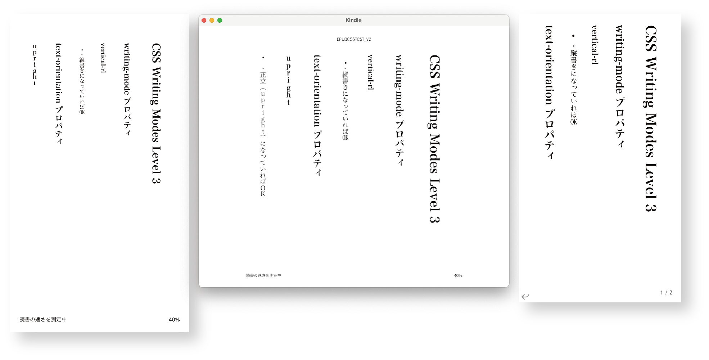

---
link:
  - rel: 'stylesheet'
    href: 'css/main.css'
lang: 'ja'
---

# 第2章 CSS表示テスト

<div class="author">

村上真雄／小形克宏（Vivliostyle Foundation）

</div>

## 2-1 はじめに

<div class="no-indent" style="margin-top:24.5Q;">

**情報開示：**本報告書のテストで取り上げたCSSモジュールの選定、及びテストの制作は、本稿の共著者である村上真雄（[Vivliostyle Foundation](https://vivliostyle.org/ja/)）がおこなった。村上はテスト対象であるVivliostyle Viewerの開発者でもある。また、もう一人の共著者である小形克宏もVivliostyle Foundationに所属する。この点、[テストファイル開発](https://github.com/jagat-xpub/epub-css-test/tree/main)や[原稿執筆](https://github.com/jagat-xpub/viewer-test-2023)に利用したGitHubリポジトリや、[テスト結果](https://docs.google.com/spreadsheets/d/1xKDlL4TrMHMa1qq2QsWcXLEGMPjx-JWcTdaw_8KkftE/edit?usp=sharing)を記録したGoogleスプレッドシートを公開することで客観性の担保に努めた。

</div>

### 2-1-1 CSS表示テストの目的と方法

2023年5月、W3Cは最新のEPUB仕様となる[EPUB 3.3](https://www.w3.org/TR/epub-33/)を勧告した。そこではCSS仕様との関係について、以下のように規定している。

> [§1.3.3 Relationship to CSS](https://www.w3.org/TR/epub-33/#sec-overview-relations-css)
> 
> EPUB 3 supports CSS as defined by the CSS Working Group Snapshot [[csssnapshot]](https://www.w3.org/TR/CSS/). EPUB 3 also maintains some prefixed CSS properties, to ensure consistent support for global languages.
> 
> 和訳：**§1.3.3 CSSとの関係**　EPUB3は、CSS Working Group Snapshot [[csssnapshot]](https://www.w3.org/TR/CSS/)で定義されているCSSをサポートします。EPUB3は、グローバル言語のための一貫したサポートを保証するために、いくつかの接頭辞付きのCSSプロパティも維持します。

上記にある “CSS Working Group Snapshot”（以下、“CSS Snapshot”）とはなんだろう。CSSレベル2まで、CSS仕様はすべてのプロパティを単一の仕様書で規定していた。しかしレベル2を超えるCSSでは飛躍的に規模が大きくなることが確実になった。そこで審議するCSS Working Groupは、機能や目的ごとの「モジュール」に仕様を分割することにし、更新はモジュールごとにすすめることにした。ところが更新のペースがバラバラになると、今度はCSS仕様全体の状況が把握しづらくなってしまう。そこで考え出されたのが、Webブラウザー（以下、ブラウザー）に実装されたCSSモジュールを、安定性の程度を評価・分類したリストを作成し、これを1年ごとに更新していく “CSS Snapshot” だ。<span class="notetext"> “CSS Snapshot” のURLは<https://www.w3.org/TR/CSS/>に固定されている。本稿を執筆している2024年3月では “CSS Snapshot 2023” というタイトルだが、1年後の2025年3月に同じURLをクリックすれば “CSS Snapshot 2024” になっているはずだ。なお、2023年版のパーマネント・リンクは<https://www.w3.org/TR/css-2023/>である。</span>

ここで重要なのが安定性の程度の分け方だが、以下の3段階に分類されることになっている（少ない数字が安定度が高い）。

1. [CSSの公式的な定義に含まれるCSSモジュール（Cascading Style Sheets (CSS) — The Official Definition）](https://www.w3.org/TR/CSS/#css-official)
2. [かなり安定しているが実装経験が限定的なCSSモジュール（Fairly Stable Modules with limited implementation experience）](https://www.w3.org/TR/CSS/#fairly-stable)
3. [大まかな相互運用性のあるCSSモジュール（Modules with Rough Interoperability）](https://www.w3.org/TR/CSS/#rough-interop)

前掲EPUB 3.3の引用にある「CSS Snapshotで定義されているCSS」とは、上記のうち1のことだ。つまりEPUB 3.3では数多くあるCSSモジュールの中でも、上記1でリストアップされているCSSモジュールだけは使えるよう求められている。では、**現在日本国内で利用されているEPUBリーダーは、これらのCSSモジュールをサポートしているのだろうか？**

もうひとつ、前掲の引用で分かるように、旧仕様で許されていた`-epub-`接頭辞付きのCSSプロパティは、最新仕様でも後方互換性のために残された。ここでいう`-epub-`接頭辞とは、[CSS レベル2.1で規定されているCSSプロパティを独自に拡張する構文](https://www.w3.org/TR/CSS2/syndata.html#vendor-keywords)のひとつ。プロパティ冒頭に付ける接頭辞をベンダーが独自に定義することから「ベンダー接頭辞」とも呼ばれる。EPUB 3.0仕様の策定時（2011年）のCSS仕様では、まだ縦書き用プロパティなどはドラフト仕様でしかなかった。そこでEPUB 3でこれらのプロパティを利用するための接頭辞が定められた。それが`-epub-`接頭辞だ。

とはいえ、試行錯誤の時代は過ぎ去り縦書き用のプロパティはすっかり安定した。そこでEPUB 3.3では[§6.3.1.3 Prefixed properties](https://www.w3.org/TR/epub-33/#sec-css-prefixed)として、「EPUB制作者は接頭辞なしのプロパティを使用するべきで、リーディングシステム（EPUBリーダー）は現行のCSS仕様をサポートするべき」とされ、また「Working Groupは、EPUBの次のメジャーバージョンでこれらの接頭辞付きプロパティをサポートする見込みがないため、現在これらの接頭辞付きプロパティを使用しているEPUB制作者は、サポートが可能になり次第、接頭辞なしバージョンに移行することを推奨する」とある。

つまりEPUB 3.3になって、接頭辞なしのプロパティを使うよう推奨された。では、**現在使われているEPUBリーダーは、`-epub-`接頭辞付きプロパティなしで表示できるのだろうか？**

これらのことを実際にテストすることによって、現在使われているEPUBリーダーが最新のEPUB 3.3が要求するCSSにどの程度対応しているかが分かるはずだ。

テストの方法をもう少し詳しく説明しよう。前記 “CSS Snapshot” にある3段階に加え、そこに載っていないが最新のメジャーなブラウザーで利用できるCSSモジュールを加え、全部で4段階の規準を設定することにした。

ただし、“CSS Snapshot” に規定されたCSSモジュールの中には、あまりに基礎的な仕様であったり、EPUBでの利用をあまり想定できないものもある。大事なことは「EPUBリーダーでテストする意味があるか」だろう。そこでそうしたCSSモジュールを外して、以下のようにテスト項目を選定した（テスト項目の具体的な内容は次項を参照）。

- CSSの公式的な定義に含まれるCSSモジュール：**82項目**
- かなり安定しているが実装経験が限定的なCSSモジュール：**25項目**
- 大まかな相互運用性のあるCSSモジュール：**30項目**
- CSS Snapshot 2023に載っていないが最新のブラウザで利用できるもの：**3項目**

つぎに、選定したテスト項目ごとに、対応の可否が一目で識別できるテスト用EPUBファイルを制作した。これは以下のリポジトリで公開しているので、お読みの方はぜひご自分でも試していただきたい。<span class="notetext">ライセンスは[CC0 1.0](https://creativecommons.org/publicdomain/zero/1.0/deed.ja)で、著作権を放棄している。詳細はリポジトリを参照。</span>

- [EPUBリーダーのCSS仕様適合性テスト](https://github.com/jagat-xpub/epub-css-test/tree/main)

最後に、テスト対象のEPUBリーダーを選定し、当研究会のメンバーごとに割り振ってテストを開始した。各担当者は前述テスト用EPUBファイルを自分が担当するEPUBリーダーにサイドロードし、テスト結果を以下のGoogleスプレッドシートに記録していった。それが以下に公開するファイルである。

- [EPUBリーダー表示チェック（JAGAT次世代パブリッシング研究会）2023](https://docs.google.com/spreadsheets/d/1xKDlL4TrMHMa1qq2QsWcXLEGMPjx-JWcTdaw_8KkftE/edit?usp=sharing)（以下、「EPUBリーダー表示チェック」）


### 2-1-2 テスト結果を掲載したCSSモジュール

ところが実際に調査結果をまとめる段階になると、あまりにテスト項目が多すぎて報告書に収まりきらないことが判明した。やむなく本章ではEPUB 3.3で利用できることが求められているモジュール（前述「1. CSSの公式的な定義に含まれるCSSモジュール」）に絞って結果を掲載することにする。

これも前項で述べたことだが、本章では “CSS Snapshot” で規定されているCSSモジュールから、EPUBリーダーでテストして意味があるかどうかを勘案して絞り込んでいる。たとえば、「1. CSSの公式的な定義に含まれるCSSモジュール」は24のCSSモジュールが規定されているが、本章ではそのうちの17のCSSモジュールに絞っている。ここで除外したCSSモジュールは以下のようなものだ。

- [CSS Level 2, latest revision](https://www.w3.org/TR/CSS2/) (including errata)
- [CSS Syntax Level 3](https://www.w3.org/TR/css-syntax-3/)
- [CSS Style Attributes](https://www.w3.org/TR/css-style-attr/)
- [Media Queries Level 3](https://www.w3.org/TR/css3-mediaqueries/)
- [CSS Namespaces](https://www.w3.org/TR/css-namespaces/)
- [CSS Box Model Level 3](https://www.w3.org/TR/css-box-3/)
- [CSS Easing Functions Level 1](https://www.w3.org/TR/css-easing-1/)

残ったCSSモジュールとそのテスト項目を以下に仕様へのリンクとともに挙げる<span class="notetext">ここに挙げた以外の詳細なテスト項目の内容やCSSモジュールは、 [EPUBリーダー表示チェック](https://docs.google.com/spreadsheets/d/1xKDlL4TrMHMa1qq2QsWcXLEGMPjx-JWcTdaw_8KkftE/edit?usp=sharing)を参照。</span>。全部で17のCSSモジュール、82のテスト項目だ。これらはいずれもEPUBでの利用が想定でき、テストする価値があると判断したものである。

- [CSS Conditional Rules Level 3](https://www.w3.org/TR/css-conditional-3/)
  - @supports ルール
- [Selectors Level 3](https://www.w3.org/TR/selectors-3/)
  - 部分文字列マッチング属性セレクタ `[att^=val]`, `[att$=val]`, `[att*=val]`
  - :root 擬似クラス
  - :nth-child(), :nth-last-child(), :nth-of-type(), :nth-last-of-type() 擬似クラス
  - :last-child, :only-child, :first-of-type, :last-of-type, :only-of-type 擬似クラス
  - :empty 擬似クラス
  - :not() 擬似クラス
  - ::first-line, ::first-letter, ::before, ::after 擬似要素
  - 後続兄弟結合子 `E ~ F`
- [CSS Cascading and Inheritance Level 4](https://www.w3.org/TR/css-cascade-4/)
  - all プロパティ
  - プロパティの値 initial, unset, revert
- [CSS Values and Units Level 3](https://www.w3.org/TR/css-values-3/)
  - 長さの単位
    - ch
    - rem
    - vw, vh, vmin, vmax
    - Q
- [CSS Custom Properties for Cascading Variables Module Level 1](https://www.w3.org/TR/css-variables-1/)
  - CSS変数
- [CSS Color Level 4](https://www.w3.org/TR/css-color-4/)
  - opacity プロパティ
  - rgb() 関数のコンマなし形式　例: rgb(0 255 0 / .5)
  - 16進数のRGBA形式（8桁、4桁）　例: #88FF44CC, #8F4C
  - hsl() 関数
  - hwb() 関数
- [CSS Backgrounds and Borders Level 3](https://www.w3.org/TR/css-backgrounds-3/)
  - 複数の背景画像　例: background-image: url(a.png), url(b.png), url(c.png);
  - border-radius プロパティ
  - border-image プロパティ
  - box-shadow プロパティ
- [CSS Images Level 3](https://www.w3.org/TR/css-images-3/)
  - グラデーション関数
    - linear-gradient()
    - radial-gradient()
    - repeating-linear-gradient(), repeating-radial-gradient()
  - object-fit プロパティ
  - object-position プロパティ
- [CSS Fonts Level 3](https://www.w3.org/TR/css-fonts-3/)
  - @font-face ルール
  - unicode-range 記述子
  - font-kerning プロパティ
  - font-variant プロパティ
  - font-feature-settings プロパティ
- [CSS Writing Modes Level 3](https://www.w3.org/TR/css-writing-modes-3/)
  - writing-mode プロパティ
  - text-orientation プロパティ
  - text-combine-upright プロパティ
- [CSS Multi-column Layout Level 1](https://www.w3.org/TR/css-multicol-1/)
  - columns プロパティ
  - column-gap プロパティ
  - column-rule プロパティ
  - column-span プロパティ
  - column-fill プロパティ
- [CSS Flexible Box Module Level 1](https://www.w3.org/TR/css-flexbox-1/)
  - display プロパティの値 flex および inline-flex
  - flex-flow プロパティ
  - order プロパティ
  - flex プロパティ
  - justify-content, align-items, align-self, align-content プロパティ
- [CSS User Interface Module Level 3](https://www.w3.org/TR/css-ui-3/)
  - box-sizing プロパティ
  - outline プロパティ
- [CSS Containment Module Level 1](https://www.w3.org/TR/css-contain-1/)
  - contain プロパティ
- [CSS Transforms Level 1](https://www.w3.org/TR/css-transforms-1/)
  - transform プロパティ
- [CSS Compositing and Blending Level 1](https://www.w3.org/TR/compositing-1/)
  - mix-blend-mode プロパティ
  - isolation プロパティ
  - background-blend-mode プロパティ
- [CSS Counter Styles Level 3](https://www.w3.org/TR/css-counter-styles-3/)
  - @counter-style ルール
  - 定義済みカウンタースタイル
    - cjk-decimal
    - hiragana, hiragana-iroha, katakana, katakana-iroha
    - cjk-earthly-branch
    - cjk-heavenly-stem
    - japanese-informal

### 2-1-3 本調査におけるテスト環境の一覧

今回の調査でテストしたEPUBリーダーの数は、テスト環境の違いも入れると、全部で55にのぼる。そのうち、テスト結果を掲載したものは37だ。その明細を<a href="#2-1-3-1-掲載したテスト環境の一覧">2-1-3-1 掲載したテスト環境の一覧</a>に掲げる。

他方、残りの18は掲載していない。その理由は一部テストファイルの不具合が判明し部分的に更新したことに伴い、それ以前のテスト結果は不正確であることが判明したので掲載をやめたものだ。この不具合については<a href="#2-2-3-メジャーなepubリーダーでサポートされるcssモジュール">2-2-3</a>で詳述することにして、それらリーダーの明細を<a href="#2-1-3-2-掲載しなかったテスト環境の一覧">2-1-3-2 掲載しなかったテスト環境の一覧</a>に掲げる。

なお、背景色が緑色はモダンブラウザー系、水色は独自エンジン系である。これらの分類については<a href="#2-2-1-レイアウトエンジンと本テストとの関係">2-2-1 レイアウトエンジンと本テストとの関係</a>を参照されたい。

#### 2-1-3-1 掲載したテスト環境の一覧

<table>
  <thead>
    <tr>
      <th style="color:#434343" align="center">リーダー名</th>
      <th style="color:#434343" align="center">略称</td>
      <th style="color:#434343" align="center">種別</th>
      <th style="color:#434343" align="center">機材名</th>
      <th style="color:#434343" align="center">OS ver.</th>
      <th style="color:#434343" align="center">リーダーver.</th>
      <th style="color:#434343" align="center">担当者</th>
      <th style="color:#434343" align="center">テスト日</th>
    </tr>
  </thead>
  <tbody>
    <tr>
      <td bgcolor="#c9daf8" align="center">Kindle Previewer3 (Mac) *¹</td>
      <td bgcolor="#c9daf8" align="center">Kindle</td>
      <td bgcolor="#c9daf8" align="center">Macアプリ</td>
      <td bgcolor="#c9daf8" align="center">Mac mini M1, 2020</td>
      <td bgcolor="#c9daf8" align="center">macOS 14.2.1</td>
      <td bgcolor="#c9daf8" align="center">3.74.0</td>
      <td bgcolor="#c9daf8" align="center">村上</td>
      <td bgcolor="#c9daf8" align="center">2023/12/28</td>
    </tr>
    <tr>
      <td bgcolor="#c9daf8" align="center">Kindle for Mac *¹</td>
      <td bgcolor="#c9daf8" align="center">Kindle</td>
      <td bgcolor="#c9daf8" align="center">Macアプリ</td>
      <td bgcolor="#c9daf8" align="center">Mac mini M1, 2020</td>
      <td bgcolor="#c9daf8" align="center">macOS 14.2.1</td>
      <td bgcolor="#c9daf8" align="center">7.0.0.100 (1.316222)</td>
      <td bgcolor="#c9daf8" align="center">村上</td>
      <td bgcolor="#c9daf8" align="center">2023/12/28</td>
    </tr>
    <tr>
      <td bgcolor="#c9daf8" align="center">Kindle Previewer3 (Win) *¹</td>
      <td bgcolor="#c9daf8" align="center">Kindle</td>
      <td bgcolor="#c9daf8" align="center">Windows<br/>アプリ</td>
      <td bgcolor="#c9daf8" align="center">N/A *⁶</td>
      <td bgcolor="#c9daf8" align="center">Windows 10 Pro 22H2</td>
      <td bgcolor="#c9daf8" align="center">3.74.0</td>
      <td bgcolor="#c9daf8" align="center">村上</td>
      <td bgcolor="#c9daf8" align="center">2024/01/09</td>
    </tr>
    <tr>
      <td bgcolor="#c9daf8" align="center">Kindle for PC *¹</td>
      <td bgcolor="#c9daf8" align="center">Kindle</td>
      <td bgcolor="#c9daf8" align="center">Windows<br/>アプリ</td>
      <td bgcolor="#c9daf8" align="center">N/A *⁶</td>
      <td bgcolor="#c9daf8" align="center">Windows 10 Pro 22H2</td>
      <td bgcolor="#c9daf8" align="center">2.3.0 (70673)</td>
      <td bgcolor="#c9daf8" align="center">村上</td>
      <td bgcolor="#c9daf8" align="center">2024/01/09</td>
    </tr>
    <tr>
      <td bgcolor="#c9daf8" align="center">Kindle for Android *¹</td>
      <td bgcolor="#c9daf8" align="center">Kindle</td>
      <td bgcolor="#c9daf8" align="center">Android<br/>アプリ</td>
      <td bgcolor="#c9daf8" align="center">OPPO A55s 5G</td>
      <td bgcolor="#c9daf8" align="center">Android 12</td>
      <td bgcolor="#c9daf8" align="center">8.89.3.0 (2.0.2766.0)</td>
      <td bgcolor="#c9daf8" align="center">村上</td>
      <td bgcolor="#c9daf8" align="center">2024/01/09</td>
    </tr>
    <tr>
      <td bgcolor="#c9daf8" align="center">iPhone用のKindle *¹</td>
      <td bgcolor="#c9daf8" align="center">Kindle</td>
      <td bgcolor="#c9daf8" align="center">iOS<br/>アプリ</td>
      <td bgcolor="#c9daf8" align="center">iPhone13mini</td>
      <td bgcolor="#c9daf8" align="center">iOS 17.2.1</td>
      <td bgcolor="#c9daf8" align="center">7.1</td>
      <td bgcolor="#c9daf8" align="center">古門</td>
      <td bgcolor="#c9daf8" align="center">2024/1/21</td>
    </tr>
    <tr>
      <td bgcolor="#c9daf8" align="center">Kinoppy for iOS *¹</td>
      <td bgcolor="#c9daf8" align="center">Kinoppy</td>
      <td bgcolor="#c9daf8" align="center">iPadアプリ</td>
      <td bgcolor="#c9daf8" align="center">iPad mini<br/>(第5世代)</td>
      <td bgcolor="#c9daf8" align="center">iPadOS 17.1.2</td>
      <td bgcolor="#c9daf8" align="center">7.0.1</td>
      <td bgcolor="#c9daf8" align="center">村上</td>
      <td bgcolor="#c9daf8" align="center">2024/01/09</td>
    </tr>
    <tr>
      <td bgcolor="#c9daf8" align="center">Kinoppy for iOS *¹</td>
      <td bgcolor="#c9daf8" align="center">Kinoppy</td>
      <td bgcolor="#c9daf8" align="center">iOSアプリ</td>
      <td bgcolor="#c9daf8" align="center">iPhone 13 mini</td>
      <td bgcolor="#c9daf8" align="center">iOS 17.2.1</td>
      <td bgcolor="#c9daf8" align="center">7.1</td>
      <td bgcolor="#c9daf8" align="center">古門</td>
      <td bgcolor="#c9daf8" align="center">2024/01/21</td>
    </tr>
    <tr>
      <td bgcolor="#d9ead3" align="center">楽天Koboアプリ for iPhone *¹</td>
      <td bgcolor="#d9ead3" align="center">kobo-mobile</td>
      <td bgcolor="#d9ead3" align="center">iOSアプリ</td>
      <td bgcolor="#d9ead3" align="center">iPhone 13 mini</td>
      <td bgcolor="#d9ead3" align="center">iOS17.2.1</td>
      <td bgcolor="#d9ead3" align="center">10.4.3</td>
      <td bgcolor="#d9ead3" align="center">古門（追試）</td>
      <td bgcolor="#d9ead3" align="center">2024/02/01</td>
    </tr>
    <tr>
      <td bgcolor="#d9ead3" align="center">楽天Koboアプリ for Android</td>
      <td bgcolor="#d9ead3" align="center">kobo-mobile</td>
      <td bgcolor="#d9ead3" align="center">Android<br/>アプリ</td>
      <td bgcolor="#d9ead3" align="center">Galaxy Tab S8 Ultra</td>
      <td bgcolor="#d9ead3" align="center">Android　13</td>
      <td bgcolor="#d9ead3" align="center">9.4.8.1</td>
      <td bgcolor="#d9ead3" align="center">仁科</td>
      <td bgcolor="#d9ead3" align="center">2023/08/20</td>
    </tr>
    <tr>
      <td bgcolor="#c9daf8" align="center">Kobo Libra 2</td>
      <td bgcolor="#c9daf8" align="center">kobo-other</td>
      <td bgcolor="#c9daf8" align="center">専用<br/>タブレット</td>
      <td bgcolor="#c9daf8" align="center">リーダーと同</td>
      <td bgcolor="#c9daf8" align="center">4.38.21908 (fac580f37d, 2023/08/22)</td>
      <td bgcolor="#c9daf8" align="center">4.37.21586 (42535ad976, 2023/07/06)</td>
      <td bgcolor="#c9daf8" align="center">仁科</td>
      <td bgcolor="#c9daf8" align="center">2023/07/25</td>
    </tr>
    <tr>
      <td bgcolor="#c9daf8" align="center">楽天Koboデスクトップ</td>
      <td bgcolor="#c9daf8" align="center">kobo-other</td>
      <td bgcolor="#c9daf8" align="center">Windows<br/>アプリ</td>
      <td bgcolor="#c9daf8" align="center">N/A *⁶</td>
      <td bgcolor="#c9daf8" align="center">Windows 10 Pro (22H2　19045.3208)</td>
      <td bgcolor="#c9daf8" align="center">4.37.19051</td>
      <td bgcolor="#c9daf8" align="center">仁科</td>
      <td bgcolor="#c9daf8" align="center">2023/07/25</td>
    </tr>
    <tr>
      <td bgcolor="#c9daf8" align="center">楽天Koboデスクトップ</td>
      <td bgcolor="#c9daf8" align="center">kobo-other</td>
      <td bgcolor="#c9daf8" align="center">Macアプリ</td>
      <td bgcolor="#c9daf8" align="center">MacBook (Retina, 12-12inch, Early 2016)</td>
      <td bgcolor="#c9daf8" align="center">macOS 12.6.6</td>
      <td bgcolor="#c9daf8" align="center">4.37.17113</td>
      <td bgcolor="#c9daf8" align="center">仁科</td>
      <td bgcolor="#c9daf8" align="center">2023/08/20</td>
    </tr>
    <tr>
      <td bgcolor="#c9daf8" align="center">楽天Koboデスクトップ *¹</td>
      <td bgcolor="#c9daf8" align="center">kobo-other</td>
      <td bgcolor="#c9daf8" align="center">Macアプリ</td>
      <td bgcolor="#c9daf8" align="center">MacBook (Retina, 12-12inch, Early 2016)</td>
      <td bgcolor="#c9daf8" align="center">macOS 12.7.2</td>
      <td bgcolor="#c9daf8" align="center"> 4.37.17113</td>
      <td bgcolor="#c9daf8" align="center">仁科</td>
      <td bgcolor="#c9daf8" align="center">2024/01/30</td>
    </tr>
    <tr>
      <td bgcolor="#d9ead3" align="center">ブック</td>
      <td bgcolor="#d9ead3" align="center">→</td>
      <td bgcolor="#d9ead3" align="center" valign="top">iOSアプリ</td>
      <td bgcolor="#d9ead3" align="center">iPhone 13 mini</td>
      <td bgcolor="#d9ead3" align="center">iOS16.4.1 (a)</td>
      <td bgcolor="#d9ead3" style="color:#0000ff" align="center">N/A *³</td>
      <td bgcolor="#d9ead3" align="center">古門</td>
      <td bgcolor="#d9ead3" align="center">2023/05/20</td>
    </tr>
    <tr>
      <td bgcolor="#d9ead3" align="center">ブック</td>
      <td bgcolor="#d9ead3" align="center">→</td>
      <td bgcolor="#d9ead3" align="center" valign="top">Macアプリ</td>
      <td bgcolor="#d9ead3" align="center">MacBookAir M2 2022</td>
      <td bgcolor="#d9ead3" align="center">macOS 13.6.3 (22G436)</td>
      <td bgcolor="#d9ead3" align="center">5.2 (5800.52)</td>
      <td bgcolor="#d9ead3" align="center">小形</td>
      <td bgcolor="#d9ead3" align="center">2023/05/23</td>
    </tr>
    <tr>
      <td bgcolor="#d9ead3" align="center">ブック</td>
      <td bgcolor="#d9ead3" align="center">→</td>
      <td bgcolor="#d9ead3" align="center">Macアプリ</td>
      <td bgcolor="#d9ead3" align="center">MacBook Pro 13-inch, 2019</td>
      <td bgcolor="#d9ead3" align="center">macOS 13.6.3 (22G436)</td>
      <td bgcolor="#d9ead3" align="center">5.2</td>
      <td bgcolor="#d9ead3" align="center">小形</td>
      <td bgcolor="#d9ead3" align="center">2024/02/07</td>
    </tr>
    <tr>
      <td bgcolor="#d9ead3" align="center">ブック*¹</td>
      <td bgcolor="#d9ead3" align="center">→</td>
      <td bgcolor="#d9ead3" align="center">Macアプリ</td>
      <td bgcolor="#d9ead3" align="center">MacBook Pro 13-inch, 2019</td>
      <td bgcolor="#d9ead3" align="center">macOS 13.6.3 (22G436)</td>
      <td bgcolor="#d9ead3" align="center">5.2</td>
      <td bgcolor="#d9ead3" align="center">小形</td>
      <td bgcolor="#d9ead3" align="center">2024/02/08</td>
    </tr>
    <tr>
      <td bgcolor="#d9ead3" align="center">ブック</td>
      <td bgcolor="#d9ead3" align="center">→</td>
      <td bgcolor="#d9ead3" align="center">Macアプリ</td>
      <td bgcolor="#d9ead3" align="center">MacBookAir M2 2022</td>
      <td bgcolor="#d9ead3" align="center">macOS 14.1.1（23B81）</td>
      <td bgcolor="#d9ead3" align="center">6.1</td>
      <td bgcolor="#d9ead3" align="center">小形</td>
      <td bgcolor="#d9ead3" align="center">2024/02/09</td>
    </tr>
    <tr>
      <td bgcolor="#d9ead3" align="center">ブック*¹</td>
      <td bgcolor="#d9ead3" align="center">→</td>
      <td bgcolor="#d9ead3" align="center">Macアプリ</td>
      <td bgcolor="#d9ead3" align="center">MacBookAir M2 2023</td>
      <td bgcolor="#d9ead3" align="center">macOS 14.1.1（23B81）</td>
      <td bgcolor="#d9ead3" align="center">6.1</td>
      <td bgcolor="#d9ead3" align="center">小形</td>
      <td bgcolor="#d9ead3" align="center">2024/02/10</td>
    </tr>
    <tr>
      <td bgcolor="#d9ead3" align="center">MURASAKI</td>
      <td bgcolor="#d9ead3" align="center">→</td>
      <td bgcolor="#d9ead3" align="center">Macアプリ</td>
      <td bgcolor="#d9ead3" align="center">MacBookAir M2 2022</td>
      <td bgcolor="#d9ead3" align="center">macOS 13.4</td>
      <td bgcolor="#d9ead3" align="center">2.4.1</td>
      <td bgcolor="#d9ead3" align="center">小形</td>
      <td bgcolor="#d9ead3" align="center">2023/05/23</td>
    </tr>
    <tr>
      <td bgcolor="#d9ead3" align="center">MURASAKI</td>
      <td bgcolor="#d9ead3" align="center">→</td>
      <td bgcolor="#d9ead3" align="center">Macアプリ</td>
      <td bgcolor="#d9ead3" align="center">MacBookAir M2 2022</td>
      <td bgcolor="#d9ead3" align="center">macOS 14.1.1 (23B81)</td>
      <td bgcolor="#d9ead3" align="center">2.4.1</td>
      <td bgcolor="#d9ead3" align="center">小形</td>
      <td bgcolor="#d9ead3" align="center">2024/02/08</td>
    </tr>
    <tr>
      <td bgcolor="#d9ead3" align="center">MURASAKI*¹</td>
      <td bgcolor="#d9ead3" align="center">→</td>
      <td bgcolor="#d9ead3" align="center">Macアプリ</td>
      <td bgcolor="#d9ead3" align="center">MacBook Pro 13-inch, 2019</td>
      <td bgcolor="#d9ead3" align="center">macOS 13.6.3 (22G436)</td>
      <td bgcolor="#d9ead3" align="center">5.2</td>
      <td bgcolor="#d9ead3" align="center">小形</td>
      <td bgcolor="#d9ead3" align="center">2024/02/08</td>
    </tr>
    <tr>
      <td bgcolor="#c9daf8" align="center">honto電子書籍リーダー *¹</td>
      <td bgcolor="#c9daf8" align="center">honto</td>
      <td bgcolor="#c9daf8" align="center">iOSアプリ</td>
      <td bgcolor="#c9daf8" align="center">iPhone 13 mini</td>
      <td bgcolor="#c9daf8" align="center">iOS17.2.1</td>
      <td bgcolor="#c9daf8" align="center">6.62.0</td>
      <td bgcolor="#c9daf8" align="center">古門</td>
      <td bgcolor="#c9daf8" align="center">2024/01/24</td>
    </tr>
    <tr>
      <td bgcolor="#d9ead3" align="center">Book Walker</td>
      <td bgcolor="#d9ead3" align="center">→</td>
      <td bgcolor="#d9ead3" align="center">iOSアプリ</td>
      <td bgcolor="#d9ead3" align="center">iPhone 13 mini</td>
      <td bgcolor="#d9ead3" align="center">iOS16.4.1 (a)</td>
      <td bgcolor="#d9ead3" align="center">7.4.7</td>
      <td bgcolor="#d9ead3" align="center">古門</td>
      <td bgcolor="#d9ead3" align="center">2023/05/20</td>
    </tr>
    <tr>
      <td bgcolor="#d9ead3" align="center">Book Walker</td>
      <td bgcolor="#d9ead3" align="center">→</td>
      <td bgcolor="#d9ead3" align="center">Android<br/>アプリ</td>
      <td bgcolor="#d9ead3" align="center">Galaxy Tab S8 Ultra</td>
      <td bgcolor="#d9ead3" align="center">Android　13</td>
      <td bgcolor="#d9ead3" align="center">7.5.0</td>
      <td bgcolor="#d9ead3" align="center">仁科</td>
      <td bgcolor="#d9ead3" align="center">2023/08/21</td>
    </tr>
    <tr>
      <td bgcolor="#c9daf8" align="center">Kinoppy *¹</td>
      <td bgcolor="#c9daf8" align="center">→</td>
      <td bgcolor="#c9daf8" align="center">Windows<br/>アプリ</td>
      <td bgcolor="#c9daf8" align="center">N/A *²</td>
      <td bgcolor="#c9daf8" align="center">Windows 10 Pro 22H2</td>
      <td bgcolor="#c9daf8" align="center">3.2.19</td>
      <td bgcolor="#c9daf8" align="center">村上</td>
      <td bgcolor="#c9daf8" align="center">2023/12/07</td>
    </tr>
    <tr>
      <td bgcolor="#c9daf8" align="center">BinB *¹</td>
      <td bgcolor="#c9daf8" align="center">→</td>
      <td bgcolor="#c9daf8" align="center">Webアプリ</td>
      <td bgcolor="#c9daf8" align="center">Galaxy Tab S8 Ultra</td>
      <td bgcolor="#c9daf8" align="center">Android 13</td>
      <td bgcolor="#c9daf8" align="center">N/A *³</td>
      <td bgcolor="#c9daf8" align="center">仁科</td>
      <td bgcolor="#c9daf8" align="center">2023/07/23</td>
    </tr>
    <tr>
      <td bgcolor="#c9daf8" align="center">BinB *¹</td>
      <td bgcolor="#c9daf8" align="center">→</td>
      <td bgcolor="#c9daf8" align="center">Webアプリ</td>
      <td bgcolor="#c9daf8" align="center">N/A *²</td>
      <td bgcolor="#c9daf8" align="center">Windows 10 Pro</td>
      <td bgcolor="#c9daf8" align="center">N/A *³</td>
      <td bgcolor="#c9daf8" align="center">仁科</td>
      <td bgcolor="#c9daf8" align="center">2023/07/23</td>
    </tr>
    <tr>
      <td bgcolor="#d9ead3" align="center">Bibi</td>
      <td bgcolor="#d9ead3" align="center">→</td>
      <td bgcolor="#d9ead3" align="center">Webアプリ</td>
      <td bgcolor="#d9ead3" align="center">N/A *²</td>
      <td bgcolor="#d9ead3" align="center">Windows 11 PRO</td>
      <td bgcolor="#d9ead3" align="center">1.2.0 / Chrome 113.0.5672.127 (64ビット) *⁴</td>
      <td bgcolor="#d9ead3" align="center">古門</td>
      <td bgcolor="#d9ead3" align="center">2023/05/28</td>
    </tr>
    <tr>
      <td bgcolor="#d9ead3" align="center">Bibi</td>
      <td bgcolor="#d9ead3" align="center">→</td>
      <td bgcolor="#d9ead3" align="center">Webアプリ</td>
      <td bgcolor="#d9ead3" align="center">N/A *²</td>
      <td bgcolor="#d9ead3" align="center">Windows 11 PRO</td>
      <td bgcolor="#d9ead3" align="center">1.2.0 / Edge 113.0.1774.57 (64ビット) *⁴</td>
      <td bgcolor="#d9ead3" align="center">古門</td>
      <td bgcolor="#d9ead3" align="center">2023/05/28</td>
    </tr>
    <tr>
      <td bgcolor="#c9daf8" align="center">超縦書</td>
      <td bgcolor="#c9daf8" align="center">→</td>
      <td bgcolor="#c9daf8" align="center">Windows<br/>アプリ</td>
      <td bgcolor="#c9daf8" align="center">N/A *²</td>
      <td bgcolor="#c9daf8" align="center">Windows 10 Home 21H2</td>
      <td bgcolor="#c9daf8" align="center">2.3.1</td>
      <td bgcolor="#c9daf8" align="center">田嶋</td>
      <td bgcolor="#c9daf8" align="center">2023/05/23</td>
    </tr>
    <tr>
      <td bgcolor="#c9daf8" align="center">超縦書 *¹</td>
      <td bgcolor="#c9daf8" align="center">→</td>
      <td bgcolor="#c9daf8" align="center">Windows<br/>アプリ</td>
      <td bgcolor="#c9daf8" align="center">N/A *²</td>
      <td bgcolor="#c9daf8" align="center">Windows 10 Pro 22H2</td>
      <td bgcolor="#c9daf8" align="center">2.3.1</td>
      <td bgcolor="#c9daf8" align="center">小形</td>
      <td bgcolor="#c9daf8" align="center">2024/02/13</td>
    </tr>
    <tr>
      <td bgcolor="#d9ead3" align="center">Vivliostyle Viewer</td>
      <td bgcolor="#d9ead3" align="center">Vivliostyle</td>
      <td bgcolor="#d9ead3" align="center">Webアプリ</td>
      <td bgcolor="#d9ead3" align="center">Mac mini M1, 2020</td>
      <td bgcolor="#d9ead3" align="center">macOS 13.4</td>
      <td bgcolor="#d9ead3" align="center">2.25.0 / Chrome 113 *⁴</td>
      <td bgcolor="#d9ead3" align="center">村上</td>
      <td bgcolor="#d9ead3" align="center">2023/05/23</td>
    </tr>
    <tr>
      <td bgcolor="#d9ead3" align="center">Vivliostyle Viewer *¹</td>
      <td bgcolor="#d9ead3" align="center">Vivliostyle</td>
      <td bgcolor="#d9ead3" align="center">Webアプリ</td>
      <td bgcolor="#d9ead3" align="center">iPad第6世代</td>
      <td bgcolor="#d9ead3" align="center">iPadOS 17.3.1</td>
      <td bgcolor="#d9ead3" align="center">2.27.0 / Safari (N/A)</td>
      <td bgcolor="#d9ead3" align="center">田嶋</td>
      <td bgcolor="#d9ead3" align="center">2024/02/13</td>
    </tr>
    <tr>
      <td bgcolor="#d9ead3" align="center">Thorium Reader</td>
      <td bgcolor="#d9ead3" align="center">Thorium</td>
      <td bgcolor="#d9ead3" align="center">Windows<br/>アプリ</td>
      <td bgcolor="#d9ead3" align="center">N/A *²</td>
      <td bgcolor="#d9ead3" align="center">Windows 11 PRO</td>
      <td bgcolor="#d9ead3" align="center">2.3.0</td>
      <td bgcolor="#d9ead3" align="center">古門</td>
      <td bgcolor="#d9ead3" align="center">2023/09/25</td>
    </tr>
    <tr>
      <td bgcolor="#d9ead3" align="center">Thorium Reader</td>
      <td bgcolor="#d9ead3" align="center">Thorium</td>
      <td bgcolor="#d9ead3" align="center">Macアプリ</td>
      <td bgcolor="#d9ead3" align="center">MacBook Air (M1, 2020) </td>
      <td bgcolor="#d9ead3" align="center">macOS12.6.7</td>
      <td bgcolor="#d9ead3" align="center">2.2.0</td>
      <td bgcolor="#d9ead3" align="center">田嶋</td>
      <td bgcolor="#d9ead3" align="center">2023/08/25</td>
    </tr>
  </tbody>
</table>

- 1……テストファイルepubcsstest_v1aによるテスト
- 2……自作機もあるWindows環境ではハードウェアを区別する意味はあまりないので省略
- 3……バージョン番号を表示する機能がない
- 4……ブラウザー上で動作するのでブラウザーのバージョン名も併記

#### 2-1-3-2 掲載しなかったテスト環境の一覧

<table>
  <thead>
    <tr>
      <th style="color:#434343" align="center">リーダー名</th>
      <th style="color:#434343" align="center">種別</th>
      <th style="color:#434343" align="center">機材名</th>
      <th style="color:#434343" align="center">OS ver.</th>
      <th style="color:#434343" align="center">リーダーver.</th>
      <th style="color:#434343" align="center">担当者</th>
      <th style="color:#434343" align="center">テスト日</th>
    </tr>
  </thead>
  <tbody>
    <tr>
      <td bgcolor="#c9daf8" align="center">Kindle for Android</td>
      <td bgcolor="#c9daf8" align="center">Android<br/>アプリ</td>
      <td bgcolor="#c9daf8" align="center">Moto G30</td>
      <td bgcolor="#c9daf8" align="center">Android 11</td>
      <td bgcolor="#c9daf8" align="center">8.81.1.0 (1.3.290180.0)</td>
      <td bgcolor="#c9daf8" align="center">仁科</td>
      <td bgcolor="#c9daf8" align="center">2023/05/22</td>
    </tr>
    <tr>
      <td bgcolor="#c9daf8" align="center">Kindle for Android</td>
      <td bgcolor="#c9daf8" align="center">Android<br/>アプリ</td>
      <td bgcolor="#c9daf8" align="center">Galaxy Tab S8 Ultra</td>
      <td bgcolor="#c9daf8" align="center">Android 13</td>
      <td bgcolor="#c9daf8" align="center">8.81.1.0 (1.3.290180.0)</td>
      <td bgcolor="#c9daf8" align="center">仁科</td>
      <td bgcolor="#c9daf8" align="center">2023/722</td>
    </tr>
    <tr>
      <td bgcolor="#c9daf8" align="center">Kindle for Android</td>
      <td bgcolor="#c9daf8" align="center">Android<br/>アプリ</td>
      <td bgcolor="#c9daf8" align="center">Xperia 10 IV</td>
      <td bgcolor="#c9daf8" align="center">Android 13</td>
      <td bgcolor="#c9daf8" align="center">8.81.1.0 (1.3.290180.0)</td>
      <td bgcolor="#c9daf8" align="center">木龍</td>
      <td bgcolor="#c9daf8" align="center">2023/07/25</td>
    </tr>
    <tr>
      <td bgcolor="#c9daf8" align="center">Kindle Fire HD 10 Plus</td>
      <td bgcolor="#c9daf8" align="center">専用<br/>タブレット</td>
      <td bgcolor="#c9daf8" align="center">リーダーと同</td>
      <td bgcolor="#c9daf8" align="center">FireOS 7.3.2.8</td>
      <td bgcolor="#c9daf8" align="center">14.81.160 (1.3.290180)</td>
      <td bgcolor="#c9daf8" align="center">仁科</td>
      <td bgcolor="#c9daf8" align="center">2023/05/21</td>
    </tr>
    <tr>
      <td bgcolor="#c9daf8" align="center">Kindle Paperwhite Signature Edition *¹</td>
      <td bgcolor="#c9daf8" align="center">専用<br/>タブレット</td>
      <td bgcolor="#c9daf8" align="center">リーダーと同</td>
      <td bgcolor="#c9daf8" align="center">不明</td>
      <td bgcolor="#c9daf8" align="center">5.15.1.1</td>
      <td bgcolor="#c9daf8" align="center">仁科</td>
      <td bgcolor="#c9daf8" align="center">2023/05/21</td>
    </tr>
    <tr>
      <td bgcolor="#c9daf8" align="center">Kindle for PC</td>
      <td bgcolor="#c9daf8" align="center">Windows<br/>アプリ</td>
      <td bgcolor="#c9daf8" align="center">N/A *⁴</td>
      <td bgcolor="#c9daf8" align="center">Windows 10 Home 21H2</td>
      <td bgcolor="#c9daf8" align="center">不明</td>
      <td bgcolor="#c9daf8" align="center">田嶋</td>
      <td bgcolor="#c9daf8" align="center">2023/05/22</td>
    </tr>
    <tr>
      <td bgcolor="#c9daf8" align="center">Kindle for PC</td>
      <td bgcolor="#c9daf8" align="center">Windows<br/>アプリ</td>
      <td bgcolor="#c9daf8" align="center">N/A *⁴</td>
      <td bgcolor="#c9daf8" align="center">不明</td>
      <td bgcolor="#c9daf8" align="center">2.0.1 (70350)</td>
      <td bgcolor="#c9daf8" align="center">仁科</td>
      <td bgcolor="#c9daf8" align="center">2023/10/24</td>
    </tr>
    <tr>
      <td bgcolor="#c9daf8" align="center">Kindle for PC</td>
      <td bgcolor="#c9daf8" align="center">Windows<br/>アプリ</td>
      <td bgcolor="#c9daf8" align="center">N/A *⁴</td>
      <td bgcolor="#c9daf8" align="center">不明</td>
      <td bgcolor="#c9daf8" align="center">1.40.1 (65535)</td>
      <td bgcolor="#c9daf8" align="center">仁科</td>
      <td bgcolor="#c9daf8" align="center">2023/05/21</td>
    </tr>
    <tr>
      <td bgcolor="#c9daf8" align="center">Kindle for PC *²</td>
      <td bgcolor="#c9daf8" align="center">Windows<br/>アプリ</td>
      <td bgcolor="#c9daf8" align="center">N/A *⁴</td>
      <td bgcolor="#c9daf8" align="center">Windows 11 Home 22H2</td>
      <td bgcolor="#c9daf8" align="center">2.0.0 (70301)</td>
      <td bgcolor="#c9daf8" align="center">木龍</td>
      <td bgcolor="#c9daf8" align="center">2023/08/22</td>
    </tr>
    <tr>
      <td bgcolor="#c9daf8" align="center">Kindle for Mac </td>
      <td bgcolor="#c9daf8" align="center">Macアプリ</td>
      <td bgcolor="#c9daf8" align="center">Macbook 12-inch, Early 2016</td>
      <td bgcolor="#c9daf8" align="center">macOS 12.6.6</td>
      <td bgcolor="#c9daf8" align="center">1.40.1 (65624)</td>
      <td bgcolor="#c9daf8" align="center">仁科</td>
      <td bgcolor="#c9daf8" align="center">2023/05/22</td>
    </tr>
    <tr>
      <td bgcolor="#c9daf8" align="center">Kindle Previewer3 (Win)</td>
      <td bgcolor="#c9daf8" align="center">Windows<br/>アプリ</td>
      <td bgcolor="#c9daf8" align="center">N/A *⁴</td>
      <td bgcolor="#c9daf8" align="center">Kindle Previewer3(Win)</td>
      <td bgcolor="#c9daf8" align="center">3.71.1</td>
      <td bgcolor="#c9daf8" align="center">仁科</td>
      <td bgcolor="#c9daf8" align="center">2023/05/22</td>
    </tr>
    <tr>
      <td bgcolor="#c9daf8" align="center">Kindle Previewer3 (Mac)</td>
      <td bgcolor="#c9daf8" align="center">Macアプリ</td>
      <td bgcolor="#c9daf8" align="center">MacBook 12-inch, Early 2016</td>
      <td bgcolor="#c9daf8" align="center">macOS 12.6.6</td>
      <td bgcolor="#c9daf8" align="center">3.72.0</td>
      <td bgcolor="#c9daf8" align="center">仁科</td>
      <td bgcolor="#c9daf8" align="center">2023/05/22</td>
    </tr>
    <tr>
      <td bgcolor="#d9ead3" align="center">楽天Kobo - 読書専用アプリ</td>
      <td bgcolor="#d9ead3" align="center">iOSアプリ</td>
      <td bgcolor="#d9ead3" align="center">iPhone 13 mini</td>
      <td bgcolor="#d9ead3" align="center">iOS16.4.1 (a)</td>
      <td bgcolor="#d9ead3" align="center">10.3.7</td>
      <td bgcolor="#d9ead3" align="center">古門</td>
      <td bgcolor="#d9ead3" align="center">2023/05/20</td>
    </tr>
    <tr>
      <td bgcolor="#c9daf8" align="center">honto電子書籍リーダー</td>
      <td bgcolor="#c9daf8" align="center">iOSアプリ</td>
      <td bgcolor="#c9daf8" align="center">iPhone 13 mini</td>
      <td bgcolor="#c9daf8" align="center">iOS16.4.1 (a)</td>
      <td bgcolor="#c9daf8" align="center">6.60.0</td>
      <td bgcolor="#c9daf8" align="center">古門</td>
      <td bgcolor="#c9daf8" align="center">2023/05/20</td>
    </tr>
    <tr>
      <td bgcolor="#c9daf8" align="center">honto電子書籍リーダー</td>
      <td bgcolor="#c9daf8" align="center">Android<br/>アプリ</td>
      <td bgcolor="#c9daf8" align="center">Galaxy Tab S8 Ultra</td>
      <td bgcolor="#c9daf8" align="center">Android 13</td>
      <td bgcolor="#c9daf8" align="center">6.60.0</td>
      <td bgcolor="#c9daf8" align="center">仁科</td>
      <td bgcolor="#c9daf8" align="center">2023/08/20</td>
    </tr>
    <tr>
      <td bgcolor="#c9daf8" align="center">Kinoppy for iOS *³</td>
      <td bgcolor="#c9daf8" align="center">iOSアプリ</td>
      <td bgcolor="#c9daf8" align="center">iPhone 13 mini</td>
      <td bgcolor="#c9daf8" align="center">iOS</td>
      <td bgcolor="#c9daf8" align="center">3.9.17.415162200</td>
      <td bgcolor="#c9daf8" align="center">古門</td>
      <td bgcolor="#c9daf8" align="center">2023/10/23</td>
    </tr>
    <tr>
      <td bgcolor="#c9daf8" align="center">Kinoppy for Android *³</td>
      <td bgcolor="#c9daf8" align="center">Android<br/>アプリ</td>
      <td bgcolor="#c9daf8" align="center">Galaxy Tab S8 Ultra</td>
      <td bgcolor="#c9daf8" align="center">Android 13</td>
      <td bgcolor="#c9daf8" align="center">3.10.7 (913557c)</td>
      <td bgcolor="#c9daf8" align="center">仁科</td>
      <td bgcolor="#c9daf8" align="center">2023/10/18</td>
    </tr>
    <tr>
      <td bgcolor="#c9daf8" align="center">Kinoppy for Windows Desktop</td>
      <td bgcolor="#c9daf8" align="center">Windows<br/>アプリ</td>
      <td bgcolor="#c9daf8" align="center">N/A *⁴</td>
      <td bgcolor="#c9daf8" align="center">Windows 10 Home 21H2</td>
      <td bgcolor="#c9daf8" align="center">Ver.3.2.19</td>
      <td bgcolor="#c9daf8" align="center">田嶋</td>
      <td bgcolor="#c9daf8" align="center">2023/5/23</td>
    </tr>
  </tbody>
</table>

- 1……4章掲載「EPUB内文字、画像、背景表示テスト」のみ画面表示ができず、機材をKindle Paperwhite（第7世代）に変更
- 2……1.40.1 (65535) 20230822／2.0.0 (70301)に更新。とりあえずその他のEPUBビューア表示テストから確認
- 3……分割ファイルで再テスト
- 4……自作機もあるWindows環境ではハードウェアを区別する意味はあまりないので省略

## 2-2 CSS表示テストの結果

### 2-2-1 レイアウトエンジンと本テストとの関係

テスト結果を報告する前に、まずレイアウトエンジンとは何か、そしてCSS表示テスト（以下、本テスト）とどのような関係があるのかを説明する。

ここでいうレイアウトエンジンとは、ある仕様にもとづいて文字や画像を描画するプログラムのことだ。レンダリングエンジンともいう。たとえばブラウザーの場合、もとづく仕様はHTML、CSS、JavaScriptになる。

同様にEPUBもHTML、CSSにもとづくことから、そのレイアウトエンジンとしてブラウザーのものを流用することが多い。とくに2010年代前半「電子書籍元年」に湧いていた我が国で、EPUBリーダー用レイアウトエンジンとして大歓迎されたのがAppleの[WebKit](https://webkit.org/)だった。

その理由は、WebKitが2011年10月に制定された[EPUB 3.0](https://idpf.org/epub/30/spec/epub30-overview.html)に先んじて、同年7月から縦書き用CSSプロパティ`writing-mode: vertical-rl;`を実装したこと<span class="notetext">writing-mode, ブラウザーの互換性（MDN Web Docs, Mozilla Foundation）<br/><https://developer.mozilla.org/ja/docs/Web/CSS/writing-mode></span>、同時に一定の条件で無料利用できるオープンソースソフトウェア（以下、OSS）なので、これを使えば開発コストを抑えると同時に、縦書きをはじめ日本語書籍に必須の機能がすぐに実装できたことが大きい。

本稿では、現在使われている（つまりモダンな<span class="notetext">「モダン」の定義を補足すると、WebにおけるCSS仕様の使われ方が大きく変わったのは、2014年〜2016年に実装がはじまった[CSS変数（カスタムプロパティ）](https://developer.mozilla.org/ja/docs/Web/CSS/var#%E3%83%96%E3%83%A9%E3%82%A6%E3%82%B6%E3%83%BC%E3%81%AE%E4%BA%92%E6%8F%9B%E6%80%A7)だ。そこでこれが使えるかどうかを重要な指標とした。</span>）ブラウザーのレイアウトエンジンを利用したEPUBリーダーを、一括して**「モダンブラウザー系」**と呼ぶことにする。

他方、レイアウトエンジンは中枢となるモジュールであり、これを外部から調達すれば独自機能の追加がむずかしくなるなど、開発の柔軟性を損なうデメリットが考えられる。これを嫌ってコストをかけても独自のレイアウトエンジンを実装するEPUBリーダーもあるだろう。あるいは、ベンダー固有の事情によりモダンブラウザー以外のレイアウトエンジンを利用する場合もあるだろう。本稿ではこれらを一括して**「独自エンジン系」**と呼ぶことにする。

ではどのようにすれば、これはモダンブラウザー系、これは独自エンジン系と判別できるのだろう。ここで、本報告書がもとづく指標 “CSS Snapshot” は、主要なブラウザーにおけるCSSモジュールの実装安定性を分類したリストであったことを思い出してほしい。

つまり、現在使われているブラウザーのレイアウトエンジンであれば、 “CSS Snapshot” の中で最も実装が安定している「CSSの公式的な定義に含まれるCSSモジュール」は、問題なく表示できるはずだ。

一方で、EPUBという限定的なフォーマットに特化した独自エンジン系にとって、余計なコストをかけてまで “CSS Snapshot” の規準をクリアするメリットはあまりない（あくまでEPUB 3.3が “CSS Snapshot” のサポートを規定する以前は、なのだが）。すくなくとも汎用性が求められるブラウザーのレイアウトエンジンとは、かなり異なった実装になるはずだ。

つまり、“CSS Snapshot” にリストアップされたCSSモジュールを帰納法的なモノサシにして、それらの多くを表示できたEPUBリーダーがモダンブラウザー系、そうでなかったEPUBリーダーが独自エンジン系と判別できるのではないか。そのように考えて、私達はテストにとりかかったのである。

具体的なテスト結果は<a href="#2-2-3-メジャーなepubリーダーでサポートされるcssモジュール">2-2-3</a>以降にゆずるが、モダンブラウザー系と考えられるEPUBリーダーは、案の定「CSSの公式的な定義に含まれるCSSモジュール」のほとんどをサポートすることが分かった。いくつかサポートしていないCSSモジュールはあっても、比較的黒字のテスト結果「OK」が多いのがモダンブラウザー系の特徴と言える。

他方、独自エンジン系の方は「CSSの公式的な定義に含まれるCSSモジュール」の範囲に限ってもサポートするCSSモジュールはあまり多くない。赤字のテスト結果「NG」が目立つのが、独自エンジン系の特徴と言える。

### 2-2-2 レイアウトエンジンの種別とCSSモジュールのグループ分け

ここまでの分析を踏まえて、レイアウトエンジンの種別ごとに<a href="#2-1-3-1-掲載したテスト環境の一覧">2-1-3-1</a>の「略称」を振り分けたのが**表1**である。

<div style=margin-top:24.5Q class="float-table">
  <table>
    <tr>
      <td style="margin-top:24.5Q;" bgcolor="#d9d9d9" align="center">モダンブラウザー系</td>
      <td bgcolor="#d9d9d9" align="center">独自エンジン系</td>
    </tr>
    <tr>
      <td bgcolor="#d9ead3" align="center">kobo-mobile</td>
      <td bgcolor="#c9daf8" align="center">Kindle</td>
    </tr>
    <tr>
      <td bgcolor="#d9ead3" align="center">ブック</td>
      <td bgcolor="#c9daf8" align="center">kobo-other</td>
    </tr>
    <tr>
      <td bgcolor="#d9ead3" align="center">MURASAKI</td>
      <td bgcolor="#c9daf8" align="center">honto</td>
    </tr>
    <tr>
      <td bgcolor="#d9ead3" align="center">Book Walker</td>
      <td bgcolor="#c9daf8" align="center">Kinoppy</td>
    </tr>
    <tr>
      <td bgcolor="#d9ead3" align="center">Bibi</td>
      <td bgcolor="#c9daf8" align="center">BinB</td>
    </tr>
    <tr>
      <td bgcolor="#d9ead3" align="center">Vivliostyle Viewer</td>
      <td bgcolor="#c9daf8" align="center">超縦書</td>
    </tr>
    <tr>
      <td bgcolor="#d9ead3" align="center">Thorium Reader</td>
      <td bgcolor="#FFFFFF" align="center"></td>
    </tr>
    <caption><strong>表1 </strong>レイアウトエンジンの種別</caption>
  </table>
</div>

その上で、
「CSSの公式的な定義に含まれるCSSモジュール」を、サポートするEPUBリーダーの数によって以下の2つのグループに分け、テスト結果を掲載する。

1. <a href="#2-2-4-メジャーなepubリーダーでサポートされるcssモジュール">2-2-4 メジャーなEPUBリーダーでサポートされるCSSモジュール</a>
2. <a href="#2-2-5-おもにモダンブラウザー系でサポートされるcssモジュール">2-2-5 おもにモダンブラウザー系でサポートされるCSSモジュール</a>

1はモダンブラウザー系はもちろん、独自エンジン系のいくつかを含めてもサポートするEPUBリーダーがとくに多かったCSSモジュールであり、2はそれ以外の「CSSの公式的な定義に含まれるCSSモジュール」である。では、次項以降でテスト結果を述べていこう。


### 2-2-3 メジャーなEPUBリーダーでサポートされるCSSモジュール

この項で報告するのは、6つのCSSモジュールにわたる28項目のテスト結果である（全82項目の約34%）。ここで言う「メジャーなEPUBリーダー」の定義については前項でも説明したが、要は「ほとんどの」ということだ。言い換えると、このクループは「ほとんどのEPUBリーダーでサポートされるCSSモジュール」である。ではテスト結果をまとめた**表2**をご覧いただきたい。

<div style=margin-top:24.5Q>
<table>
  <thead>
    <tr>
      <td style="color:#434343" align="right"></td>
      <td style="writing-mode: vertical-lr" bgcolor="#c9daf8" align="center">Kindle</td>
      <td style="writing-mode: vertical-lr" bgcolor="#d9ead3" align="center">kobo-mobile</td>
      <td style="writing-mode: vertical-lr" bgcolor="#c9daf8" align="center">kobo-other</td>
      <td style="writing-mode: vertical-lr" bgcolor="#d9ead3" align="center">ブック</td>
      <td style="writing-mode: vertical-lr" bgcolor="#d9ead3" align="center">MURASAKI</td>
      <td style="writing-mode: vertical-lr" bgcolor="#c9daf8" align="center">honto</td>
      <td style="writing-mode: vertical-lr" bgcolor="#d9ead3" align="center">Book Walker</td>
      <td style="writing-mode: vertical-lr" bgcolor="#c9daf8" align="center">Kinoppy</td>
      <td style="writing-mode: vertical-lr" bgcolor="#c9daf8" align="center">BinB</td>
      <td style="writing-mode: vertical-lr" bgcolor="#d9ead3" align="center">Bibi</td>
      <td style="writing-mode: vertical-lr" bgcolor="#c9daf8" align="center">超縦書</td>
      <td style="writing-mode: vertical-lr" bgcolor="#d9ead3" align="center">Vivliostyle</td>
      <td style="writing-mode: vertical-lr" bgcolor="#d9ead3" align="center">Thorium</td>
    </tr>
  </thead>
  <tbody>
    <tr>
      <th valign="bottom">Selectors Level 3</th>
      <td valign="bottom"></td>
      <td valign="bottom"></td>
      <td valign="bottom"></td>
      <td valign="bottom"></td>
      <td valign="bottom"></td>
      <td valign="bottom"></td>
      <td valign="bottom"></td>
      <td valign="bottom"></td>
      <td valign="bottom"></td>
      <td valign="bottom"></td>
      <td valign="bottom"></td>
      <td valign="bottom"></td>
      <td valign="bottom"></td>
    </tr>
    <tr>
      <td>部分文字列マッチング属性セレクタ [att^=val]</td>
      <td align="center">OK</td>
      <td align="center">OK</td>
      <td align="center">OK</td>
      <td align="center">OK</td>
      <td align="center">OK</td>
      <td style="color:#ea4335" align="center">NG</td>
      <td align="center">OK</td>
      <td style="color:#ea4335" align="center">NG</td>
      <td style="color:#ea4335" align="center">NG</td>
      <td align="center">OK</td>
      <td align="center">OK</td>
      <td align="center">OK</td>
      <td align="center">OK</td>
    </tr>
    <tr>
      <td>部分文字列マッチング属性セレクタ[att$=val]</td>
      <td align="center">OK</td>
      <td align="center">OK</td>
      <td align="center">OK</td>
      <td align="center">OK</td>
      <td align="center">OK</td>
      <td style="color:#ea4335" align="center">NG</td>
      <td align="center">OK</td>
      <td style="color:#ea4335" align="center">NG</td>
      <td style="color:#ea4335" align="center">NG</td>
      <td align="center">OK</td>
      <td align="center">OK</td>
      <td align="center">OK</td>
      <td align="center">OK</td>
    </tr>
    <tr>
      <td>部分文字列マッチング属性セレクタ[att*=val]</td>
      <td align="center">OK</td>
      <td align="center">OK</td>
      <td align="center">OK</td>
      <td align="center">OK</td>
      <td align="center">OK</td>
      <td style="color:#ea4335" align="center">NG</td>
      <td align="center">OK</td>
      <td style="color:#ea4335" align="center">NG</td>
      <td style="color:#ea4335" align="center">NG</td>
      <td align="center">OK</td>
      <td align="center">OK</td>
      <td align="center">OK</td>
      <td align="center">OK</td>
    </tr>
    <tr>
      <td>:root 擬似クラス</td>
      <td align="center">OK</td>
      <td align="center">OK</td>
      <td align="center">OK</td>
      <td align="center">OK</td>
      <td align="center">OK</td>
      <td style="color:#ea4335" align="center">NG</td>
      <td align="center">OK</td>
      <td style="color:#ea4335" align="center">NG</td>
      <td style="color:#ea4335" align="center">NG</td>
      <td align="center">OK</td>
      <td align="center">OK</td>
      <td align="center">OK</td>
      <td align="center">OK</td>
    </tr>
    <tr>
      <td>:nth-child() 擬似クラス</td>
      <td align="center">OK</td>
      <td align="center">OK</td>
      <td align="center">OK</td>
      <td align="center">OK</td>
      <td align="center">OK</td>
      <td style="color:#ea4335" align="center">NG</td>
      <td align="center">OK</td>
      <td style="color:#ea4335" align="center">NG</td>
      <td style="color:#ea4335" align="center">NG</td>
      <td align="center">OK</td>
      <td align="center">OK</td>
      <td align="center">OK</td>
      <td align="center">OK</td>
    </tr>
    <tr>
      <td>:nth-last-child() 擬似クラス</td>
      <td align="center">OK</td>
      <td align="center">OK</td>
      <td align="center">OK</td>
      <td align="center">OK</td>
      <td align="center">OK</td>
      <td style="color:#ea4335" align="center">NG</td>
      <td align="center">OK</td>
      <td style="color:#ea4335" align="center">NG</td>
      <td style="color:#ea4335" align="center">NG</td>
      <td align="center">OK</td>
      <td align="center">OK</td>
      <td align="center">OK</td>
      <td align="center">OK</td>
    </tr>
    <tr>
      <td>:nth-of-type() 擬似クラス</td>
      <td align="center">OK</td>
      <td align="center">OK</td>
      <td align="center">OK</td>
      <td align="center">OK</td>
      <td align="center">OK</td>
      <td style="color:#ea4335" align="center">NG</td>
      <td align="center">OK</td>
      <td style="color:#ea4335" align="center">NG</td>
      <td style="color:#ea4335" align="center">NG</td>
      <td align="center">OK</td>
      <td align="center">OK</td>
      <td align="center">OK</td>
      <td align="center">OK</td>
    </tr>
    <tr>
      <td>:nth-last-of-type() 擬似クラス</td>
      <td align="center">OK</td>
      <td align="center">OK</td>
      <td align="center">OK</td>
      <td align="center">OK</td>
      <td align="center">OK</td>
      <td style="color:#ea4335" align="center">NG</td>
      <td align="center">OK</td>
      <td style="color:#ea4335" align="center">NG</td>
      <td style="color:#ea4335" align="center">NG</td>
      <td align="center">OK</td>
      <td align="center">OK</td>
      <td align="center">OK</td>
      <td align="center">OK</td>
    </tr>
    <tr>
      <td>:last-child 擬似クラス</td>
      <td align="center">OK</td>
      <td align="center">OK</td>
      <td align="center">OK</td>
      <td align="center">OK</td>
      <td align="center">OK</td>
      <td style="color:#ea4335" align="center">NG</td>
      <td align="center">OK</td>
      <td style="color:#ea4335" align="center">NG</td>
      <td style="color:#ea4335" align="center">NG</td>
      <td align="center">OK</td>
      <td align="center">OK</td>
      <td align="center">OK</td>
      <td align="center">OK</td>
    </tr>
    <tr>
      <td>:only-child 擬似クラス</td>
      <td align="center">OK</td>
      <td align="center">OK</td>
      <td align="center">OK</td>
      <td align="center">OK</td>
      <td align="center">OK</td>
      <td style="color:#ea4335" align="center">NG</td>
      <td align="center">OK</td>
      <td style="color:#ea4335" align="center">NG</td>
      <td style="color:#ea4335" align="center">NG</td>
      <td align="center">OK</td>
      <td align="center">OK</td>
      <td align="center">OK</td>
      <td align="center">OK</td>
    </tr>
    <tr>
      <td>:first-of-type 擬似クラス</td>
      <td align="center">OK</td>
      <td align="center">OK</td>
      <td align="center">OK</td>
      <td align="center">OK</td>
      <td align="center">OK</td>
      <td style="color:#ea4335" align="center">NG</td>
      <td align="center">OK</td>
      <td style="color:#ea4335" align="center">NG</td>
      <td style="color:#ea4335" align="center">NG</td>
      <td align="center">OK</td>
      <td align="center">OK</td>
      <td align="center">OK</td>
      <td align="center">OK</td>
    </tr>
    <tr>
      <td>:last-of-type 擬似クラス</td>
      <td align="center">OK</td>
      <td align="center">OK</td>
      <td align="center">OK</td>
      <td align="center">OK</td>
      <td align="center">OK</td>
      <td style="color:#ea4335" align="center">NG</td>
      <td align="center">OK</td>
      <td style="color:#ea4335" align="center">NG</td>
      <td style="color:#ea4335" align="center">NG</td>
      <td align="center">OK</td>
      <td align="center">OK</td>
      <td align="center">OK</td>
      <td align="center">OK</td>
    </tr>
    <tr>
      <td>:only-of-type 擬似クラス</td>
      <td align="center">OK</td>
      <td align="center">OK</td>
      <td align="center">OK</td>
      <td align="center">OK</td>
      <td align="center">OK</td>
      <td style="color:#ea4335" align="center">NG</td>
      <td align="center">OK</td>
      <td style="color:#ea4335" align="center">NG</td>
      <td style="color:#ea4335" align="center">NG</td>
      <td align="center">OK</td>
      <td align="center">OK</td>
      <td align="center">OK</td>
      <td align="center">OK</td>
    </tr>
    <tr>
      <td>:empty 擬似クラス</td>
      <td align="center">OK</td>
      <td align="center">OK</td>
      <td align="center">OK</td>
      <td align="center">OK</td>
      <td align="center">OK</td>
      <td style="color:#ea4335" align="center">NG</td>
      <td align="center">OK</td>
      <td style="color:#ea4335" align="center">NG</td>
      <td style="color:#ea4335" align="center">NG</td>
      <td align="center">OK</td>
      <td align="center">OK</td>
      <td align="center">OK</td>
      <td align="center">OK</td>
    </tr>
    <tr>
      <td>:not 擬似クラス</td>
      <td align="center">OK</td>
      <td align="center">OK</td>
      <td align="center">OK</td>
      <td align="center">OK</td>
      <td align="center">OK</td>
      <td style="color:#ea4335" align="center">NG</td>
      <td align="center">OK</td>
      <td style="color:#ea4335" align="center">NG</td>
      <td style="color:#ea4335" align="center">NG</td>
      <td align="center">OK</td>
      <td align="center">OK</td>
      <td align="center">OK</td>
      <td align="center">OK</td>
    </tr>
    <tr>
      <td valign="bottom">::first-line 擬似要素</td>
      <td align="center">OK</td>
      <td align="center">OK</td>
      <td align="center">OK</td>
      <td align="center">OK</td>
      <td align="center">OK</td>
      <td style="color:#ea4335" align="center">NG</td>
      <td align="center">OK</td>
      <td style="color:#ea4335" align="center">NG</td>
      <td style="color:#ea4335" align="center">NG</td>
      <td align="center">OK</td>
      <td align="center">OK</td>
      <td align="center">OK</td>
      <td align="center">OK</td>
    </tr>
    <tr>
      <td>::first-letter 擬似要素</td>
      <td align="center">OK</td>
      <td align="center">OK</td>
      <td align="center">OK</td>
      <td align="center">OK</td>
      <td align="center">OK</td>
      <td style="color:#ea4335" align="center">NG</td>
      <td align="center">OK</td>
      <td style="color:#ea4335" align="center">NG</td>
      <td style="color:#ea4335" align="center">NG</td>
      <td align="center">OK</td>
      <td align="center">OK</td>
      <td align="center">OK</td>
      <td align="center">OK</td>
    </tr>
    <tr>
      <td>::before 擬似要素</td>
      <td align="center">OK</td>
      <td align="center">OK</td>
      <td align="center">OK</td>
      <td align="center">OK</td>
      <td align="center">OK</td>
      <td style="color:#ea4335" align="center">NG</td>
      <td align="center">OK</td>
      <td style="color:#ea4335" align="center">NG</td>
      <td style="color:#ea4335" align="center">NG</td>
      <td align="center">OK</td>
      <td align="center">OK</td>
      <td align="center">OK</td>
      <td align="center">OK</td>
    </tr>
    <tr>
      <td>::after 擬似要素</td>
      <td align="center">OK</td>
      <td align="center">OK</td>
      <td align="center">OK</td>
      <td align="center">OK</td>
      <td align="center">OK</td>
      <td style="color:#ea4335" align="center">NG</td>
      <td align="center">OK</td>
      <td style="color:#ea4335" align="center">NG</td>
      <td style="color:#ea4335" align="center">NG</td>
      <td align="center">OK</td>
      <td align="center">OK</td>
      <td align="center">OK</td>
      <td align="center">OK</td>
    </tr>
    <tr>
      <td>後続兄弟結合子 E ~ F</td>
      <td align="center">OK</td>
      <td align="center">OK</td>
      <td align="center">OK</td>
      <td align="center">OK</td>
      <td align="center">OK</td>
      <td style="color:#ea4335" align="center">NG</td>
      <td align="center">OK</td>
      <td style="color:#ea4335" align="center">NG</td>
      <td style="color:#ea4335" align="center">NG</td>
      <td align="center">OK</td>
      <td align="center">OK</td>
      <td align="center">OK</td>
      <td align="center">OK</td>
    </tr>
    <tr>
      <th valign="bottom">CSS Cascading and Inheritance Level 4</th>
      <td align="center"></td>
      <td align="center"></td>
      <td align="center"></td>
      <td align="center"></td>
      <td align="center"></td>
      <td align="center"></td>
      <td align="center"></td>
      <td align="center"></td>
      <td align="center"></td>
      <td align="center"></td>
      <td align="center"></td>
      <td align="center"></td>
      <td align="center"></td>
    </tr>
    <tr>
      <td valign="bottom">プロパティの値 initial</td>
      <td align="center">OK</td>
      <td align="center">OK</td>
      <td align="center">OK</td>
      <td align="center">OK</td>
      <td align="center">OK</td>
      <td style="color:#ea4335" align="center">NG</td>
      <td align="center">OK</td>
      <td style="color:#ea4335" align="center">NG</td>
      <td style="color:#ea4335" align="center">NG</td>
      <td align="center">OK</td>
      <td align="center">OK</td>
      <td align="center">OK</td>
      <td align="center">OK</td>
    </tr>
      <th valign="bottom">CSS Values and Units Level 3</th>
      <td align="center"></td>
      <td align="center"></td>
      <td align="center"></td>
      <td align="center"></td>
      <td align="center"></td>
      <td align="center"></td>
      <td align="center"></td>
      <td align="center"></td>
      <td align="center"></td>
      <td align="center"></td>
      <td align="center"></td>
      <td align="center"></td>
      <td align="center"></td>
    </tr>
    <tr>
      <td valign="bottom">長さの単位 rem</td>
      <td align="center">OK</td>
      <td align="center">OK</td>
      <td align="center">OK</td>
      <td align="center">OK</td>
      <td align="center">OK</td>
      <td style="color:#ea4335" align="center">NG</td>
      <td align="center">OK</td>
      <td align="center">OK</td>
      <td align="center">OK</td>
      <td align="center">OK</td>
      <td align="center">OK</td>
      <td align="center">OK</td>
      <td align="center">OK</td>
    </tr>
    <tr>
      <th valign="bottom">CSS Backgrounds and Borders Level 3</th>
      <td align="center"></td>
      <td align="center"></td>
      <td align="center"></td>
      <td align="center"></td>
      <td align="center"></td>
      <td align="center"></td>
      <td align="center"></td>
      <td align="center"></td>
      <td align="center"></td>
      <td align="center"></td>
      <td align="center"></td>
      <td align="center"></td>
      <td align="center"></td>
    </tr>
    <tr>
      <td valign="bottom">border-radius プロパティ</td>
      <td align="center">OK</td>
      <td align="center">OK</td>
      <td align="center">OK</td>
      <td align="center">OK</td>
      <td align="center">OK</td>
      <td align="center">OK</td>
      <td align="center">OK</td>
      <td style="color:#1f1f1f" align="center">OK</td>
      <td style="color:#ea4335" align="center">NG</td>
      <td align="center">OK</td>
      <td align="center">OK</td>
      <td align="center">OK</td>
      <td align="center">OK</td>
    </tr>
    <tr>
      <td valign="bottom">box-shadow プロパティ</td>
      <td align="center">OK</td>
      <td align="center">OK</td>
      <td align="center">OK</td>
      <td align="center">OK</td>
      <td style="color:#ea4335" align="center">NG</td>
      <td style="color:#ea4335" align="center">NG</td>
      <td align="center">OK</td>
      <td style="color:#ea4335" align="center">NG</td>
      <td style="color:#ea4335" align="center">NG</td>
      <td align="center">OK</td>
      <td align="center">OK</td>
      <td align="center">OK</td>
      <td align="center">OK</td>
    </tr>
    <tr>
      <th valign="bottom">CSS User Interface Module Level 3</th>
      <td align="center"></td>
      <td align="center"></td>
      <td align="center"></td>
      <td align="center"></td>
      <td align="center"></td>
      <td align="center"></td>
      <td align="center"></td>
      <td align="center"></td>
      <td align="center"></td>
      <td align="center"></td>
      <td align="center"></td>
      <td align="center"></td>
      <td align="center"></td>
    </tr>
    <tr>
      <td valign="bottom">outline プロパティ</td>
      <td align="center">OK</td>
      <td align="center">OK</td>
      <td align="center">OK</td>
      <td align="center">OK</td>
      <td align="center">OK</td>
      <td style="color:#ea4335" align="center">NG</td>
      <td align="center">OK</td>
      <td style="color:#ea4335" align="center">NG</td>
      <td style="color:#ea4335" align="center">NG</td>
      <td align="center">OK</td>
      <td align="center">OK</td>
      <td align="center">OK</td>
      <td align="center">OK</td>
    </tr>
    <tr>
      <th valign="bottom">CSS Counter Styles Level 3</th>
      <td align="center"></td>
      <td align="center"></td>
      <td align="center"></td>
      <td align="center"></td>
      <td align="center"></td>
      <td align="center"></td>
      <td align="center"></td>
      <td align="center"></td>
      <td align="center"></td>
      <td align="center"></td>
      <td align="center"></td>
      <td align="center"></td>
      <td align="center"></td>
    </tr>
    <tr>
      <td valign="bottom">定義済みカウンタースタイル lower-greek</td>
      <td align="center">OK</td>
      <td align="center">OK</td>
      <td align="center">OK</td>
      <td align="center">OK</td>
      <td align="center">OK</td>
      <td style="color:#ea4335" align="center">NG</td>
      <td align="center">OK</td>
      <td style="color:#ea4335" align="center">NG</td>
      <td style="color:#ea4335" align="center">NG</td>
      <td bgcolor="#f3f3f3" align="center">OK</td>
      <td align="center">OK</td>
      <td align="center">OK</td>
      <td align="center">OK</td>
    </tr>
    <tr>
      <td valign="bottom">定義済みカウンタースタイル katakana</td>
      <td align="center">OK</td>
      <td align="center">OK</td>
      <td align="center">OK</td>
      <td align="center">OK</td>
      <td align="center">OK</td>
      <td align="center">OK</td>
      <td align="center">OK</td>
      <td style="color:#ea4335" align="center">NG</td>
      <td style="color:#ea4335" align="center">NG</td>
      <td align="center">OK</td>
      <td align="center">OK</td>
      <td align="center">OK</td>
      <td align="center">OK</td>
    </tr>
    <tr>
      <td valign="bottom">定義済みカウンタースタイル katakana-iroha</td>
      <td align="center">OK</td>
      <td align="center">OK</td>
      <td align="center">OK</td>
      <td align="center">OK</td>
      <td align="center">OK</td>
      <td align="center">OK</td>
      <td align="center">OK</td>
      <td style="color:#ea4335" align="center">NG</td>
      <td style="color:#ea4335" align="center">NG</td>
      <td align="center">OK</td>
      <td align="center">OK</td>
      <td align="center">OK</td>
      <td align="center">OK</td>
    </tr>
    <caption><strong>表2 </strong>メジャーなEPUBリーダーでサポートされるCSSモジュール</caption>
  </tbody>
</table>
</div>

このグループに関しては、独自エンジン系に属するBinB（ボイジャー）、Kinoppy（紀伊國屋書店）、honto（大日本印刷）以外のEPUBリーダーはほぼ全てクリアした。ただし、このテスト結果が確定するまでいささかの曲折があった。その原因はまさに独自エンジン系の独自な実装にある。

ここで使ったテストファイルの当初のバージョンでは、多くのテスト項目においてCSS レベル2.1のプロパティである`visibility`を使っていた。たとえば、Selector 3の「:root擬似クラス」のテスト項目は次のようになっている。

```html
<style>
.OK {
  visibility: hidden;
}
:root #root-pseudo .OK {
  visibility: visible;
}
</style>
<section id="root-pseudo">
  <h2>:root 擬似クラス</h2>
  <ul>
    <li><span class="OK">OK</span></li>
  </ul>
</section>
```

もしも:root擬似クラスが機能していれば`visibility: visible`が適用され「OK」が表示される、そうでない場合には`visibility: hidden`が適用され「OK」が非表示になる、そういうアルゴリズムだ。ところが、そもそも`visibility`をサポートしていないEPUBリーダーでは`visibility: hidden`も機能せず、テスト結果に関わらず常に「OK」が表示されてしまう。つまり正しいテスト結果は得られない。

もともとこれは、EPUB 3をサポートするEPUBリーダーであれば、当然CSS レベル2.1にある`visibility`などはサポートしているはずという想定によるものだった。ところが独自エンジン系EPUBリーダーの一部にはこの想定が通用せず、これ以前におこなったテスト結果を廃棄して、新しく作り直したテストをやり直すことになった。その廃棄したテスト結果が、<a href="#2-1-3-2-掲載しなかったテスト環境の一覧">2-1-3-2 掲載しなかったテスト環境の一覧</a>に掲載したものであり、新しく作り直したテストファイルが[epubcsstest_v1a.epub](https://github.com/jagat-xpub/epub-css-test/blob/main/epub/epubcsstest_v1a.epub)<span class="notetext">ZIP圧縮前のフォルダは以下を参照。<br/><https://github.com/jagat-xpub/epub-css-test/tree/main/epub-exp/epubcsstest_v1a></span>である（**図1**）。

ところが、独自エンジン系の実装に振り回されるのはこれが最後ではなかった。長くなるので詳細は省くが、締め切りも迫った2024年3月25日、「::first-line擬似要素」「rgb()関数のコンマなし形式」の2項目についても同じような問題が発生し、やむなくテストを書き直すことになった。こうして作られたのが[epubcsstest_v2.epub](https://github.com/jagat-xpub/epub-css-test/blob/main/epub/epubcsstest_v2.epub)<span class="notetext">ZIP圧縮前のフォルダは以下を参照。<br/><https://github.com/jagat-xpub/epub-css-test/tree/main/epub-exp/epubcsstest_v2></span>だ。

このとき前述2項目と、以前からテスト結果に疑問があった項目も合わせて再テストしたEPUBリーダーは、[Kindle（アマゾン）](https://docs.google.com/spreadsheets/d/1xKDlL4TrMHMa1qq2QsWcXLEGMPjx-JWcTdaw_8KkftE/edit?pli=1#gid=0&range=R27:X27)、[iOS版](https://docs.google.com/spreadsheets/d/1xKDlL4TrMHMa1qq2QsWcXLEGMPjx-JWcTdaw_8KkftE/edit?pli=1#gid=396838262&range=D45)と[Android版](https://docs.google.com/spreadsheets/d/1xKDlL4TrMHMa1qq2QsWcXLEGMPjx-JWcTdaw_8KkftE/edit?pli=1#gid=396838262&range=F27)のkobo-mobile（楽天Kobo）、[ブック（アップル）](https://docs.google.com/spreadsheets/d/1xKDlL4TrMHMa1qq2QsWcXLEGMPjx-JWcTdaw_8KkftE/edit?pli=1#gid=212733997&range=L27)、[MURASAKI（Genji App）](https://docs.google.com/spreadsheets/d/1xKDlL4TrMHMa1qq2QsWcXLEGMPjx-JWcTdaw_8KkftE/edit?pli=1#gid=610814699&range=F45)、[honto](https://docs.google.com/spreadsheets/d/1xKDlL4TrMHMa1qq2QsWcXLEGMPjx-JWcTdaw_8KkftE/edit?pli=1#gid=1733190750&range=D25)、[Book Walker（ブックウォーカー）](https://docs.google.com/spreadsheets/d/1xKDlL4TrMHMa1qq2QsWcXLEGMPjx-JWcTdaw_8KkftE/edit?pli=1#gid=968182416&range=F27)、[超縦書（BPS）](https://docs.google.com/spreadsheets/d/1xKDlL4TrMHMa1qq2QsWcXLEGMPjx-JWcTdaw_8KkftE/edit?pli=1#gid=1234705026&range=H27)の7つであった。

### 2-2-4 おもにモダンブラウザー系でサポートされるCSSモジュール

#### 2-2-4-1　テスト結果の概要

この項で報告するのは、11のCSSモジュールにわたる54項目のテスト結果である（全82項目の約66%）。ここで言う「おもにモダンブラウザー系でサポートされるCSSモジュール」とは、簡単に言うと前項で掲載したテスト項目以外全てである。言い換えると、「モダンブラウザー系だけでなく、独自エンジン系の一部でもサポートされるCSSモジュール」とも言える。では**表3**のテスト結果を見ていただこう。

<div style=margin-top:24.5Q>
<table>
  <thead>
    <tr>
      <td style="color:#434343" align="right"></td>
      <td style="writing-mode: vertical-lr" bgcolor="#c9daf8" align="center">Kindle</td>
      <td style="writing-mode: vertical-lr" bgcolor="#d9ead3" align="center">kobo-mobile</td>
      <td style="writing-mode: vertical-lr" bgcolor="#c9daf8" align="center">kobo-other</td>
      <td style="writing-mode: vertical-lr" bgcolor="#d9ead3" align="center">ブック</td>
      <td style="writing-mode: vertical-lr" bgcolor="#d9ead3" align="center">MURASAKI</td>
      <td style="writing-mode: vertical-lr" bgcolor="#c9daf8" align="center">honto</td>
      <td style="writing-mode: vertical-lr" bgcolor="#d9ead3" align="center">Book Walker</td>
      <td style="writing-mode: vertical-lr" bgcolor="#c9daf8" align="center">Kinoppy</td>
      <td style="writing-mode: vertical-lr" bgcolor="#c9daf8" align="center">BinB</td>
      <td style="writing-mode: vertical-lr" bgcolor="#d9ead3" align="center">Bibi</td>
      <td style="writing-mode: vertical-lr" bgcolor="#c9daf8" align="center">超縦書</td>
      <td style="writing-mode: vertical-lr" bgcolor="#d9ead3" align="center">Vivliostyle</td>
      <td style="writing-mode: vertical-lr" bgcolor="#d9ead3" align="center">Thorium</td>
    </tr>
  </thead>
  <tbody>
    <tr>
      <th valign="bottom">CSS Values and Units Level 3</th>
      <td align="center"></td>
      <td align="center"></td>
      <td align="center"></td>
      <td align="center"></td>
      <td align="center"></td>
      <td align="center"></td>
      <td align="center"></td>
      <td align="center"></td>
      <td align="center"></td>
      <td align="center"></td>
      <td align="center"></td>
      <td align="center"></td>
      <td align="center"></td>
    </tr>
    <tr>
      <td valign="bottom">長さの単位 ch</td>
      <td style="color:#ea4335" align="center">NG</td>
      <td align="center">OK</td>
      <td align="center">OK</td>
      <td align="center">OK</td>
      <td align="center">OK</td>
      <td style="color:#ea4335" align="center">NG</td>
      <td align="center">OK</td>
      <td style="color:#ea4335" align="center">NG</td>
      <td style="color:#ea4335" align="center">NG</td>
      <td align="center">OK</td>
      <td align="center">OK</td>
      <td align="center">OK</td>
      <td align="center">OK</td>
    </tr>
    <tr>
      <td valign="bottom">長さの単位 vw</td>
      <td style="color:#ea4335" align="center">NG</td>
      <td align="center">OK</td>
      <td align="center">OK</td>
      <td align="center">OK</td>
      <td align="center">OK</td>
      <td style="color:#ea4335" align="center">NG</td>
      <td align="center">OK</td>
      <td style="color:#ea4335" align="center">NG</td>
      <td style="color:#ea4335" align="center">NG</td>
      <td align="center">OK</td>
      <td align="center">OK</td>
      <td align="center">OK</td>
      <td align="center">OK</td>
    </tr>
    <tr>
      <td valign="bottom">長さの単位 vh</td>
      <td style="color:#ea4335" align="center">NG</td>
      <td align="center">OK</td>
      <td align="center">OK</td>
      <td align="center">OK</td>
      <td align="center">OK</td>
      <td style="color:#ea4335" align="center">NG</td>
      <td align="center">OK</td>
      <td style="color:#ea4335" align="center">NG</td>
      <td style="color:#ea4335" align="center">NG</td>
      <td align="center">OK</td>
      <td align="center">OK</td>
      <td align="center">OK</td>
      <td align="center">OK</td>
    </tr>
    <tr>
      <td valign="bottom">長さの単位 vmin</td>
      <td style="color:#ea4335" align="center">NG</td>
      <td align="center">OK</td>
      <td align="center">OK</td>
      <td align="center">OK</td>
      <td align="center">OK</td>
      <td style="color:#ea4335" align="center">NG</td>
      <td align="center">OK</td>
      <td style="color:#ea4335" align="center">NG</td>
      <td style="color:#ea4335" align="center">NG</td>
      <td align="center">OK</td>
      <td align="center">OK</td>
      <td align="center">OK</td>
      <td align="center">OK</td>
    </tr>
    <tr>
      <td valign="bottom">長さの単位 vmax</td>
      <td style="color:#ea4335" align="center">NG</td>
      <td align="center">OK</td>
      <td align="center">OK</td>
      <td align="center">OK</td>
      <td align="center">OK</td>
      <td style="color:#ea4335" align="center">NG</td>
      <td align="center">OK</td>
      <td style="color:#ea4335" align="center">NG</td>
      <td style="color:#ea4335" align="center">NG</td>
      <td align="center">OK</td>
      <td align="center">OK</td>
      <td align="center">OK</td>
      <td align="center">OK</td>
    </tr>
    <tr>
      <td valign="bottom">長さの単位 Q</td>
      <td style="color:#ea4335" align="center">NG</td>
      <td align="center">OK</td>
      <td style="color:#ea4335" align="center">NG</td>
      <td align="center">OK</td>
      <td align="center">OK</td>
      <td style="color:#ea4335" align="center">NG</td>
      <td align="center">OK</td>
      <td style="color:#ea4335" align="center">NG</td>
      <td style="color:#ea4335" align="center">OK / NG </td>
      <td align="center">OK</td>
      <td style="color:#ea4335" align="center">NG</td>
      <td align="center">OK</td>
      <td align="center">OK</td>
    </tr>
    <tr>
      <th valign="bottom">CSS Conditional Rules Level 3</th>
      <td align="center"></td>
      <td align="center"></td>
      <td align="center"></td>
      <td align="center"></td>
      <td align="center"></td>
      <td align="center"></td>
      <td align="center"></td>
      <td align="center"></td>
      <td align="center"></td>
      <td align="center"></td>
      <td style="color:#ea4335" align="center"></td>
      <td align="center"></td>
      <td align="center"></td>
    </tr>
    <tr>
      <td valign="bottom">@supports ルール</td>
      <td style="color:#ea4335" align="center">NG</td>
      <td align="center">OK</td>
      <td style="color:#ea4335" align="center">NG</td>
      <td align="center">OK</td>
      <td align="center">OK</td>
      <td style="color:#ea4335" align="center">NG</td>
      <td align="center">OK</td>
      <td style="color:#ea4335" align="center">NG</td>
      <td style="color:#ea4335" align="center">NG</td>
      <td align="center">OK</td>
      <td align="center">OK</td>
      <td align="center">OK</td>
      <td align="center">OK</td>
    </tr>
    <tr>
      <th valign="bottom">CSS Cascading and Inheritance Level 4</th>
      <td align="center"></td>
      <td align="center"></td>
      <td align="center"></td>
      <td align="center"></td>
      <td align="center"></td>
      <td align="center"></td>
      <td align="center"></td>
      <td align="center"></td>
      <td align="center"></td>
      <td align="center"></td>
      <td align="center"></td>
      <td align="center"></td>
      <td align="center"></td>
    </tr>
    <tr>
      <td valign="bottom">all プロパティ</td>
      <td style="color:#ea4335" align="center">NG</td>
      <td align="center">OK</td>
      <td style="color:#ea4335" align="center">NG</td>
      <td align="center">OK</td>
      <td align="center">OK</td>
      <td style="color:#ea4335" align="center">NG</td>
      <td align="center">OK</td>
      <td style="color:#ea4335" align="center">NG</td>
      <td style="color:#ea4335" align="center">NG</td>
      <td style="color:#ea4335" align="center">NG</td>
      <td style="color:#ea4335" align="center">NG</td>
      <td align="center">OK</td>
      <td align="center">OK</td>
    </tr>
    <tr>
      <td valign="bottom">プロパティの値 unset</td>
      <td style="color:#ea4335" align="center">NG</td>
      <td align="center">OK</td>
      <td style="color:#ea4335" align="center">NG</td>
      <td align="center">OK</td>
      <td align="center">OK</td>
      <td style="color:#ea4335" align="center">NG</td>
      <td align="center">OK</td>
      <td style="color:#ea4335" align="center">NG</td>
      <td style="color:#ea4335" align="center">NG</td>
      <td align="center">OK</td>
      <td style="color:#ea4335" align="center">NG</td>
      <td align="center">OK</td>
      <td align="center">OK</td>
    </tr>
    <tr>
      <td valign="bottom">プロパティの値 revert</td>
      <td style="color:#ea4335" align="center">NG</td>
      <td style="color:#ea4335" align="center">OK / NG *¹</td>
      <td style="color:#ea4335" align="center">NG</td>
      <td align="center">OK</td>
      <td align="center">OK</td>
      <td style="color:#ea4335" align="center">NG</td>
      <td style="color:#ea4335" align="center">OK / NG *¹</td>
      <td style="color:#ea4335" align="center">NG</td>
      <td style="color:#ea4335" align="center">NG</td>
      <td align="center">OK</td>
      <td style="color:#ea4335" align="center">NG</td>
      <td align="center">OK</td>
      <td align="center">OK</td>
    </tr>
    <tr>
      <th valign="bottom">CSS Custom Properties for Cascading Variables Module Level 1</th>
      <td align="center"></td>
      <td align="center"></td>
      <td align="center"></td>
      <td align="center"></td>
      <td align="center"></td>
      <td align="center"></td>
      <td align="center"></td>
      <td align="center"></td>
      <td align="center"></td>
      <td align="center"></td>
      <td style="color:#ea4335" align="center"></td>
      <td align="center"></td>
      <td align="center"></td>
    </tr>
    <tr>
      <td valign="bottom">CSS変数</td>
      <td style="color:#ea4335" align="center">NG</td>
      <td align="center">OK</td>
      <td style="color:#ea4335" align="center">NG</td>
      <td align="center">OK</td>
      <td align="center">OK</td>
      <td style="color:#ea4335" align="center">NG</td>
      <td align="center">OK</td>
      <td style="color:#ea4335" align="center">NG</td>
      <td style="color:#ea4335" align="center">NG</td>
      <td align="center">OK</td>
      <td style="color:#ea4335" align="center">NG</td>
      <td align="center">OK</td>
      <td align="center">OK</td>
    </tr>
    <tr>
      <th valign="bottom">CSS Color Level 4</th>
      <td align="center"></td>
      <td align="center"></td>
      <td align="center"></td>
      <td align="center"></td>
      <td align="center"></td>
      <td align="center"></td>
      <td align="center"></td>
      <td align="center"></td>
      <td align="center"></td>
      <td align="center"></td>
      <td style="color:#ea4335" align="center"></td>
      <td align="center"></td>
      <td align="center"></td>
    </tr>
    <tr>
      <td valign="bottom">opacity プロパティ</td>
      <td style="color:#ea4335" align="center">NG</td>
      <td align="center">OK</td>
      <td align="center">OK</td>
      <td align="center">OK</td>
      <td align="center">OK</td>
      <td style="color:#ea4335" align="center">NG</td>
      <td align="center">OK</td>
      <td style="color:#ea4335" align="center">NG</td>
      <td style="color:#ea4335" align="center">NG</td>
      <td align="center">OK</td>
      <td align="center">OK</td>
      <td align="center">OK</td>
      <td align="center">OK</td>
    </tr>
    <tr>
      <td valign="bottom">rgb() 関数のコンマなし形式 例: rgb (0 255 0 / .5)</td>
      <td style="color:#ea4335" align="center">NG</td>
      <td align="center">OK</td>
      <td style="color:#ea4335" align="center">NG</td>
      <td align="center">OK</td>
      <td align="center">OK</td>
      <td style="color:#ea4335" align="center" valign="bottom">NG</td>
      <td align="center">OK</td>
      <td style="color:#ea4335" align="center" valign="bottom">NG</td>
      <td style="color:#ea4335" align="center" valign="bottom">NG</td>
      <td align="center">OK</td>
      <td style="color:#ea4335" align="center" valign="bottom">NG</td>
      <td align="center">OK</td>
      <td align="center">OK</td>
    </tr>
    <tr>
      <td valign="bottom">16進数のRGBA形式 (8桁）</td>
      <td style="color:#ea4335" align="center">NG</td>
      <td align="center">OK</td>
      <td style="color:#ea4335" align="center">NG</td>
      <td align="center">OK</td>
      <td align="center">OK</td>
      <td style="color:#ea4335" align="center">NG</td>
      <td align="center">OK</td>
      <td style="color:#ea4335" align="center">NG</td>
      <td style="color:#ea4335" align="center">NG</td>
      <td align="center">OK</td>
      <td style="color:#ea4335" align="center" valign="bottom">NG</td>
      <td align="center">OK</td>
      <td align="center">OK</td>
    </tr>
    <tr>
      <td valign="bottom">16進数のRGBA形式 (4桁）</td>
      <td style="color:#ea4335" align="center">NG</td>
      <td align="center">OK</td>
      <td style="color:#ea4335" align="center">NG</td>
      <td align="center">OK</td>
      <td align="center">OK</td>
      <td style="color:#ea4335" align="center">NG</td>
      <td align="center">OK</td>
      <td style="color:#ea4335" align="center">NG</td>
      <td style="color:#ea4335" align="center">NG</td>
      <td align="center">OK</td>
      <td style="color:#ea4335" align="center" valign="bottom">NG</td>
      <td align="center">OK</td>
      <td align="center">OK</td>
    </tr>
    <tr>
      <td valign="bottom">hsl() 関数</td>
      <td style="color:#ea4335" align="center">NG</td>
      <td align="center">OK</td>
      <td style="color:#ea4335" align="center">NG</td>
      <td align="center">OK</td>
      <td align="center">OK</td>
      <td style="color:#ea4335" align="center">NG</td>
      <td align="center">OK</td>
      <td style="color:#ea4335" align="center">NG</td>
      <td style="color:#ea4335" align="center">NG</td>
      <td align="center">OK</td>
      <td style="color:#ea4335" align="center" valign="bottom">NG</td>
      <td align="center">OK</td>
      <td align="center">OK</td>
    </tr>
    <tr>
      <td valign="bottom">hwb() 関数</td>
      <td style="color:#ea4335" align="center">NG</td>
      <td style="color:#ea4335" align="center">OK / NG *¹</td>
      <td style="color:#ea4335" align="center">NG</td>
      <td align="center">OK</td>
      <td align="center">OK</td>
      <td style="color:#ea4335" align="center">NG</td>
      <td style="color:#ea4335" align="center">OK / NG *¹</td>
      <td style="color:#ea4335" align="center">NG</td>
      <td style="color:#ea4335" align="center">NG</td>
      <td align="center">OK</td>
      <td style="color:#ea4335" align="center" valign="bottom">NG</td>
      <td align="center">OK</td>
      <td align="center">OK</td>
    </tr>
    <tr>
      <th valign="bottom">CSS Backgrounds and Borders Level 3</th>
      <td align="center"></td>
      <td align="center"></td>
      <td align="center"></td>
      <td align="center"></td>
      <td align="center"></td>
      <td align="center"></td>
      <td align="center"></td>
      <td align="center"></td>
      <td align="center"></td>
      <td align="center"></td>
      <td align="center"></td>
      <td align="center"></td>
      <td align="center"></td>
    </tr>
    <tr>
      <td valign="bottom">複数の背景画像</td>
      <td style="color:#ea4335" align="center">NG</td>
      <td align="center">OK</td>
      <td align="center">OK</td>
      <td align="center">OK</td>
      <td align="center">OK</td>
      <td style="color:#ea4335" align="center">NG</td>
      <td align="center">OK</td>
      <td style="color:#ea4335" align="center">NG</td>
      <td style="color:#ea4335" align="center">NG</td>
      <td align="center">OK</td>
      <td align="center">OK</td>
      <td align="center">OK</td>
      <td align="center">OK</td>
    </tr>
    <tr>
      <td valign="bottom">border-image プロパティ</td>
      <td style="color:#ea4335" align="center">NG</td>
      <td align="center">OK</td>
      <td align="center">OK</td>
      <td align="center">OK</td>
      <td align="center">OK</td>
      <td style="color:#ea4335" align="center">NG</td>
      <td align="center">OK</td>
      <td style="color:#ea4335" align="center">NG</td>
      <td style="color:#ea4335" align="center">NG</td>
      <td align="center">OK</td>
      <td align="center">OK</td>
      <td align="center">OK</td>
      <td align="center">OK</td>
    </tr>
    <tr>
      <th valign="bottom">CSS Images Level 3</th>
      <td align="center"></td>
      <td align="center"></td>
      <td align="center"></td>
      <td align="center"></td>
      <td align="center"></td>
      <td align="center"></td>
      <td align="center"></td>
      <td align="center"></td>
      <td align="center"></td>
      <td align="center"></td>
      <td align="center"></td>
      <td align="center"></td>
      <td align="center"></td>
    </tr>
    <tr>
      <td valign="bottom">グラデーション関数 linear-gradient()</td>
      <td style="color:#ea4335" align="center">NG</td>
      <td align="center">OK</td>
      <td align="center">OK</td>
      <td align="center">OK</td>
      <td align="center">OK</td>
      <td style="color:#ea4335" align="center">NG</td>
      <td align="center">OK</td>
      <td style="color:#ea4335" align="center">NG</td>
      <td style="color:#ea4335" align="center">NG</td>
      <td align="center">OK</td>
      <td align="center">OK</td>
      <td align="center">OK</td>
      <td align="center">OK</td>
    </tr>
    <tr>
      <td valign="bottom">グラデーション関数 radial-gradient()</td>
      <td style="color:#ea4335" align="center">NG</td>
      <td align="center">OK</td>
      <td align="center">OK</td>
      <td align="center">OK</td>
      <td align="center">OK</td>
      <td style="color:#ea4335" align="center">NG</td>
      <td align="center">OK</td>
      <td style="color:#ea4335" align="center">NG</td>
      <td style="color:#ea4335" align="center">NG</td>
      <td align="center">OK</td>
      <td align="center">OK</td>
      <td align="center">OK</td>
      <td align="center">OK</td>
    </tr>
    <tr>
      <td valign="bottom">グラデーション関数 repeating-linear-gradient()</td>
      <td style="color:#ea4335" align="center">NG</td>
      <td align="center">OK</td>
      <td align="center">OK</td>
      <td align="center">OK</td>
      <td align="center">OK</td>
      <td style="color:#ea4335" align="center">NG</td>
      <td align="center">OK</td>
      <td style="color:#ea4335" align="center">NG</td>
      <td style="color:#ea4335" align="center">NG</td>
      <td align="center">OK</td>
      <td align="center">OK</td>
      <td align="center">OK</td>
      <td align="center">OK</td>
    </tr>
    <tr>
      <td valign="bottom">グラデーション関数 repeating-radial-gradient()</td>
      <td style="color:#ea4335" align="center">NG</td>
      <td align="center">OK</td>
      <td align="center">OK</td>
      <td align="center">OK</td>
      <td align="center">OK</td>
      <td style="color:#ea4335" align="center">NG</td>
      <td align="center">OK</td>
      <td style="color:#ea4335" align="center">NG</td>
      <td style="color:#ea4335" align="center">NG</td>
      <td align="center">OK</td>
      <td align="center">OK</td>
      <td align="center">OK</td>
      <td align="center">OK</td>
    </tr>
    <tr>
      <td valign="bottom">object-fit プロパティ contain</td>
      <td style="color:#ea4335" align="center">NG</td>
      <td align="center">OK</td>
      <td style="color:#ea4335" align="center">NG</td>
      <td align="center">OK</td>
      <td align="center">OK</td>
      <td style="color:#ea4335" align="center">NG</td>
      <td align="center">OK</td>
      <td style="color:#ea4335" align="center">NG</td>
      <td style="color:#ea4335" align="center">NG</td>
      <td align="center">OK</td>
      <td align="center">OK</td>
      <td align="center">OK</td>
      <td align="center">OK</td>
    </tr>
    <tr>
      <td valign="bottom">object-fit プロパティ cover</td>
      <td style="color:#ea4335" align="center">NG</td>
      <td style="color:#ea4335" align="center">OK / NG *³</td>
      <td style="color:#ea4335" align="center">NG</td>
      <td align="center">OK</td>
      <td align="center">OK</td>
      <td style="color:#ea4335" align="center">NG</td>
      <td align="center">OK</td>
      <td style="color:#ea4335" align="center">NG</td>
      <td style="color:#ea4335" align="center">NG</td>
      <td align="center">OK</td>
      <td align="center">OK</td>
      <td align="center">OK</td>
      <td align="center">OK</td>
    </tr>
    <tr>
      <td valign="bottom">object-position プロパティ</td>
      <td style="color:#ea4335" align="center">NG</td>
      <td align="center">OK</td>
      <td style="color:#ea4335" align="center">NG</td>
      <td align="center">OK</td>
      <td align="center">OK</td>
      <td style="color:#ea4335" align="center">NG</td>
      <td align="center">OK</td>
      <td style="color:#ea4335" align="center">NG</td>
      <td style="color:#ea4335" align="center">NG</td>
      <td align="center">OK</td>
      <td align="center">OK</td>
      <td align="center">OK</td>
      <td align="center">OK</td>
    </tr>
    <tr>
      <th valign="bottom">CSS Fonts Level 3</th>
      <td align="center"></td>
      <td align="center"></td>
      <td align="center"></td>
      <td align="center"></td>
      <td align="center"></td>
      <td align="center"></td>
      <td align="center"></td>
      <td align="center"></td>
      <td align="center"></td>
      <td align="center"></td>
      <td style="color:#ea4335" align="center"></td>
      <td align="center"></td>
      <td align="center"></td>
    </tr>
    <tr>
      <td valign="bottom">@font-face ルール</td>
      <td style="color:#ea4335" align="center">NG</td>
      <td align="center">OK</td>
      <td align="center">OK</td>
      <td style="color:#ea4335" align="center">OK / NG *²</td>
      <td align="center">OK</td>
      <td style="color:#ea4335" align="center">NG</td>
      <td align="center">OK</td>
      <td style="color:#ea4335" align="center">NG</td>
      <td style="color:#ea4335" align="center">NG</td>
      <td style="color:#ea4335" align="center">NG</td>
      <td align="center">OK</td>
      <td align="center">OK</td>
      <td align="center">OK</td>
    </tr>
    <tr>
      <td valign="bottom">unicode-range 記述子</td>
      <td style="color:#ea4335" align="center">NG</td>
      <td align="center">OK</td>
      <td align="center">OK</td>
      <td style="color:#ea4335" align="center">OK / NG *²</td>
      <td align="center">OK</td>
      <td style="color:#ea4335" align="center">NG</td>
      <td align="center">OK</td>
      <td style="color:#ea4335" align="center">NG</td>
      <td style="color:#ea4335" align="center">NG</td>
      <td style="color:#ea4335" align="center">NG</td>
      <td align="center">OK</td>
      <td align="center">OK</td>
      <td align="center">OK</td>
    </tr>
    <tr>
      <td valign="bottom">font-kerning プロパティ</td>
      <td style="color:#ea4335" align="center">NG</td>
      <td align="center">OK</td>
      <td style="color:#ea4335" align="center">NG</td>
      <td style="color:#ea4335" align="center">OK / NG *³</td>
      <td align="center">OK</td>
      <td style="color:#ea4335" align="center">NG</td>
      <td align="center">OK</td>
      <td style="color:#ea4335" align="center">NG</td>
      <td style="color:#ea4335" align="center">NG</td>
      <td style="color:#ea4335" align="center">NG</td>
      <td style="color:#ea4335" align="center">NG</td>
      <td align="center">OK</td>
      <td align="center">OK</td>
    </tr>
    <tr>
      <td valign="bottom">font-variant プロパティ</td>
      <td style="color:#ea4335" align="center">NG</td>
      <td align="center">OK</td>
      <td style="color:#ea4335" align="center">NG</td>
      <td style="color:#ea4335" align="center">OK / NG *⁴</td>
      <td align="center">OK</td>
      <td style="color:#ea4335" align="center">NG</td>
      <td align="center">OK</td>
      <td style="color:#ea4335" align="center">NG</td>
      <td style="color:#ea4335" align="center">NG</td>
      <td style="color:#ea4335" align="center">NG</td>
      <td style="color:#ea4335" align="center">NG</td>
      <td align="center">OK</td>
      <td align="center">OK</td>
    </tr>
    <tr>
      <td valign="bottom">font-feature-settings プロパティ</td>
      <td style="color:#ea4335" align="center">NG</td>
      <td align="center">OK</td>
      <td style="color:#ea4335" align="center">NG</td>
      <td style="color:#ea4335" align="center">OK / NG *⁴</td>
      <td align="center">OK</td>
      <td style="color:#ea4335" align="center">NG</td>
      <td align="center">OK</td>
      <td style="color:#ea4335" align="center">NG</td>
      <td style="color:#ea4335" align="center">NG</td>
      <td style="color:#ea4335" align="center">NG</td>
      <td style="color:#ea4335" align="center">NG</td>
      <td align="center">OK</td>
      <td align="center">OK</td>
    </tr>
    <tr>
      <th valign="bottom">CSS Writing Modes Level 3</th>
      <td align="center"></td>
      <td align="center"></td>
      <td align="center"></td>
      <td align="center"></td>
      <td align="center"></td>
      <td align="center"></td>
      <td align="center"></td>
      <td align="center"></td>
      <td align="center"></td>
      <td align="center"></td>
      <td style="color:#ea4335" align="center"></td>
      <td align="center"></td>
      <td align="center"></td>
    </tr>
    <tr>
      <td valign="bottom">writing-mode プロパティ vertical-rl</td>
      <td style="color:#ea4335" align="center">OK / NG *⁵</td>
      <td align="center">OK</td>
      <td style="color:#ea4335" align="center">NG *⁵</td>
      <td align="center">OK</td>
      <td align="center">OK</td>
      <td align="center">OK</td>
      <td align="center">OK</td>
      <td align="center">OK</td>
      <td align="center">OK</td>
      <td align="center">OK</td>
      <td style="color:#ea4335" align="center">NG *⁵</td>
      <td align="center">OK</td>
      <td align="center">OK</td>
    </tr>
    <tr>
      <td valign="bottom">text-orientation プロパティ upright</td>
      <td style="color:#ea4335" align="center">OK / NG *⁵</td>
      <td align="center">OK</td>
      <td style="color:#0000ff" align="center" valign="bottom">N/A *⁵</td>
      <td align="center">OK</td>
      <td align="center">OK</td>
      <td align="center">OK</td>
      <td align="center">OK</td>
      <td align="center">OK</td>
      <td align="center">OK</td>
      <td align="center">OK</td>
      <td style="color:#0000ff" align="center">N/A *⁵</td>
      <td align="center">OK</td>
      <td align="center">OK</td>
    </tr>
    <tr>
      <td valign="bottom">text-orientation プロパティ sideways</td>
      <td style="color:#ea4335" align="center">OK / NG *⁵</td>
      <td align="center">OK</td>
      <td style="color:#0000ff" align="center" valign="bottom">N/A *⁵</td>
      <td align="center">OK</td>
      <td align="center">OK</td>
      <td align="center">OK</td>
      <td align="center">OK</td>
      <td align="center">OK</td>
      <td align="center">OK</td>
      <td align="center">OK</td>
      <td style="color:#0000ff" align="center">N/A *⁵</td>
      <td align="center">OK</td>
      <td align="center">OK</td>
    </tr>
    <tr>
      <th valign="bottom">CSS Multi-column Layout Level 1</th>
      <td align="center"></td>
      <td align="center"></td>
      <td align="center"></td>
      <td align="center"></td>
      <td align="center"></td>
      <td align="center"></td>
      <td align="center"></td>
      <td align="center"></td>
      <td align="center"></td>
      <td align="center"></td>
      <td style="color:#0000ff" align="center"></td>
      <td align="center"></td>
      <td align="center"></td>
    </tr>
    <tr>
      <td valign="bottom">段組 2段組</td>
      <td style="color:#ea4335" align="center">NG *⁶</td>
      <td style="color:#ea4335" align="center">OK / NG *¹ *⁶</td>
      <td style="color:#ea4335" align="center">NG *⁶</td>
      <td align="center">OK</td>
      <td align="center">OK</td>
      <td style="color:#ea4335" align="center">NG *⁶</td>
      <td style="color:#ea4335" align="center">OK / NG *⁶ *¹</td>
      <td style="color:#ea4335" align="center">NG *⁶</td>
      <td style="color:#ea4335" align="center">NG *⁶</td>
      <td align="center">OK</td>
      <td style="color:#ea4335" align="center">NG *⁶</td>
      <td align="center">OK</td>
      <td align="center">OK</td>
    </tr>
    <tr>
      <td valign="bottom">段組 段間罫</td>
      <td style="color:#0000ff" align="center">N/A *⁶</td>
      <td style="color:#ea4335" align="center">OK / NG *¹ *⁶</td>
      <td style="color:#0000ff" align="center">N/A *⁶</td>
      <td align="center">OK</td>
      <td align="center">OK</td>
      <td style="color:#0000ff" align="center">N/A *⁶</td>
      <td style="color:#0000ff" align="center">OK / N/A *⁶ *¹</td>
      <td style="color:#0000ff" align="center">N/A *⁶</td>
      <td style="color:#0000ff" align="center">N/A *⁶</td>
      <td align="center">OK</td>
      <td style="color:#0000ff" align="center">N/A *⁶</td>
      <td align="center">OK</td>
      <td align="center">OK</td>
    </tr>
    <tr>
      <td valign="bottom">段抜き：column-span プロパティ</td>
      <td style="color:#0000ff" align="center">N/A *⁶</td>
      <td style="color:#ea4335" align="center">OK / NG *¹ *⁶</td>
      <td style="color:#0000ff" align="center">N/A *⁶</td>
      <td align="center">OK</td>
      <td align="center">OK</td>
      <td style="color:#0000ff" align="center">N/A *⁶</td>
      <td style="color:#0000ff" align="center">OK / N/A *⁶ *¹</td>
      <td style="color:#0000ff" align="center">N/A *⁶</td>
      <td style="color:#0000ff" align="center">N/A *⁶</td>
      <td align="center">OK</td>
      <td style="color:#0000ff" align="center">N/A *⁶</td>
      <td align="center">OK</td>
      <td align="center">OK</td>
    </tr>
    <tr>
      <td valign="bottom">段バランス：column-fill: balance</td>
      <td style="color:#0000ff" align="center">N/A *⁶</td>
      <td style="color:#ea4335" align="center">OK / NG *¹ *⁶</td>
      <td style="color:#0000ff" align="center">N/A *⁶</td>
      <td align="center">OK</td>
      <td align="center">OK</td>
      <td style="color:#0000ff" align="center">N/A *⁶</td>
      <td style="color:#0000ff" align="center">OK / N/A *⁶ *¹</td>
      <td style="color:#0000ff" align="center">N/A *⁶</td>
      <td style="color:#0000ff" align="center">N/A *⁶</td>
      <td align="center">OK</td>
      <td style="color:#0000ff" align="center">N/A *⁶</td>
      <td align="center">OK</td>
      <td align="center">OK</td>
    </tr>
    <tr>
      <td valign="bottom">段バランス：column-fill: auto</td>
      <td style="color:#0000ff" align="center">N/A *⁶</td>
      <td style="color:#ea4335" align="center">OK / NG *¹ *⁶</td>
      <td style="color:#0000ff" align="center">N/A *⁶</td>
      <td align="center">OK</td>
      <td align="center">OK</td>
      <td style="color:#0000ff" align="center">N/A *⁶</td>
      <td style="color:#0000ff" align="center">OK / N/A *⁶ *¹</td>
      <td style="color:#0000ff" align="center">N/A *⁶</td>
      <td style="color:#0000ff" align="center">N/A *⁶</td>
      <td align="center">OK</td>
      <td style="color:#0000ff" align="center">N/A *⁶</td>
      <td align="center">OK</td>
      <td align="center">OK</td>
    </tr>
    <tr>
      <th valign="bottom">CSS Flexible Box Module Level 1</th>
      <td align="center"></td>
      <td align="center"></td>
      <td align="center"></td>
      <td align="center"></td>
      <td align="center"></td>
      <td align="center"></td>
      <td align="center"></td>
      <td align="center"></td>
      <td align="center"></td>
      <td align="center"></td>
      <td align="center"></td>
      <td align="center"></td>
      <td align="center"></td>
    </tr>
    <tr>
      <td valign="bottom">Flexboxによる上下中央揃え</td>
      <td style="color:#ea4335" align="center">NG</td>
      <td align="center">OK</td>
      <td style="color:#ea4335" align="center">NG</td>
      <td align="center">OK</td>
      <td align="center">OK</td>
      <td style="color:#ea4335" align="center">NG</td>
      <td align="center">OK</td>
      <td style="color:#ea4335" align="center">NG</td>
      <td style="color:#ea4335" align="center">NG</td>
      <td align="center">OK</td>
      <td align="center">OK</td>
      <td align="center">OK</td>
      <td align="center">OK</td>
    </tr>
    <tr>
      <th valign="bottom">CSS User Interface Module Level 3</th>
      <td align="center"></td>
      <td align="center"></td>
      <td align="center"></td>
      <td align="center"></td>
      <td align="center"></td>
      <td align="center"></td>
      <td align="center"></td>
      <td align="center"></td>
      <td align="center"></td>
      <td align="center"></td>
      <td align="center"></td>
      <td align="center"></td>
      <td align="center"></td>
    </tr>
    <tr>
      <td valign="bottom">box-sizing プロパティ border-box</td>
      <td style="color:#ea4335" align="center">NG</td>
      <td align="center">OK</td>
      <td align="center">OK</td>
      <td align="center">OK</td>
      <td align="center">OK</td>
      <td style="color:#ea4335" align="center">NG</td>
      <td align="center">OK</td>
      <td style="color:#ea4335" align="center">NG</td>
      <td style="color:#ea4335" align="center">NG</td>
      <td align="center">OK</td>
      <td align="center">OK</td>
      <td align="center">OK</td>
      <td align="center">OK</td>
    </tr>
    <tr>
      <td valign="bottom">box-sizing プロパティ content-box</td>
      <td style="color:#ea4335" align="center">NG</td>
      <td align="center">OK</td>
      <td align="center">OK</td>
      <td align="center">OK</td>
      <td align="center">OK</td>
      <td style="color:#ea4335" align="center">NG</td>
      <td align="center">OK</td>
      <td style="color:#ea4335" align="center">NG</td>
      <td style="color:#ea4335" align="center">NG</td>
      <td align="center">OK</td>
      <td align="center">OK</td>
      <td align="center">OK</td>
      <td align="center">OK</td>
    </tr>
    <tr>
      <th valign="bottom">CSS Containment Module Level 1</th>
      <td align="center"></td>
      <td align="center"></td>
      <td align="center"></td>
      <td align="center"></td>
      <td align="center"></td>
      <td align="center"></td>
      <td align="center"></td>
      <td align="center"></td>
      <td align="center"></td>
      <td align="center"></td>
      <td style="color:#ea4335" align="center"></td>
      <td align="center"></td>
      <td align="center"></td>
    </tr>
    <tr>
      <td valign="bottom">contain プロパティ</td>
      <td style="color:#ea4335" align="center">NG</td>
      <td align="center">OK</td>
      <td style="color:#ea4335" align="center">NG</td>
      <td align="center">OK</td>
      <td align="center">OK</td>
      <td style="color:#ea4335" align="center">NG</td>
      <td align="center">OK</td>
      <td style="color:#ea4335" align="center">NG</td>
      <td style="color:#ea4335" align="center">NG</td>
      <td align="center">OK</td>
      <td style="color:#ea4335" align="center">NG</td>
      <td align="center">OK</td>
      <td align="center">OK</td>
    </tr>
    <tr>
      <th valign="bottom">CSS Transforms Level 1</th>
      <td align="center"></td>
      <td align="center"></td>
      <td align="center"></td>
      <td align="center"></td>
      <td align="center"></td>
      <td align="center"></td>
      <td align="center"></td>
      <td align="center"></td>
      <td align="center"></td>
      <td align="center"></td>
      <td style="color:#ea4335" align="center"></td>
      <td align="center"></td>
      <td align="center"></td>
    </tr>
    <tr>
      <td valign="bottom">transform プロパティ</td>
      <td style="color:#ea4335" align="center">NG</td>
      <td align="center">OK</td>
      <td style="color:#ea4335" align="center">NG</td>
      <td align="center">OK</td>
      <td align="center">OK</td>
      <td style="color:#ea4335" align="center">NG</td>
      <td align="center">OK</td>
      <td align="center">OK</td>
      <td style="color:#ea4335" align="center">NG</td>
      <td align="center">OK</td>
      <td style="color:#ea4335" align="center">NG</td>
      <td align="center">OK</td>
      <td align="center">OK</td>
    </tr>
    <tr>
      <th valign="bottom">CSS Compositing and Blending Level 1</th>
      <td align="center"></td>
      <td align="center"></td>
      <td align="center"></td>
      <td align="center"></td>
      <td align="center"></td>
      <td align="center"></td>
      <td align="center"></td>
      <td align="center"></td>
      <td align="center"></td>
      <td align="center"></td>
      <td style="color:#ea4335" align="center"></td>
      <td style="color:#ea4335" align="center"></td>
      <td align="center"></td>
    </tr>
    <tr>
      <td valign="bottom">mix-blend-mode プロパティ</td>
      <td style="color:#ea4335" align="center">NG *⁷</td>
      <td align="center">OK</td>
      <td style="color:#ea4335" align="center">NG *⁷</td>
      <td align="center">OK</td>
      <td align="center">OK</td>
      <td style="color:#ea4335" align="center">NG *⁷</td>
      <td align="center">OK</td>
      <td style="color:#ea4335" align="center">NG *⁷</td>
      <td style="color:#ea4335" align="center">NG *⁷</td>
      <td align="center">OK</td>
      <td style="color:#ea4335" align="center">NG *⁷</td>
      <td align="center">OK</td>
      <td align="center">OK</td>
    </tr>
    <tr>
      <td valign="bottom">isolation プロパティ</td>
      <td style="color:#0000ff" align="center">N/A *⁷</td>
      <td align="center">OK</td>
      <td style="color:#0000ff" align="center">N/A *⁷</td>
      <td align="center">OK</td>
      <td align="center">OK</td>
      <td style="color:#0000ff" align="center">N/A *⁷</td>
      <td align="center">OK</td>
      <td style="color:#0000ff" align="center">N/A *⁷</td>
      <td style="color:#0000ff" align="center">N/A *⁷</td>
      <td align="center">OK</td>
      <td style="color:#0000ff" align="center">N/A *⁷</td>
      <td align="center">OK</td>
      <td align="center">OK</td>
    </tr>
    <tr>
      <td valign="bottom">background-blend-mode プロパティ</td>
      <td style="color:#ea4335" align="center">NG</td>
      <td align="center">OK</td>
      <td style="color:#ea4335" align="center">NG</td>
      <td align="center">OK</td>
      <td align="center">OK</td>
      <td style="color:#ea4335" align="center">NG</td>
      <td align="center">OK</td>
      <td style="color:#ea4335" align="center">NG</td>
      <td style="color:#ea4335" align="center">NG</td>
      <td align="center">OK</td>
      <td style="color:#ea4335" align="center">NG</td>
      <td align="center">OK</td>
      <td align="center">OK</td>
    </tr>
    <tr>
      <th valign="bottom">CSS Counter Styles Level 3</th>
      <td align="center"></td>
      <td align="center"></td>
      <td align="center"></td>
      <td align="center"></td>
      <td align="center"></td>
      <td align="center"></td>
      <td align="center"></td>
      <td align="center"></td>
      <td align="center"></td>
      <td align="center"></td>
      <td align="center"></td>
      <td align="center"></td>
      <td align="center"></td>
    </tr>
    <tr>
      <td valign="bottom">@counter-style ルール</td>
      <td style="color:#ea4335" align="center">NG</td>
      <td style="color:#ea4335" align="center">OK / NG *¹</td>
      <td style="color:#ea4335" align="center">NG</td>
      <td align="center">OK</td>
      <td align="center">OK</td>
      <td style="color:#ea4335" align="center">NG</td>
      <td style="color:#ea4335" align="center">OK / NG *¹</td>
      <td style="color:#ea4335" align="center">NG</td>
      <td style="color:#ea4335" align="center">NG</td>
      <td align="center">OK</td>
      <td style="color:#ea4335" align="center">NG</td>
      <td style="color:#ea4335" align="center">NG</td>
      <td align="center">OK</td>
    </tr>
    <tr>
      <td valign="bottom">定義済みカウンタースタイル cjk-decimal</td>
      <td style="color:#ea4335" align="center">NG</td>
      <td style="color:#ea4335" align="center">OK / NG *¹</td>
      <td style="color:#ea4335" align="center">NG</td>
      <td align="center">OK</td>
      <td align="center">OK</td>
      <td align="center">OK</td>
      <td style="color:#ea4335" align="center">OK / NG *¹</td>
      <td style="color:#ea4335" align="center">NG</td>
      <td style="color:#ea4335" align="center">NG</td>
      <td align="center">OK</td>
      <td style="color:#ea4335" align="center">NG</td>
      <td align="center">OK</td>
      <td align="center">OK</td>
    </tr>
    <tr>
      <td valign="bottom">定義済みカウンタースタイル hiragana</td>
      <td style="color:#ea4335" align="center">OK / NG *⁸</td>
      <td align="center">OK</td>
      <td align="center">OK</td>
      <td align="center">OK</td>
      <td align="center">OK</td>
      <td align="center">OK</td>
      <td align="center">OK</td>
      <td style="color:#ea4335" align="center">NG</td>
      <td style="color:#ea4335" align="center">NG</td>
      <td align="center">OK</td>
      <td align="center">OK</td>
      <td align="center">OK</td>
      <td align="center">OK</td>
    </tr>
    <tr>
      <td valign="bottom">定義済みカウンタースタイル hiragana-iroha</td>
      <td style="color:#ea4335" align="center">OK / NG *⁸</td>
      <td align="center">OK</td>
      <td align="center">OK</td>
      <td align="center">OK</td>
      <td align="center">OK</td>
      <td align="center">OK</td>
      <td align="center">OK</td>
      <td style="color:#ea4335" align="center">NG</td>
      <td style="color:#ea4335" align="center">NG</td>
      <td align="center">OK</td>
      <td align="center">OK</td>
      <td align="center">OK</td>
      <td align="center">OK</td>
    </tr>
    <tr>
      <td valign="bottom">定義済みカウンタースタイル cjk-earthly-branch</td>
      <td style="color:#ea4335" align="center">OK / NG *⁸</td>
      <td align="center">OK</td>
      <td align="center">OK</td>
      <td align="center">OK</td>
      <td align="center">OK</td>
      <td style="color:#ea4335" align="center">NG</td>
      <td align="center">OK</td>
      <td style="color:#ea4335" align="center">NG</td>
      <td style="color:#ea4335" align="center">NG</td>
      <td align="center">OK</td>
      <td align="center">OK</td>
      <td align="center">OK</td>
      <td align="center">OK</td>
    </tr>
    <tr>
      <td valign="bottom">定義済みカウンタースタイル cjk-heavenly-stem</td>
      <td style="color:#ea4335" align="center">OK / NG *⁸</td>
      <td align="center">OK</td>
      <td align="center">OK</td>
      <td align="center">OK</td>
      <td align="center">OK</td>
      <td style="color:#ea4335" align="center">NG</td>
      <td align="center">OK</td>
      <td style="color:#ea4335" align="center">NG</td>
      <td style="color:#ea4335" align="center">NG</td>
      <td align="center">OK</td>
      <td align="center">OK</td>
      <td align="center">OK</td>
      <td align="center">OK</td>
    </tr>
    <tr>
      <td valign="bottom">定義済みカウンタースタイル japanese-informal</td>
      <td style="color:#ea4335" align="center">NG</td>
      <td style="color:#ea4335" align="center">OK / NG *¹</td>
      <td style="color:#ea4335" align="center">NG</td>
      <td align="center">OK</td>
      <td align="center">OK</td>
      <td style="color:#ea4335" align="center">NG</td>
      <td style="color:#ea4335" align="center">OK / NG *¹</td>
      <td style="color:#ea4335" align="center">NG</td>
      <td style="color:#ea4335" align="center">NG</td>
      <td align="center">OK</td>
      <td style="color:#ea4335" align="center">NG</td>
      <td align="center">OK</td>
      <td align="center">OK</td>
    </tr>
    <caption><strong>表3 </strong>おもにモダンブラウザー系でサポートされるCSSモジュール</caption>
  </tbody>
</table>
</div>

- 1……iOSがOK、AndroidがNG
- 2……Mac、及びiOSでNG
- 3……iOSのみNG
- 4……MacのみNG
- 5……`vertical-rl`がNGの場合、これを前提とするtext-orientationは無効（N/A）
- 6……掲載した全てのテスト環境で2段組がNGの場合、これを前提とする他のプロパティは無効（N/A）
- 7……掲載した全てのテスト環境でmix-blend-modeがNGの場合、これを前提とするisolationは無効（N/A）
- 8……Windows上のKindle for PCのみNG。他はすべてOK

一見すると、黒の「OK」と赤の「NG」が不規則に入り乱れているように見えるかもしれない。しかし縦に見ていくとつながりが見て取れる。つまりリーダーごとに、「OK」が多いものと「NG」が多いものの2種類に分かれている。上端のレイアウトエンジンの違いも含めてみれば違いがさらに分かる。「OK」の多いリーダーは緑色＝モダンブラウザー系であり、「NG」の多いリーダーは水色＝独自エンジン系なのである。

前項で「NG」が多かったBinBとKinoppy、hontoだが、この項でも「NG」が多いのは変わらない。しかし、それらに加えて前項では「OK」が多かったKindle、kobo-other（楽天Kobo）、超縦書も「NG」が多くなった。

#### 2-2-4-2　「writing-mode プロパティ vertical-rl」に絞ったテスト結果

<figure style="text-align: center;" class="figure-right">
  
  <figcaption><strong>図1</strong> 左からKindle（Windows版 v2.3.1(70682)）、kobo-other (Mac版 v4.37.17113)、超縦書（v2.3.1）。</figcaption>
</figure>

すべてのテスト項目を説明するには紙幅が足りないので、ここまでとくに拘ってきた「writing-mode プロパティ vertical-rl」を例に挙げて、スクリーンショットとともに見ていこう。

なお、テストから本稿執筆まで間隔が空いてしまったので、スクリーンショットは執筆時点（2024年4月11日）の最新版で撮り直した。リーダーのバージョンがテスト時と違うものはいちいちコメントしたが、テスト結果に変わりはなかった。なおまた、テストファイルはBinBだけがepubcsstest_v1a.epubで、他の全てはepubcsstest_v2.epubである。ただし「writing-mode プロパティ」に関してはテストファイルが違ってもテスト内容に基本的な違いはないので、結果が変わることは考えにくい。

まず「NG」だったものから紹介すると、**図1**左からKindleのうちWindows（テスト時v2.3.0 (70673)→v2.3.1(70682)）、kobo-other（スクリーンショットはMac版だが、Windows版も同じ結果。v4.37.17113）、そして超縦書（Windows版 v2.3.1）。この3つのリーダーは`writing-mode: vertical-rl;`を指定しても縦書きで表示しなかった。これらのリーダーで縦書きを表示したい場合は、`-epub-`などの接頭辞をつける必要がある。

残りはすべて「OK」だったものだ。**図2**左からKindleのうちiPhone版（テスト時v7.1→v7.8）、KindleのうちMac版（テスト時v7.0.0.100 (1.316222)→v7.6.0.0(1.329899)）、kobo-mobileのうちiPhone版（テスト時v10.4.3→v10.5.3）。

<figure style="text-align: center; margin-top:24.5Q; " class="figure-bottom">
  
  <figcaption><strong>図2</strong> 左からKindle（iPhone版v7.7）、Kindle（Mac版v7.6.0.0(1.329899)）、kobo-mobile（iPhone版v10.5.3）。</figcaption>
</figure>

ここでKindleのスクリーンショットが3つ揃ったので、これについてコメントしよう。本テストが始動したのは2023年5月頃だったが、同年8月にKindleは[メジャーアップデート](https://forest.watch.impress.co.jp/docs/news/1526058.html)をおこなっている。しかし、特定のCSSモジュールに対応しているかどうかをみる本テストの立場からは、アップデートの前後で大きな違いは見られなかった<span class="notetext">ここでは[2023年5月〜同年7月にepubcsstest_v1でおこなったテスト（不掲載分）](https://docs.google.com/spreadsheets/d/1xKDlL4TrMHMa1qq2QsWcXLEGMPjx-JWcTdaw_8KkftE/edit?pli=1#gid=0&range=E2:Q6)と、[2023年12月〜翌1月におこなったepubcsstest_v1aでおこなったテスト（掲載分）](https://docs.google.com/spreadsheets/d/1xKDlL4TrMHMa1qq2QsWcXLEGMPjx-JWcTdaw_8KkftE/edit?pli=1#gid=0&range=R2:X6)の結果を比較している。Kindleに関しては、epubcsstest_v1で誤判定があったのは「::first-line 擬似要素」だけであり、それ以外は問題ない。</span>。

ただし、この「writing-mode プロパティ vertical-rl」は、その数少ない例外の一つだ。2023年5月〜同年7月ではすべて「NG」だったものが、2023年12月〜2024年1月におこなった再テストでは「OK」に変わっている。

なお、専用端末に関しては再テストをしていないのでアップデート後の対応は不明だが、参考のためKindle Paperwhite Signeture Edition（第11世代、v5.16.7（4193160020））で、「writing-mode プロパティ vertical-rl」に限ってテストしたところ、やはり「OK」に変わっていた。

他方、Kindle（専用端末、モバイル端末、デスクトップ）と[Kindle Previewer](https://docs.google.com/spreadsheets/d/1xKDlL4TrMHMa1qq2QsWcXLEGMPjx-JWcTdaw_8KkftE/edit?pli=1#gid=0&range=P2:Q6)は、それぞれCSSモジュールの対応程度が異なる。しかしKindleの中では、CSSモジュールの対応程度はハードウェアやOSの違いが少ない。つまり、Kindleの中ではいくつかの例外を除きハードウェアやOSの違いに関わらず「OK」と「NG」がよく揃っていると言える。ただし、ここでも「writing-mode プロパティ vertical-rl」はその例外で、Windows版のKindleだけが「NG」だった（図1）。

koboについても触れておこう。同じkoboでありながらkobo-otherが「NG」（図1）、kobo-mobileが「OK」（図2）と結果が分かれていることに興味が引かれるかもしれない。しかし、前者は独自エンジン系、後者はモダンブラウザー系なので、じつはレイアウトエンジンの違いが出た、分かりやすい結果とも言える。

**図3**に移ろう。左からブック（Mac版、テスト時v6.1→v6.3(6040)、MURASAKI（Mac版、v2.4.1(30)）、honto（iPhone版 v6.62.0）。このうちブックとMURASAKIはモダンブラウザー系だ。残るhontoは独自エンジン系だが、「OK」の結果を出している。

<figure style="text-align: center; margin-top:24.5Q; " class="figure-right">
  
  <figcaption><strong>図3 </strong>左からブック（v6.3(6040)）、MURASAKI（v2.4.1(30)）、honto（iPhone版 v6.62.0）</figcaption>
</figure>

よく知られているように、iOSでは「Webを閲覧するアプリ」<span class="notetext">[「App Reviewガイドライン」2.5.6（アップル）、最終更新日：2024年4月5日](https://developer.apple.com/jp/app-store/review/guidelines/#performance)</span>に関してはレイアウトエンジンをWebKitに制限している。EPUBリーダーの多くもiOS版に関してはWebKitを使う中で、珍しい実装と言える。

なお、hontoはMac版、Windows版も用意されているが、サイドロードに対応しているのはiOS、Android版だけであり、さらにサイドロードしたEPUBは同期の対象外であることから、Mac版、Windows版のテストはあきらめざるを得なかった。

次に**図4**。左から、Book Walker（スクリーンショットはiPhone版だが、Android版も同じ結果。テスト時v7.4.7→v7.6.0）、Kinoppy（Windows版 テスト時v3.2.19→v3.3.20.329851E）、BinB（バージョン非表示）。このうちBook Walkerのみモダンブラウザー系で、KinoppyとBinBは独自エンジン系だ。

このうち、BinBは<a href="#2-2-3-メジャーなepubリーダーでサポートされるcssモジュール">2-2-3</a>だけでなく、本項の多くのテスト結果も「NG」だったが、「writing-mode プロパティ vertical-rl」については「OK」としている。

ここまで独自エンジン系で「writing-mode プロパティ vertical-rl」が「OK」だったKindle（Windows版を除く）、honto、Kinoppy、そしてこのBinBは、これ以外のテスト結果では「NG」が多いのが特徴だ。CSSモジュールについては選択的に実装する開発方針なのかもしれない。

なおまた、Kinoppyについては他にMac版、iOS版、Android版もあるが、これらはテストファイルをサイドロードして表示させると必ず落ちる現象に見舞われた。そこでテストファイルを細かく分割したところ、iOS版、Android版では改善したがMac版は変わりがなく、やむなくMac版のテストをあきらめた。ただし、結果を記録できたiOS版、Android版も<a href="#2-2-3-メジャーなepubリーダーでサポートされるcssモジュール">2-2-3</a>で述べた理由により、残念ながら不掲載としている。

<figure style="text-align: center; margin-top:24.5Q; " class="figure-right">
  
  <figcaption><strong>図4 </strong>左からBook Walker（v7.6.0）、Kinoppy（Windows版 v3.3.20.329851E）、BinB（バージョン非表示）</figcaption>
</figure>

最後に**図5**を見てみよう。左からBibi（v1.2.0、松島智）、Vivliostyle（テスト時v2.25.0、Chrome 113で確認→v2.28.1、Chrome 123で確認、ビブリオスタイル）、Thorium Reader（Mac版、テスト時v2.2.0→v2.4.1、EDRLab）。これらは3つともモダンブラウザー系であり、順当な結果と言える。

<figure style="text-align: center; margin-top:24.5Q; " class="figure-right">
  
  <figcaption><strong>図5 </strong>Bibi（v1.2.0）、Vivliostylev2.28.1、Chrome 123で確認）、Thorium Reader（v2.4.1）</figcaption>
</figure>

## 2-3 おわりに

今回の調査で分かったことは、モダンCSSをサポートしているのはモダンブラウザーエンジンを利用しているEPUBリーダーのみであるということ。そうではないEPUBリーダーでは、基本的に EPUB 3.0 で規定されていた "EPUB 3 CSS Profile" の範囲しかサポートしていない。