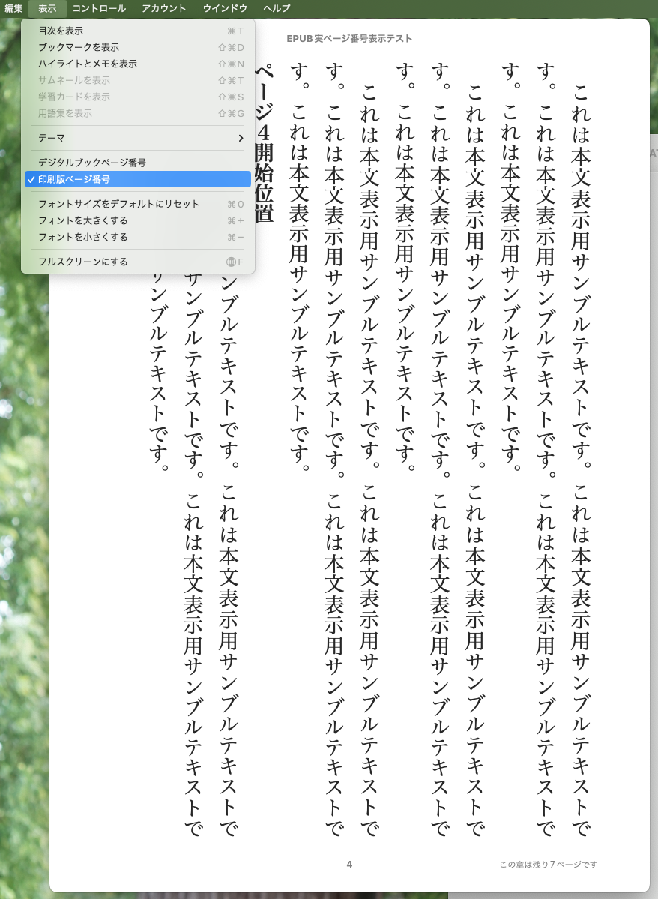
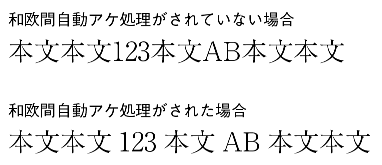
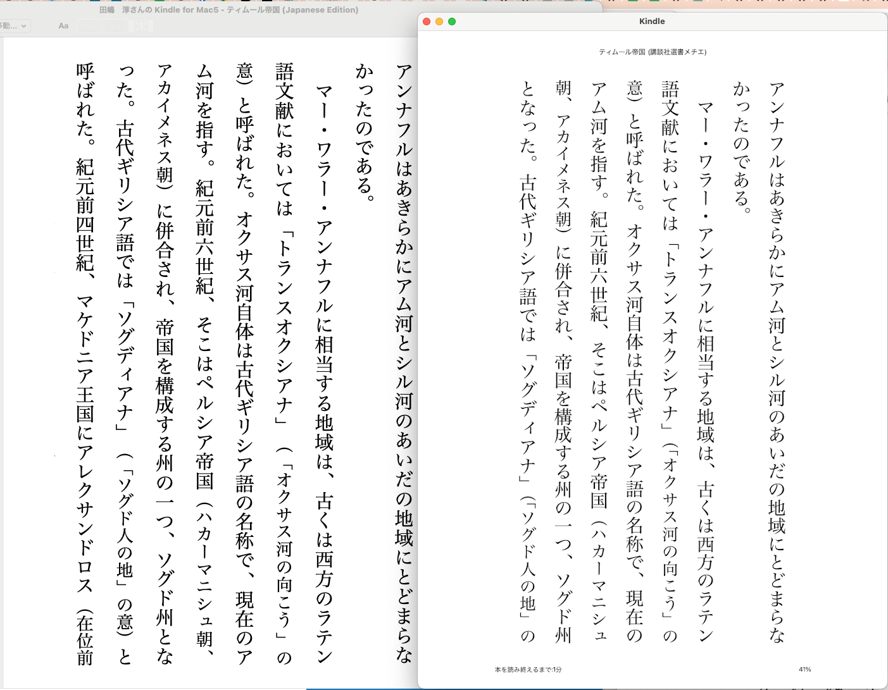
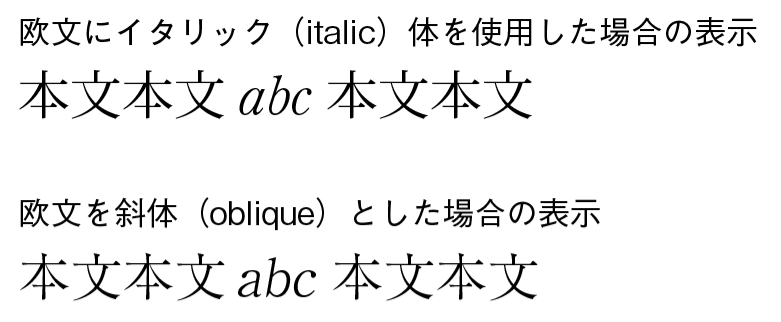

---
link:
  - rel: 'stylesheet'
    href: 'css/main.css'
lang: 'ja'
---

# 第3章　その他のEPUBビューア表示テスト

田嶋　淳

## 3-1 本扉配置指定テスト

### 3-1-1 調査の概要／目的


冊子体で綴じられた紙の本は、当たり前のことだが、見開きで読まれることを前提として作られてきた。このため、紙の本の体裁を引き継いで作られたリフロー型の電子書籍にも見開きを前提としたページ位置配置の規格がある。これは本扉、章扉などを見開き表示の際に縦書きならば左、横書きならば右に配置する指定に用いられる他、例えば絵画を題材として扱うような本で文中に挿入される見開きの図版を泣き別れにならないように表示させるために使われたりもする。これはEPUB内のOPFファイルにページ配置位置の指定を行うことで指定できるが、以前のテストの際には海外製のビューアを中心に未実装の例が目立った。これを踏まえ、今現在どういった状況にあるかを調査した。

### 3-1-2 ページ配置位置の指定方法

EPUBで見開き表示の際に各XHTMLファイルを左右どちらに配置するかを指定するには、EPUB内のOPFファイルのSPINEブロックに以下のような記述を行う必要がある。

```
<spine page-progression-direction="rtl">
<itemref linear="yes" idref="p-cover" properties="page-spread-left" />
<itemref linear="yes" idref="p-toc" />
<itemref linear="yes" idref="p-001" />
<itemref linear="yes" idref="p-002" properties="page-spread-left" />
</spine>
```

「properties="page-spread-left"」が配置位置指定に該当する。「properties="page-spread-right"」なら右ページに配置、「properties="page-spread-left"」なら左ページに配置の指定となる。

### 3-1-3 テスト結果

#### 3-1-3-1 本調査におけるテスト環境の一覧

<table>
  <tr>
    <th style="color:#434343" align="center">リーダー名</th>
    <th style="color:#434343" align="center">略称</th>
    <th style="color:#434343" align="center">種別</th>
    <th style="color:#434343" align="center">機材名</th>
    <th style="color:#434343" align="center">OS ver.</th>
    <th style="color:#434343" align="center">リーダーver.</th>
    <th style="color:#434343" align="center">担当者</th>
    <th style="color:#434343" align="center">テスト日</th>
  </tr>
  <tr>
    <td bgcolor="#c9daf8" align="center">Kindle for Android</td>
    <td bgcolor="#c9daf8" align="center">Kindle</td>
    <td bgcolor="#c9daf8" align="center">Androidアプリ</td>
    <td bgcolor="#c9daf8" align="center">Moto G30</td>
    <td bgcolor="#c9daf8" align="center">Android 11</td>
    <td bgcolor="#c9daf8" align="center">8.81.1.0 (1.3.290180.0)</td>
    <td bgcolor="#c9daf8" align="center">仁科</td>
    <td bgcolor="#c9daf8" align="center">2023/5/22</td>
  </tr>
  <tr>
    <td bgcolor="#c9daf8" align="center">Kindle for Android</td>
    <td bgcolor="#c9daf8" align="center">Kindle</td>
    <td bgcolor="#c9daf8" align="center">Androidアプリ</td>
    <td bgcolor="#c9daf8" align="center">Galaxy Tab S8 Ultra</td>
    <td bgcolor="#c9daf8" align="center">Android 13</td>
    <td bgcolor="#c9daf8" align="center">8.81.1.0 (1.3.290180.0)</td>
    <td bgcolor="#c9daf8" align="center">仁科</td>
    <td bgcolor="#c9daf8" align="center">2023/7/22</td>
  </tr>
  <tr>
    <td bgcolor="#c9daf8" align="center">Kindle for Android</td>
    <td bgcolor="#c9daf8" align="center">Kindle</td>
    <td bgcolor="#c9daf8" align="center">Androidアプリ</td>
    <td bgcolor="#c9daf8" align="center">Xperia 10 IV</td>
    <td bgcolor="#c9daf8" align="center">Android 13</td>
    <td bgcolor="#c9daf8" align="center">8.81.1.0 (1.3.290180.0)</td>
    <td bgcolor="#c9daf8" align="center">木龍</td>
    <td bgcolor="#c9daf8" align="center">2023/7/25</td>
  </tr>
  <tr>
    <td bgcolor="#c9daf8" align="center">Kindle Fire HD 10 Plus</td>
    <td bgcolor="#c9daf8" align="center">Kindle</td>
    <td bgcolor="#c9daf8" align="center">専用タブレット</td>
    <td bgcolor="#c9daf8" align="center">リーダーと同</td>
    <td bgcolor="#c9daf8" align="center">FireOS 7.3.2.8</td>
    <td bgcolor="#c9daf8" align="center">14.81.160 (1.3.290180)</td>
    <td bgcolor="#c9daf8" align="center">仁科</td>
    <td bgcolor="#c9daf8" align="center">2023/5/21</td>
  </tr>
  <tr>
    <td bgcolor="#c9daf8" align="center">Kindle Paperwhite Signature Edition</td>
    <td bgcolor="#c9daf8" align="center">Kindle</td>
    <td bgcolor="#c9daf8" align="center">専用タブレット</td>
    <td bgcolor="#c9daf8" align="center">リーダーと同</td>
    <td bgcolor="#c9daf8" align="center"></td>
    <td bgcolor="#c9daf8" align="center"></td>
    <td bgcolor="#c9daf8" align="center">仁科</td>
    <td bgcolor="#c9daf8" align="center">2023/5/21</td>
  </tr>
  <tr>
    <td bgcolor="#c9daf8" align="center">Kindle for PC</td>
    <td bgcolor="#c9daf8" align="center">Kindle</td>
    <td bgcolor="#c9daf8" align="center">Windowsアプリ</td>
    <td bgcolor="#c9daf8" align="center">N/A *¹</td>
    <td bgcolor="#c9daf8" align="center">Windows 10 Home 21H2</td>
    <td bgcolor="#c9daf8" align="center">1.40.1(65535)</td>
    <td bgcolor="#c9daf8" align="center">田嶋</td>
    <td bgcolor="#c9daf8" align="center">2023/5/22</td>
  </tr>
  <tr>
    <td bgcolor="#c9daf8" align="center">Kindle for PC</td>
    <td bgcolor="#c9daf8" align="center">Kindle</td>
    <td bgcolor="#c9daf8" align="center">Windowsアプリ</td>
    <td bgcolor="#c9daf8" align="center">GCR2070RGF-QCG</td>
    <td bgcolor="#c9daf8" align="center">Kindle for PC</td>
    <td bgcolor="#c9daf8" align="center">2.0.1 (70350)</td>
    <td bgcolor="#c9daf8" align="center">仁科</td>
    <td bgcolor="#c9daf8" align="center">2023/10/24</td>
  </tr>
  <tr>
    <td bgcolor="#c9daf8" align="center">Kindle for PC</td>
    <td bgcolor="#c9daf8" align="center">Kindle</td>
    <td bgcolor="#c9daf8" align="center">Windowsアプリ</td>
    <td bgcolor="#c9daf8" align="center">GALLERIA ZA9C-R38</td>
    <td bgcolor="#c9daf8" align="center">Kindle for PC</td>
    <td bgcolor="#c9daf8" align="center">1.40.1 (65535)</td>
    <td bgcolor="#c9daf8" align="center">仁科</td>
    <td bgcolor="#c9daf8" align="center">2023/05/21</td>
  </tr>
  <tr>
    <td bgcolor="#c9daf8" align="center">Kindle for PC</td>
    <td bgcolor="#c9daf8" align="center">Kindle</td>
    <td bgcolor="#c9daf8" align="center">Windowsアプリ</td>
    <td bgcolor="#c9daf8" align="center">11 (Surface Pro 8)</td>
    <td bgcolor="#c9daf8" align="center">Kindle for PC</td>
    <td bgcolor="#c9daf8" align="center">2.0.0 (70301)</td>
    <td bgcolor="#c9daf8" align="center">木龍</td>
    <td bgcolor="#c9daf8" align="center">2023/8/22</td>
  </tr>
  <tr>
    <td bgcolor="#c9daf8" align="center">Kindle for Mac</td>
    <td bgcolor="#c9daf8" align="center">Kindle</td>
    <td bgcolor="#c9daf8" align="center">Macアプリ</td>
    <td bgcolor="#c9daf8" align="center">Macbook 12-inch, Early 2016</td>
    <td bgcolor="#c9daf8" align="center">macOS Monterey 12.6.6</td>
    <td bgcolor="#c9daf8" align="center">1.40.1 (65624)</td>
    <td bgcolor="#c9daf8" align="center">仁科</td>
    <td bgcolor="#c9daf8" align="center">2023/5/22</td>
  </tr>
  <tr>
    <td bgcolor="#c9daf8" align="center">Kindle Previewer3 (Win)</td>
    <td bgcolor="#c9daf8" align="center">Kindle</td>
    <td bgcolor="#c9daf8" align="center">Windowsアプリ</td>
    <td bgcolor="#c9daf8" align="center">GALLERIA ZA9C-R38</td>
    <td bgcolor="#c9daf8" align="center"></td>
    <td bgcolor="#c9daf8" align="center"></td>
    <td bgcolor="#c9daf8" align="center">仁科</td>
    <td bgcolor="#c9daf8" align="center">2023/5/22</td>
  </tr>
  <tr>
    <td bgcolor="#c9daf8" align="center">Kindle Previewer3 (Mac)</td>
    <td bgcolor="#c9daf8" align="center">Kindle</td>
    <td bgcolor="#c9daf8" align="center">Macアプリ</td>
    <td bgcolor="#c9daf8" align="center">Macbook 12-inch, Early 2016</td>
    <td bgcolor="#c9daf8" align="center"></td>
    <td bgcolor="#c9daf8" align="center">3.72.0</td>
    <td bgcolor="#c9daf8" align="center">仁科</td>
    <td bgcolor="#c9daf8" align="center">2023/5/22</td>
  </tr>
  <tr>
    <td bgcolor="#c9daf8" align="center">楽天Koboアプリ for iPhone</td>
    <td bgcolor="#c9daf8" align="center">kobo</td>
    <td bgcolor="#c9daf8" align="center">iOSアプリ</td>
    <td bgcolor="#c9daf8" align="center">iPhone13mini</td>
    <td bgcolor="#c9daf8" align="center">iOS16.4.1 (a)</td>
    <td bgcolor="#c9daf8" align="center">10.3.7</td>
    <td bgcolor="#c9daf8" align="center">古門</td>
    <td bgcolor="#c9daf8" align="center">2023/5/20</td>
  </tr>
  <tr>
    <td bgcolor="#c9daf8" align="center">楽天Koboアプリ for Android</td>
    <td bgcolor="#c9daf8" align="center">kobo</td>
    <td bgcolor="#c9daf8" align="center">Androidアプリ</td>
    <td bgcolor="#c9daf8" align="center">Galaxy Tab S8 Ultra</td>
    <td bgcolor="#c9daf8" align="center">Android 13</td>
    <td bgcolor="#c9daf8" align="center">9.4.8.1</td>
    <td bgcolor="#c9daf8" align="center">仁科</td>
    <td bgcolor="#c9daf8" align="center">2023/8/20</td>
  </tr>
  <tr>
    <td bgcolor="#c9daf8" align="center">Kobo Libra 2</td>
    <td bgcolor="#c9daf8" align="center">kobo</td>
    <td bgcolor="#c9daf8" align="center">専用タブレット</td>
    <td bgcolor="#c9daf8" align="center">Kobo Libra 2</td>
    <td bgcolor="#c9daf8" align="center"></td>
    <td bgcolor="#c9daf8" align="center">4.37.21586 (42535ad976)</td>
    <td bgcolor="#c9daf8" align="center">仁科</td>
    <td bgcolor="#c9daf8" align="center">2023/07/25</td>
  </tr>
  <tr>
    <td bgcolor="#c9daf8" align="center">楽天Koboデスクトップ</td>
    <td bgcolor="#c9daf8" align="center">kobo</td>
    <td bgcolor="#c9daf8" align="center">Windowsアプリ</td>
    <td bgcolor="#c9daf8" align="center">GALLERIA ZA9C-R38</td>
    <td bgcolor="#c9daf8" align="center">Windows 10 Pro (22H2 19045.3208)</td>
    <td bgcolor="#c9daf8" align="center">4.37.19051</td>
    <td bgcolor="#c9daf8" align="center">仁科</td>
    <td bgcolor="#c9daf8" align="center">2023/07/25</td>
  </tr>
  <tr>
    <td bgcolor="#c9daf8" align="center">楽天Koboデスクトップ</td>
    <td bgcolor="#c9daf8" align="center">kobo</td>
    <td bgcolor="#c9daf8" align="center">Macアプリ</td>
    <td bgcolor="#c9daf8" align="center">MacBook (Retina, 12-12inch, Early 2016)</td>
    <td bgcolor="#c9daf8" align="center">macOS Monterey 12.6.6</td>
    <td bgcolor="#c9daf8" align="center">4.37.17113</td>
    <td bgcolor="#c9daf8" align="center">仁科</td>
    <td bgcolor="#c9daf8" align="center">2023/08/20</td>
  </tr>
  <tr>
    <td bgcolor="#c9daf8" align="center">ブック</td>
    <td bgcolor="#c9daf8" align="center">ブック</td>
    <td bgcolor="#c9daf8" align="center">iOSアプリ</td>
    <td bgcolor="#c9daf8" align="center">iPhone13mini</td>
    <td bgcolor="#c9daf8" align="center">iOS16.4.1 (a)</td>
    <td bgcolor="#c9daf8" align="center">N/A *²</td>
    <td bgcolor="#c9daf8" align="center">古門</td>
    <td bgcolor="#c9daf8" align="center">2023/5/20</td>
  </tr>
  <tr>
    <td bgcolor="#c9daf8" align="center">ブック</td>
    <td bgcolor="#c9daf8" align="center">ブック</td>
    <td bgcolor="#c9daf8" align="center">iOSアプリ</td>
    <td bgcolor="#c9daf8" align="center">iPad第6世代</td>
    <td bgcolor="#c9daf8" align="center">iOS17.1.2</td>
    <td bgcolor="#c9daf8" align="center">N/A *²</td>
    <td bgcolor="#c9daf8" align="center">田嶋</td>
    <td bgcolor="#c9daf8" align="center">2024/1/11</td>
  </tr>
  <tr>
    <td bgcolor="#c9daf8" align="center">ブック</td>
    <td bgcolor="#c9daf8" align="center">ブック</td>
    <td bgcolor="#c9daf8" align="center">Macアプリ</td>
    <td bgcolor="#c9daf8" align="center">MacBookAir M2 2022</td>
    <td bgcolor="#c9daf8" align="center">13.6.3 (22G436)</td>
    <td bgcolor="#c9daf8" align="center">5.2 (5800.52)</td>
    <td bgcolor="#c9daf8" align="center">小形</td>
    <td bgcolor="#c9daf8" align="center">2024/01/05</td>
  </tr>
  <tr>
    <td bgcolor="#c9daf8" align="center">MURASAKI</td>
    <td bgcolor="#c9daf8" align="center">→</td>
    <td bgcolor="#c9daf8" align="center">Macアプリ</td>
    <td bgcolor="#c9daf8" align="center">MacBookAir M2 2022</td>
    <td bgcolor="#c9daf8" align="center">13.4</td>
    <td bgcolor="#c9daf8" align="center">2.4.1</td>
    <td bgcolor="#c9daf8" align="center">小形</td>
    <td bgcolor="#c9daf8" align="center">2023/05/23</td>
  </tr>
  <tr>
    <td bgcolor="#c9daf8" align="center">honto電子書籍リーダー</td>
    <td bgcolor="#c9daf8" align="center">honto</td>
    <td bgcolor="#c9daf8" align="center">iOSアプリ</td>
    <td bgcolor="#c9daf8" align="center">iPhone13mini</td>
    <td bgcolor="#c9daf8" align="center">iOS16.4.1 (a)</td>
    <td bgcolor="#c9daf8" align="center">6.60.0</td>
    <td bgcolor="#c9daf8" align="center">古門</td>
    <td bgcolor="#c9daf8" align="center">2023/5/20</td>
  </tr>
  <tr>
    <td bgcolor="#c9daf8" align="center">honto電子書籍リーダー</td>
    <td bgcolor="#c9daf8" align="center">honto</td>
    <td bgcolor="#c9daf8" align="center">iOSアプリ</td>
    <td bgcolor="#c9daf8" align="center">iPad第6世代</td>
    <td bgcolor="#c9daf8" align="center">iOS17.1.2</td>
    <td bgcolor="#c9daf8" align="center">6.62.0</td>
    <td bgcolor="#c9daf8" align="center">田嶋</td>
    <td bgcolor="#c9daf8" align="center">2023/9/15</td>
  </tr>
  <tr>
    <td bgcolor="#c9daf8" align="center">honto電子書籍リーダー</td>
    <td bgcolor="#c9daf8" align="center">honto</td>
    <td bgcolor="#c9daf8" align="center">Androidアプリ</td>
    <td bgcolor="#c9daf8" align="center">Galaxy Tab S8 Ultra</td>
    <td bgcolor="#c9daf8" align="center">Android 13</td>
    <td bgcolor="#c9daf8" align="center">6.60.0</td>
    <td bgcolor="#c9daf8" align="center">仁科</td>
    <td bgcolor="#c9daf8" align="center">2023/8/20</td>
  </tr>
  <tr>
    <td bgcolor="#c9daf8" align="center">BOOK☆WALKER</td>
    <td bgcolor="#c9daf8" align="center">→</td>
    <td bgcolor="#c9daf8" align="center">iOSアプリ</td>
    <td bgcolor="#c9daf8" align="center">iPhone13mini</td>
    <td bgcolor="#c9daf8" align="center">iOS16.4.1 (a)</td>
    <td bgcolor="#c9daf8" align="center">7.4.7</td>
    <td bgcolor="#c9daf8" align="center">古門</td>
    <td bgcolor="#c9daf8" align="center">2023/5/20</td>
  </tr>
  <tr>
    <td bgcolor="#c9daf8" align="center">BOOK☆WALKER</td>
    <td bgcolor="#c9daf8" align="center">→</td>
    <td bgcolor="#c9daf8" align="center">iOSアプリ</td>
    <td bgcolor="#c9daf8" align="center">iPad第6世代</td>
    <td bgcolor="#c9daf8" align="center">iOS17.1.2</td>
    <td bgcolor="#c9daf8" align="center">7.5.1</td>
    <td bgcolor="#c9daf8" align="center">田嶋</td>
    <td bgcolor="#c9daf8" align="center">2024/1/10</td>
  </tr>
  <tr>
    <td bgcolor="#c9daf8" align="center">BOOK☆WALKER</td>
    <td bgcolor="#c9daf8" align="center">→</td>
    <td bgcolor="#c9daf8" align="center">Androidアプリ</td>
    <td bgcolor="#c9daf8" align="center">Galaxy Tab S8 Ultra</td>
    <td bgcolor="#c9daf8" align="center">Android 13</td>
    <td bgcolor="#c9daf8" align="center">7.5.0</td>
    <td bgcolor="#c9daf8" align="center">仁科</td>
    <td bgcolor="#c9daf8" align="center">2023/8/21</td>
  </tr>
  <tr>
    <td bgcolor="#c9daf8" align="center">Kinoppy for iOS</td>
    <td bgcolor="#c9daf8" align="center">Kinoppy</td>
    <td bgcolor="#c9daf8" align="center">iOSアプリ</td>
    <td bgcolor="#c9daf8" align="center">iPhone13mini</td>
    <td bgcolor="#c9daf8" align="center">iOSアプリ</td>
    <td bgcolor="#c9daf8" align="center">3.9.17.415162200</td>
    <td bgcolor="#c9daf8" align="center">古門</td>
    <td bgcolor="#c9daf8" align="center">2023/10/23</td>
  </tr>
  <tr>
    <td bgcolor="#c9daf8" align="center">Kinoppy for iOS</td>
    <td bgcolor="#c9daf8" align="center">Kinoppy</td>
    <td bgcolor="#c9daf8" align="center">iOSアプリ</td>
    <td bgcolor="#c9daf8" align="center">iPad第6世代</td>
    <td bgcolor="#c9daf8" align="center">iOS17.1.2</td>
    <td bgcolor="#c9daf8" align="center">3.10.0.452243324</td>
    <td bgcolor="#c9daf8" align="center">田嶋</td>
    <td bgcolor="#c9daf8" align="center">2024/1/11</td>
  </tr>
  <tr>
    <td bgcolor="#c9daf8" align="center">Kinoppy for Android</td>
    <td bgcolor="#c9daf8" align="center">Kinoppy</td>
    <td bgcolor="#c9daf8" align="center">Androidアプリ</td>
    <td bgcolor="#c9daf8" align="center">Galaxy Tab S8 Ultra</td>
    <td bgcolor="#c9daf8" align="center">Android 13</td>
    <td bgcolor="#c9daf8" align="center">3.10.7(913557c)</td>
    <td bgcolor="#c9daf8" align="center">仁科</td>
    <td bgcolor="#c9daf8" align="center">2023/10/18</td>
  </tr>
  <tr>
    <td bgcolor="#c9daf8" align="center">Kinoppy for Windows Desktop</td>
    <td bgcolor="#c9daf8" align="center">Kinoppy</td>
    <td bgcolor="#c9daf8" align="center">Windowsアプリ</td>
    <td bgcolor="#c9daf8" align="center">N/A *¹</td>
    <td bgcolor="#c9daf8" align="center">Windows 10 Home 21H2</td>
    <td bgcolor="#c9daf8" align="center">3.2.19</td>
    <td bgcolor="#c9daf8" align="center">田嶋</td>
    <td bgcolor="#c9daf8" align="center">2023/5/23</td>
  </tr>
  <tr>
    <td bgcolor="#c9daf8" align="center">Kinoppy for Mac</td>
    <td bgcolor="#c9daf8" align="center">Kinoppy</td>
    <td bgcolor="#c9daf8" align="center">Macアプリ</td>
    <td bgcolor="#c9daf8" align="center">Macbook 12-inch, Early 2016</td>
    <td bgcolor="#c9daf8" align="center">macOS Monterey 12.6.6</td>
    <td bgcolor="#c9daf8" align="center">3.6.6 (Build 649561180)</td>
    <td bgcolor="#c9daf8" align="center">仁科</td>
    <td bgcolor="#c9daf8" align="center">2023/8/21</td>
  </tr>
  <tr>
    <td bgcolor="#c9daf8" align="center">Romancer</td>
    <td bgcolor="#c9daf8" align="center">Voyager</td>
    <td bgcolor="#c9daf8" align="center">Webアプリ</td>
    <td bgcolor="#c9daf8" align="center">Galaxy Tab S8 Ultra</td>
    <td bgcolor="#c9daf8" align="center">Android 13</td>
    <td bgcolor="#c9daf8" align="center">N/A *² </td>
    <td bgcolor="#c9daf8" align="center">仁科</td>
    <td bgcolor="#c9daf8" align="center">2023/7/23</td>
  </tr>
  <tr>
    <td bgcolor="#c9daf8" align="center">Romancer</td>
    <td bgcolor="#c9daf8" align="center">Voyager</td>
    <td bgcolor="#c9daf8" align="center">Webアプリ</td>
    <td bgcolor="#c9daf8" align="center">N/A *¹</td>
    <td bgcolor="#c9daf8" align="center">Windows 10 Pro</td>
    <td bgcolor="#c9daf8" align="center">N/A *² </td>
    <td bgcolor="#c9daf8" align="center">仁科</td>
    <td bgcolor="#c9daf8" align="center">2023/7/23</td>
  </tr>
  <tr>
    <td bgcolor="#c9daf8" align="center">Bibi</td>
    <td bgcolor="#c9daf8" align="center">→</td>
    <td bgcolor="#c9daf8" align="center">Webアプリ</td>
    <td bgcolor="#c9daf8" align="center">DELL</td>
    <td bgcolor="#c9daf8" align="center">Windows 11 PRO</td>
    <td bgcolor="#c9daf8" align="center">Chrome 113.0.5672.127(64ビット)*³</td>
    <td bgcolor="#c9daf8" align="center">古門</td>
    <td bgcolor="#c9daf8" align="center">2023/05/28</td>
  </tr>
  <tr>
    <td bgcolor="#c9daf8" align="center">Bibi</td>
    <td bgcolor="#c9daf8" align="center">→</td>
    <td bgcolor="#c9daf8" align="center">Webアプリ</td>
    <td bgcolor="#c9daf8" align="center">DELL</td>
    <td bgcolor="#c9daf8" align="center">Windows 11 PRO</td>
    <td bgcolor="#c9daf8" align="center">Edge 113.0.1774.57 (64ビット)*³</td>
    <td bgcolor="#c9daf8" align="center">古門</td>
    <td bgcolor="#c9daf8" align="center">2023/05/28</td>
  </tr>
  <tr>
    <td bgcolor="#c9daf8" align="center">超縦書</td>
    <td bgcolor="#c9daf8" align="center">→</td>
    <td bgcolor="#c9daf8" align="center">Windowsアプリ</td>
    <td bgcolor="#c9daf8" align="center">N/A</td>
    <td bgcolor="#c9daf8" align="center">Windows 10 Home 21H2</td>
    <td bgcolor="#c9daf8" align="center">2.3.1</td>
    <td bgcolor="#c9daf8" align="center">田嶋</td>
    <td bgcolor="#c9daf8" align="center">22023/5/23</td>
  </tr>
  <tr>
    <td bgcolor="#c9daf8" align="center">Thorium Reader</td>
    <td bgcolor="#c9daf8" align="center">Thorium</td>
    <td bgcolor="#c9daf8" align="center">Windowsアプリ</td>
    <td bgcolor="#c9daf8" align="center">N/A</td>
    <td bgcolor="#c9daf8" align="center">Windows 11 PRO</td>
    <td bgcolor="#c9daf8" align="center">2.3.0</td>
    <td bgcolor="#c9daf8" align="center">古門</td>
    <td bgcolor="#c9daf8" align="center">2023/09/25</td>
  </tr>
  <tr>
    <td bgcolor="#c9daf8" align="center">Thorium Reader</td>
    <td bgcolor="#c9daf8" align="center">Thorium</td>
    <td bgcolor="#c9daf8" align="center">Macアプリ</td>
    <td bgcolor="#c9daf8" align="center">MacBook Air (M1, 2020)</td>
    <td bgcolor="#c9daf8" align="center">macOS12.6.7</td>
    <td bgcolor="#c9daf8" align="center">2.2.0</td>
    <td bgcolor="#c9daf8" align="center">田嶋</td>
    <td bgcolor="#c9daf8" align="center">2023/08/25</td>
  </tr>
  <tr>
    <td bgcolor="#c9daf8" align="center">Vivliostyle Viewer</td>
    <td bgcolor="#c9daf8" align="center">Vivliostyle</td>
    <td bgcolor="#c9daf8" align="center">Webアプリ</td>
    <td bgcolor="#c9daf8" align="center">Mac mini M1, 2020</td>
    <td bgcolor="#c9daf8" align="center">macOS 13.4</td>
    <td bgcolor="#c9daf8" align="center">v2.25.0 / Chrome 113*³</td>
    <td bgcolor="#c9daf8" align="center">村上</td>
    <td bgcolor="#c9daf8" align="center">2023/5/23</td>
  </tr>
</table>

- *1……自作機もあるWindows環境ではハードウェアを区別する意味はあまりないので省略
- *2……バージョン番号を表示する機能がない
- *3……ブラウザ上で動作するのでブラウザのバージョン名も併記

#### 3-1-3-2 各ビューアの対応状況
<table>
  <tr>
    <th style="color:#434343" align="center">Kindle</th>
    <td bgcolor="#c9daf8" align="center">NG *¹</td>
  </tr>
  <tr>
    <th style="color:#434343" align="center">Kobo</th>
    <td bgcolor="#c9daf8" align="center">NA/OK *²</td>
  </tr>
  <tr>
    <th style="color:#434343" align="center">ブック</th>
    <td bgcolor="#c9daf8" align="center">NG</td>
  </tr>
  <tr>
    <th style="color:#434343" align="center">MURASAKI</th>
    <td bgcolor="#c9daf8" align="center">NA</td>
  </tr>
  <tr>
    <th style="color:#434343" align="center">honto</th>
    <td bgcolor="#c9daf8" align="center">NA/OK *²</td>
  </tr>
  <tr>
    <th style="color:#434343" align="center">BOOK☆WALKER</th>
    <td bgcolor="#c9daf8" align="center">NA/OK *²</td>
  </tr>
  <tr>
    <th style="color:#434343" align="center">Kinoppy</th>
    <td bgcolor="#c9daf8" align="center">OK</td>
  </tr>
  <tr>
    <th style="color:#434343" align="center">Voyager</th>
    <td bgcolor="#c9daf8" align="center">NG</td>
  </tr>
  <tr>
    <th style="color:#434343" align="center">Bibi</th>
    <td bgcolor="#c9daf8" align="center">NA</td>
  </tr>
  <tr>
    <th style="color:#434343" align="center">超縦書</th>
    <td bgcolor="#c9daf8" align="center">OK</td>
  </tr>
  <tr>
    <th style="color:#434343" align="center">Thorium</th>
    <td bgcolor="#c9daf8" align="center">NA</td>
  </tr>
  <tr>
    <th style="color:#434343" align="center">Vivliostyle</th>
    <td bgcolor="#c9daf8" align="center">OK</td>
  </tr>
</table>

- *1 見開き表示を選択できないデバイスが多く、Android版、Windows版は横書きのみ見開きを選択できるがページ配置位置指定は効かない
- *2 Android版のみ見開き表示モードがあり、配置位置指定も効く

<br>

こちらはEPUB独自プロパティへの対応状況の調査となるため、「各OSで利用できるブラウザエンジンに依拠するもの」「独自レイアウトエンジンで動作するもの」への区分は設けず、対応状況を一覧表示した。また、見開き表示そのものに対応していないビューアも少なくないため、それに該当する場合は「NA」としている。

結果として見開き表示モードそのものがないビューアが多かった他、一部のデバイスでのみ対応、横書き時のみ見開き表示に対応など発展途上の実装が多く観測された。スマートフォンやタブレットは縦画面で見ることが多い実情を反映した結果と言えそうだが、今後VR/AR系デバイスでは見開きで見る機会も増えそうなので、今後の対応に期待したい。

## 3-2 実ページ番号表示テスト

### 3-2-1 調査の概要／目的
紙の本には当然ながらページ番号が記述されており、これはその本の内部での参照や他の本からの位置参照の方法として使われている。ただ、リフロー型電子書籍では文字サイズ・画面サイズによってページが随時生成されるため、紙の本と同じようにページ番号を利用した参照はできない。このため、通常はリンク処理で置き換えるといった対応を取るが、これは同じ本の内部参照に対してのみ有効な手法であり、リフロー型電子書籍で他の本の特定の箇所にリンクを貼る技術は現状存在していない。それを実現するためには出版される個々の電子書籍に（例えばISBNのような）一意の番号を付与し、それを管理する枠組みが必須になる。さらに、その仕組みがあったとしても「参照先が必ず電子本とは限らない」という問題はずっと残るため、結局ページ番号という旧来の参照の仕組みからは逃れられないことになる。  

このため、紙の本のページ番号をEPUB内に記入する規格それ自体はかなり前から存在しており、複数人が指示された特定のページを開く必要がある電子教科書等では実際に利用されてきたように思われる。ただ、一部を除いて一般向けのEPUBビューアでは使えない状況が続いてきた。  

しかし、2023年4月に正式にW3C規格化されたEPUB Accessibility 1.1内で「EPUB requirements」として「Page navigation」の記述が入り、EPUB Accessibilityを取り込んで2023年5月に規格化されたEPUB3.3でも主な変更点としてアクセシビリティ対応を謳っている状況がある。  

これを踏まえて、各EPUBビューアが現時点でどこまでリフロー型EPUB内への紙の本のページ番号の記述に対応しているかを調査した。

### 3-2-2 紙の本のページ番号の指定方法
EPUB内に紙の本のページ番号の記述を指定するには、ナビゲーション文書と本文内の各ページ開始位置にそれぞれ記述を行う必要がある。  

ナビゲーション文書の指定は以下のような形になる。

```
<nav epub:type="page-list">
 <ol>
   <li><a href="xhtml/p-002.xhtml#page001">1</a></li>
   <li><a href="xhtml/p-002.xhtml#page002">2</a></li>
   <li><a href="xhtml/p-002.xhtml#page003">3</a></li>
   <li><a href="xhtml/p-002.xhtml#page004">4</a></li>
   <li><a href="xhtml/p-002.xhtml#page005">5</a></li>
   <li><a href="xhtml/p-002.xhtml#page006">6</a></li>
   <li><a href="xhtml/p-002.xhtml#page007">7</a></li>
   <li><a href="xhtml/p-002.xhtml#page008">8</a></li>
   <li><a href="xhtml/p-002.xhtml#page009">9</a></li>
 </ol>
</nav>
```

本文内に入れる各ページ開始位置の指定の記述は以下。

```
<p>本文本文本文本文<span id="page001" epub:type="pagebreak" role="doc-pagebreak" aria-label="1" title="1"/>本文本文本文本文本文</p>
```

「```<span id="page001" epub:type="pagebreak" role="doc-pagebreak" aria-label="1" title="1"/>```」が指定に該当する。なお、title属性の値はビューアで表示する際の指定なので、目次など前付けのブロックにローマ数字を採用している本などにも問題なく対応できる。

### 3-2-3 テスト結果

#### 3-2-3-1 本調査におけるテスト環境の一覧
<table>
  <tr>
    <th style="color:#434343" align="center">リーダー名</th>
    <th style="color:#434343" align="center">略称</th>
    <th style="color:#434343" align="center">種別</th>
    <th style="color:#434343" align="center">機材名</th>
    <th style="color:#434343" align="center">OS ver.</th>
    <th style="color:#434343" align="center">リーダーver.</th>
    <th style="color:#434343" align="center">担当者</th>
    <th style="color:#434343" align="center">テスト日</th>
  </tr>
  <tr>
    <td bgcolor="#c9daf8" align="center">Kindle for Android</td>
    <td bgcolor="#c9daf8" align="center">Kindle</td>
    <td bgcolor="#c9daf8" align="center">Androidアプリ</td>
    <td bgcolor="#c9daf8" align="center">Moto G30</td>
    <td bgcolor="#c9daf8" align="center">Android 11</td>
    <td bgcolor="#c9daf8" align="center">8.81.1.0 (1.3.290180.0)</td>
    <td bgcolor="#c9daf8" align="center">仁科</td>
    <td bgcolor="#c9daf8" align="center">2023/5/22</td>
  </tr>
  <tr>
    <td bgcolor="#c9daf8" align="center">Kindle for Android</td>
    <td bgcolor="#c9daf8" align="center">Kindle</td>
    <td bgcolor="#c9daf8" align="center">Androidアプリ</td>
    <td bgcolor="#c9daf8" align="center">Galaxy Tab S8 Ultra</td>
    <td bgcolor="#c9daf8" align="center">Android 13</td>
    <td bgcolor="#c9daf8" align="center">8.81.1.0 (1.3.290180.0)</td>
    <td bgcolor="#c9daf8" align="center">仁科</td>
    <td bgcolor="#c9daf8" align="center">2023/7/22</td>
  </tr>
  <tr>
    <td bgcolor="#c9daf8" align="center">Kindle for Android</td>
    <td bgcolor="#c9daf8" align="center">Kindle</td>
    <td bgcolor="#c9daf8" align="center">Androidアプリ</td>
    <td bgcolor="#c9daf8" align="center">Xperia 10 IV</td>
    <td bgcolor="#c9daf8" align="center">Android 13</td>
    <td bgcolor="#c9daf8" align="center">8.81.1.0 (1.3.290180.0)</td>
    <td bgcolor="#c9daf8" align="center">木龍</td>
    <td bgcolor="#c9daf8" align="center">2023/7/25</td>
  </tr>
  <tr>
    <td bgcolor="#c9daf8" align="center">Kindle Fire HD 10 Plus</td>
    <td bgcolor="#c9daf8" align="center">Kindle</td>
    <td bgcolor="#c9daf8" align="center">専用タブレット</td>
    <td bgcolor="#c9daf8" align="center">リーダーと同</td>
    <td bgcolor="#c9daf8" align="center">FireOS 7.3.2.8</td>
    <td bgcolor="#c9daf8" align="center">14.81.160 (1.3.290180)</td>
    <td bgcolor="#c9daf8" align="center">仁科</td>
    <td bgcolor="#c9daf8" align="center">2023/5/21</td>
  </tr>
  <tr>
    <td bgcolor="#c9daf8" align="center">Kindle Paperwhite Signature Edition</td>
    <td bgcolor="#c9daf8" align="center">Kindle</td>
    <td bgcolor="#c9daf8" align="center">専用タブレット</td>
    <td bgcolor="#c9daf8" align="center">リーダーと同</td>
    <td bgcolor="#c9daf8" align="center"></td>
    <td bgcolor="#c9daf8" align="center"></td>
    <td bgcolor="#c9daf8" align="center">仁科</td>
    <td bgcolor="#c9daf8" align="center">2023/5/21</td>
  </tr>
  <tr>
    <td bgcolor="#c9daf8" align="center">Kindle for PC</td>
    <td bgcolor="#c9daf8" align="center">Kindle</td>
    <td bgcolor="#c9daf8" align="center">Windowsアプリ</td>
    <td bgcolor="#c9daf8" align="center">N/A *¹</td>
    <td bgcolor="#c9daf8" align="center">Windows 10 Home 21H2</td>
    <td bgcolor="#c9daf8" align="center">1.40.1(65535)</td>
    <td bgcolor="#c9daf8" align="center">田嶋</td>
    <td bgcolor="#c9daf8" align="center">2023/5/22</td>
  </tr>
  <tr>
    <td bgcolor="#c9daf8" align="center">Kindle for PC</td>
    <td bgcolor="#c9daf8" align="center">Kindle</td>
    <td bgcolor="#c9daf8" align="center">Windowsアプリ</td>
    <td bgcolor="#c9daf8" align="center">GCR2070RGF-QCG</td>
    <td bgcolor="#c9daf8" align="center">Kindle for PC</td>
    <td bgcolor="#c9daf8" align="center">2.0.1 (70350)</td>
    <td bgcolor="#c9daf8" align="center">仁科</td>
    <td bgcolor="#c9daf8" align="center">2023/10/24</td>
  </tr>
  <tr>
    <td bgcolor="#c9daf8" align="center">Kindle for PC</td>
    <td bgcolor="#c9daf8" align="center">Kindle</td>
    <td bgcolor="#c9daf8" align="center">Windowsアプリ</td>
    <td bgcolor="#c9daf8" align="center">GALLERIA ZA9C-R38</td>
    <td bgcolor="#c9daf8" align="center">Kindle for PC</td>
    <td bgcolor="#c9daf8" align="center">1.40.1 (65535)</td>
    <td bgcolor="#c9daf8" align="center">仁科</td>
    <td bgcolor="#c9daf8" align="center">2023/05/21</td>
  </tr>
  <tr>
    <td bgcolor="#c9daf8" align="center">Kindle for PC</td>
    <td bgcolor="#c9daf8" align="center">Kindle</td>
    <td bgcolor="#c9daf8" align="center">Windowsアプリ</td>
    <td bgcolor="#c9daf8" align="center">11 (Surface Pro 8)</td>
    <td bgcolor="#c9daf8" align="center">Kindle for PC</td>
    <td bgcolor="#c9daf8" align="center">2.0.0 (70301)</td>
    <td bgcolor="#c9daf8" align="center">木龍</td>
    <td bgcolor="#c9daf8" align="center">2023/8/22</td>
  </tr>
  <tr>
    <td bgcolor="#c9daf8" align="center">Kindle for Mac</td>
    <td bgcolor="#c9daf8" align="center">Kindle</td>
    <td bgcolor="#c9daf8" align="center">Macアプリ</td>
    <td bgcolor="#c9daf8" align="center">Macbook 12-inch, Early 2016</td>
    <td bgcolor="#c9daf8" align="center">macOS 12.6.6</td>
    <td bgcolor="#c9daf8" align="center">1.40.1 (65624)</td>
    <td bgcolor="#c9daf8" align="center">仁科</td>
    <td bgcolor="#c9daf8" align="center">2023/5/22</td>
  </tr>
  <tr>
    <td bgcolor="#c9daf8" align="center">Kindle Previewer3 (Win)</td>
    <td bgcolor="#c9daf8" align="center">Kindle</td>
    <td bgcolor="#c9daf8" align="center">Windowsアプリ</td>
    <td bgcolor="#c9daf8" align="center">GALLERIA ZA9C-R38</td>
    <td bgcolor="#c9daf8" align="center"></td>
    <td bgcolor="#c9daf8" align="center"></td>
    <td bgcolor="#c9daf8" align="center">仁科</td>
    <td bgcolor="#c9daf8" align="center">2023/5/22</td>
  </tr>
  <tr>
    <td bgcolor="#c9daf8" align="center">Kindle Previewer3 (Mac)</td>
    <td bgcolor="#c9daf8" align="center">Kindle</td>
    <td bgcolor="#c9daf8" align="center">Macアプリ</td>
    <td bgcolor="#c9daf8" align="center">Macbook 12-inch, Early 2016</td>
    <td bgcolor="#c9daf8" align="center"></td>
    <td bgcolor="#c9daf8" align="center">3.72.0</td>
    <td bgcolor="#c9daf8" align="center">仁科</td>
    <td bgcolor="#c9daf8" align="center">2023/5/22</td>
  </tr>
  <tr>
    <td bgcolor="#c9daf8" align="center">楽天Koboアプリ for iPhone</td>
    <td bgcolor="#c9daf8" align="center">kobo</td>
    <td bgcolor="#c9daf8" align="center">iOSアプリ</td>
    <td bgcolor="#c9daf8" align="center">iPhone13mini</td>
    <td bgcolor="#c9daf8" align="center">iOS16.4.1 (a)</td>
    <td bgcolor="#c9daf8" align="center">10.3.7</td>
    <td bgcolor="#c9daf8" align="center">古門</td>
    <td bgcolor="#c9daf8" align="center">2023/5/20</td>
  </tr>
  <tr>
    <td bgcolor="#c9daf8" align="center">楽天Koboアプリ for Android</td>
    <td bgcolor="#c9daf8" align="center">kobo</td>
    <td bgcolor="#c9daf8" align="center">Androidアプリ</td>
    <td bgcolor="#c9daf8" align="center">Galaxy Tab S8 Ultra</td>
    <td bgcolor="#c9daf8" align="center">Android 13</td>
    <td bgcolor="#c9daf8" align="center">9.4.8.1</td>
    <td bgcolor="#c9daf8" align="center">仁科</td>
    <td bgcolor="#c9daf8" align="center">2023/8/20</td>
  </tr>
  <tr>
    <td bgcolor="#c9daf8" align="center">Kobo Libra 2</td>
    <td bgcolor="#c9daf8" align="center">kobo</td>
    <td bgcolor="#c9daf8" align="center">専用タブレット</td>
    <td bgcolor="#c9daf8" align="center">リーダーと同</td>
    <td bgcolor="#c9daf8" align="center"></td>
    <td bgcolor="#c9daf8" align="center">4.37.21586 (42535ad976)</td>
    <td bgcolor="#c9daf8" align="center">仁科</td>
    <td bgcolor="#c9daf8" align="center">2023/07/25</td>
  </tr>
  <tr>
    <td bgcolor="#c9daf8" align="center">楽天Koboデスクトップ</td>
    <td bgcolor="#c9daf8" align="center">kobo</td>
    <td bgcolor="#c9daf8" align="center">Windowsアプリ</td>
    <td bgcolor="#c9daf8" align="center">GALLERIA ZA9C-R38</td>
    <td bgcolor="#c9daf8" align="center">Windows 10 Pro (22H2 19045.3208)</td>
    <td bgcolor="#c9daf8" align="center">4.37.19051</td>
    <td bgcolor="#c9daf8" align="center">仁科</td>
    <td bgcolor="#c9daf8" align="center">2023/07/25</td>
  </tr>
  <tr>
    <td bgcolor="#c9daf8" align="center">楽天Koboデスクトップ</td>
    <td bgcolor="#c9daf8" align="center">kobo</td>
    <td bgcolor="#c9daf8" align="center">Macアプリ</td>
    <td bgcolor="#c9daf8" align="center">MacBook (Retina, 12-12inch, Early 2016)</td>
    <td bgcolor="#c9daf8" align="center">macOS 12.6.6</td>
    <td bgcolor="#c9daf8" align="center">4.37.17113</td>
    <td bgcolor="#c9daf8" align="center">仁科</td>
    <td bgcolor="#c9daf8" align="center">2023/08/20</td>
  </tr>
  <tr>
    <td bgcolor="#c9daf8" align="center">ブック</td>
    <td bgcolor="#c9daf8" align="center">ブック</td>
    <td bgcolor="#c9daf8" align="center">iOSアプリ</td>
    <td bgcolor="#c9daf8" align="center">iPhone13mini</td>
    <td bgcolor="#c9daf8" align="center">iOS16.4.1 (a)</td>
    <td bgcolor="#c9daf8" align="center">N/A *²</td>
    <td bgcolor="#c9daf8" align="center">古門</td>
    <td bgcolor="#c9daf8" align="center">2023/5/20</td>
  </tr>
  <tr>
    <td bgcolor="#c9daf8" align="center">ブック</td>
    <td bgcolor="#c9daf8" align="center">ブック</td>
    <td bgcolor="#c9daf8" align="center">iOSアプリ</td>
    <td bgcolor="#c9daf8" align="center">iPad第6世代</td>
    <td bgcolor="#c9daf8" align="center">iOS17.1.2</td>
    <td bgcolor="#c9daf8" align="center">N/A *²</td>
    <td bgcolor="#c9daf8" align="center">田嶋</td>
    <td bgcolor="#c9daf8" align="center">2024/1/11</td>
  </tr>
  <tr>
    <td bgcolor="#c9daf8" align="center">ブック</td>
    <td bgcolor="#c9daf8" align="center">ブック</td>
    <td bgcolor="#c9daf8" align="center">Mac</td>
    <td bgcolor="#c9daf8" align="center">MacBookAir M2 2022</td>
    <td bgcolor="#c9daf8" align="center">13.6.3 (22G436)</td>
    <td bgcolor="#c9daf8" align="center">5.2 (5800.52)</td>
    <td bgcolor="#c9daf8" align="center">小形</td>
    <td bgcolor="#c9daf8" align="center">2024/01/05</td>
  </tr>
  <tr>
    <td bgcolor="#c9daf8" align="center">MURASAKI</td>
    <td bgcolor="#c9daf8" align="center">MURASAKI</td>
    <td bgcolor="#c9daf8" align="center">Mac</td>
    <td bgcolor="#c9daf8" align="center">MacBookAir M2 2022</td>
    <td bgcolor="#c9daf8" align="center">13.4</td>
    <td bgcolor="#c9daf8" align="center">2.4.1</td>
    <td bgcolor="#c9daf8" align="center">小形</td>
    <td bgcolor="#c9daf8" align="center">2023/05/23</td>
  </tr>
  <tr>
    <td bgcolor="#c9daf8" align="center">MURASAKI</td>
    <td bgcolor="#c9daf8" align="center">MURASAKI</td>
    <td bgcolor="#c9daf8" align="center">Mac</td>
    <td bgcolor="#c9daf8" align="center"></td>
    <td bgcolor="#c9daf8" align="center">13.6.3</td>
    <td bgcolor="#c9daf8" align="center">2.4.1</td>
    <td bgcolor="#c9daf8" align="center">田嶋</td>
    <td bgcolor="#c9daf8" align="center">2024/1/11</td>
  </tr>
  <tr>
    <td bgcolor="#c9daf8" align="center">honto</td>
    <td bgcolor="#c9daf8" align="center">honto</td>
    <td bgcolor="#c9daf8" align="center">iOSアプリ</td>
    <td bgcolor="#c9daf8" align="center">iPhone13mini</td>
    <td bgcolor="#c9daf8" align="center">iOS16.4.1 (a)</td>
    <td bgcolor="#c9daf8" align="center">6.60.0</td>
    <td bgcolor="#c9daf8" align="center">古門</td>
    <td bgcolor="#c9daf8" align="center">2023/5/20</td>
  </tr>
  <tr>
    <td bgcolor="#c9daf8" align="center">honto</td>
    <td bgcolor="#c9daf8" align="center">honto</td>
    <td bgcolor="#c9daf8" align="center">iOSアプリ</td>
    <td bgcolor="#c9daf8" align="center">iPad第6世代</td>
    <td bgcolor="#c9daf8" align="center">iOS17.1.2</td>
    <td bgcolor="#c9daf8" align="center">6.62.0</td>
    <td bgcolor="#c9daf8" align="center">田嶋</td>
    <td bgcolor="#c9daf8" align="center">2023/9/15</td>
  </tr>
  <tr>
    <td bgcolor="#c9daf8" align="center">honto</td>
    <td bgcolor="#c9daf8" align="center">honto</td>
    <td bgcolor="#c9daf8" align="center">Androidアプリ</td>
    <td bgcolor="#c9daf8" align="center">Galaxy Tab S8 Ultra</td>
    <td bgcolor="#c9daf8" align="center">Android 13</td>
    <td bgcolor="#c9daf8" align="center">6.60.0</td>
    <td bgcolor="#c9daf8" align="center">仁科</td>
    <td bgcolor="#c9daf8" align="center">2023/8/20</td>
  </tr>
  <tr>
    <td bgcolor="#c9daf8" align="center">BOOK☆WALKER</td>
    <td bgcolor="#c9daf8" align="center">BOOK☆WALKER</td>
    <td bgcolor="#c9daf8" align="center">iOSアプリ</td>
    <td bgcolor="#c9daf8" align="center">iPhone13mini</td>
    <td bgcolor="#c9daf8" align="center">iOS16.4.1 (a)</td>
    <td bgcolor="#c9daf8" align="center">7.4.7</td>
    <td bgcolor="#c9daf8" align="center">古門</td>
    <td bgcolor="#c9daf8" align="center">2023/5/20</td>
  </tr>
  <tr>
    <td bgcolor="#c9daf8" align="center">BOOK☆WALKER</td>
    <td bgcolor="#c9daf8" align="center">BOOK☆WALKER</td>
    <td bgcolor="#c9daf8" align="center">iOSアプリ</td>
    <td bgcolor="#c9daf8" align="center">iPad第6世代</td>
    <td bgcolor="#c9daf8" align="center">iOS17.1.2</td>
    <td bgcolor="#c9daf8" align="center">7.5.1</td>
    <td bgcolor="#c9daf8" align="center">田嶋</td>
    <td bgcolor="#c9daf8" align="center">2024/1/10</td>
  </tr>
  <tr>
    <td bgcolor="#c9daf8" align="center">BOOK☆WALKER for Android</td>
    <td bgcolor="#c9daf8" align="center">BOOK☆WALKER</td>
    <td bgcolor="#c9daf8" align="center">Androidアプリ</td>
    <td bgcolor="#c9daf8" align="center">Galaxy Tab S8 Ultra</td>
    <td bgcolor="#c9daf8" align="center">Android 13</td>
    <td bgcolor="#c9daf8" align="center">7.5.0</td>
    <td bgcolor="#c9daf8" align="center">仁科</td>
    <td bgcolor="#c9daf8" align="center">2023/8/21</td>
  </tr>
  <tr>
    <td bgcolor="#c9daf8" align="center">Kinoppy</td>
    <td bgcolor="#c9daf8" align="center">Kinoppy</td>
    <td bgcolor="#c9daf8" align="center">iOSアプリ</td>
    <td bgcolor="#c9daf8" align="center">iPhone13mini</td>
    <td bgcolor="#c9daf8" align="center">iOS</td>
    <td bgcolor="#c9daf8" align="center">3.9.17.415162200</td>
    <td bgcolor="#c9daf8" align="center">古門</td>
    <td bgcolor="#c9daf8" align="center">2023/10/23</td>
  </tr>
  <tr>
    <td bgcolor="#c9daf8" align="center">Kinoppy</td>
    <td bgcolor="#c9daf8" align="center">Kinoppy</td>
    <td bgcolor="#c9daf8" align="center">iOSアプリ</td>
    <td bgcolor="#c9daf8" align="center">iPad第6世代</td>
    <td bgcolor="#c9daf8" align="center">iOS17.1.2</td>
    <td bgcolor="#c9daf8" align="center">3.10.0.452243324</td>
    <td bgcolor="#c9daf8" align="center">田嶋</td>
    <td bgcolor="#c9daf8" align="center">2024/1/11</td>
  </tr>
  <tr>
    <td bgcolor="#c9daf8" align="center">Kinoppy for Android</td>
    <td bgcolor="#c9daf8" align="center">Kinoppy</td>
    <td bgcolor="#c9daf8" align="center">Androidアプリ</td>
    <td bgcolor="#c9daf8" align="center">Galaxy Tab S8 Ultra</td>
    <td bgcolor="#c9daf8" align="center">Android 13</td>
    <td bgcolor="#c9daf8" align="center">3.10.7(913557c)</td>
    <td bgcolor="#c9daf8" align="center">仁科</td>
    <td bgcolor="#c9daf8" align="center">2023/10/18</td>
  </tr>
  <tr>
    <td bgcolor="#c9daf8" align="center">Kinoppy</td>
    <td bgcolor="#c9daf8" align="center">Kinoppy</td>
    <td bgcolor="#c9daf8" align="center">Windowsアプリ</td>
    <td bgcolor="#c9daf8" align="center">N/A *¹</td>
    <td bgcolor="#c9daf8" align="center">Windows 10 Home 21H2</td>
    <td bgcolor="#c9daf8" align="center">3.2.19</td>
    <td bgcolor="#c9daf8" align="center">田嶋</td>
    <td bgcolor="#c9daf8" align="center">2023/5/23</td>
  </tr>
  <tr>
    <td bgcolor="#c9daf8" align="center">Kinoppy</td>
    <td bgcolor="#c9daf8" align="center">Kinoppy</td>
    <td bgcolor="#c9daf8" align="center">Macアプリ</td>
    <td bgcolor="#c9daf8" align="center">Macbook 12-inch, Early 2016</td>
    <td bgcolor="#c9daf8" align="center">macOS 12.6.6</td>
    <td bgcolor="#c9daf8" align="center">3.6.6 (Build 649561180)</td>
    <td bgcolor="#c9daf8" align="center">仁科</td>
    <td bgcolor="#c9daf8" align="center">2023/8/21</td>
  </tr>
  <tr>
    <td bgcolor="#c9daf8" align="center">Romancer</td>
    <td bgcolor="#c9daf8" align="center">Voyager</td>
    <td bgcolor="#c9daf8" align="center">Webアプリ</td>
    <td bgcolor="#c9daf8" align="center">Galaxy Tab S8 Ultra</td>
    <td bgcolor="#c9daf8" align="center">Android 13</td>
    <td bgcolor="#c9daf8" align="center">N/A *² </td>
    <td bgcolor="#c9daf8" align="center">仁科</td>
    <td bgcolor="#c9daf8" align="center">2023/7/23</td>
  </tr>
  <tr>
    <td bgcolor="#c9daf8" align="center">Romancer</td>
    <td bgcolor="#c9daf8" align="center">Voyager</td>
    <td bgcolor="#c9daf8" align="center">Webアプリ</td>
    <td bgcolor="#c9daf8" align="center">N/A *¹</td>
    <td bgcolor="#c9daf8" align="center">Windows 10 Pro</td>
    <td bgcolor="#c9daf8" align="center">N/A *² </td>
    <td bgcolor="#c9daf8" align="center">仁科</td>
    <td bgcolor="#c9daf8" align="center">2023/7/23</td>
  </tr>
  <tr>
    <td bgcolor="#c9daf8" align="center">Bibi</td>
    <td bgcolor="#c9daf8" align="center">→</td>
    <td bgcolor="#c9daf8" align="center">Webアプリ</td>
    <td bgcolor="#c9daf8" align="center">DELL</td>
    <td bgcolor="#c9daf8" align="center">Windows 11 PRO</td>
    <td bgcolor="#c9daf8" align="center">Chrome 113.0.5672.127(64ビット) *³</td>
    <td bgcolor="#c9daf8" align="center">古門</td>
    <td bgcolor="#c9daf8" align="center">2023/05/28</td>
  </tr>
  <tr>
    <td bgcolor="#c9daf8" align="center">Bibi</td>
    <td bgcolor="#c9daf8" align="center">→</td>
    <td bgcolor="#c9daf8" align="center">Webアプリ</td>
    <td bgcolor="#c9daf8" align="center">DELL</td>
    <td bgcolor="#c9daf8" align="center">Windows 11 PRO</td>
    <td bgcolor="#c9daf8" align="center">Edge 113.0.1774.57 (64ビット) *³</td>
    <td bgcolor="#c9daf8" align="center">古門</td>
    <td bgcolor="#c9daf8" align="center">2023/05/28</td>
  </tr>
  <tr>
    <td bgcolor="#c9daf8" align="center">超縦書</td>
    <td bgcolor="#c9daf8" align="center">超縦書</td>
    <td bgcolor="#c9daf8" align="center">Windowsアプリ</td>
    <td bgcolor="#c9daf8" align="center">N/A *¹</td>
    <td bgcolor="#c9daf8" align="center">Windows 10 Home 21H2</td>
    <td bgcolor="#c9daf8" align="center">2.3.1</td>
    <td bgcolor="#c9daf8" align="center">田嶋</td>
    <td bgcolor="#c9daf8" align="center">22023/5/23</td>
  </tr>
  <tr>
    <td bgcolor="#c9daf8" align="center">Thorium Reader</td>
    <td bgcolor="#c9daf8" align="center">Thorium</td>
    <td bgcolor="#c9daf8" align="center">Windowsアプリ</td>
    <td bgcolor="#c9daf8" align="center">N/A *¹</td>
    <td bgcolor="#c9daf8" align="center">Windows 11 PRO</td>
    <td bgcolor="#c9daf8" align="center">2.3.0</td>
    <td bgcolor="#c9daf8" align="center">古門</td>
    <td bgcolor="#c9daf8" align="center">2023/09/25</td>
  </tr>
  <tr>
    <td bgcolor="#c9daf8" align="center">Thorium Reader</td>
    <td bgcolor="#c9daf8" align="center">Thorium</td>
    <td bgcolor="#c9daf8" align="center">Macアプリ</td>
    <td bgcolor="#c9daf8" align="center">MacBook Air (M1, 2020)</td>
    <td bgcolor="#c9daf8" align="center">macOS12.6.7</td>
    <td bgcolor="#c9daf8" align="center">2.2.0</td>
    <td bgcolor="#c9daf8" align="center">田嶋</td>
    <td bgcolor="#c9daf8" align="center">2023/08/25</td>
  </tr>
  <tr>
    <td bgcolor="#c9daf8" align="center">Vivliostyle Viewer</td>
    <td bgcolor="#c9daf8" align="center">Vivliostyle</td>
    <td bgcolor="#c9daf8" align="center">Webアプリ</td>
    <td bgcolor="#c9daf8" align="center">Mac mini M1, 2020</td>
    <td bgcolor="#c9daf8" align="center">macOS 13.4</td>
    <td bgcolor="#c9daf8" align="center">v2.25.0 / Chrome 113 *³</td>
    <td bgcolor="#c9daf8" align="center">村上</td>
    <td bgcolor="#c9daf8" align="center">2023/5/23</td>
  </tr>
</table>

- *1……自作機もあるWindows環境ではハードウェアを区別する意味はあまりないので省略
- *2……バージョン番号を表示する機能がない
- *3……ブラウザ上で動作するのでブラウザのバージョン名も併記

<br>

#### 3-2-3-2 各ビューアの対応状況

<table>
  <tr>
    <th style="color:#434343" align="center">Kindle</th>
    <td bgcolor="#c9daf8" align="center">NG *¹</td>
  </tr>
  <tr>
    <th style="color:#434343" align="center">Kobo</th>
    <td bgcolor="#c9daf8" align="center">NG</td>
  </tr>
  <tr>
    <th style="color:#434343" align="center">ブック</th>
    <td bgcolor="#c9daf8" align="center">OK</td>
  </tr>
  <tr>
    <th style="color:#434343" align="center">Murasaki</th>
    <td bgcolor="#c9daf8" align="center">OK</td>
  </tr>
  <tr>
    <th style="color:#434343" align="center">honto</th>
    <td bgcolor="#c9daf8" align="center">NG</td>
  </tr>
  <tr>
    <th style="color:#434343" align="center">BOOK☆WALKER</th>
    <td bgcolor="#c9daf8" align="center">NG</td>
  </tr>
  <tr>
    <th style="color:#434343" align="center">Kinoppy</th>
    <td bgcolor="#c9daf8" align="center">NG</td>
  </tr>
  <tr>
    <th style="color:#434343" align="center">Voyager</th>
    <td bgcolor="#c9daf8" align="center">NG</td>
  </tr>
  <tr>
    <th style="color:#434343" align="center">Bibi</th>
    <td bgcolor="#c9daf8" align="center">NG</td>
  </tr>
  <tr>
    <th style="color:#434343" align="center">超縦書</th>
    <td bgcolor="#c9daf8" align="center">NG</td>
  </tr>
  <tr>
    <th style="color:#434343" align="center">Thorium Reader</th>
    <td bgcolor="#c9daf8" align="center">NG</td>
  </tr>
  <tr>
    <th style="color:#434343" align="center">Vivliostyle</th>
    <td bgcolor="#c9daf8" align="center">NG</td>
  </tr>
</table>

- *1 Kindleパブリッシングガイドラインに「実際のページ番号の有効化」の項目があるため対応はしていると思われるが、読み込ませたテストデータでは有効にならないので「NG」扱いとした

<br>

こちらはEPUB独自プロパティへの対応状況の調査となるため、「各OSで利用できるブラウザエンジンに依拠するもの」「独自レイアウトエンジンで動作するもの」への区分は設けず、対応状況を一覧表示した。

現時点で対応が確認できたのは「ブック」と「MURASAKI」のみ。Kindleはガイドライン文書に対応済の記載はあるが読み込ませたテストデータでは確認できない。これはかなり前からずっと変わっていない。外部文書の参照が頻繁に出てくるような類の本ではページ番号によるナビゲーションは重要なので、今後の対応を期待したいところ。
対応済みだったアプリで実ページ番号にアクセスする方法を以下に載せておく。



Mac版の「ブック」では表示メニューから「印刷版ページ番号」を選択することでノンブルの表示が実ページ番号に切り替わる。iOS版では特に切り替え設定は見当たらないが、自動で切り替わって表示される模様。


「Murasaki」では移動メニューの「ページ番号」を選ぶことで選択ボックスが表示され、各ページの先頭位置にジャンプすることができる。

## 3-3 文字の自動ツメ・アキ表示テスト

### 3-3-1 調査の概要／目的


DTPでの和文組版処理では、一般的に句読点や全角カッコ類などの約物が連続する際には組版ソフト側の処理によって字間スペースの自動ツメ処理が行われ、字間が間延びして見えないように調整されている。



また、和文の文中に欧文の文字列が挿入された際には自動でスペースの挿入処理が行われ、単語間の区切りをわかりやすくする。これらは通常、組版ソフト側の自動処理で当たり前のように行われ、組版作業者は気づきにくいが、日本語の可読性を上げるための縁の下の力持ち的な技術のひとつと言える。ただ、Webや電子書籍の世界では、日本のみを対象として展開してきた一部の電子書籍ストアアプリやVivliostyleのようなWeb規格の先行実装を実現しているアプリケーションを除き、これまではほぼこういった処理は行われていなかった。

しかし、W3C等での規格策定の進捗に合わせる形で2023年12月始めにGoogle Chromeに近日中に文字ツメ／アケ関連のプロパティ（text-spacing-trim / text-autospace）が実装される予定とのアナウンスがあった（[参照](https://developer.chrome.com/blog/css-i18n-features?hl=ja)）。まだ規格策定の段階としてはWDであり、ようやく最初のブラウザ実装が出る程度の段階であるため、規格が確定してメジャーなブラウザ全てで使えるようになるにはしばらく時間はかかりそうだが、いずれは安定して使えるようになることを期待したい。  

こういったW3Cの規格としての文字ツメ／アケ関連プロパティ実装の動きと並行する形で、各EPUBビューアで独自実装、強制適用という形で文字ツメ／アケ処理が行われるようになってきている状況がある。このため、このテストでは2023年12月時点での記録として、各ビューアの状況をレポートすることとした。ただし上記のように正式なCSS規格の規格が策定進展中という状態であるため、特に外部のブラウザエンジンをレンダリングに使用しているビューアでは、環境の変化に連動する形で将来的に挙動が変化する可能性があることは最初に注記しておく。なお、CSSのtext-spacing-trim / text-autospace自体の先行実装を行っているVivliostyle Viewerはここではテストから除外した。  

テストとしては各ビューアが「括弧類が段落行頭に来た場合に行頭に二分スペースが入るかどうか」「行中で約物が連続した場合にアキの自動ツメ処理を行うかどうか」「和欧文字間に自動でスペースを挿入する処理を行うかどうか」を観察している。  

なお、「括弧類が段落行頭に来た場合に行頭に二分スペースが入るかどうか」のテストでも「OK」「NG」の表記を使っているが、こちらのテストで行頭二分下げの処理をすることが望ましいとする意図はないので留意されたい。単純な表示結果の区分として使っている。これは本来的には段落行頭二分下げ／折り返し天付きの組版処理ができているかを見たかったのだが、折り返し時の処理結果のチェックが難しかったため段落行頭二分下げの処理のみを記録した。「行中で約物が連続した場合にアキの自動ツメ処理を行うかどうか」と組み合わせて見ることで前述の処理ができているかの推測はできるように思う。  

また、こちらのテスト結果は「各OSで利用できるブラウザエンジンに依拠するアプリの対応状況」と「独自レイアウトエンジンで動作するアプリの挙動の対応状況」に分けて記述した。これは、テストの性質上、特に「各OSで利用できるブラウザエンジンに依拠するアプリ」において、OSのメジャーアップデートなど外部環境の変化によって結果が変化する可能性が大きいからである。

### 3-3-2 文字アケ・文字ツメの指定方法
こちらのテストはCSSのtext-spacing-trim / text-autospaceを指定したテストファイルで挙動の観察をしているが、それ自体への対応と見られる挙動はVivliostyle Viewer以外では見られなかった（指定ありなしに関わらず表示結果が同じ）。このため、得られた表示結果を元に各EPUBビューアで独自実装、強制適用という形での文字ツメ／アケ処理の実装状況を確認している。なお、結果が不明瞭なビューアに関しては執筆者が追試して確認を行った。

### 3-3-3 テスト結果

#### 3-3-3-1 本調査におけるテスト環境の一覧
<table>
  <tr>
    <th style="color:#434343" align="center">リーダー名</th>
    <th style="color:#434343" align="center">略称</th>
    <th style="color:#434343" align="center">種別</th>
    <th style="color:#434343" align="center">機材名</th>
    <th style="color:#434343" align="center">OS ver.</th>
    <th style="color:#434343" align="center">リーダーver.</th>
    <th style="color:#434343" align="center">担当者</th>
    <th style="color:#434343" align="center">テスト日</th>
  </tr>
  <tr>
    <td bgcolor="#c9daf8" align="center">Kindle for Android</td>
    <td bgcolor="#c9daf8" align="center">Kindle</td>
    <td bgcolor="#c9daf8" align="center">Androidアプリ</td>
    <td bgcolor="#c9daf8" align="center">Moto G30</td>
    <td bgcolor="#c9daf8" align="center">Android 11</td>
    <td bgcolor="#c9daf8" align="center">8.81.1.0 (1.3.290180.0)</td>
    <td bgcolor="#c9daf8" align="center">仁科</td>
    <td bgcolor="#c9daf8" align="center">2023/5/22</td>
  </tr>
  <tr>
    <td bgcolor="#c9daf8" align="center">Kindle for Android</td>
    <td bgcolor="#c9daf8" align="center">Kindle</td>
    <td bgcolor="#c9daf8" align="center">Androidアプリ</td>
    <td bgcolor="#c9daf8" align="center">Galaxy Tab S8 Ultra</td>
    <td bgcolor="#c9daf8" align="center">Android 13</td>
    <td bgcolor="#c9daf8" align="center">8.81.1.0 (1.3.290180.0)</td>
    <td bgcolor="#c9daf8" align="center">仁科</td>
    <td bgcolor="#c9daf8" align="center">2023/7/22</td>
  </tr>
  <tr>
    <td bgcolor="#c9daf8" align="center">Kindle for Android</td>
    <td bgcolor="#c9daf8" align="center">Kindle</td>
    <td bgcolor="#c9daf8" align="center">Androidアプリ</td>
    <td bgcolor="#c9daf8" align="center">Xperia 10 IV</td>
    <td bgcolor="#c9daf8" align="center">Android 13</td>
    <td bgcolor="#c9daf8" align="center">8.81.1.0 (1.3.290180.0)</td>
    <td bgcolor="#c9daf8" align="center">木龍</td>
    <td bgcolor="#c9daf8" align="center">2023/7/25</td>
  </tr>
  <tr>
    <td bgcolor="#c9daf8" align="center">Kindle Fire HD 10 Plus</td>
    <td bgcolor="#c9daf8" align="center">Kindle</td>
    <td bgcolor="#c9daf8" align="center">専用タブレット</td>
    <td bgcolor="#c9daf8" align="center">リーダーと同</td>
    <td bgcolor="#c9daf8" align="center">FireOS 7.3.2.8</td>
    <td bgcolor="#c9daf8" align="center">14.81.160 (1.3.290180)</td>
    <td bgcolor="#c9daf8" align="center">仁科</td>
    <td bgcolor="#c9daf8" align="center">2023/5/21</td>
  </tr>
  <tr>
    <td bgcolor="#c9daf8" align="center">Kindle Paperwhite Signature Edition</td>
    <td bgcolor="#c9daf8" align="center">Kindle</td>
    <td bgcolor="#c9daf8" align="center">専用タブレット</td>
    <td bgcolor="#c9daf8" align="center">リーダーと同</td>
    <td bgcolor="#c9daf8" align="center"></td>
    <td bgcolor="#c9daf8" align="center">5.15.1.1</td>
    <td bgcolor="#c9daf8" align="center">仁科</td>
    <td bgcolor="#c9daf8" align="center">2023/5/21</td>
  </tr>
  <tr>
    <td bgcolor="#c9daf8" align="center">Kindle (第8世代)</td>
    <td bgcolor="#c9daf8" align="center">Kindle</td>
    <td bgcolor="#c9daf8" align="center">専用タブレット</td>
    <td bgcolor="#c9daf8" align="center">リーダーと同</td>
    <td bgcolor="#c9daf8" align="center"></td>
    <td bgcolor="#c9daf8" align="center">5.16.2.11 (4097490002)</td>
    <td bgcolor="#c9daf8" align="center">田嶋</td>
    <td bgcolor="#c9daf8" align="center">2023/9/15</td>
  </tr>
  <tr>
    <td bgcolor="#c9daf8" align="center">Kindle for PC</td>
    <td bgcolor="#c9daf8" align="center">Kindle</td>
    <td bgcolor="#c9daf8" align="center">Windowsアプリ</td>
    <td bgcolor="#c9daf8" align="center">N/A</td>
    <td bgcolor="#c9daf8" align="center">Windows 10 Home 21H2</td>
    <td bgcolor="#c9daf8" align="center">1.40.1(65535)</td>
    <td bgcolor="#c9daf8" align="center">田嶋</td>
    <td bgcolor="#c9daf8" align="center">2023/5/22</td>
  </tr>
  <tr>
    <td bgcolor="#c9daf8" align="center">Kindle for PC</td>
    <td bgcolor="#c9daf8" align="center">Kindle</td>
    <td bgcolor="#c9daf8" align="center">Windowsアプリ</td>
    <td bgcolor="#c9daf8" align="center">GCR2070RGF-QCG</td>
    <td bgcolor="#c9daf8" align="center">Kindle for PC</td>
    <td bgcolor="#c9daf8" align="center">2.0.1(70350)</td>
    <td bgcolor="#c9daf8" align="center">仁科</td>
    <td bgcolor="#c9daf8" align="center">2023/10/24</td>
  </tr>
  <tr>
    <td bgcolor="#c9daf8" align="center">Kindle for PC</td>
    <td bgcolor="#c9daf8" align="center">Kindle</td>
    <td bgcolor="#c9daf8" align="center">Windowsアプリ</td>
    <td bgcolor="#c9daf8" align="center">GALLERIA ZA9C-R38</td>
    <td bgcolor="#c9daf8" align="center">Kindle for PC</td>
    <td bgcolor="#c9daf8" align="center">1.40.1 (65535)</td>
    <td bgcolor="#c9daf8" align="center">仁科</td>
    <td bgcolor="#c9daf8" align="center">2023/05/21</td>
  </tr>
  <tr>
    <td bgcolor="#c9daf8" align="center">Kindle for PC</td>
    <td bgcolor="#c9daf8" align="center">Kindle</td>
    <td bgcolor="#c9daf8" align="center">Windowsアプリ</td>
    <td bgcolor="#c9daf8" align="center">11 (Surface Pro 8)</td>
    <td bgcolor="#c9daf8" align="center">Kindle for PC</td>
    <td bgcolor="#c9daf8" align="center">2.0.0 (70301)</td>
    <td bgcolor="#c9daf8" align="center">木龍</td>
    <td bgcolor="#c9daf8" align="center">2023/8/22</td>
  </tr>
  <tr>
    <td bgcolor="#c9daf8" align="center">Kindle for Mac</td>
    <td bgcolor="#c9daf8" align="center">Kindle</td>
    <td bgcolor="#c9daf8" align="center">Macアプリ</td>
    <td bgcolor="#c9daf8" align="center">Macbook 12-inch, Early 2016</td>
    <td bgcolor="#c9daf8" align="center">macOS Monterey 12.6.6</td>
    <td bgcolor="#c9daf8" align="center">Kindle for Mac 1.40.1 (65624)</td>
    <td bgcolor="#c9daf8" align="center">仁科</td>
    <td bgcolor="#c9daf8" align="center">2023/5/22</td>
  </tr>
  <tr>
    <td bgcolor="#c9daf8" align="center">Kindle Previewer3(Win)</td>
    <td bgcolor="#c9daf8" align="center">Kindle</td>
    <td bgcolor="#c9daf8" align="center">Windowsアプリ</td>
    <td bgcolor="#c9daf8" align="center">GALLERIA ZA9C-R38</td>
    <td bgcolor="#c9daf8" align="center"></td>
    <td bgcolor="#c9daf8" align="center">3.71.1</td>
    <td bgcolor="#c9daf8" align="center">仁科</td>
    <td bgcolor="#c9daf8" align="center">2023/5/22</td>
  </tr>
  <tr>
    <td bgcolor="#c9daf8" align="center">Kindle Previewer3(Mac)</td>
    <td bgcolor="#c9daf8" align="center">Kindle</td>
    <td bgcolor="#c9daf8" align="center">Macアプリ</td>
    <td bgcolor="#c9daf8" align="center">Macbook 12-inch, Early 2016</td>
    <td bgcolor="#c9daf8" align="center">macOS12.6.6</td>
    <td bgcolor="#c9daf8" align="center">3.72.0</td>
    <td bgcolor="#c9daf8" align="center">仁科</td>
    <td bgcolor="#c9daf8" align="center">2023/5/22</td>
  </tr>
  <tr>
    <td bgcolor="#c9daf8" align="center">楽天Koboアプリ for iPhone</td>
    <td bgcolor="#c9daf8" align="center">kobo</td>
    <td bgcolor="#c9daf8" align="center">iOSアプリ</td>
    <td bgcolor="#c9daf8" align="center">iPhone13mini</td>
    <td bgcolor="#c9daf8" align="center">iOS16.4.1 (a)</td>
    <td bgcolor="#c9daf8" align="center">10.3.7</td>
    <td bgcolor="#c9daf8" align="center">古門</td>
    <td bgcolor="#c9daf8" align="center">2023/5/20</td>
  </tr>
  <tr>
    <td bgcolor="#c9daf8" align="center">楽天Koboアプリ for iPhone</td>
    <td bgcolor="#c9daf8" align="center">kobo</td>
    <td bgcolor="#c9daf8" align="center">iOSアプリ</td>
    <td bgcolor="#c9daf8" align="center">iPad第6世代</td>
    <td bgcolor="#c9daf8" align="center">16.6</td>
    <td bgcolor="#c9daf8" align="center">10.4.2</td>
    <td bgcolor="#c9daf8" align="center">田嶋</td>
    <td bgcolor="#c9daf8" align="center">2023/9/14</td>
  </tr>
  <tr>
    <td bgcolor="#c9daf8" align="center">楽天Koboアプリ for Android</td>
    <td bgcolor="#c9daf8" align="center">kobo</td>
    <td bgcolor="#c9daf8" align="center">Androidアプリ</td>
    <td bgcolor="#c9daf8" align="center">Galaxy Tab S8 Ultra</td>
    <td bgcolor="#c9daf8" align="center">Android 13</td>
    <td bgcolor="#c9daf8" align="center">9.4.8.1</td>
    <td bgcolor="#c9daf8" align="center">仁科</td>
    <td bgcolor="#c9daf8" align="center">2023/8/20</td>
  </tr>
  <tr>
    <td bgcolor="#c9daf8" align="center">Kobo Libra 2</td>
    <td bgcolor="#c9daf8" align="center">kobo</td>
    <td bgcolor="#c9daf8" align="center">専用タブレット</td>
    <td bgcolor="#c9daf8" align="center">リーダーと同</td>
    <td bgcolor="#c9daf8" align="center"></td>
    <td bgcolor="#c9daf8" align="center">4.37.21586 (42535ad976)</td>
    <td bgcolor="#c9daf8" align="center">仁科</td>
    <td bgcolor="#c9daf8" align="center">2023/07/25</td>
  </tr>
  <tr>
    <td bgcolor="#c9daf8" align="center">楽天Koboデスクトップ</td>
    <td bgcolor="#c9daf8" align="center">kobo</td>
    <td bgcolor="#c9daf8" align="center">Windowsアプリ</td>
    <td bgcolor="#c9daf8" align="center">GALLERIA ZA9C-R38</td>
    <td bgcolor="#c9daf8" align="center">Windows 10 Pro (22H2 19045.3208)</td>
    <td bgcolor="#c9daf8" align="center">4.37.19051</td>
    <td bgcolor="#c9daf8" align="center">仁科</td>
    <td bgcolor="#c9daf8" align="center">2023/07/25</td>
  </tr>
  <tr>
    <td bgcolor="#c9daf8" align="center">楽天Koboデスクトップ</td>
    <td bgcolor="#c9daf8" align="center">kobo</td>
    <td bgcolor="#c9daf8" align="center">Macアプリ</td>
    <td bgcolor="#c9daf8" align="center">MacBook (Retina, 12-12inch, Early 2016)</td>
    <td bgcolor="#c9daf8" align="center">macOS Monterey 12.6.6</td>
    <td bgcolor="#c9daf8" align="center">4.37.17113</td>
    <td bgcolor="#c9daf8" align="center">仁科</td>
    <td bgcolor="#c9daf8" align="center">2023/08/20</td>
  </tr>
  <tr>
    <td bgcolor="#c9daf8" align="center">ブック</td>
    <td bgcolor="#c9daf8" align="center">ブック</td>
    <td bgcolor="#c9daf8" align="center">iOSアプリ</td>
    <td bgcolor="#c9daf8" align="center">iPhone13mini</td>
    <td bgcolor="#c9daf8" align="center">iOS16.4.1 (a)</td>
    <td bgcolor="#c9daf8" align="center"></td>
    <td bgcolor="#c9daf8" align="center">古門</td>
    <td bgcolor="#c9daf8" align="center">2023/5/20</td>
  </tr>
  <tr>
    <td bgcolor="#c9daf8" align="center">ブック</td>
    <td bgcolor="#c9daf8" align="center">ブック</td>
    <td bgcolor="#c9daf8" align="center">iOSアプリ</td>
    <td bgcolor="#c9daf8" align="center">iPad第6世代</td>
    <td bgcolor="#c9daf8" align="center">iOS17.1.2</td>
    <td bgcolor="#c9daf8" align="center"></td>
    <td bgcolor="#c9daf8" align="center">田嶋</td>
    <td bgcolor="#c9daf8" align="center">2023/12/28</td>
  </tr>
  <tr>
    <td bgcolor="#c9daf8" align="center">ブック</td>
    <td bgcolor="#c9daf8" align="center">ブック</td>
    <td bgcolor="#c9daf8" align="center">Macアプリ</td>
    <td bgcolor="#c9daf8" align="center">MacBookAir M2 2022</td>
    <td bgcolor="#c9daf8" align="center">13.6.3 (22G436)</td>
    <td bgcolor="#c9daf8" align="center">5.2 (5800.52)</td>
    <td bgcolor="#c9daf8" align="center">小形</td>
    <td bgcolor="#c9daf8" align="center">2024/01/05</td>
  </tr>
  <tr>
    <td bgcolor="#c9daf8" align="center">ブック</td>
    <td bgcolor="#c9daf8" align="center">ブック</td>
    <td bgcolor="#c9daf8" align="center">Macアプリ</td>
    <td bgcolor="#c9daf8" align="center"></td>
    <td bgcolor="#c9daf8" align="center">macOS13.6.1</td>
    <td bgcolor="#c9daf8" align="center">5.2</td>
    <td bgcolor="#c9daf8" align="center">田嶋</td>
    <td bgcolor="#c9daf8" align="center">2023/12/28</td>
  </tr>
  <tr>
    <td bgcolor="#c9daf8" align="center">MURASAKI</td>
    <td bgcolor="#c9daf8" align="center">MURASAKI</td>
    <td bgcolor="#c9daf8" align="center">Macアプリ</td>
    <td bgcolor="#c9daf8" align="center">MacBookAir M2 2022</td>
    <td bgcolor="#c9daf8" align="center">13.4</td>
    <td bgcolor="#c9daf8" align="center">2.4.1</td>
    <td bgcolor="#c9daf8" align="center">小形</td>
    <td bgcolor="#c9daf8" align="center">2023/05/23</td>
  </tr>
  <tr>
    <td bgcolor="#c9daf8" align="center">honto</td>
    <td bgcolor="#c9daf8" align="center">honto</td>
    <td bgcolor="#c9daf8" align="center">iOSアプリ</td>
    <td bgcolor="#c9daf8" align="center">iPhone13mini</td>
    <td bgcolor="#c9daf8" align="center">iOS16.4.1 (a)</td>
    <td bgcolor="#c9daf8" align="center">6.60.0</td>
    <td bgcolor="#c9daf8" align="center">古門</td>
    <td bgcolor="#c9daf8" align="center">2023/5/20</td>
  </tr>
  <tr>
    <td bgcolor="#c9daf8" align="center">honto</td>
    <td bgcolor="#c9daf8" align="center">honto</td>
    <td bgcolor="#c9daf8" align="center">iOSアプリ</td>
    <td bgcolor="#c9daf8" align="center">iPad第6世代</td>
    <td bgcolor="#c9daf8" align="center">16.6</td>
    <td bgcolor="#c9daf8" align="center">6.61.0</td>
    <td bgcolor="#c9daf8" align="center">田嶋</td>
    <td bgcolor="#c9daf8" align="center">2023/9/15</td>
  </tr>
  <tr>
    <td bgcolor="#c9daf8" align="center">honto</td>
    <td bgcolor="#c9daf8" align="center">honto</td>
    <td bgcolor="#c9daf8" align="center">Androidアプリ</td>
    <td bgcolor="#c9daf8" align="center">Galaxy Tab S8 Ultra</td>
    <td bgcolor="#c9daf8" align="center">Android 13</td>
    <td bgcolor="#c9daf8" align="center">6.60.0</td>
    <td bgcolor="#c9daf8" align="center">仁科</td>
    <td bgcolor="#c9daf8" align="center">2023/8/20</td>
  </tr>
  <tr>
    <td bgcolor="#c9daf8" align="center">BOOK☆WALKER</td>
    <td bgcolor="#c9daf8" align="center">BOOK☆WALKER</td>
    <td bgcolor="#c9daf8" align="center">iOSアプリ</td>
    <td bgcolor="#c9daf8" align="center">iPhone13mini</td>
    <td bgcolor="#c9daf8" align="center">iOS16.4.1 (a)</td>
    <td bgcolor="#c9daf8" align="center">7.4.7</td>
    <td bgcolor="#c9daf8" align="center">古門</td>
    <td bgcolor="#c9daf8" align="center">2023/5/20</td>
  </tr>
  <tr>
    <td bgcolor="#c9daf8" align="center">BOOK☆WALKER</td>
    <td bgcolor="#c9daf8" align="center">BOOK☆WALKER</td>
    <td bgcolor="#c9daf8" align="center">iOSアプリ</td>
    <td bgcolor="#c9daf8" align="center">iPad第6世代</td>
    <td bgcolor="#c9daf8" align="center">16.6</td>
    <td bgcolor="#c9daf8" align="center">7.5.0</td>
    <td bgcolor="#c9daf8" align="center">田嶋</td>
    <td bgcolor="#c9daf8" align="center">2023/9/15</td>
  </tr>
  <tr>
    <td bgcolor="#c9daf8" align="center">BOOK☆WALKER for Android</td>
    <td bgcolor="#c9daf8" align="center">BOOK☆WALKER for Android</td>
    <td bgcolor="#c9daf8" align="center">Androidアプリ</td>
    <td bgcolor="#c9daf8" align="center">Galaxy Tab S8 Ultra</td>
    <td bgcolor="#c9daf8" align="center">Android 13</td>
    <td bgcolor="#c9daf8" align="center">7.5.0</td>
    <td bgcolor="#c9daf8" align="center">仁科</td>
    <td bgcolor="#c9daf8" align="center">2023/8/21</td>
  </tr>
  <tr>
    <td bgcolor="#c9daf8" align="center">Kinoppy</td>
    <td bgcolor="#c9daf8" align="center">Kinoppy</td>
    <td bgcolor="#c9daf8" align="center">iOSアプリ</td>
    <td bgcolor="#c9daf8" align="center">iPhone13mini</td>
    <td bgcolor="#c9daf8" align="center">iOS</td>
    <td bgcolor="#c9daf8" align="center">3.9.17.415162200</td>
    <td bgcolor="#c9daf8" align="center">古門</td>
    <td bgcolor="#c9daf8" align="center">2023/10/23</td>
  </tr>
  <tr>
    <td bgcolor="#c9daf8" align="center">Kinoppy</td>
    <td bgcolor="#c9daf8" align="center">Kinoppy</td>
    <td bgcolor="#c9daf8" align="center">iOSアプリ</td>
    <td bgcolor="#c9daf8" align="center">iPad第6世代</td>
    <td bgcolor="#c9daf8" align="center">16.6</td>
    <td bgcolor="#c9daf8" align="center">3.9.18.417351880</td>
    <td bgcolor="#c9daf8" align="center">田嶋</td>
    <td bgcolor="#c9daf8" align="center">2023/8/30</td>
  </tr>
  <tr>
    <td bgcolor="#c9daf8" align="center">Kinoppy for Android</td>
    <td bgcolor="#c9daf8" align="center">Kinoppy</td>
    <td bgcolor="#c9daf8" align="center">Androidアプリ</td>
    <td bgcolor="#c9daf8" align="center">Galaxy Tab S8 Ultra</td>
    <td bgcolor="#c9daf8" align="center">Android 13</td>
    <td bgcolor="#c9daf8" align="center">3.10.7(913557c)</td>
    <td bgcolor="#c9daf8" align="center">仁科</td>
    <td bgcolor="#c9daf8" align="center">2023/10/18</td>
  </tr>
  <tr>
    <td bgcolor="#c9daf8" align="center">Kinoppy</td>
    <td bgcolor="#c9daf8" align="center">Kinoppy</td>
    <td bgcolor="#c9daf8" align="center">Windowsアプリ</td>
    <td bgcolor="#c9daf8" align="center">N/A *¹</td>
    <td bgcolor="#c9daf8" align="center">Windows 10 Home 21H2</td>
    <td bgcolor="#c9daf8" align="center">3.2.19</td>
    <td bgcolor="#c9daf8" align="center">田嶋</td>
    <td bgcolor="#c9daf8" align="center">2023/5/23</td>
  </tr>
  <tr>
    <td bgcolor="#c9daf8" align="center">Kinoppy</td>
    <td bgcolor="#c9daf8" align="center">Kinoppy</td>
    <td bgcolor="#c9daf8" align="center">Macアプリ</td>
    <td bgcolor="#c9daf8" align="center">Macbook 12-inch, Early 2016</td>
    <td bgcolor="#c9daf8" align="center">macOS Monterey 12.6.6</td>
    <td bgcolor="#c9daf8" align="center">Kinoppy for Mac3.6.6 (Build 649561180)</td>
    <td bgcolor="#c9daf8" align="center">仁科</td>
    <td bgcolor="#c9daf8" align="center">2023/8/21</td>
  </tr>
  <tr>
    <td bgcolor="#c9daf8" align="center">Romancer</td>
    <td bgcolor="#c9daf8" align="center">Voyager</td>
    <td bgcolor="#c9daf8" align="center">Webアプリ</td>
    <td bgcolor="#c9daf8" align="center">Galaxy Tab S8 Ultra</td>
    <td bgcolor="#c9daf8" align="center">Android 13</td>
    <td bgcolor="#c9daf8" align="center">N/A *²</td>
    <td bgcolor="#c9daf8" align="center">仁科</td>
    <td bgcolor="#c9daf8" align="center">2023/7/23</td>
  </tr>
  <tr>
    <td bgcolor="#c9daf8" align="center">Romancer</td>
    <td bgcolor="#c9daf8" align="center">Voyager</td>
    <td bgcolor="#c9daf8" align="center">Webアプリ</td>
    <td bgcolor="#c9daf8" align="center">N/A *¹</td>
    <td bgcolor="#c9daf8" align="center">Windows 10 Pro</td>
    <td bgcolor="#c9daf8" align="center">N/A *²</td>
    <td bgcolor="#c9daf8" align="center">仁科</td>
    <td bgcolor="#c9daf8" align="center">2023/7/23</td>
  </tr>
  <tr>
    <td bgcolor="#c9daf8" align="center">Bibi</td>
    <td bgcolor="#c9daf8" align="center">→</td>
    <td bgcolor="#c9daf8" align="center">Webアプリ</td>
    <td bgcolor="#c9daf8" align="center">DELL</td>
    <td bgcolor="#c9daf8" align="center">Windows 11 PRO</td>
    <td bgcolor="#c9daf8" align="center">Chrome 113.0.5672.127(64ビット) *³</td>
    <td bgcolor="#c9daf8" align="center">古門</td>
    <td bgcolor="#c9daf8" align="center">2023/05/28</td>
  </tr>
  <tr>
    <td bgcolor="#c9daf8" align="center">Bibi</td>
    <td bgcolor="#c9daf8" align="center">→</td>
    <td bgcolor="#c9daf8" align="center">Webアプリ</td>
    <td bgcolor="#c9daf8" align="center">DELL</td>
    <td bgcolor="#c9daf8" align="center">Windows 11 PRO</td>
    <td bgcolor="#c9daf8" align="center">Edge 113.0.1774.57 (64ビット) *³</td>
    <td bgcolor="#c9daf8" align="center">古門</td>
    <td bgcolor="#c9daf8" align="center">2023/05/28</td>
  </tr>
  <tr>
    <td bgcolor="#c9daf8" align="center">超縦書</td>
    <td bgcolor="#c9daf8" align="center">超縦書</td>
    <td bgcolor="#c9daf8" align="center">Windowsアプリ</td>
    <td bgcolor="#c9daf8" align="center">N/A *¹</td>
    <td bgcolor="#c9daf8" align="center">Windows 10 Home 21H2</td>
    <td bgcolor="#c9daf8" align="center">2.3.1</td>
    <td bgcolor="#c9daf8" align="center">田嶋</td>
    <td bgcolor="#c9daf8" align="center">22023/5/23</td>
  </tr>
  <tr>
    <td bgcolor="#c9daf8" align="center">Thorium Reader</td>
    <td bgcolor="#c9daf8" align="center">Thorium</td>
    <td bgcolor="#c9daf8" align="center">Windowsアプリ</td>
    <td bgcolor="#c9daf8" align="center">N/A *¹</td>
    <td bgcolor="#c9daf8" align="center">Windows 11 PRO</td>
    <td bgcolor="#c9daf8" align="center">2.3.0</td>
    <td bgcolor="#c9daf8" align="center">古門</td>
    <td bgcolor="#c9daf8" align="center">2023/09/25</td>
  </tr>
  <tr>
    <td bgcolor="#c9daf8" align="center">Thorium Reader</td>
    <td bgcolor="#c9daf8" align="center">Thorium</td>
    <td bgcolor="#c9daf8" align="center">Macアプリ</td>
    <td bgcolor="#c9daf8" align="center">MacBook Air (M1, 2020)</td>
    <td bgcolor="#c9daf8" align="center">macOS12.6.7</td>
    <td bgcolor="#c9daf8" align="center">2.2.0</td>
    <td bgcolor="#c9daf8" align="center">田嶋</td>
    <td bgcolor="#c9daf8" align="center">2023/08/25</td>
  </tr>
</table>

- *1……自作機もあるWindows環境ではハードウェアを区別する意味はあまりないので省略
- *2……バージョン番号を表示する機能がない
- *3……ブラウザ上で動作するのでブラウザのバージョン名も併記

#### 3-3-3-2 各OSで利用できるブラウザエンジンに依拠するアプリの対応状況
<table>
  <tr>
    <td align="center" valign="bottom"></td>
    <th style="color:#434343" align="center">括弧類が行頭に来た場合に行頭に二分スペースが入るかどうか</th>
    <th style="color:#434343" align="center">行中で約物が連続した場合にアキの自動ツメ処理を行うかどうか</th>
    <th style="color:#434343" align="center">和欧文字間に自動でスペースを挿入する処理を行うかどうか</th>
  </tr>
  <tr>
    <th style="color:#434343" align="center">ブック</th>
    <td align="center" valign="bottom">OK</td>
    <td align="center" valign="bottom">NG</td>
    <td align="center" valign="bottom">NG</td>
  </tr>
  <tr>
    <th style="color:#434343" align="center">Kobo(iOS/Android)</th>
    <td align="center" valign="bottom">OK</td>
    <td align="center" valign="bottom">NG</td>
    <td align="center" valign="bottom">NG</td>
  </tr>
  <tr>
    <th style="color:#434343" align="center">MURASAKI</th>
    <td align="center" valign="bottom">OK</td>
    <td align="center" valign="bottom">NG</td>
    <td align="center" valign="bottom">NG</td>
  </tr>
  <tr>
    <th style="color:#434343" align="center">BOOK☆WALKER</th>
    <td align="center" valign="bottom">OK</td>
    <td align="center" valign="bottom">NG</td>
    <td align="center" valign="bottom">NG</td>
  </tr>
  <tr>
    <th style="color:#434343" align="center">Bibi</th>
    <td align="center" valign="bottom">OK</td>
    <td align="center" valign="bottom">NG</td>
    <td align="center" valign="bottom">OK</td>
  </tr>
  <tr>
    <th style="color:#434343" align="center">Thorium</th>
    <td align="center" valign="bottom">OK</td>
    <td align="center" valign="bottom">NG</td>
    <td align="center" valign="bottom">NG</td>
  </tr>
</table>

#### 3-3-3-3 独自レイアウトエンジンで動作するアプリの挙動の対応状況

<table>
  <tr>
    <td align="center" valign="bottom"></td>
    <th style="color:#434343" align="center">括弧類が行頭に来た場合に行頭に二分スペースが入るかどうか</th>
    <th style="color:#434343" align="center">行中で約物が連続した場合にアキの自動ツメ処理を行うかどうか</th>
    <th style="color:#434343" align="center">和欧文字間に自動でスペースを挿入する処理を行うかどうか</th>
  </tr>
  <tr>
    <th style="color:#434343" align="center">Kindle</th>
    <td align="center" valign="bottom">NG</td>
    <td align="center" valign="bottom">OK</td>
    <td align="center" valign="bottom">NG*¹</td>
  </tr>
  <tr>
    <th style="color:#434343" align="center">kobo(専用タブレット/Windows/Mac)</th>
    <td align="center" valign="bottom">OK</td>
    <td align="center" valign="bottom">NG</td>
    <td align="center" valign="bottom">NG</td>
  </tr>
  <tr>
    <th style="color:#434343" align="center">honto</th>
    <td align="center" valign="bottom">OK</td>
    <td align="center" valign="bottom">OK</td>
    <td align="center" valign="bottom">OK</td>
  </tr>
  <tr>
    <th style="color:#434343" align="center">Kinoppy</th>
    <td align="center" valign="bottom">OK</td>
    <td align="center" valign="bottom">OK</td>
    <td align="center" valign="bottom">NG</td>
  </tr>
  <tr>
    <th style="color:#434343" align="center">Voyager</th>
    <td align="center" valign="bottom">OK</td>
    <td align="center" valign="bottom">NG</td>
    <td align="center" valign="bottom">NG</td>
  </tr>
  <tr>
    <th style="color:#434343" align="center">超縦書</th>
    <td align="center" valign="bottom">OK</td>
    <td align="center" valign="bottom">NG</td>
    <td align="center" valign="bottom">NG</td>
  </tr>
</table>

- *1 Kindle Previewer3を除く

<br>

「各OSで利用できるブラウザエンジンに依拠するアプリ」では、BiB/iでの和欧間スペース自動アケ以外はツメ／アケの独自処理を行っているビューアは見当たらなかった。BiB/iはブラウザエンジンに強く依存するビューアであるが、EPUB内のXHTMLファイルをGoogle Chromeで開いて見ても文字アケ処理は行われていないため、独自処理で文字アケを行っているのかもしれない。
また、こちらのグループは外部エンジンでレンダリング処理を行っている以上、将来的なOS等のアップデートに準じて対応が進む可能性はあることは重ねて言及しておきたい。  

「独自レイアウトエンジンで動作するアプリ」では、以前からツメ／アケ処理を行っていたhonto、Kinoppy以外に、Kindle Previewer3での対応が目立った。これはつい数ヶ月前にWindows版／Mac版アプリのメジャーアップデート完了のアナウンスがあったことと符合するが、Windows版KindleとKindle Previerer3で和欧文字間のアケ処理の挙動に差が出ていることも気になる。Kindle Previerer3はiOS版Kindleとほぼ同じ挙動を示すという話があり、またMac版のKindleアプリはiOS版をベースに作られたらしいとの話もあるようなので、現状iOS版/Mac版Kindleと他のもので挙動に差異があるということかもしれない。  

Kindleは現在、全てのデバイスで外部EPUBデータを読み込んで販売時と同じように表示できるわけではないため（Send to Kindleで転送自体はできてもCSSが効かないなどの症状が出る）、テストファイルを用いての完全な検証はできないが、新旧のMac版Kindleアプリで販売されている本の同一のページを表示すると明らかな組版の挙動の違いが見られるため、最後に販売されている本の同一箇所のスクリーンショットを撮ったものを載せておく。左が旧Kindleアプリ（現在Kindle Classicというアプリ名に変わっている）、右が新Kindleアプリの表示画面になる。明らかに連続する約物のツメ処理が効いているのが見て取れる。



参照：「ティムール帝国」（講談社文庫メチエ）

## 3-4 イタリック表示字形テスト

### 3-4-1 調査の概要／目的
欧文では、著者名と作品名が連続で示される場合に作品名の部分をイタリック体にするなど、強調のバリエーションのひとつとしてイタリック体を使用する慣習がある。「イタリック体」は成り立ち的には筆記書体をルーツに持つ活版印刷用の書体であり、日本で一般的な写植の光学変形処理をルーツとする「斜体」とは別に扱われるべきものだが、現在のWebの規格ではイタリック体の代わりにソフトウェア的に変形処理を行った斜体（oblique）を使用することが許容されている。  
技術的な問題やフォントのソフトウェアライセンスの問題が絡むことによる判断と思われるが、小文字の「a」など、明らかに異なる字形になる文字が存在することもあり、本来的には専用に設計されたイタリック体の字形情報を呼び出して表示するべきなのは間違いない。



それを踏まえてこちらのテストでは電書協ガイドのCSSで「font-style:italic」を指定した際に該当する文字がイタリック体の字形で表示されているかどうかをチェックした。また、電書協ガイドの範疇からは外れるが、埋め込みフォントを使用してイタリック体を指定した際に正しく表示されるかのテストも合わせて行っている。

### 3-4-2 イタリック表示の指定方法
font-style:italicの指定は電書協ガイドの規定のstyle-standard.cssの記述をそのまま使って行い、特に追加の指示は入れていない。関係すると思われる箇所は以下。

```
html {
  font-family: serif-ja, serif;
}
```
```
.italic {
  font-style: italic;
}
```

フォント埋め込みは以下の形で指定している。埋め込みにはAdobeがSIL OPEN FONT LICENSEで公開しているフォント、「Source Code Pro」を使用し、EPUB内に配置した上でOPFファイルのmanifestブロックにファイル追加のための記述を追加した。

OPF
```
<!-- font -->
<item media-type="application/font-sfnt" id="fonts.SourceCodePro-Medium.ttf" href="fonts/SourceCodePro-Medium.ttf" />
<item media-type="application/font-sfnt" id="fonts.SourceCodePro-MediumIt.ttf" href="fonts/SourceCodePro-MediumIt.ttf" />
```

CSS、XHTMLの記述は以下の通り。

CSS
```
/* フォント指定 */
@font-face {
	font-family:"SourceCodeProMedium";
	font-style:normal;
	src : url("../fonts/SourceCodePro-Medium.ttf");
}
@font-face {
	font-family:"SourceCodeProMedium";
	font-style:italic;
	src : url("../fonts/SourceCodePro-MediumIt.ttf");
}

@font-face {
	font-family:"SourceCodeProMediumIt";
	font-style:normal;
	font-weight:normal;
	src : url("../fonts/SourceCodePro-MediumIt.ttf");
}

.SourceCodeProMedium {
	font-family:"SourceCodeProMedium";
}
.SourceCodeProMediumIt {
	font-family:"SourceCodeProMediumIt";
}
```

XHTML
```
<h4 class="ko-midashi">「lang=&quot;en&quot; xml:lang =&quot;en&quot;」の部分言語指定を行った上で「font-style: italic」を指定</h4>
<p><span lang="en" xml:lang ="en">abc <span style="font-style: italic">abc</span></span> abc</p>

<h4 class="ko-midashi">全体に埋め込みフォントを指定した上で該当箇所に「font-style: italic」を指定</h4>
<p><span class="SourceCodeProMedium">abc <span style="font-style: italic">abc</span> abc</span></p>

<h4 class="ko-midashi">正体の部分とイタリックの部分で別の埋め込みフォントを指定</h4>
<p><span class="SourceCodeProMedium">abc </span><span class="SourceCodeProMediumIt">abc</span><span class="SourceCodeProMedium"> abc</span></p>
```


### 3-4-3 テスト結果

#### 3-4-3-1 本調査におけるテスト環境の一覧

<table>
  <tr>
    <th style="color:#434343" align="center">リーダー名</th>
    <th style="color:#434343" align="center">略称</th>
    <th style="color:#434343" align="center">種別</th>
    <th style="color:#434343" align="center">機材名</th>
    <th style="color:#434343" align="center">OS ver.</th>
    <th style="color:#434343" align="center">リーダーver.</th>
    <th style="color:#434343" align="center">担当者</th>
    <th style="color:#434343" align="center">テスト日</th>
  </tr>
  <tr>
    <td bgcolor="#c9daf8" align="center">Kindle for Android</td>
    <td bgcolor="#c9daf8" align="center">Kindle</td>
    <td bgcolor="#c9daf8" align="center">Androidアプリ</td>
    <td bgcolor="#c9daf8" align="center">Moto G30</td>
    <td bgcolor="#c9daf8" align="center">Android 11</td>
    <td bgcolor="#c9daf8" align="center">8.81.1.0 (1.3.290180.0)</td>
    <td bgcolor="#c9daf8" align="center">仁科</td>
    <td bgcolor="#c9daf8" align="center">2023/5/22</td>
  </tr>
  <tr>
    <td bgcolor="#c9daf8" align="center">Kindle for Android</td>
    <td bgcolor="#c9daf8" align="center">Kindle</td>
    <td bgcolor="#c9daf8" align="center">Androidアプリ</td>
    <td bgcolor="#c9daf8" align="center">Galaxy Tab S8 Ultra</td>
    <td bgcolor="#c9daf8" align="center">Android 13</td>
    <td bgcolor="#c9daf8" align="center">8.81.1.0 (1.3.290180.0)</td>
    <td bgcolor="#c9daf8" align="center">仁科</td>
    <td bgcolor="#c9daf8" align="center">2023/7/22</td>
  </tr>
  <tr>
    <td bgcolor="#c9daf8" align="center">Kindle for Android</td>
    <td bgcolor="#c9daf8" align="center">Kindle</td>
    <td bgcolor="#c9daf8" align="center">Androidアプリ</td>
    <td bgcolor="#c9daf8" align="center">Xperia 10 IV</td>
    <td bgcolor="#c9daf8" align="center">Android 13</td>
    <td bgcolor="#c9daf8" align="center">8.81.1.0 (1.3.290180.0)</td>
    <td bgcolor="#c9daf8" align="center">木龍</td>
    <td bgcolor="#c9daf8" align="center">2023/7/25</td>
  </tr>
  <tr>
    <td bgcolor="#c9daf8" align="center">Kindle Fire HD 10 Plus</td>
    <td bgcolor="#c9daf8" align="center">Kindle</td>
    <td bgcolor="#c9daf8" align="center">専用タブレット</td>
    <td bgcolor="#c9daf8" align="center">リーダーと同</td>
    <td bgcolor="#c9daf8" align="center">FireOS 7.3.2.8</td>
    <td bgcolor="#c9daf8" align="center">14.81.160 (1.3.290180)</td>
    <td bgcolor="#c9daf8" align="center">仁科</td>
    <td bgcolor="#c9daf8" align="center">2023/5/21</td>
  </tr>
  <tr>
    <td bgcolor="#c9daf8" align="center">Kindle Paperwhite Signature Edition</td>
    <td bgcolor="#c9daf8" align="center">Kindle</td>
    <td bgcolor="#c9daf8" align="center">専用タブレット</td>
    <td bgcolor="#c9daf8" align="center">リーダーと同</td>
    <td bgcolor="#c9daf8" align="center"></td>
    <td bgcolor="#c9daf8" align="center"></td>
    <td bgcolor="#c9daf8" align="center">仁科</td>
    <td bgcolor="#c9daf8" align="center">2023/5/21</td>
  </tr>
  <tr>
    <td bgcolor="#c9daf8" align="center">Kindle (第8世代)</td>
    <td bgcolor="#c9daf8" align="center">Kindle</td>
    <td bgcolor="#c9daf8" align="center">専用タブレット</td>
    <td bgcolor="#c9daf8" align="center">リーダーと同</td>
    <td bgcolor="#c9daf8" align="center"></td>
    <td bgcolor="#c9daf8" align="center">5.16.2.11 (4097490002)</td>
    <td bgcolor="#c9daf8" align="center">田嶋</td>
    <td bgcolor="#c9daf8" align="center">2023/9/15</td>
  </tr>
  <tr>
    <td bgcolor="#c9daf8" align="center">Kindle for PC</td>
    <td bgcolor="#c9daf8" align="center">Kindle</td>
    <td bgcolor="#c9daf8" align="center">Windows</td>
    <td bgcolor="#c9daf8" align="center">N/A *¹</td>
    <td bgcolor="#c9daf8" align="center">Windows 10 Home 21H2</td>
    <td bgcolor="#c9daf8" align="center">1.40.1(65535)</td>
    <td bgcolor="#c9daf8" align="center">田嶋</td>
    <td bgcolor="#c9daf8" align="center">2023/5/22</td>
  </tr>
  <tr>
    <td bgcolor="#c9daf8" align="center">Kindle for PC</td>
    <td bgcolor="#c9daf8" align="center">Kindle</td>
    <td bgcolor="#c9daf8" align="center">Windows</td>
    <td bgcolor="#c9daf8" align="center">GCR2070RGF-QCG</td>
    <td bgcolor="#c9daf8" align="center">Kindle for PC</td>
    <td bgcolor="#c9daf8" align="center">2.0.1 (70350)</td>
    <td bgcolor="#c9daf8" align="center">仁科</td>
    <td bgcolor="#c9daf8" align="center">2023/10/24</td>
  </tr>
  <tr>
    <td bgcolor="#c9daf8" align="center">Kindle for PC</td>
    <td bgcolor="#c9daf8" align="center">Kindle</td>
    <td bgcolor="#c9daf8" align="center">Windows</td>
    <td bgcolor="#c9daf8" align="center">GALLERIA ZA9C-R38</td>
    <td bgcolor="#c9daf8" align="center">Kindle for PC</td>
    <td bgcolor="#c9daf8" align="center">1.40.1 (65535)</td>
    <td bgcolor="#c9daf8" align="center">仁科</td>
    <td bgcolor="#c9daf8" align="center">2023/05/21</td>
  </tr>
  <tr>
    <td bgcolor="#c9daf8" align="center">Kindle for PC</td>
    <td bgcolor="#c9daf8" align="center">Kindle</td>
    <td bgcolor="#c9daf8" align="center">Windows</td>
    <td bgcolor="#c9daf8" align="center">11 (Surface Pro 8)</td>
    <td bgcolor="#c9daf8" align="center">Kindle for PC</td>
    <td bgcolor="#c9daf8" align="center">2.0.0 (70301)</td>
    <td bgcolor="#c9daf8" align="center">木龍</td>
    <td bgcolor="#c9daf8" align="center">2023/8/22</td>
  </tr>
  <tr>
    <td bgcolor="#c9daf8" align="center">Kindle for Mac</td>
    <td bgcolor="#c9daf8" align="center">Kindle</td>
    <td bgcolor="#c9daf8" align="center">Mac</td>
    <td bgcolor="#c9daf8" align="center">Macbook 12-inch, Early 2016</td>
    <td bgcolor="#c9daf8" align="center">macOS 12.6.6</td>
    <td bgcolor="#c9daf8" align="center">1.40.1 (65624)</td>
    <td bgcolor="#c9daf8" align="center">仁科</td>
    <td bgcolor="#c9daf8" align="center">2023/5/22</td>
  </tr>
  <tr>
    <td bgcolor="#c9daf8" align="center">Kindle Previewer3(Win)</td>
    <td bgcolor="#c9daf8" align="center">Kindle</td>
    <td bgcolor="#c9daf8" align="center">Kindle Previewer3(Win)</td>
    <td bgcolor="#c9daf8" align="center">GALLERIA ZA9C-R38</td>
    <td bgcolor="#c9daf8" align="center"></td>
    <td bgcolor="#c9daf8" align="center">3.71.1</td>
    <td bgcolor="#c9daf8" align="center">仁科</td>
    <td bgcolor="#c9daf8" align="center">2023/5/22</td>
  </tr>
  <tr>
    <td bgcolor="#c9daf8" align="center">Kindle Previewer3(Mac)</td>
    <td bgcolor="#c9daf8" align="center">Kindle</td>
    <td bgcolor="#c9daf8" align="center">Kindle Previewer3(Mac)</td>
    <td bgcolor="#c9daf8" align="center">Macbook 12-inch, Early 2016</td>
    <td bgcolor="#c9daf8" align="center">macOS12.6.6</td>
    <td bgcolor="#c9daf8" align="center">3.72.0</td>
    <td bgcolor="#c9daf8" align="center">仁科</td>
    <td bgcolor="#c9daf8" align="center">2023/5/22</td>
  </tr>
  <tr>
    <td bgcolor="#c9daf8" align="center">楽天Koboアプリ for iPhone</td>
    <td bgcolor="#c9daf8" align="center">kobo</td>
    <td bgcolor="#c9daf8" align="center">iOSアプリ</td>
    <td bgcolor="#c9daf8" align="center">iPhone13mini</td>
    <td bgcolor="#c9daf8" align="center">iOS16.4.1 (a)</td>
    <td bgcolor="#c9daf8" align="center">10.3.7</td>
    <td bgcolor="#c9daf8" align="center">古門</td>
    <td bgcolor="#c9daf8" align="center">2023/5/20</td>
  </tr>
  <tr>
    <td bgcolor="#c9daf8" align="center">楽天Kobo</td>
    <td bgcolor="#c9daf8" align="center">kobo</td>
    <td bgcolor="#c9daf8" align="center">iOSアプリ</td>
    <td bgcolor="#c9daf8" align="center">iPad第6世代</td>
    <td bgcolor="#c9daf8" align="center">16.6</td>
    <td bgcolor="#c9daf8" align="center">10.4.2</td>
    <td bgcolor="#c9daf8" align="center">田嶋</td>
    <td bgcolor="#c9daf8" align="center">2023/9/14</td>
  </tr>
  <tr>
    <td bgcolor="#c9daf8" align="center">楽天Koboアプリ for Android</td>
    <td bgcolor="#c9daf8" align="center">kobo</td>
    <td bgcolor="#c9daf8" align="center">Androidアプリ</td>
    <td bgcolor="#c9daf8" align="center">Galaxy Tab S8 Ultra</td>
    <td bgcolor="#c9daf8" align="center">Android 13</td>
    <td bgcolor="#c9daf8" align="center">9.4.8.1</td>
    <td bgcolor="#c9daf8" align="center">仁科</td>
    <td bgcolor="#c9daf8" align="center">2023/8/20</td>
  </tr>
  <tr>
    <td bgcolor="#c9daf8" align="center">Kobo Libra 2</td>
    <td bgcolor="#c9daf8" align="center">kobo</td>
    <td bgcolor="#c9daf8" align="center">専用タブレット</td>
    <td bgcolor="#c9daf8" align="center">リーダーと同</td>
    <td bgcolor="#c9daf8" align="center"></td>
    <td bgcolor="#c9daf8" align="center">4.37.21586 (42535ad976)</td>
    <td bgcolor="#c9daf8" align="center">仁科</td>
    <td bgcolor="#c9daf8" align="center">2023/07/25</td>
  </tr>
  <tr>
    <td bgcolor="#c9daf8" align="center">楽天Koboデスクトップ</td>
    <td bgcolor="#c9daf8" align="center">kobo</td>
    <td bgcolor="#c9daf8" align="center">Windows</td>
    <td bgcolor="#c9daf8" align="center">GALLERIA ZA9C-R38</td>
    <td bgcolor="#c9daf8" align="center">Windows 10 Pro (22H2 19045.3208)</td>
    <td bgcolor="#c9daf8" align="center">4.37.19051</td>
    <td bgcolor="#c9daf8" align="center">仁科</td>
    <td bgcolor="#c9daf8" align="center">2023/07/25</td>
  </tr>
  <tr>
    <td bgcolor="#c9daf8" align="center">楽天Koboデスクトップ</td>
    <td bgcolor="#c9daf8" align="center">kobo</td>
    <td bgcolor="#c9daf8" align="center">Mac</td>
    <td bgcolor="#c9daf8" align="center">MacBook (Retina, 12-12inch, Early 2016)</td>
    <td bgcolor="#c9daf8" align="center">macOS 12.6.6</td>
    <td bgcolor="#c9daf8" align="center">4.37.17113</td>
    <td bgcolor="#c9daf8" align="center">仁科</td>
    <td bgcolor="#c9daf8" align="center">2023/08/20</td>
  </tr>
  <tr>
    <td bgcolor="#c9daf8" align="center">ブック</td>
    <td bgcolor="#c9daf8" align="center">ブック</td>
    <td bgcolor="#c9daf8" align="center">iOSアプリ</td>
    <td bgcolor="#c9daf8" align="center">iPhone13mini</td>
    <td bgcolor="#c9daf8" align="center">iOS16.4.1 (a)</td>
    <td bgcolor="#c9daf8" align="center"></td>
    <td bgcolor="#c9daf8" align="center">古門</td>
    <td bgcolor="#c9daf8" align="center">2023/5/20</td>
  </tr>
  <tr>
    <td bgcolor="#c9daf8" align="center">ブック</td>
    <td bgcolor="#c9daf8" align="center">ブック</td>
    <td bgcolor="#c9daf8" align="center">iOSアプリ</td>
    <td bgcolor="#c9daf8" align="center">iPad第6世代</td>
    <td bgcolor="#c9daf8" align="center">iOS17.1.2</td>
    <td bgcolor="#c9daf8" align="center"></td>
    <td bgcolor="#c9daf8" align="center">田嶋</td>
    <td bgcolor="#c9daf8" align="center">2023/12/28</td>
  </tr>
  <tr>
    <td bgcolor="#c9daf8" align="center">ブック</td>
    <td bgcolor="#c9daf8" align="center">ブック</td>
    <td bgcolor="#c9daf8" align="center">Macアプリ</td>
    <td bgcolor="#c9daf8" align="center">MacBookAir M2 2022</td>
    <td bgcolor="#c9daf8" align="center">macOS 13.6.3 (22G436)</td>
    <td bgcolor="#c9daf8" align="center">5.2 (5800.52)</td>
    <td bgcolor="#c9daf8" align="center">小形</td>
    <td bgcolor="#c9daf8" align="center">2024/01/05</td>
  </tr>
  <tr>
    <td bgcolor="#c9daf8" align="center">ブック</td>
    <td bgcolor="#c9daf8" align="center">ブック</td>
    <td bgcolor="#c9daf8" align="center">Macアプリ</td>
    <td bgcolor="#c9daf8" align="center"></td>
    <td bgcolor="#c9daf8" align="center">macOS 13.6.1</td>
    <td bgcolor="#c9daf8" align="center">5.2</td>
    <td bgcolor="#c9daf8" align="center">田嶋</td>
    <td bgcolor="#c9daf8" align="center">2023/12/28</td>
  </tr>
  <tr>
    <td bgcolor="#c9daf8" align="center">MURASAKI</td>
    <td bgcolor="#c9daf8" align="center">MURASAKI</td>
    <td bgcolor="#c9daf8" align="center">Macアプリ</td>
    <td bgcolor="#c9daf8" align="center">MacBookAir M2 2022</td>
    <td bgcolor="#c9daf8" align="center">macOS 13.4</td>
    <td bgcolor="#c9daf8" align="center">2.4.1</td>
    <td bgcolor="#c9daf8" align="center">小形</td>
    <td bgcolor="#c9daf8" align="center">2023/05/23</td>
  </tr>
  <tr>
    <td bgcolor="#c9daf8" align="center">MURASAKI</td>
    <td bgcolor="#c9daf8" align="center">MURASAKI</td>
    <td bgcolor="#c9daf8" align="center">Macアプリ</td>
    <td bgcolor="#c9daf8" align="center"></td>
    <td bgcolor="#c9daf8" align="center">macOS13.6.1</td>
    <td bgcolor="#c9daf8" align="center">2.4.1</td>
    <td bgcolor="#c9daf8" align="center">田嶋</td>
    <td bgcolor="#c9daf8" align="center">2023/12/28</td>
  </tr>
  <tr>
    <td bgcolor="#c9daf8" align="center">honto</td>
    <td bgcolor="#c9daf8" align="center">honto</td>
    <td bgcolor="#c9daf8" align="center">iOSアプリ</td>
    <td bgcolor="#c9daf8" align="center">iPhone13mini</td>
    <td bgcolor="#c9daf8" align="center">iOS16.4.1 (a)</td>
    <td bgcolor="#c9daf8" align="center">6.60.0</td>
    <td bgcolor="#c9daf8" align="center">古門</td>
    <td bgcolor="#c9daf8" align="center">2023/5/20</td>
  </tr>
  <tr>
    <td bgcolor="#c9daf8" align="center">honto</td>
    <td bgcolor="#c9daf8" align="center">honto</td>
    <td bgcolor="#c9daf8" align="center">iOSアプリ</td>
    <td bgcolor="#c9daf8" align="center">iPad第6世代</td>
    <td bgcolor="#c9daf8" align="center">16.6</td>
    <td bgcolor="#c9daf8" align="center">6.61.0</td>
    <td bgcolor="#c9daf8" align="center">田嶋</td>
    <td bgcolor="#c9daf8" align="center">2023/9/15</td>
  </tr>
  <tr>
    <td bgcolor="#c9daf8" align="center">honto</td>
    <td bgcolor="#c9daf8" align="center">honto</td>
    <td bgcolor="#c9daf8" align="center">Androidアプリ</td>
    <td bgcolor="#c9daf8" align="center">Galaxy Tab S8 Ultra</td>
    <td bgcolor="#c9daf8" align="center">Android 13</td>
    <td bgcolor="#c9daf8" align="center">6.60.0</td>
    <td bgcolor="#c9daf8" align="center">仁科</td>
    <td bgcolor="#c9daf8" align="center">2023/8/20</td>
  </tr>
  <tr>
    <td bgcolor="#c9daf8" align="center">BOOK☆WALKER</td>
    <td bgcolor="#c9daf8" align="center">BOOK☆WALKER</td>
    <td bgcolor="#c9daf8" align="center">iOSアプリ</td>
    <td bgcolor="#c9daf8" align="center">iPhone13mini</td>
    <td bgcolor="#c9daf8" align="center">iOS16.4.1 (a)</td>
    <td bgcolor="#c9daf8" align="center">7.4.7</td>
    <td bgcolor="#c9daf8" align="center">古門</td>
    <td bgcolor="#c9daf8" align="center">2023/5/20</td>
  </tr>
  <tr>
    <td bgcolor="#c9daf8" align="center">BOOK☆WALKER</td>
    <td bgcolor="#c9daf8" align="center">BOOK☆WALKER</td>
    <td bgcolor="#c9daf8" align="center">iOSアプリ</td>
    <td bgcolor="#c9daf8" align="center">iPad第6世代</td>
    <td bgcolor="#c9daf8" align="center">iOS17.1.2</td>
    <td bgcolor="#c9daf8" align="center">7.5.1</td>
    <td bgcolor="#c9daf8" align="center">田嶋</td>
    <td bgcolor="#c9daf8" align="center">2024/1/10</td>
  </tr>
  <tr>
    <td bgcolor="#c9daf8" align="center">BOOK☆WALKER for Android</td>
    <td bgcolor="#c9daf8" align="center">BOOK☆WALKER</td>
    <td bgcolor="#c9daf8" align="center">Androidアプリ</td>
    <td bgcolor="#c9daf8" align="center">Galaxy Tab S8 Ultra</td>
    <td bgcolor="#c9daf8" align="center">Android 13</td>
    <td bgcolor="#c9daf8" align="center">7.5.0</td>
    <td bgcolor="#c9daf8" align="center">仁科</td>
    <td bgcolor="#c9daf8" align="center">2023/8/21</td>
  </tr>
  <tr>
    <td bgcolor="#c9daf8" align="center">Kinoppy</td>
    <td bgcolor="#c9daf8" align="center">Kinoppy</td>
    <td bgcolor="#c9daf8" align="center">iOSアプリ</td>
    <td bgcolor="#c9daf8" align="center">iPhone13mini</td>
    <td bgcolor="#c9daf8" align="center">iOS</td>
    <td bgcolor="#c9daf8" align="center">3.9.17.415162200</td>
    <td bgcolor="#c9daf8" align="center">古門</td>
    <td bgcolor="#c9daf8" align="center">2023/10/23</td>
  </tr>
  <tr>
    <td bgcolor="#c9daf8" align="center">Kinoppy</td>
    <td bgcolor="#c9daf8" align="center">Kinoppy</td>
    <td bgcolor="#c9daf8" align="center">iOSアプリ</td>
    <td bgcolor="#c9daf8" align="center">iPad第6世代</td>
    <td bgcolor="#c9daf8" align="center">16.6</td>
    <td bgcolor="#c9daf8" align="center">3.9.18.417351880</td>
    <td bgcolor="#c9daf8" align="center">田嶋</td>
    <td bgcolor="#c9daf8" align="center">2023/8/30</td>
  </tr>
  <tr>
    <td bgcolor="#c9daf8" align="center">Kinoppy for Android</td>
    <td bgcolor="#c9daf8" align="center">Kinoppy</td>
    <td bgcolor="#c9daf8" align="center">Androidアプリ</td>
    <td bgcolor="#c9daf8" align="center">Galaxy Tab S8 Ultra</td>
    <td bgcolor="#c9daf8" align="center">Android 13</td>
    <td bgcolor="#c9daf8" align="center">3.10.7(913557c)</td>
    <td bgcolor="#c9daf8" align="center">仁科</td>
    <td bgcolor="#c9daf8" align="center">2023/10/18</td>
  </tr>
  <tr>
    <td bgcolor="#c9daf8" align="center">Kinoppy</td>
    <td bgcolor="#c9daf8" align="center">Kinoppy</td>
    <td bgcolor="#c9daf8" align="center">Windowsアプリ</td>
    <td bgcolor="#c9daf8" align="center">N/A *¹</td>
    <td bgcolor="#c9daf8" align="center">Windows 10 Home 21H2</td>
    <td bgcolor="#c9daf8" align="center">3.2.19</td>
    <td bgcolor="#c9daf8" align="center">田嶋</td>
    <td bgcolor="#c9daf8" align="center">2023/5/23</td>
  </tr>
  <tr>
    <td bgcolor="#c9daf8" align="center">Kinoppy for Mac</td>
    <td bgcolor="#c9daf8" align="center">Kinoppy</td>
    <td bgcolor="#c9daf8" align="center">Macアプリ</td>
    <td bgcolor="#c9daf8" align="center">Macbook 12-inch, Early 2016</td>
    <td bgcolor="#c9daf8" align="center">macOS 12.6.6</td>
    <td bgcolor="#c9daf8" align="center">3.6.6 (Build 649561180)</td>
    <td bgcolor="#c9daf8" align="center">仁科</td>
    <td bgcolor="#c9daf8" align="center">2023/8/21</td>
  </tr>
  <tr>
    <td bgcolor="#c9daf8" align="center">Romancer</td>
    <td bgcolor="#c9daf8" align="center">Voyager</td>
    <td bgcolor="#c9daf8" align="center">Webアプリ</td>
    <td bgcolor="#c9daf8" align="center">Galaxy Tab S8 Ultra</td>
    <td bgcolor="#c9daf8" align="center">Android 13</td>
    <td bgcolor="#c9daf8" align="center">N/A *² </td>
    <td bgcolor="#c9daf8" align="center">仁科</td>
    <td bgcolor="#c9daf8" align="center">2023/7/23</td>
  </tr>
  <tr>
    <td bgcolor="#c9daf8" align="center">Romancer</td>
    <td bgcolor="#c9daf8" align="center">Voyager</td>
    <td bgcolor="#c9daf8" align="center">Webアプリ</td>
    <td bgcolor="#c9daf8" align="center">N/A *¹</td>
    <td bgcolor="#c9daf8" align="center">Windows 10 Pro</td>
    <td bgcolor="#c9daf8" align="center">N/A *² </td>
    <td bgcolor="#c9daf8" align="center">仁科</td>
    <td bgcolor="#c9daf8" align="center">2023/7/23</td>
  </tr>
  <tr>
    <td bgcolor="#c9daf8" align="center">Bibi</td>
    <td bgcolor="#c9daf8" align="center">→</td>
    <td bgcolor="#c9daf8" align="center">Webアプリ</td>
    <td bgcolor="#c9daf8" align="center">DELL</td>
    <td bgcolor="#c9daf8" align="center">Windows 11 PRO</td>
    <td bgcolor="#c9daf8" align="center">Chrome 113.0.5672.127 (64ビット) *³</td>
    <td bgcolor="#c9daf8" align="center">古門</td>
    <td bgcolor="#c9daf8" align="center">2023/05/28</td>
  </tr>
  <tr>
    <td bgcolor="#c9daf8" align="center">Bibi</td>
    <td bgcolor="#c9daf8" align="center">→</td>
    <td bgcolor="#c9daf8" align="center">Webアプリ</td>
    <td bgcolor="#c9daf8" align="center">DELL</td>
    <td bgcolor="#c9daf8" align="center">Windows 11 PRO</td>
    <td bgcolor="#c9daf8" align="center">Edge 113.0.1774.57 (64ビット) *³</td>
    <td bgcolor="#c9daf8" align="center">古門</td>
    <td bgcolor="#c9daf8" align="center">2023/05/28</td>
  </tr>
  <tr>
    <td bgcolor="#c9daf8" align="center">超縦書</td>
    <td bgcolor="#c9daf8" align="center">超縦書</td>
    <td bgcolor="#c9daf8" align="center">Windowsアプリ</td>
    <td bgcolor="#c9daf8" align="center">N/A *¹</td>
    <td bgcolor="#c9daf8" align="center">Windows 10 Home 21H2</td>
    <td bgcolor="#c9daf8" align="center">2.3.1</td>
    <td bgcolor="#c9daf8" align="center">田嶋</td>
    <td bgcolor="#c9daf8" align="center">22023/5/23</td>
  </tr>
  <tr>
    <td bgcolor="#c9daf8" align="center">Thorium Reader</td>
    <td bgcolor="#c9daf8" align="center">Thorium Reader</td>
    <td bgcolor="#c9daf8" align="center">Windowsアプリ</td>
    <td bgcolor="#c9daf8" align="center">N/A *¹</td>
    <td bgcolor="#c9daf8" align="center">Windows 11 PRO</td>
    <td bgcolor="#c9daf8" align="center">2.3.0</td>
    <td bgcolor="#c9daf8" align="center">古門</td>
    <td bgcolor="#c9daf8" align="center">2023/09/25</td>
  </tr>
  <tr>
    <td bgcolor="#c9daf8" align="center">Thorium Reader</td>
    <td bgcolor="#c9daf8" align="center">Thorium Reader</td>
    <td bgcolor="#c9daf8" align="center">Macアプリ</td>
    <td bgcolor="#c9daf8" align="center">MacBook Air (M1, 2020)</td>
    <td bgcolor="#c9daf8" align="center">macOS12.6.7</td>
    <td bgcolor="#c9daf8" align="center">2.2.0</td>
    <td bgcolor="#c9daf8" align="center">田嶋</td>
    <td bgcolor="#c9daf8" align="center">2023/08/25</td>
  </tr>
  <tr>
    <td bgcolor="#c9daf8" align="center">Vivliostyle Viewer</td>
    <td bgcolor="#c9daf8" align="center">Vivliostyle Viewer</td>
    <td bgcolor="#c9daf8" align="center">Webアプリ</td>
    <td bgcolor="#c9daf8" align="center">Mac mini M1, 2020</td>
    <td bgcolor="#c9daf8" align="center">macOS 13.4</td>
    <td bgcolor="#c9daf8" align="center">v2.25.0 / Chrome 113 *³</td>
    <td bgcolor="#c9daf8" align="center">村上</td>
    <td bgcolor="#c9daf8" align="center">2023/5/23</td>
  </tr>
</table>

- *1……自作機もあるWindows環境ではハードウェアを区別する意味はあまりないので省略
- *2……バージョン番号を表示する機能がない
- *3……ブラウザ上で動作するのでブラウザのバージョン名も併記

#### 3-4-3-2 各OSで利用できるブラウザエンジンに依拠するアプリの対応状況
<table>
  <tr>
    <td valign="bottom"></td>
    <th style="color:#434343" align="center">「font-style: italic」のみ指定</th>
    <th style="color:#434343" align="center">部分言語指定を行った上で「font-style: italic」を指定</th>
    <th style="color:#434343" align="center">埋め込みフォントを指定した上で「font-style: italic」を指定</th>
    <th style="color:#434343" align="center">正体の部分とイタリックの部分で別の埋め込みフォントを指定</th>
  </tr>
  <tr>
    <th style="color:#434343" align="center">ブック</th>
    <td bgcolor="#c9daf8" align="center">NG</td>
    <td bgcolor="#c9daf8" align="center">OK*¹</td>
    <td bgcolor="#c9daf8" align="center">OK *¹* ²</td>
    <td bgcolor="#c9daf8" align="center">OK *¹ *² *³</td>
  </tr>
  <tr>
    <th style="color:#434343" align="center">Kobo(iOS/Android)</th>
    <td bgcolor="#c9daf8" align="center">NG</td>
    <td bgcolor="#c9daf8" align="center">OK*¹</td>
    <td bgcolor="#c9daf8" align="center">OK*¹</td>
    <td bgcolor="#c9daf8" align="center">OK*¹ *³</td>
  </tr>
  <tr>
    <th style="color:#434343" align="center">MURASAKI</th>
    <td bgcolor="#c9daf8" align="center">NG</td>
    <td bgcolor="#c9daf8" align="center">OK</td>
    <td bgcolor="#c9daf8" align="center">OK</td>
    <td bgcolor="#c9daf8" align="center">OK</td>
  </tr>
  <tr>
    <th style="color:#434343" align="center">BOOK☆WALKER</th>
    <td bgcolor="#c9daf8" align="center">NG</td>
    <td bgcolor="#c9daf8" align="center">NG</td>
    <td bgcolor="#c9daf8" align="center">OK</td>
    <td bgcolor="#c9daf8" align="center">OK</td>
  </tr>
  <tr>
    <th style="color:#434343" align="center">Bibi</th>
    <td bgcolor="#c9daf8" align="center">OK</td>
    <td bgcolor="#c9daf8" align="center">OK</td>
    <td bgcolor="#c9daf8" align="center">OK</td>
    <td bgcolor="#c9daf8" align="center">OK</td>
  </tr>
  <tr>
    <th style="color:#434343" align="center">Thorium</th>
    <td bgcolor="#c9daf8" align="center">NG</td>
    <td bgcolor="#c9daf8" align="center">NG</td>
    <td bgcolor="#c9daf8" align="center">OK</td>
    <td bgcolor="#c9daf8" align="center">OK</td>
  </tr>
  <tr>
    <th style="color:#434343" align="center">Vivliostyle</th>
    <td bgcolor="#c9daf8" align="center">NG</td>
    <td bgcolor="#c9daf8" align="center">NG</td>
    <td bgcolor="#c9daf8" align="center">OK</td>
    <td bgcolor="#c9daf8" align="center">OK</td>
  </tr>
</table>

- *1 フォントを「オリジナル」「出版者のフォント」等に設定した場合のみ
- *2 Mac版ではフォントを変更しても埋め込みフォントを優先して表示する
- *3 iOS版でフォントを変更すると正体になる挙動あり

#### 3-4-3-3 独自レイアウトエンジンで動作するアプリの挙動の対応状況

<table>
  <tr>
    <td valign="bottom"></td>
    <th style="color:#434343" align="center">「font-style: italic」のみ指定</th>
    <th style="color:#434343" align="center">部分言語指定を行った上で「font-style: italic」を指定</th>
    <th style="color:#434343" align="center">埋め込みフォントを指定した上で「font-style: italic」を指定</th>
    <th style="color:#434343" align="center">正体の部分とイタリックの部分で別の埋め込みフォントを指定</th>
  </tr>
  <tr>
    <th style="color:#434343" align="center">Kindle</th>
    <td bgcolor="#c9daf8" align="center">NG</td>
    <td bgcolor="#c9daf8" align="center">NG *² / OK *¹ *³</td>
    <td bgcolor="#c9daf8" align="center">OK</td>
    <td bgcolor="#c9daf8" align="center">OK *¹ *⁴</td>
  </tr>
  <tr>
    <th style="color:#434343" align="center">kobo(専用タブレット/Windows/Mac)</th>
    <td bgcolor="#c9daf8" align="center">NG</td>
    <td bgcolor="#c9daf8" align="center">NG</td>
    <td bgcolor="#c9daf8" align="center">OK</td>
    <td bgcolor="#c9daf8" align="center">OK</td>
  </tr>
  <tr>
    <th style="color:#434343" align="center">honto</th>
    <td bgcolor="#c9daf8" align="center">OK*⁵</td>
    <td bgcolor="#c9daf8" align="center">OK*⁵</td>
    <td bgcolor="#c9daf8" align="center">OK*⁶</td>
    <td bgcolor="#c9daf8" align="center">NG</td>
  </tr>
  <tr>
    <th style="color:#434343" align="center">Kinoppy</th>
    <td bgcolor="#c9daf8" align="center">OK*⁷</td>
    <td bgcolor="#c9daf8" align="center">NG</td>
    <td bgcolor="#c9daf8" align="center">NG</td>
    <td bgcolor="#c9daf8" align="center">NG</td>
  </tr>
  <tr>
    <th style="color:#434343" align="center">Voyager</th>
    <td bgcolor="#c9daf8" align="center">NG</td>
    <td bgcolor="#c9daf8" align="center">NG</td>
    <td bgcolor="#c9daf8" align="center">NG</td>
    <td bgcolor="#c9daf8" align="center">NG</td>
  </tr>
  <tr>
    <th style="color:#434343" align="center">超縦書</th>
    <td bgcolor="#c9daf8" align="center">NG</td>
    <td bgcolor="#c9daf8" align="center">NG</td>
    <td bgcolor="#c9daf8" align="center">OK</td>
    <td bgcolor="#c9daf8" align="center">OK</td>
  </tr>
</table>

- *1 フォントを「オリジナル」「出版者のフォント」等に設定した場合のみ （電子ペーパー端末）
- *2 Kindle Windows版/Android版
- *3 Kindle Previerer3/ 電子ペーパー端末
- *4 フォントを変更すると正体になる挙動あり （電子ペーパー端末）
- *5 フォントを「秀英明朝」に指定した場合のみ
- *6 埋め込んだフォントで表示はされていない
- *7 フォントを「明朝体」に指定した場合のみ （iOS版）

<br>

電書協ガイドのCSSのままで「font-style:italic」を指定してイタリック体の字形が表示されたのはBibi、honto、Kinoppyのみ。BibiはChromeのエンジン挙動ということだろうか。　honto、Kinoppyは日本国内を中核ターゲットとしたストアのビューアであるため、日本語表示の最適化のためにWeb標準を超えたカスタマイズが行われていることが覗える。一方でフォント埋め込みの処理を行った場合にイタリック体で表示できたビューアは相当数あったが、アプリ側の表示設定で「オリジナル」「出版者のフォント」等を選ぶ必要があり、読者がそれとは異なるフォントを選んだ場合にはイタリック体で表示されなくなってしまった。ただ、Mac版ブックでは埋め込みフォントを指定した場合にはそちらを優先して表示に使う挙動が見られた。デバイスフォントより埋め込みフォントの表示を優先させたいケースはイタリック体の表示に限らずあるため（コンピュータ技術書でのコード部分での等幅フォント使用など）、この実装は制作者側としてはありがたくはある。
全体として、全てのストアで確実にイタリック体で表示させる指定はなかったが、埋め込みフォント指定と部分言語指定を両方行っておき、該当箇所に「font-style:italic」の指定を行うことが現状での最適解ということになるだろうか。ただし、読者に「オリジナル」「出版者のフォント」等を指定して読んでもらう必要はあるため、そういった注意書きは必要になりそうだ。以下にそれを行う場合の参照コードを示しておく。


CSS
```
@font-face {
	font-family:"SourceCodeProMedium";
	font-style:normal;
	src : url("../fonts/SourceCodePro-Medium.ttf");
}
@font-face {
	font-family:"SourceCodeProMedium";
	font-style:italic;
	src : url("../fonts/SourceCodePro-MediumIt.ttf");
}
.SourceCodeProMedium {
	font-family:"SourceCodeProMedium";
}
```

XHTML
```
<p><span  lang="en" xml:lang ="en" class="SourceCodeProMedium">abc <span style="font-style: italic">abc</span> abc</span></p>
```

なお、イタリック体の表示には各EPUBビューアが表示に使用しているOpentypeの日本語商用フォントが内部に持っていると考えられるイタリック体の字形情報を「font-feature-settings:ital」で呼び出す方法も考えられるが、これはビューア側の仕様変更で容易に表示が崩れる可能性があること、実際に試してみたところ「font-style:italic」を併せて指定した場合に効果が重複して（通常より文字が傾いて）表示されるビューアがあったことから参考情報に留めておくこととしたい。

## 3-5 画像内代替文字検索／読み上げテスト

### 3-5-1 調査の概要／目的
EPUBビューア内の画像には読み上げ・検索用に代替文字（alt）を設定することができるが、長らくほとんどのビューアでは画像代替文字の読み上げ・検索はできなかった。しかし、2023年5月に正式規格化されたEPUB3.3ではアクセシビリティ対応を主要な変更点として謳っており、画像の読み上げ・検索対応は喫緊の課題となっている。これを踏まえ、各EPUBビューアが画像の読み上げ・検索に対応しているかを調査した。

### 3-5-2 画像内代替文字の指定方法
画像のalt属性の値として、画像内の文字と同じものを記述し、読み上げ／検索が効くかどうかを調査した。

```
<p></p>
```

### 3-5-3 テスト結果

#### 3-5-3-1 本調査におけるテスト環境の一覧
<table>
  <tr>
    <th style="color:#434343" align="center">リーダー名</th>
    <th style="color:#434343" align="center">略称</th>
    <th style="color:#434343" align="center">種別</th>
    <th style="color:#434343" align="center">機材名</th>
    <th style="color:#434343" align="center">OS ver.</th>
    <th style="color:#434343" align="center">リーダーver.</th>
    <th style="color:#434343" align="center">担当者</th>
    <th style="color:#434343" align="center">テスト日</th>
  </tr>
  <tr>
    <td bgcolor="#c9daf8" align="center">Kindle for Android</td>
    <td bgcolor="#c9daf8" align="center">Kindle</td>
    <td bgcolor="#c9daf8" align="center">Androidアプリ</td>
    <td bgcolor="#c9daf8" align="center">Moto G30</td>
    <td bgcolor="#c9daf8" align="center">Android 11</td>
    <td bgcolor="#c9daf8" align="center">8.81.1.0 (1.3.290180.0)</td>
    <td bgcolor="#c9daf8" align="center">仁科</td>
    <td bgcolor="#c9daf8" align="center">2023/5/22</td>
  </tr>
  <tr>
    <td bgcolor="#c9daf8" align="center">Kindle for Android</td>
    <td bgcolor="#c9daf8" align="center">Kindle</td>
    <td bgcolor="#c9daf8" align="center">Androidアプリ</td>
    <td bgcolor="#c9daf8" align="center">Galaxy Tab S8 Ultra</td>
    <td bgcolor="#c9daf8" align="center">Android 13</td>
    <td bgcolor="#c9daf8" align="center">8.81.1.0 (1.3.290180.0)</td>
    <td bgcolor="#c9daf8" align="center">仁科</td>
    <td bgcolor="#c9daf8" align="center">2023/7/22</td>
  </tr>
  <tr>
    <td bgcolor="#c9daf8" align="center">Kindle for Android</td>
    <td bgcolor="#c9daf8" align="center">Kindle</td>
    <td bgcolor="#c9daf8" align="center">Androidアプリ</td>
    <td bgcolor="#c9daf8" align="center">Xperia 10 IV</td>
    <td bgcolor="#c9daf8" align="center">Android 13</td>
    <td bgcolor="#c9daf8" align="center">8.81.1.0 (1.3.290180.0)</td>
    <td bgcolor="#c9daf8" align="center">木龍</td>
    <td bgcolor="#c9daf8" align="center">2023/7/25</td>
  </tr>
  <tr>
    <td bgcolor="#c9daf8" align="center">Kindle Fire HD 10 Plus</td>
    <td bgcolor="#c9daf8" align="center">Kindle</td>
    <td bgcolor="#c9daf8" align="center">専用タブレット</td>
    <td bgcolor="#c9daf8" align="center">リーダーと同</td>
    <td bgcolor="#c9daf8" align="center">FireOS 7.3.2.8</td>
    <td bgcolor="#c9daf8" align="center">14.81.160 (1.3.290180)</td>
    <td bgcolor="#c9daf8" align="center">仁科</td>
    <td bgcolor="#c9daf8" align="center">2023/5/21</td>
  </tr>
  <tr>
    <td bgcolor="#c9daf8" align="center">Kindle Paperwhite Signature Edition</td>
    <td bgcolor="#c9daf8" align="center">Kindle</td>
    <td bgcolor="#c9daf8" align="center">専用タブレット</td>
    <td bgcolor="#c9daf8" align="center">リーダーと同</td>
    <td bgcolor="#c9daf8" align="center"></td>
    <td bgcolor="#c9daf8" align="center"></td>
    <td bgcolor="#c9daf8" align="center">仁科</td>
    <td bgcolor="#c9daf8" align="center">2023/5/21</td>
  </tr>
  <tr>
    <td bgcolor="#c9daf8" align="center">Kindle for PC</td>
    <td bgcolor="#c9daf8" align="center">Kindle</td>
    <td bgcolor="#c9daf8" align="center">Windowsアプリ</td>
    <td bgcolor="#c9daf8" align="center">N/A *¹</td>
    <td bgcolor="#c9daf8" align="center">Windows 10 Home 21H2</td>
    <td bgcolor="#c9daf8" align="center">1.40.1(65535)</td>
    <td bgcolor="#c9daf8" align="center">田嶋</td>
    <td bgcolor="#c9daf8" align="center">2023/5/22</td>
  </tr>
  <tr>
    <td bgcolor="#c9daf8" align="center">Kindle for PC</td>
    <td bgcolor="#c9daf8" align="center">Kindle</td>
    <td bgcolor="#c9daf8" align="center">Windowsアプリ</td>
    <td bgcolor="#c9daf8" align="center">GCR2070RGF-QCG</td>
    <td bgcolor="#c9daf8" align="center">Kindle for PC</td>
    <td bgcolor="#c9daf8" align="center">2.0.1 (70350)</td>
    <td bgcolor="#c9daf8" align="center">仁科</td>
    <td bgcolor="#c9daf8" align="center">2023/10/24</td>
  </tr>
  <tr>
    <td bgcolor="#c9daf8" align="center">Kindle for PC</td>
    <td bgcolor="#c9daf8" align="center">Kindle</td>
    <td bgcolor="#c9daf8" align="center">Windowsアプリ</td>
    <td bgcolor="#c9daf8" align="center">GALLERIA ZA9C-R38</td>
    <td bgcolor="#c9daf8" align="center">Kindle for PC</td>
    <td bgcolor="#c9daf8" align="center">1.40.1 (65535)</td>
    <td bgcolor="#c9daf8" align="center">仁科</td>
    <td bgcolor="#c9daf8" align="center">2023/05/21</td>
  </tr>
  <tr>
    <td bgcolor="#c9daf8" align="center">Kindle for PC</td>
    <td bgcolor="#c9daf8" align="center">Kindle</td>
    <td bgcolor="#c9daf8" align="center">Windowsアプリ</td>
    <td bgcolor="#c9daf8" align="center">11 (Surface Pro 8)</td>
    <td bgcolor="#c9daf8" align="center">Kindle for PC</td>
    <td bgcolor="#c9daf8" align="center">2.0.0 (70301)</td>
    <td bgcolor="#c9daf8" align="center">木龍</td>
    <td bgcolor="#c9daf8" align="center">2023/8/22</td>
  </tr>
  <tr>
    <td bgcolor="#c9daf8" align="center">Kindle for Mac</td>
    <td bgcolor="#c9daf8" align="center">Kindle</td>
    <td bgcolor="#c9daf8" align="center">Macアプリ</td>
    <td bgcolor="#c9daf8" align="center">Macbook 12-inch, Early 2016</td>
    <td bgcolor="#c9daf8" align="center">macOS 12.6.6</td>
    <td bgcolor="#c9daf8" align="center">1.40.1 (65624)</td>
    <td bgcolor="#c9daf8" align="center">仁科</td>
    <td bgcolor="#c9daf8" align="center">2023/5/22</td>
  </tr>
  <tr>
    <td bgcolor="#c9daf8" align="center">Kindle Previewer3 (Win)</td>
    <td bgcolor="#c9daf8" align="center">Kindle</td>
    <td bgcolor="#c9daf8" align="center">Windowsアプリ</td>
    <td bgcolor="#c9daf8" align="center">GALLERIA ZA9C-R38</td>
    <td bgcolor="#c9daf8" align="center"></td>
    <td bgcolor="#c9daf8" align="center">3.71.1</td>
    <td bgcolor="#c9daf8" align="center">仁科</td>
    <td bgcolor="#c9daf8" align="center">2023/5/22</td>
  </tr>
  <tr>
    <td bgcolor="#c9daf8" align="center">Kindle Previewer3 (Mac)</td>
    <td bgcolor="#c9daf8" align="center">Kindle</td>
    <td bgcolor="#c9daf8" align="center">Macアプリ</td>
    <td bgcolor="#c9daf8" align="center">Macbook 12-inch, Early 2016</td>
    <td bgcolor="#c9daf8" align="center"></td>
    <td bgcolor="#c9daf8" align="center">3.72.0</td>
    <td bgcolor="#c9daf8" align="center">仁科</td>
    <td bgcolor="#c9daf8" align="center">2023/5/22</td>
  </tr>
  <tr>
    <td bgcolor="#c9daf8" align="center">楽天Koboアプリ for iPhone</td>
    <td bgcolor="#c9daf8" align="center">kobo</td>
    <td bgcolor="#c9daf8" align="center">iOSアプリ</td>
    <td bgcolor="#c9daf8" align="center">iPhone13mini</td>
    <td bgcolor="#c9daf8" align="center">iOS16.4.1 (a)</td>
    <td bgcolor="#c9daf8" align="center">10.3.7</td>
    <td bgcolor="#c9daf8" align="center">古門</td>
    <td bgcolor="#c9daf8" align="center">2023/5/20</td>
  </tr>
  <tr>
    <td bgcolor="#c9daf8" align="center">楽天Koboアプリ for Android</td>
    <td bgcolor="#c9daf8" align="center">kobo</td>
    <td bgcolor="#c9daf8" align="center">Androidアプリ</td>
    <td bgcolor="#c9daf8" align="center">Galaxy Tab S8 Ultra</td>
    <td bgcolor="#c9daf8" align="center">Android 13</td>
    <td bgcolor="#c9daf8" align="center">9.4.8.1</td>
    <td bgcolor="#c9daf8" align="center">仁科</td>
    <td bgcolor="#c9daf8" align="center">2023/8/20</td>
  </tr>
  <tr>
    <td bgcolor="#c9daf8" align="center">Kobo Libra 2</td>
    <td bgcolor="#c9daf8" align="center">kobo</td>
    <td bgcolor="#c9daf8" align="center">専用タブレット</td>
    <td bgcolor="#c9daf8" align="center">リーダーと同</td>
    <td bgcolor="#c9daf8" align="center"></td>
    <td bgcolor="#c9daf8" align="center">4.37.21586 (42535ad976)</td>
    <td bgcolor="#c9daf8" align="center">仁科</td>
    <td bgcolor="#c9daf8" align="center">2023/07/25</td>
  </tr>
  <tr>
    <td bgcolor="#c9daf8" align="center">楽天Koboデスクトップ</td>
    <td bgcolor="#c9daf8" align="center">kobo</td>
    <td bgcolor="#c9daf8" align="center">Windowsアプリ</td>
    <td bgcolor="#c9daf8" align="center">GALLERIA ZA9C-R38</td>
    <td bgcolor="#c9daf8" align="center">Windows 10 Pro (22H2 19045.3208)</td>
    <td bgcolor="#c9daf8" align="center">4.37.19051</td>
    <td bgcolor="#c9daf8" align="center">仁科</td>
    <td bgcolor="#c9daf8" align="center">2023/07/25</td>
  </tr>
  <tr>
    <td bgcolor="#c9daf8" align="center">楽天Koboデスクトップ</td>
    <td bgcolor="#c9daf8" align="center">kobo</td>
    <td bgcolor="#c9daf8" align="center">Macアプリ</td>
    <td bgcolor="#c9daf8" align="center">MacBook (Retina, 12-12inch, Early 2016)</td>
    <td bgcolor="#c9daf8" align="center">macOS 12.6.6</td>
    <td bgcolor="#c9daf8" align="center">4.37.17113</td>
    <td bgcolor="#c9daf8" align="center">仁科</td>
    <td bgcolor="#c9daf8" align="center">2023/08/20</td>
  </tr>
  <tr>
    <td bgcolor="#c9daf8" align="center">ブック</td>
    <td bgcolor="#c9daf8" align="center">ブック</td>
    <td bgcolor="#c9daf8" align="center">iOSアプリ</td>
    <td bgcolor="#c9daf8" align="center">iPhone13mini</td>
    <td bgcolor="#c9daf8" align="center">iOS16.4.1 (a)</td>
    <td bgcolor="#c9daf8" align="center"></td>
    <td bgcolor="#c9daf8" align="center">古門</td>
    <td bgcolor="#c9daf8" align="center">2023/5/20</td>
  </tr>
  <tr>
    <td bgcolor="#c9daf8" align="center">ブック</td>
    <td bgcolor="#c9daf8" align="center">ブック</td>
    <td bgcolor="#c9daf8" align="center">Macアプリ</td>
    <td bgcolor="#c9daf8" align="center">MacBookAir M2 2022</td>
    <td bgcolor="#c9daf8" align="center">13.6.3 (22G436)</td>
    <td bgcolor="#c9daf8" align="center">5.2 (5800.52)</td>
    <td bgcolor="#c9daf8" align="center">小形</td>
    <td bgcolor="#c9daf8" align="center">2024/01/05</td>
  </tr>
  <tr>
    <td bgcolor="#c9daf8" align="center">MURASAKI</td>
    <td bgcolor="#c9daf8" align="center">MURASAKI</td>
    <td bgcolor="#c9daf8" align="center">Macアプリ</td>
    <td bgcolor="#c9daf8" align="center">MacBookAir M2 2022</td>
    <td bgcolor="#c9daf8" align="center">13.4</td>
    <td bgcolor="#c9daf8" align="center">2.4.1</td>
    <td bgcolor="#c9daf8" align="center">小形</td>
    <td bgcolor="#c9daf8" align="center">2023/05/23</td>
  </tr>
  <tr>
    <td bgcolor="#c9daf8" align="center">honto</td>
    <td bgcolor="#c9daf8" align="center">honto</td>
    <td bgcolor="#c9daf8" align="center">iOSアプリ</td>
    <td bgcolor="#c9daf8" align="center">iPhone13mini</td>
    <td bgcolor="#c9daf8" align="center">iOS16.4.1 (a)</td>
    <td bgcolor="#c9daf8" align="center">6.60.0</td>
    <td bgcolor="#c9daf8" align="center">古門</td>
    <td bgcolor="#c9daf8" align="center">2023/5/20</td>
  </tr>
  <tr>
    <td bgcolor="#c9daf8" align="center">honto</td>
    <td bgcolor="#c9daf8" align="center">honto</td>
    <td bgcolor="#c9daf8" align="center">iOSアプリ</td>
    <td bgcolor="#c9daf8" align="center">iPad第6世代</td>
    <td bgcolor="#c9daf8" align="center">17.1.2</td>
    <td bgcolor="#c9daf8" align="center">6.62.0</td>
    <td bgcolor="#c9daf8" align="center">田嶋</td>
    <td bgcolor="#c9daf8" align="center">2024/1/11</td>
  </tr>
  <tr>
    <td bgcolor="#c9daf8" align="center">honto</td>
    <td bgcolor="#c9daf8" align="center">honto</td>
    <td bgcolor="#c9daf8" align="center">Androidアプリ</td>
    <td bgcolor="#c9daf8" align="center">Galaxy Tab S8 Ultra</td>
    <td bgcolor="#c9daf8" align="center">Android 13</td>
    <td bgcolor="#c9daf8" align="center">6.60.0</td>
    <td bgcolor="#c9daf8" align="center">仁科</td>
    <td bgcolor="#c9daf8" align="center">2023/8/20</td>
  </tr>
  <tr>
    <td bgcolor="#c9daf8" align="center">BOOK☆WALKER</td>
    <td bgcolor="#c9daf8" align="center">BOOK☆WALKER</td>
    <td bgcolor="#c9daf8" align="center">iOSアプリ</td>
    <td bgcolor="#c9daf8" align="center">iPhone13mini</td>
    <td bgcolor="#c9daf8" align="center">iOS16.4.1 (a)</td>
    <td bgcolor="#c9daf8" align="center">7.4.7</td>
    <td bgcolor="#c9daf8" align="center">古門</td>
    <td bgcolor="#c9daf8" align="center">2023/5/20</td>
  </tr>
  <tr>
    <td bgcolor="#c9daf8" align="center">BOOK☆WALKER for Android</td>
    <td bgcolor="#c9daf8" align="center">BOOK☆WALKER</td>
    <td bgcolor="#c9daf8" align="center">Androidアプリ</td>
    <td bgcolor="#c9daf8" align="center">Galaxy Tab S8 Ultra</td>
    <td bgcolor="#c9daf8" align="center">Android 13</td>
    <td bgcolor="#c9daf8" align="center">7.5.0</td>
    <td bgcolor="#c9daf8" align="center">仁科</td>
    <td bgcolor="#c9daf8" align="center">2023/8/21</td>
  </tr>
  <tr>
    <td bgcolor="#c9daf8" align="center">Kinoppy</td>
    <td bgcolor="#c9daf8" align="center">Kinoppy</td>
    <td bgcolor="#c9daf8" align="center">iOSアプリ</td>
    <td bgcolor="#c9daf8" align="center">iPhone13mini</td>
    <td bgcolor="#c9daf8" align="center">iOS</td>
    <td bgcolor="#c9daf8" align="center">3.9.17.415162200</td>
    <td bgcolor="#c9daf8" align="center">古門</td>
    <td bgcolor="#c9daf8" align="center">2023/10/23</td>
  </tr>
  <tr>
    <td bgcolor="#c9daf8" align="center">Kinoppy</td>
    <td bgcolor="#c9daf8" align="center">Kinoppy</td>
    <td bgcolor="#c9daf8" align="center">iOSアプリ</td>
    <td bgcolor="#c9daf8" align="center">iPad第6世代</td>
    <td bgcolor="#c9daf8" align="center">16.6</td>
    <td bgcolor="#c9daf8" align="center">3.9.18.417351880</td>
    <td bgcolor="#c9daf8" align="center">田嶋</td>
    <td bgcolor="#c9daf8" align="center">2023/8/30</td>
  </tr>
  <tr>
    <td bgcolor="#c9daf8" align="center">Kinoppy for Android</td>
    <td bgcolor="#c9daf8" align="center">Kinoppy</td>
    <td bgcolor="#c9daf8" align="center">Androidアプリ</td>
    <td bgcolor="#c9daf8" align="center">Galaxy Tab S8 Ultra</td>
    <td bgcolor="#c9daf8" align="center">Android 13</td>
    <td bgcolor="#c9daf8" align="center">3.10.7(913557c)</td>
    <td bgcolor="#c9daf8" align="center">仁科</td>
    <td bgcolor="#c9daf8" align="center">2023/10/18</td>
  </tr>
  <tr>
    <td bgcolor="#c9daf8" align="center">Kinoppy for Mac</td>
    <td bgcolor="#c9daf8" align="center">Kinoppy</td>
    <td bgcolor="#c9daf8" align="center">Macアプリ</td>
    <td bgcolor="#c9daf8" align="center">Macbook 12-inch, Early 2016</td>
    <td bgcolor="#c9daf8" align="center">macOS 12.6.6</td>
    <td bgcolor="#c9daf8" align="center">3.6.6 (Build 649561180)</td>
    <td bgcolor="#c9daf8" align="center">仁科</td>
    <td bgcolor="#c9daf8" align="center">2023/8/21</td>
  </tr>
  <tr>
    <td bgcolor="#c9daf8" align="center">Romancer</td>
    <td bgcolor="#c9daf8" align="center">Voyager</td>
    <td bgcolor="#c9daf8" align="center">Webアプリ</td>
    <td bgcolor="#c9daf8" align="center">Galaxy Tab S8 Ultra</td>
    <td bgcolor="#c9daf8" align="center">Android 13</td>
    <td bgcolor="#c9daf8" align="center">N/A *² </td>
    <td bgcolor="#c9daf8" align="center">仁科</td>
    <td bgcolor="#c9daf8" align="center">2023/7/23</td>
  </tr>
  <tr>
    <td bgcolor="#c9daf8" align="center">Romancer</td>
    <td bgcolor="#c9daf8" align="center">Voyager</td>
    <td bgcolor="#c9daf8" align="center">Webアプリ</td>
    <td bgcolor="#c9daf8" align="center">N/A *¹</td>
    <td bgcolor="#c9daf8" align="center">Windows 10 Pro</td>
    <td bgcolor="#c9daf8" align="center">N/A *² </td>
    <td bgcolor="#c9daf8" align="center">仁科</td>
    <td bgcolor="#c9daf8" align="center">2023/7/23</td>
  </tr>
  <tr>
    <td bgcolor="#c9daf8" align="center">Bibi</td>
    <td bgcolor="#c9daf8" align="center">→</td>
    <td bgcolor="#c9daf8" align="center">Webアプリ</td>
    <td bgcolor="#c9daf8" align="center">DELL</td>
    <td bgcolor="#c9daf8" align="center">Windows 11 PRO</td>
    <td bgcolor="#c9daf8" align="center">Chrome 113.0.5672.127(64ビット) *³</td>
    <td bgcolor="#c9daf8" align="center">古門</td>
    <td bgcolor="#c9daf8" align="center">2023/05/28</td>
  </tr>
  <tr>
    <td bgcolor="#c9daf8" align="center">Bibi</td>
    <td bgcolor="#c9daf8" align="center">→</td>
    <td bgcolor="#c9daf8" align="center">Webアプリ</td>
    <td bgcolor="#c9daf8" align="center">DELL</td>
    <td bgcolor="#c9daf8" align="center">Windows 11 PRO</td>
    <td bgcolor="#c9daf8" align="center">Edge 113.0.1774.57(64ビット) *³</td>
    <td bgcolor="#c9daf8" align="center">古門</td>
    <td bgcolor="#c9daf8" align="center">2023/05/28</td>
  </tr>
  <tr>
    <td bgcolor="#c9daf8" align="center">超縦書</td>
    <td bgcolor="#c9daf8" align="center">超縦書</td>
    <td bgcolor="#c9daf8" align="center">Windowsアプリ</td>
    <td bgcolor="#c9daf8" align="center">N/A *¹</td>
    <td bgcolor="#c9daf8" align="center">Windows 10 Home 21H2</td>
    <td bgcolor="#c9daf8" align="center">2.3.1</td>
    <td bgcolor="#c9daf8" align="center">田嶋</td>
    <td bgcolor="#c9daf8" align="center">22023/5/23</td>
  </tr>
  <tr>
    <td bgcolor="#c9daf8" align="center">Thorium Reader</td>
    <td bgcolor="#c9daf8" align="center">Thorium</td>
    <td bgcolor="#c9daf8" align="center">Windowsアプリ</td>
    <td bgcolor="#c9daf8" align="center">N/A *¹</td>
    <td bgcolor="#c9daf8" align="center">Windows 11 PRO</td>
    <td bgcolor="#c9daf8" align="center">2.3.0</td>
    <td bgcolor="#c9daf8" align="center">古門</td>
    <td bgcolor="#c9daf8" align="center">2023/09/25</td>
  </tr>
  <tr>
    <td bgcolor="#c9daf8" align="center">Thorium Reader</td>
    <td bgcolor="#c9daf8" align="center">Thorium</td>
    <td bgcolor="#c9daf8" align="center">Macアプリ</td>
    <td bgcolor="#c9daf8" align="center">MacBook Air (M1, 2020)</td>
    <td bgcolor="#c9daf8" align="center">macOS12.6.7</td>
    <td bgcolor="#c9daf8" align="center">2.2.0</td>
    <td bgcolor="#c9daf8" align="center">田嶋</td>
    <td bgcolor="#c9daf8" align="center">2023/08/25</td>
  </tr>
  <tr>
    <td bgcolor="#c9daf8" align="center">Vivliostyle Viewer</td>
    <td bgcolor="#c9daf8" align="center">Vivliostyle</td>
    <td bgcolor="#c9daf8" align="center">Webアプリ</td>
    <td bgcolor="#c9daf8" align="center">Mac mini M1, 2020</td>
    <td bgcolor="#c9daf8" align="center">macOS 13.4</td>
    <td bgcolor="#c9daf8" align="center">v2.25.0 / Chrome 113 *³</td>
    <td bgcolor="#c9daf8" align="center">村上</td>
    <td bgcolor="#c9daf8" align="center">2023/5/23</td>
  </tr>
</table>

- *1……自作機もあるWindows環境ではハードウェアを区別する意味はあまりないので省略
- *2……バージョン番号を表示する機能がない
- *3……ブラウザ上で動作するのでブラウザのバージョン名も併記

#### 3-5-3-2 各OSで利用できるブラウザエンジンに依拠するアプリの対応状況
<table>
  <tr>
    <td bgcolor="#c9daf8" align="center"></td>
    <th style="color:#434343" align="center">検索</th>
    <th style="color:#434343" align="center">読み上げ</th>
  </tr>
  <tr>
    <th style="color:#434343" align="center">ブック</th>
    <td bgcolor="#c9daf8" align="center">NG</td>
    <td bgcolor="#c9daf8" align="center">OK/NG *¹</td>
  </tr>
  <tr>
    <th style="color:#434343" align="center">Kobo(iOS/Android)</th>
    <td bgcolor="#c9daf8" align="center">NG</td>
    <td bgcolor="#c9daf8" align="center">NA</td>
  </tr>
  <tr>
    <th style="color:#434343" align="center">MURASAKI</th>
    <td bgcolor="#c9daf8" align="center">NG</td>
    <td bgcolor="#c9daf8" align="center">NG</td>
  </tr>
  <tr>
    <th style="color:#434343" align="center">BOOK☆WALKER</th>
    <td bgcolor="#c9daf8" align="center">NG</td>
    <td bgcolor="#c9daf8" align="center">NA</td>
  </tr>
  <tr>
    <th style="color:#434343" align="center">Bibi</th>
    <td bgcolor="#c9daf8" align="center">NG</td>
    <td bgcolor="#c9daf8" align="center">NA</td>
  </tr>
  <tr>
    <th style="color:#434343" align="center">Thorium</th>
    <td bgcolor="#c9daf8" align="center">NG</td>
    <td bgcolor="#c9daf8" align="center">OK *²</td>
  </tr>
  <tr>
    <th style="color:#434343" align="center">Vivliostyle</th>
    <td bgcolor="#c9daf8" align="center">NG</td>
    <td bgcolor="#c9daf8" align="center">NG</td>
  </tr>
</table>

- *1 iOS端末ではVoiceOverでの読み上げを確認、Macでは読み上げられず
- *2 Macでの読み上げは確認

#### 3-5-3-3 独自レイアウトエンジンで動作するアプリの挙動の対応状況

<table>
  <tr>
    <td bgcolor="#c9daf8" align="center"></td>
    <th style="color:#434343" align="center">検索</th>
    <th style="color:#434343" align="center">読み上げ</th>
  </tr>
  <tr>
    <th style="color:#434343" align="center">Kindle</th>
    <td bgcolor="#c9daf8" align="center">NG</td>
    <td bgcolor="#c9daf8" align="center">NA/NG *¹</td>
  </tr>
  <tr>
    <th style="color:#434343" align="center">kobo(専用電子ペーパー端末/Windows/Mac)</th>
    <td bgcolor="#c9daf8" align="center">NG</td>
    <td bgcolor="#c9daf8" align="center">NA</td>
  </tr>
  <tr>
    <th style="color:#434343" align="center">honto</th>
    <td bgcolor="#c9daf8" align="center">OK</td>
    <td bgcolor="#c9daf8" align="center">OK</td>
  </tr>
  <tr>
    <th style="color:#434343" align="center">Kinoppy</th>
    <td bgcolor="#c9daf8" align="center">NG</td>
    <td bgcolor="#c9daf8" align="center">NA</td>
  </tr>
  <tr>
    <th style="color:#434343" align="center">Voyager</th>
    <td bgcolor="#c9daf8" align="center">NG</td>
    <td bgcolor="#c9daf8" align="center">OK</td>
  </tr>
  <tr>
    <th style="color:#434343" align="center">超縦書</th>
    <td bgcolor="#c9daf8" align="center">NG</td>
    <td bgcolor="#c9daf8" align="center">NG</td>
  </tr>
</table>

- *1 Androidアプリ／専用Android端末以外では読み上げメニュー自体を選択できない

こちらのテストは、テスト実行者が各デバイスの読み上げモードの使い方に必ずしも習熟していないため、読み上げの動作の実行自体に困難を伴ったことを最初に断っておきたい。それを前提に見ていただければ幸いである。

まず、画像代替テキストの検索に対応していたのはhontoだけだった。検索ができることは紙の本と比べた時の電子書籍の大きなアドバンテージであるだけに、ここはもう少し各ビューアの対応が進んで欲しい思いはある。
画像代替テキストの読み上げは「ブック」「honto」「Voyager」「Thorium Reader」で対応が確認できた。また、読み上げ対応は多くのアプリがOS等の仕組みを利用して実現していると考えられるため、特にブラウザエンジンに依拠するアプリでは今後のOS等のアップデートに伴って読み上げが可能になる可能性はある。今後の進展に期待したい。
